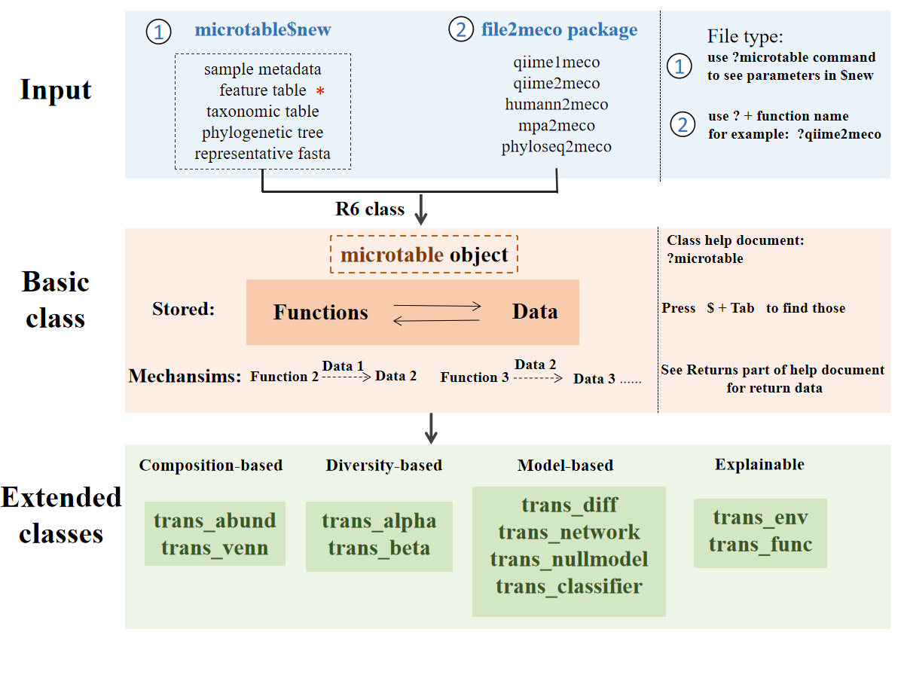

# Introduction {#intro}

The microeco package has several advantages compared to other packages in R.
The main goal of developing this package is to help users analyse communtiy ecology data fast.
So a series of commonly-used and cutting-edge approaches are implemented.
To facilitate the data mining, the whole structure of microeco package are highly modularized to
make users conveniently remember, search and use.
It is notable that, beside the demonstration in the tutorial, users can also save the intermediate files in each object and
apply those files to other tools according to the format requirement.
Main files stored in the object of each class are the frequently-used data.frame format.
So the intermediate and result files are easily saved, modified and used for other tools in microbial ecology.
Before starting the specific usage of each class, let's first learn several key points.

## Framework

This is a framework for users to fast understand the design of the microeco package. 

```{r, out.width = "8000px", fig.align="center", echo = FALSE}

```

The stored 'Functions' and 'Files' in 'Basic class' represent that you can access those functions or files using $ operator 
as we show in the figure, e.g., function `dataset$cal_alphadiv()` and its returned result `dataset$alpha_diversity`.


## R6 Class

All the classes in microeco package depend on the R6 class [@R6_Winston]. 
R6 uses the encapsulated object-oriented programming paradigm, 
which means that R6 is a profoundly different OO system from S3 and S4 because it is built on encapsulated objects, rather than generic functions. 
If you are interested in the class features, read more from 'Advanced R' book (https://adv-r.hadley.nz/).

  + A generic is a regular function, so it lives in the global namespace. An R6 method belongs to an object so it lives in a local namespace. 
This influences how we think about naming. The methods belong to objects, not generics, and you can call them like object$method().

  + R6’s reference semantics allow methods to simultaneously return a value and modify an object.
  
  + Every R6 object has an S3 class that reflects its hierarchy of R6 class.

## Help

The use of help documents in the microeco package may be a little different from other packages we often used.
If you wish to see one of help documents of functions, you should search the name of the class (not the name of the function) 
and click the link of each function.

```{r, echo = TRUE}
# first install microeco, see https://github.com/ChiLiubio/microeco
# load package microeco
library(microeco)
```

```{r, echo = TRUE, eval = FALSE}
# this can show all the functions and the detailed descriptions in the microtable class
# same with: help(microtable)
?microtable
```

## Dependence

### Important packages
To keep the start and use of microeco package simplified, 
the installation of microeco only depend on several packages, which are compulsory-installed from CRAN and frequently used in the data analysis.
So the question is that you may encounter an error when using a class or function that invoke an additional package like this:

```{r, echo = TRUE, eval = FALSE}
library(microeco)
data(dataset)
t1 <- trans_network$new(dataset = dataset, cal_cor = NA, taxa_level = "OTU", filter_thres = 0.0005)
t1$cal_network(network_method = "SpiecEasi")
```

```html
Error in t1$cal_network(network_method = "SpiecEasi"): igraph package not installed ...
```

<br>
The reason is that network construction require igraph package. We donot put the igraph and some other packages on the "Imports" part of microeco package.
In addition, some packages, e.g. SpiecEasi, are released on github and can not be installed automatically.

The solutions:

1. install the package when encounter such an error. Actually, it's very easy to install the packages from CRAN or bioconductor or github. Just try it.

2. install the packages in advance. This is recommended if the user is interest in most of the methods in the microeco package and want to run a large number of examples in tutorial.

We show several packages that are published in CRAN and not installed automatically.

```{r, echo = FALSE, eval = TRUE}
pre_pac <- read.delim("prerequite_packages.tsv")
```

```{r, echo = FALSE, eval = TRUE}
knitr::kable(pre_pac)
```

Then, if you want to install these packages or some of them, you can do like this:

```{r, echo = TRUE, eval = FALSE}
# If a package is not installed, it will be installed from CRAN.
# First select the packages of interest
packages <- c("MASS", "GUniFrac", "ggpubr", "randomForest", "ggdendro", "ggrepel", "agricolae", "gridExtra", "picante", "pheatmap", "igraph", "rgexf", "ggalluvial", "ggh4x", "FSA")
# Now check or install
for(x in packages){
	if(!require(x, character.only = TRUE)) {
		install.packages(x, dependencies = TRUE)
	}
}
```

There are also some packages that are useful in some functions. These packages may be R packages published in bioconductor or github,
or packages written by other languages.

### ggtree
Plotting the cladogram from LEfSe result requires the ggtree package in bioconductor (https://bioconductor.org/packages/release/bioc/html/ggtree.html).
```{r, echo = TRUE, eval = FALSE}
if (!requireNamespace("BiocManager", quietly = TRUE)) install.packages("BiocManager")
BiocManager::install("ggtree")
```

### SpiecEasi

The R package SpiecEasi can be used for the network construction using SPIEC-EASI (SParse InversE Covariance Estimation for Ecological Association Inference) approach.
The package can be installed from Github https://github.com/zdk123/SpiecEasi

### Gephi
Gephi is an excellent network visualization tool and used to open the saved network file, 
i.e. network.gexf in the [tutorial](https://chiliubio.github.io/microeco_tutorial/model-based-class.html#trans_network-class).
You can download Gephi and learn how to use it from https://gephi.org/users/download/


### WGCNA
In the correlation-based network, when the species number is very large,
the correlation algorithm in WGCNA is very fast compared to the 'cor' option in trans_network.

```{r, echo = TRUE, eval = FALSE}
install.packages("WGCNA", dependencies = TRUE)
```

### Tax4Fun
Tax4Fun is an R package used for the prediction of functional potential of prokaryotic communities.

1. install Tax4Fun package
```{r, echo = TRUE, eval = FALSE}
install.packages("RJSONIO")
install.packages(system.file("extdata", "biom_0.3.12.tar.gz", package="microeco"), repos = NULL, type = "source")
install.packages(system.file("extdata", "qiimer_0.9.4.tar.gz", package="microeco"), repos = NULL, type = "source")
install.packages(system.file("extdata", "Tax4Fun_0.3.1.tar.gz", package="microeco"), repos = NULL, type = "source")
```

2. download SILVA123 reference data from http://tax4fun.gobics.de/  
　unzip SILVA123.zip and provide this path to the folderReferenceData parameter of cal_tax4fun function in trans_func class.


### Tax4Fun2
Tax4Fun2 is another R package for the the prediction of functional profiles and functional gene redundancies of prokaryotic communities [@Wemheuer_Tax4Fun2_2020].
It has higher accuracies than PICRUSt and Tax4Fun. The Tax4Fun2 approach implemented in microeco is a little different from the original package.
Using Tax4Fun2 approach require the representative fasta file.
The user do not need to install Tax4Fun2 R package.
The only thing need to do is to download the blast tool (**ignore this if the blast tool has been in the path**) and Ref99NR/Ref100NR database (select one).
Downlaod blast tools from "ftp://ftp.ncbi.nlm.nih.gov/blast/executables/blast+" ; e.g. ncbi-blast-\*\*\*\*-x64-win64.tar.gz  for windows system.
Note that some errors can come from the latest versions because of memory issue (https://www.biostars.org/p/413294/). 
An easy solution is to use previous version (such as 2.5.0).
Downlaod Ref99NR.zip from "https://cloudstor.aarnet.edu.au/plus/s/DkoZIyZpMNbrzSw/download"  or Ref100NR.zip from "https://cloudstor.aarnet.edu.au/plus/s/jIByczak9ZAFUB4/download" .
Uncompress all the folders. The final folders should be like these structures:

blast tools:  
　|-- ncbi-blast-2.5.0+  
　　|---- bin  
　　　|------ blastn.exe  
　　　|------ makeblastdb.exe  
　　　|------ ......  

Ref99NR:  
　|-- Tax4Fun2_ReferenceData_v2  
　　|---- Ref99NR  
　　　|------ otu000001.tbl.gz  
　　　|------ ......  
　　　|------ Ref99NR.fasta  
　　　|------ Ref99NR.tre  

The path "Tax4Fun2_ReferenceData_v2" will be required in the trans_func$cal_tax4fun2() function.
The blast tool path "ncbi-blast-2.5.0+/bin" is also required if it is not added to the path (environmental variable).


```{r, echo = TRUE, eval = FALSE}
# Either seqinr or Biostrings package should be installed for reading and writing fasta file
install.packages("seqinr", dependencies = TRUE)
# or install Biostrings from bioconductor https://bioconductor.org/packages/release/bioc/html/Biostrings.html
# Now we show how to read the fasta file
# see https://github.com/ChiLiubio/file2meco if you do not have installed file2meco
rep_fasta_path <- system.file("extdata", "rep.fna", package="file2meco")
rep_fasta <- seqinr::read.fasta(rep_fasta_path)
# or use Biostrings::readDNAStringSet(rep_fasta_path)
# then see the help document of microtable class about the rep_fasta in microtable$new().
```

## Plotting
Most of the plotting in the package rely on the ggplot2 package system.
We provide some parameters to change the corresponding plot, but it may be far from enough.
The user can also assign the output a name and use the ggplot2-style grammers to modify it.
Each data table used for plotting is stored in the object and can be saved for the customized analysis and plotting.
Of course, the user can also directly modify the class and reload them to use.
Any contribution of a modified class is also appreciated via github pushing or email (liuchi0426@126.com).


