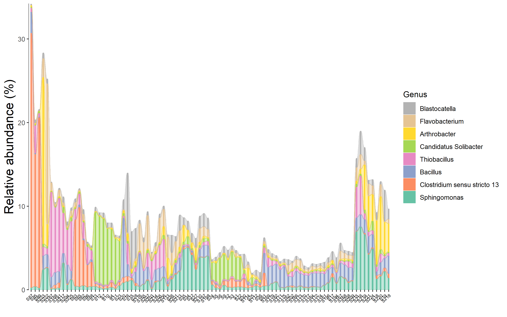

# Composition-based class

The trans_abund class and trans_venn class are grouped into 'Composition-based class', 
since they are mainly used to show the composition information of communities.


## trans_abund class
　The trans_abund class is used to transform taxonomic abundance data to plots based on the ggplot2 package.
As a premise, the **taxa_abund list in the object of microtable class must be first calculated**.

### Example

We first show the bar plot example.

```{r, echo = TRUE}
# create trans_abund object
# use 10 Phyla with the highest abundance in the dataset.
t1 <- trans_abund$new(dataset = dataset, taxrank = "Phylum", ntaxa = 10)
# t1 object now include the transformed abundance data t1$abund_data and other elements for the following plotting
```

As the sample number is large, we do not show the sample names in x axis and add the facet to show abundance according to groups.

```{r, echo = TRUE, eval = FALSE}
t1$plot_bar(others_color = "grey70", facet = "Group", xtext_keep = FALSE, legend_text_italic = FALSE)
# return a ggplot2 object
```

```{r, out.width = "750px", fig.align="center", echo = FALSE}
knitr::include_graphics("Images/plot_bar.png")
```

```{r, echo = TRUE, eval = FALSE}
# two facets example
# require package ggh4x, first run install.packages("ggh4x") if not installed
t1$plot_bar(others_color = "grey70", facet = "Group", facet2 = "Type", xtext_keep = FALSE, legend_text_italic = FALSE, barwidth = 1)
```

```{r, out.width = "750px", fig.align="center", echo = FALSE}
knitr::include_graphics("Images/plot_bar_facet2.png")
```


The alluvial plot is also implemented in the plot_bar function with use_alluvium parameter.

```{r, echo = TRUE, eval = FALSE}
t1 <- trans_abund$new(dataset = dataset, taxrank = "Genus", ntaxa = 8)
# require ggalluvial package
# use_alluvium = TRUE make the alluvial plot, clustering =TRUE can be used to reorder the samples by clustering
# bar_type = "notfull" can discard 'others'; select another color palette
t1$plot_bar(bar_type = "notfull", use_alluvium = TRUE, clustering = TRUE, xtext_type_hor = FALSE, xtext_size = 6, color_values = RColorBrewer::brewer.pal(8, "Set2"))
```

```{r, fig.align="center", echo = FALSE}

```

The bar plot can also be performed with group mean values.

```{r, echo = TRUE, eval = FALSE}
# The groupmean parameter can be used to obtain the group-mean barplot.
t1 <- trans_abund$new(dataset = dataset, taxrank = "Phylum", ntaxa = 10, groupmean = "Group")
g1 <- t1$plot_bar(others_color = "grey70", legend_text_italic = FALSE)
g1 + theme_classic() + theme(axis.title.y = element_text(size = 18))
```

```{r, out.width = "400px", fig.align="center", echo = FALSE}
knitr::include_graphics("Images/plot_bar_mean.png")
```

The box plot is an excellent way to intuitionally show abundance distribution across groups.

```{r, echo = TRUE, eval = FALSE}
# show 15 taxa at Class level
t1 <- trans_abund$new(dataset = dataset, taxrank = "Class", ntaxa = 15)
t1$plot_box(group = "Group")
```

```{r, out.width = "700px", fig.align="center", echo = FALSE}
knitr::include_graphics("Images/plot_box.png")
```

Then we show the heatmap with the high abundant genera.

```{r, echo = TRUE, eval = FALSE}
# show 40 taxa at Genus level
t1 <- trans_abund$new(dataset = dataset, taxrank = "Genus", ntaxa = 40)
t1$plot_heatmap(facet = "Group", xtext_keep = FALSE, withmargin = FALSE)
```

```{r, out.width = "750px", fig.align="center", echo = FALSE}
knitr::include_graphics("Images/plot_heatmap.png")
```

Line chart is very useful to show the abundance change of taxa along time, space or other gradients.

```{r, echo = TRUE, eval = FALSE}
t1 <- trans_abund$new(dataset = dataset, taxrank = "Genus", ntaxa = 5)
t1$plot_line()
t1 <- trans_abund$new(dataset = dataset, taxrank = "Genus", ntaxa = 5, group = "Type")
t1$plot_line(position = position_dodge(0.3), xtext_type_hor = TRUE)
```

```{r, out.width = "750px", fig.align="center", echo = FALSE}
knitr::include_graphics("Images/plot_line_type.png")
```

Then, we show the pie chart with the group mean values.

```{r, echo = TRUE, eval = FALSE}
t1 <- trans_abund$new(dataset = dataset, taxrank = "Phylum", ntaxa = 6, groupmean = "Group")
# all pie chart in one row
t1$plot_pie(facet_nrow = 1)
```

```{r, out.width = "600px", fig.align="center", echo = FALSE}
knitr::include_graphics("Images/plot_pie.png")
```

### Key points

  + trans_abund$new: creating trans_abund object can invoke taxa_abund in microtable for transformation
  + color_values parameter: color_values parameter in each function is used for colors selection
  + input_taxaname parameter: input_taxaname parameter in trans_abund$new can be used to select interested customized taxa instead of abundance-based selection
  + use_percentage parameter: use_percentage parameter in trans_abund$new - whether show the abundance percentage
  

## trans_venn class

The trans_venn class is used for venn analysis, i.e. shared and unique taxa.

### Example

This part can be performed using samples or groups at OTU/ASV level or higher taxonomic level.
To analyze the unique and shared OTUs of groups,
we first merge samples according to the "Group" column of sample_table.

```{r, echo = TRUE, eval = FALSE}
# merge samples as one community for each group
dataset1 <- dataset$merge_samples(use_group = "Group")
# dataset1 is a new microtable object
# create trans_venn object
t1 <- trans_venn$new(dataset1, ratio = NULL)
t1$plot_venn()
```

```{r, out.width = "500px", fig.align="center", echo = FALSE}
knitr::include_graphics("Images/trans_venn_0.png")
```

```{r, echo = TRUE, eval = FALSE}
# create venn plot with more information
t1 <- trans_venn$new(dataset1, ratio = "seqratio")
t1$plot_venn()
# The integer is OTU number
# The percentage data is the sequence number/total sequence number
```

```{r, out.width = "500px", fig.align="center", echo = FALSE}
knitr::include_graphics("Images/trans_venn_1.png")
```

When the groups are too many to show with venn plot, using petal plot is better.

```{r, echo = TRUE, eval = FALSE}
# use "Type" column in sample_table
dataset1 <- dataset$merge_samples(use_group = "Type")
t1 <- trans_venn$new(dataset1)
t1$plot_venn(petal_plot = TRUE, petal_center_size = 50, petal_r = 1.5, petal_a = 3, petal_move_xy = 3.8, petal_color_center = "#BEBADA")
```

```{r, out.width = "500px", fig.align="center", echo = FALSE}
knitr::include_graphics("Images/trans_venn_2.png")
```

Another way to plot the results is to use plot_bar function, which is especially useful for a large number of samples/groups.

```{r, echo = TRUE, eval = FALSE}
tmp <- dataset$merge_samples(use_group = "Type")
tmp
t1 <- trans_venn$new(dataset = tmp)
# only show some sets with large intersection numbers
t1$data_summary %<>% .[.[, 1] > 20, ]
t1$plot_bar()
```

```{r, out.width = "800px", fig.align="center", echo = FALSE}
knitr::include_graphics("Images/plot_venn_bar_type.png")
```

Generally, after getting the venn plot, we do not know who those shared or unique taxa are.
The composition of the unique or shared species may account for the different and similar parts of ecological characteristics across groups[@Mendes_Deciphering_2011].
So, it is interesting to further analyze the composition of unique and shared species. 
For this goal, we first transform the results of venn plot to the traditional feature-sample table, that is, another object of microtable class.

```{r, echo = TRUE, eval = TRUE}
dataset1 <- dataset$merge_samples(use_group = "Group")
t1 <- trans_venn$new(dataset1)
# transform venn results to the sample-species table, here do not consider abundance, only use presence/absence.
t2 <- t1$trans_comm(use_frequency = TRUE)
# t2 is a new microtable class, each part is considered a sample
class(t2)
```

We use bar plot to show the composition at the Genus level.

```{r, echo = TRUE, eval = FALSE}
# calculate taxa abundance, that is, the frequency
t2$cal_abund()
# transform and plot
t3 <- trans_abund$new(dataset = t2, taxrank = "Genus", ntaxa = 8)
t3$plot_bar(bar_type = "part", legend_text_italic = T, ylab_title = "Frequency (%)", xtext_type_hor = FALSE, color_values = RColorBrewer::brewer.pal(8, "Set2"),
	order_x = c("IW", "CW", "TW", "IW&CW", "IW&TW", "CW&TW", "IW&CW&TW"))
```


```{r, out.width = "650px", fig.align="center", echo = FALSE}
knitr::include_graphics("Images/trans_venn_bar.png")
```

We also try to use pie chart to show the compositions at the Phylum level.

```{r, echo = TRUE, eval = FALSE}
t3 <- trans_abund$new(dataset = t2, taxrank = "Phylum", ntaxa = 8)
t3$plot_pie(facet_nrow = 3, color_values = rev(c(RColorBrewer::brewer.pal(8, "Dark2"), "grey50")))
```

```{r, out.width = "800px", fig.align="center", echo = FALSE}
knitr::include_graphics("Images/trans_venn_pie.png")
```

### Key points

  + ratio parameter: ratio parameter in trans_abund$new control whether and what content appear below the taxa number in venn plot
  + return data: using trans_venn$new() return data_details and data_summary stored in trans_venn object for further ploting


