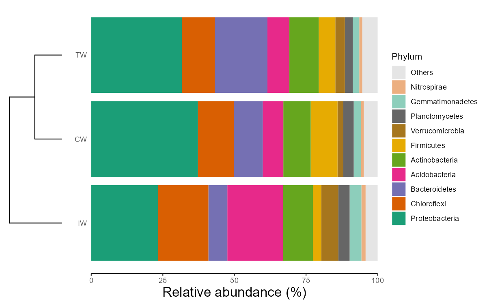
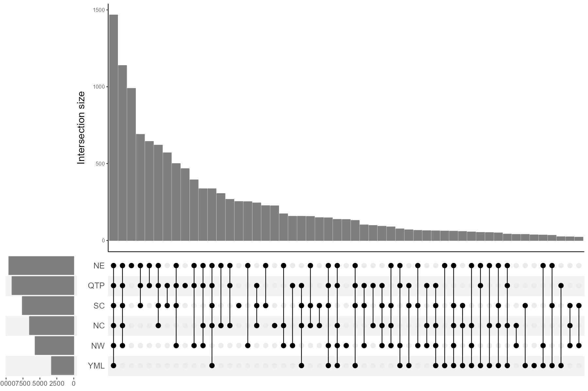
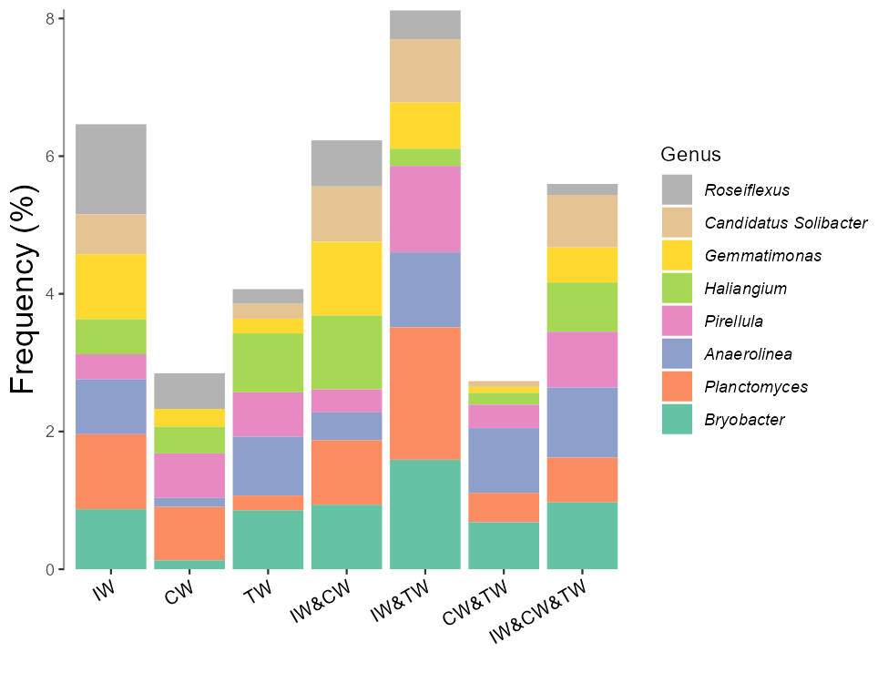

# Composition-based class

The trans_abund class and trans_venn class are organised into the section 'Composition-based class', 
since they are mainly used to show the composition information of communities.


## trans_abund class
　The trans_abund class has several functions to visualize taxonomic abundance based on the ggplot2 package.


### Example

We first show the bar plot example.

```{r, echo = TRUE}
# create trans_abund object
# select top 8 abundant Phyla.
t1 <- trans_abund$new(dataset = dataset, taxrank = "Phylum", ntaxa = 8)
# t1 object now include the transformed abundance data t1$abund_data and other elements for the following plotting
```

As the sample number is large, we do not show the sample names in x axis and add the facet to show abundance according to groups.

```{r, echo = TRUE, eval = FALSE}
t1$plot_bar(others_color = "grey70", facet = "Group", xtext_keep = FALSE, legend_text_italic = FALSE)
# return a ggplot2 object
```

```{r, out.width = "750px", fig.align="center", echo = FALSE}
knitr::include_graphics("Images/trans_abund_barplot1.png")
```

Two or more facets are supported with the facet parameter from v0.14.0 by providing a vector with multiple elements.

```{r, echo = TRUE, eval = FALSE}
# require package ggh4x, first run install.packages("ggh4x") if not installed
t1$plot_bar(others_color = "grey70", facet = c("Group", "Type"), xtext_keep = FALSE, legend_text_italic = FALSE, barwidth = 1)
```

```{r, out.width = "750px", fig.align="center", echo = FALSE}
knitr::include_graphics("Images/trans_abund_barplot_facet2.png")
```

The default operation can filter all the unclassified taxa (i.e. p__ or g__ in tax_table that has been processed by `tidy_taxonomy` function), 
as those unknown taxa are generally meaningless.
However sometimes, these unknown taxa may be meaningful for users.
For example, if one want to isolate some unknown species, it is valuable to check the abundance of those unknown taxa.
At this time, please see this topic (https://github.com/ChiLiubio/microeco/issues/165) to resolve the issue that how to show unknown taxa with hierarchical taxonomy classification.
The alluvial plot is also implemented in the plot_bar function with use_alluvium parameter.

```{r, echo = TRUE, eval = FALSE}
t1 <- trans_abund$new(dataset = dataset, taxrank = "Genus", ntaxa = 8)
# require ggalluvial package
# use_alluvium = TRUE make the alluvial plot, clustering =TRUE can be used to reorder the samples by clustering
# bar_type = "notfull" can discard 'others'; select another color palette
p <- t1$plot_bar(bar_type = "notfull", use_alluvium = TRUE, clustering = TRUE, xtext_angle = 30, xtext_size = 3, color_values = RColorBrewer::brewer.pal(8, "Set2"))
```

```{r, fig.align="center", echo = FALSE}
knitr::include_graphics("Images/trans_abund_bar_allu.png")
```

The bar plot can also be performed with group mean values.
Note that, from v0.16.0, the parameter `group_morestats = TRUE` can be used to add more summary statistics in the return `data_abund` when `groupmean` parameter is provided.

```{r, echo = TRUE, eval = FALSE}
# The groupmean parameter can be used to obtain the group-mean barplot.
t1 <- trans_abund$new(dataset = dataset, taxrank = "Phylum", ntaxa = 10, groupmean = "Group")
g1 <- t1$plot_bar(others_color = "grey70", legend_text_italic = FALSE)
g1 + theme_classic() + theme(axis.title.y = element_text(size = 18))
```

```{r, out.width = "400px", fig.align="center", echo = FALSE}
knitr::include_graphics("Images/trans_abund_barplot_groupmean.png")
```

The box plot is an excellent way to intuitionally show abundance distribution across groups.

```{r, echo = TRUE, eval = FALSE}
# show 15 taxa at Class level
t1 <- trans_abund$new(dataset = dataset, taxrank = "Class", ntaxa = 15)
t1$plot_box(group = "Group", xtext_angle = 30)
```

```{r, out.width = "700px", fig.align="center", echo = FALSE}
knitr::include_graphics("Images/trans_abund_boxplot.png")
```

Then we show the heatmap with the high abundant genera.

```{r, echo = TRUE, eval = FALSE}
# show 40 taxa at Genus level
t1 <- trans_abund$new(dataset = dataset, taxrank = "Genus", ntaxa = 40)
t1$plot_heatmap(facet = "Group", xtext_keep = FALSE, withmargin = FALSE)
```

```{r, out.width = "750px", fig.align="center", echo = FALSE}
knitr::include_graphics("Images/trans_abund_heatmap.png")
```

Line chart is very useful to show the abundance change of taxa along time, space or other gradients.

```{r, echo = TRUE, eval = FALSE}
t1 <- trans_abund$new(dataset = dataset, taxrank = "Phylum", ntaxa = 5)
t1$plot_line()
t1 <- trans_abund$new(dataset = dataset, taxrank = "Genus", ntaxa = 5, groupmean = "Type")
t1$plot_line(position = position_dodge(0.3), xtext_angle = 0)
```

```{r, out.width = "750px", fig.align="center", echo = FALSE}
knitr::include_graphics("Images/trans_abund_line.png")
```

Then, we show the pie chart with the group mean values.

```{r, echo = TRUE, eval = FALSE}
t1 <- trans_abund$new(dataset = dataset, taxrank = "Phylum", ntaxa = 6, groupmean = "Group")
# all pie chart in one row
t1$plot_pie(facet_nrow = 1)
t1$plot_pie(facet_nrow = 1, add_label = TRUE)
```

```{r, out.width = "600px", fig.align="center", echo = FALSE}
knitr::include_graphics("Images/trans_abund_pie.png")
```

The donut and radar charts are implemented from v0.17.0. 
Please install the dependent packages according to the steps (https://chiliubio.github.io/microeco_tutorial/intro.html#dependence).

```{r, echo = TRUE, eval = FALSE}
t1 <- trans_abund$new(dataset = dataset, taxrank = "Phylum", ntaxa = 8, groupmean = "Group")
t1$plot_donut(label = FALSE)
t1$plot_donut(label = TRUE)
```

```{r, out.width = "650px", fig.align="center", echo = FALSE}
knitr::include_graphics("Images/trans_abund_donut.png")
```

```{r, echo = TRUE, eval = FALSE}
t1 <- trans_abund$new(dataset = dataset, taxrank = "Phylum", ntaxa = 8, groupmean = "Group")
t1$plot_radar(values.radar = c("0%", "25%", "50%"), grid.min = 0, grid.mid = 0.25, grid.max = 0.5)
t1 <- trans_abund$new(dataset = dataset, taxrank = "Phylum", ntaxa = 8, groupmean = "Type")
t1$plot_radar(values.radar = c("0%", "25%", "50%"), grid.min = 0, grid.mid = 0.25, grid.max = 0.5)
```

```{r, out.width = "700px", fig.align="center", echo = FALSE}
knitr::include_graphics("Images/trans_abund_radar.png")
```

The ternary plot can be used for the case with three samples/groups.

```{r, echo = TRUE, eval = FALSE}
t1 <- trans_abund$new(dataset = dataset, taxrank = "Phylum", ntaxa = 8, groupmean = "Group")
t1$plot_tern()
```

```{r, out.width = "600px", fig.align="center", echo = FALSE}
knitr::include_graphics("Images/trans_abund_ternary.png")
```


When the hierarchical abundance data of two levels is needed to be shown in bar plot, the nested legend can be used.

```{r, echo = TRUE, eval = FALSE}
# require ggnested package; see https://chiliubio.github.io/microeco_tutorial/intro.html#dependence
test1 <- trans_abund$new(dataset = dataset, taxrank = "Class", ntaxa = 10, high_level = "Phylum", prefix = "\\|")
test1$plot_bar(ggnested = TRUE, facet = c("Group", "Type"), xtext_angle = 30)
# fixed number in each phylum
test1 <- trans_abund$new(dataset = dataset, taxrank = "Class", ntaxa = 30, show = 0, high_level = "Phylum", high_level_fix_nsub = 4)
test1$plot_bar(ggnested = TRUE, xtext_angle = 30, facet = c("Group", "Type"))
# sum others in each phylum
test1 <- trans_abund$new(dataset = dataset, taxrank = "Class", ntaxa = 20, show = 0, high_level = "Phylum", high_level_fix_nsub = 3, prefix = "\\|")
test1$plot_bar(ggnested = TRUE, high_level_add_other = TRUE, xtext_angle = 30, facet = c("Group", "Type"))
```

```{r, out.width = "700px", fig.align="center", echo = FALSE}
knitr::include_graphics("Images/trans_abund_barplot_ggnested.png")
```

The `coord_flip` parameter in `plot_bar` function can be changed to make the coordinate axis flipped.
The clustering plot can also be added in the bar plot.
In this case, the coordinate axis will be flipped automatically for better visualization.

```{r, echo = TRUE, eval = FALSE}
t1 <- trans_abund$new(dataset = dataset, taxrank = "Phylum", ntaxa = 10, groupmean = "Group")
g1 <- t1$plot_bar(coord_flip = TRUE)
g1 <- g1 + theme_classic() + theme(axis.title.x = element_text(size = 16), axis.ticks.y = element_blank(), axis.line.y = element_blank())
g1
g1 <- t1$plot_bar(clustering_plot = TRUE)
# In this case, g1 (aplot object) is the combination of different ggplot objects
# to adjust the main plot, please select g1[[1]]
g1[[1]] <- g1[[1]] + theme_classic() + theme(axis.title.x = element_text(size = 16), axis.ticks.y = element_blank(), axis.line.y = element_blank())
g1
# save the figure
ggsave("test.png", g1, width = 8, height = 5)
```

```{r, out.width = "600px", fig.align="center", echo = FALSE}

```


### Key points

  + trans_abund$new: creating trans_abund object can invoke taxa_abund in microtable for transformation
  + color_values parameter: color_values parameter in each function is used for colors selection
  + input_taxaname parameter: input_taxaname parameter in trans_abund$new can be used to select interested customized taxa instead of abundance-based selection
  + use_percentage parameter: use_percentage parameter in trans_abund$new - whether show the abundance percentage
  

## trans_venn class

The trans_venn class is developed for venn analysis, i.e. shared and unique taxa across samples/groups.

### Example

This part can be performed using samples or groups at OTU/ASV level or higher taxonomic level.
To analyze the unique and shared OTUs of groups,
we first merge samples according to the "Group" column of sample_table.

```{r, echo = TRUE, eval = FALSE}
# merge samples as one community for each group
dataset1 <- dataset$merge_samples(use_group = "Group")
# dataset1 is a new microtable object
# create trans_venn object
t1 <- trans_venn$new(dataset1, ratio = NULL)
t1$plot_venn()
```

```{r, out.width = "500px", fig.align="center", echo = FALSE}
knitr::include_graphics("Images/trans_venn_0.png")
```

```{r, echo = TRUE, eval = FALSE}
# create venn plot with more information
t1 <- trans_venn$new(dataset1, ratio = "seqratio")
t1$plot_venn()
# The integer is OTU number
# The percentage data is the sequence number/total sequence number
```

```{r, out.width = "500px", fig.align="center", echo = FALSE}
knitr::include_graphics("Images/trans_venn_1.png")
```

When the groups are too many to show with venn plot, using petal plot is better.
To assign different colors in petals, please provide multiple colors to `petal_color` parameter.

```{r, echo = TRUE, eval = FALSE}
# use "Type" column in sample_table
dataset1 <- dataset$merge_samples(use_group = "Type")
t1 <- trans_venn$new(dataset1)
t1$plot_venn(petal_plot = TRUE, petal_color = RColorBrewer::brewer.pal(8, "Dark2"))
t1$plot_venn(petal_plot = TRUE, petal_center_size = 50, petal_r = 1.5, petal_a = 3, petal_move_xy = 3.8, petal_color_center = "#BEBADA")
```

```{r, out.width = "500px", fig.align="center", echo = FALSE}
knitr::include_graphics("Images/trans_venn_2.png")
```

Another way to plot the results is to use `plot_bar` function, which is especially useful for a large number of samples/groups.
This way is generally called UpSet plot. Please see the help document for more parameters to adjust the plot.

```{r, echo = TRUE, eval = FALSE}
tmp <- dataset$merge_samples(use_group = "Type")
tmp
t1 <- trans_venn$new(dataset = tmp)
# only show some sets with large intersection numbers
t1$data_summary %<>% .[.[, 1] > 20, ]
g1 <- t1$plot_bar(left_plot = TRUE, bottom_height = 0.5, left_width = 0.15, up_bar_fill = "grey50", left_bar_fill = "grey50", bottom_point_color = "black")
g1
# g1 is aplot class and can be saved with ggplot2::ggsave, aplot::ggsave or cowplot::save_plot function
# as g1 is comprised of several sub-plots, please adjust the details for each sub-plot
g1[[1]]
g1[[2]]
```

```{r, out.width = "800px", fig.align="center", echo = FALSE}

```

Generally, after getting the intersection results, we do not know who those shared or unique taxa are.
The composition of the unique or shared species may account for the different and similar parts of ecological characteristics across groups[@Mendes_Deciphering_2011].
So, it is interesting to further analyze the composition of unique and shared species. 
For this goal, we first transform the results of venn plot to the traditional feature-sample table, that is, another object of microtable class.

```{r, echo = TRUE, eval = TRUE}
dataset1 <- dataset$merge_samples(use_group = "Group")
t1 <- trans_venn$new(dataset1)
# transform venn results to the sample-species table, here do not consider abundance, only use presence/absence.
t2 <- t1$trans_comm(use_frequency = TRUE)
# t2 is a new microtable class, each part is considered a sample
class(t2)
```

We use bar plot to show the composition at the Genus level.

```{r, echo = TRUE, eval = FALSE}
# calculate taxa abundance, that is, the frequency
t2$cal_abund()
# transform and plot
t3 <- trans_abund$new(dataset = t2, taxrank = "Genus", ntaxa = 8)
t3$plot_bar(bar_type = "part", legend_text_italic = T, xtext_angle = 30, color_values = RColorBrewer::brewer.pal(8, "Set2"),
	order_x = c("IW", "CW", "TW", "IW&CW", "IW&TW", "CW&TW", "IW&CW&TW")) + ylab("Frequency (%)")
```


```{r, out.width = "650px", fig.align="center", echo = FALSE}

```

We also try to use pie chart to show the compositions at the Phylum level.

```{r, echo = TRUE, eval = FALSE}
t3 <- trans_abund$new(dataset = t2, taxrank = "Phylum", ntaxa = 8)
t3$data_abund$Sample %<>% factor(., levels = unique(.))
t3$plot_pie(facet_nrow = 3, color_values = c(RColorBrewer::brewer.pal(8, "Dark2"), "grey50"))
```

```{r, out.width = "800px", fig.align="center", echo = FALSE}
knitr::include_graphics("Images/trans_venn_pie.png")
```

Other examples:

To reorder samples in the plots, please manipulate the sample_table in the object to adjust the orders.
```{r, echo = TRUE, eval = FALSE}
test <- dataset$merge_samples(use_group = "Type")
test$sample_table %<>% .[c("YML", "NE", "NW", "NC", "QTP", "SC"), , drop = FALSE]
test$tidy_dataset()
# The columns of otu_table can also be reordered according to the sample_table after running tidy_dataset function
t1 <- trans_venn$new(test)
t1$plot_bar(sort_samples = FALSE)
```

The parameter `sort_samples = TRUE` in `plot_bar` function can be applied to sort samples in the y axis according to the number of features.
The left bar plot can be removed when the parameter `left_plot = FALSE`.

```{r, echo = TRUE, eval = FALSE}
test <- dataset$merge_samples(use_group = "Type")
t1 <- trans_venn$new(test)
# remove left bar in the UpSet plot
t1$plot_bar(left_plot = FALSE)
# sort samples in the axis according to the number of features
t1$plot_bar(sort_samples = TRUE)
# original orders in test$sample_table
t1$plot_bar(sort_samples = FALSE)
```

### Key points

  + ratio parameter: ratio parameter in trans_abund$new control whether and what content appear below the taxa number in venn plot
  + return data: using trans_venn$new() return data_details and data_summary stored in trans_venn object for further ploting


