# Diversity-based class

Diversity is one of the core topics in community ecology.
It refers to alpha diversity, beta diversity and gamma diversity.


## trans_alpha class

　Alpha diversity can be transformed and visualized using the `trans_alpha` class.
Creating an object of `trans_alpha` class can invoke the alpha_diversity data stored in the microtable object.


### Example

Creating a `trans_alpha` object can return two data.frame with the prefix 'data_': `data_alpha` and `data_stat`.
`data_alpha` is used for subsequent differential test and visualization.


```{r, echo = TRUE, eval = FALSE}
t1 <- trans_alpha$new(dataset = mt_rarefied, group = "Group")
# return t1$data_stat
head(t1$data_stat)
```

```{r, echo = FALSE}
t1 <- trans_alpha$new(dataset = mt_rarefied, group = "Group")
pander::pander(head(t1$data_stat))
```

Then, we test the differences among groups using Kruskal-Wallis Rank Sum Test (overall test when groups > 2), Wilcoxon Rank Sum Tests (for paired groups),
Dunn's Kruskal-Wallis Multiple Comparisons (for paired groups when groups > 2) and anova with multiple comparisons.

```{r, echo = TRUE, eval = FALSE}
t1$cal_diff(method = "KW")
# return t1$res_diff
head(t1$res_diff)
```

```{r, echo = FALSE}
suppressWarnings(t1$cal_diff(method = "KW"))
pander::pander(head(t1$res_diff[, -3]))
```

```{r, echo = TRUE, eval = FALSE}
t1$cal_diff(method = "KW_dunn")
# return t1$res_diff
head(t1$res_diff)
```

```{r, echo = FALSE}
t1$cal_diff(method = "KW_dunn")
pander::pander(head(t1$res_diff))
```

```{r, echo = TRUE, eval = FALSE}
# more options
t1$cal_diff(method = "KW_dunn", KW_dunn_letter = FALSE)
head(t1$res_diff)
t1$cal_diff(method = "wilcox")
head(t1$res_diff)
t1$cal_diff(method = "t.test")
```

Then, let's try to use anova. 
From v1.0.0, the `alpha` parameter can be used to adjust the significance threshold (default: 0.05) of multiple comparisons when method is 'anova' or 'KW_dunn'.


```{r, echo = TRUE, eval = FALSE}
t1$cal_diff(method = "anova")
# return t1$res_diff
head(t1$res_diff)
```

```{r, echo = FALSE}
suppressMessages(library(agricolae))
t1$cal_diff(method = "anova")
pander::pander(head(t1$res_diff))
```

The multi-factor analysis of variance is also supported with the `formula` parameter, such as two-way anova. 

```{r, echo = TRUE, eval = FALSE}
t1 <- trans_alpha$new(dataset = mt_rarefied, group = "Group")
t1$cal_diff(method = "anova", formula = "Group+Type")
head(t1$res_diff)
# see the help document for the usage of formula
```


The plot_alpha function add the significance label by searching the results in **object$res_diff** instead of recalculating the significance.
Now, let's plot the alpha diversity for each group and include the anova result.

```{r, echo = TRUE, eval = FALSE}
t1$cal_diff(method = "anova")
# y_increase can adjust the distance from the letters to the highest point
t1$plot_alpha(measure = "Chao1", y_increase = 0.3)
t1$plot_alpha(measure = "Chao1", y_increase = 0.1)
# add_sig_text_size: letter size adjustment
t1$plot_alpha(measure = "Chao1", add_sig_text_size = 6, add = "jitter", order_x_mean = TRUE)
```

```{r, out.width = "600px", fig.align="center", echo = FALSE}
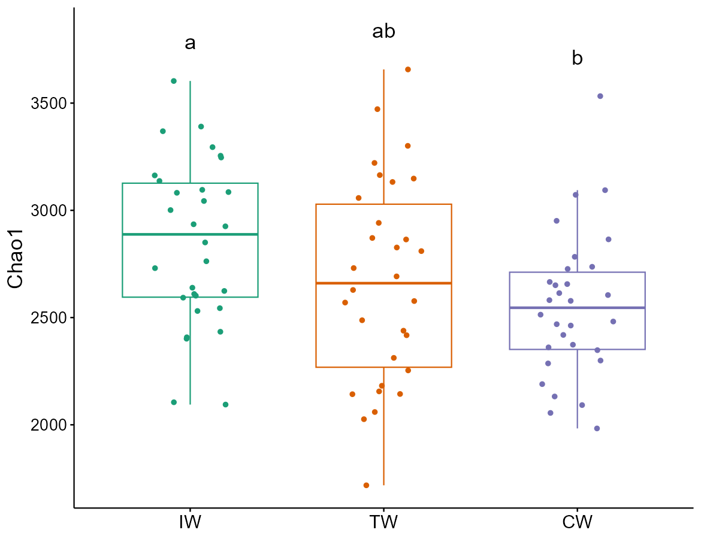
```

```{r, echo = TRUE, eval = FALSE}
t1$cal_diff(method = "wilcox")
t1$plot_alpha(measure = "Chao1", shape = "Group")
# y_start: starting height for the first label
# y_increase: increased height for each label
t1$plot_alpha(measure = "Chao1", shape = "Group", add = "jitter", y_start = 0.1, y_increase = 0.1)
```

```{r, out.width = "600px", fig.align="center", echo = FALSE}
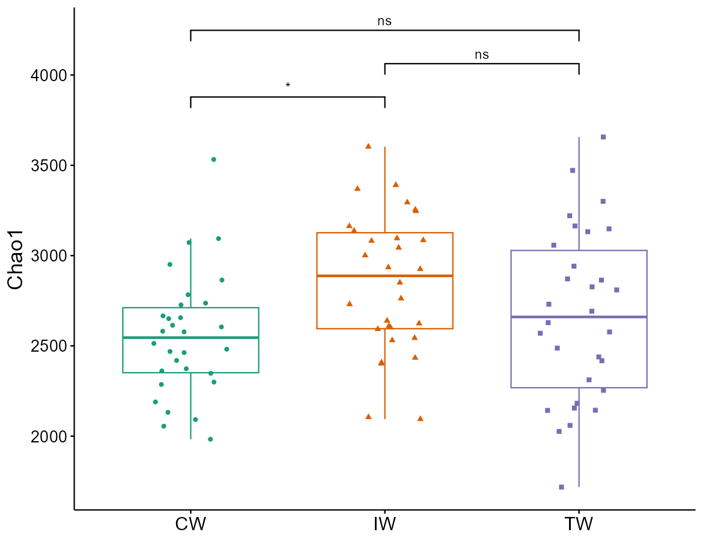
```

Let's try to remove the 'ns' in the label by manipulating the `object$res_diff`.

```{r, echo = TRUE, eval = FALSE}
t1$res_diff %<>% base::subset(Significance != "ns")
t1$plot_alpha(measure = "Chao1", add = "dotplot", xtext_size = 15)
```

```{r, out.width = "600px", fig.align="center", echo = FALSE}
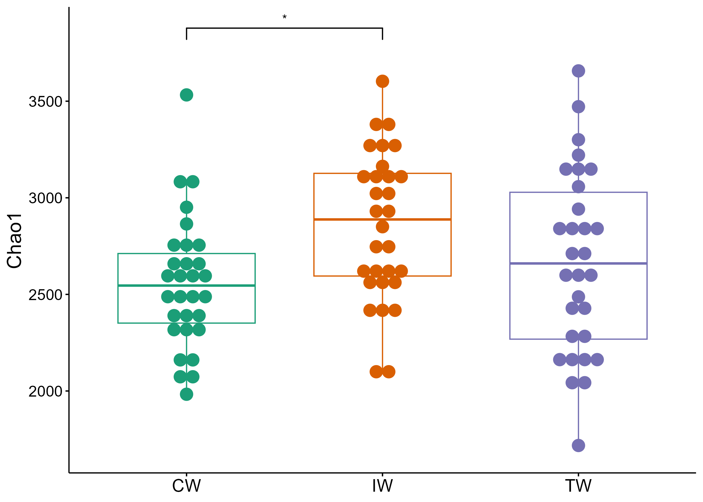
```

The trans_alpha class supports the differential test of groups within each group using the `by_group` parameter.

```{r, echo = TRUE, eval = FALSE}
t1 <- trans_alpha$new(dataset = mt_rarefied, group = "Type", by_group = "Group")
t1$cal_diff(method = "wilcox")
t1$plot_alpha(measure = "Shannon")
```

```{r, out.width = "600px", fig.align="center", echo = FALSE}
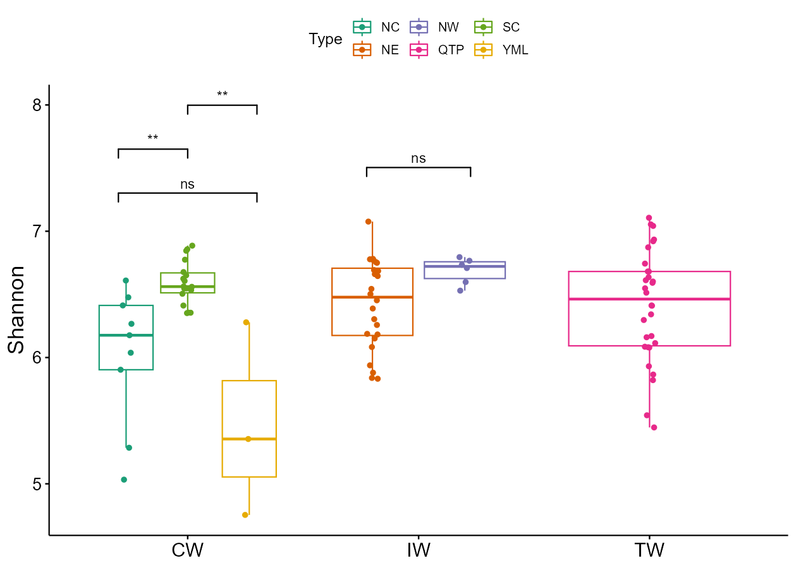
```


Scheirer Ray Hare test is a nonparametric test that is suitable for a two-way factorial experiment.

```{r, echo = TRUE, eval = FALSE}
t1 <- trans_alpha$new(dataset = mt_rarefied)
# require rcompanion package to be installed
t1$cal_diff(method = "scheirerRayHare", formula = "Group+Type")
```


Linear mixed-effects model can be selected with the `method = "lme"`.
This model is implemented based on the `lmerTest` package.
For more parameters, please see `lmerTest::lmer` function.
Please use parameter passing when more parameters are needed.
For the formula usage, please follow this (https://mspeekenbrink.github.io/sdam-r-companion/linear-mixed-effects-models.html).
In the return table, conditional R2 is the total variance explained by fixed and random effects, 
and marginal R2 is the variance explained by fixed effects.

```{r, echo = TRUE, eval = FALSE}
if(!require("lmerTest")) install.packages("lmerTest")
t1 <- trans_alpha$new(dataset = mt_rarefied)
# just using (1|Type) as an example to show the random effect
t1$cal_diff(method = "lme", formula = "Group + (1|Type)")
View(t1$res_diff)
# return_model = TRUE can return original models, i.e. object$res_model
t1$cal_diff(method = "lme", formula = "Group + (1|Type)", return_model = TRUE)
```

Note that from v1.9.0, the parameter `plot_type` control which type of plot is employed.
All the options starting with "gg" (e.g., "ggboxplot", "ggdotplot", "ggviolin", "ggstripchart", "ggerrorplot") means they are the functions coming from the ggpubr package.

```{r, echo = TRUE, eval = FALSE}
t1 <- trans_alpha$new(dataset = mt_rarefied, group = "Type")
t1$cal_diff(method = "KW_dunn", KW_dunn_letter = TRUE)
t1$plot_alpha(plot_type = "ggboxplot", add = "none")

t1$plot_alpha(plot_type = "ggdotplot")
t1$plot_alpha(plot_type = "ggdotplot", fill = "Type", alpha = 0.3)
t1$plot_alpha(plot_type = "ggdotplot", add = "mean_se")
t1$plot_alpha(plot_type = "ggdotplot", add = c("mean_se", "violin"))
t1$plot_alpha(plot_type = "ggdotplot", add = c("mean_se", "violin"), fill = "Type", alpha = 0.2)

t1$plot_alpha(plot_type = "ggviolin")
t1$plot_alpha(plot_type = "ggviolin", y_increase = 0.4, add = "mean_se")
t1$plot_alpha(plot_type = "ggviolin", fill = "Type", alpha = 0.2, y_increase = 0.4, add = "mean_se", add_sig_text_size = 6)

t1$plot_alpha(plot_type = "ggstripchart", add = "mean_se")

t1$plot_alpha(plot_type = "ggerrorplot")
```


The option `"errorbar"` or `"barerrorbar"` in `plot_alpha` will invoke the `data_stat` instead of `data_alpha` for the Mean±SE (or SD) plot (based on the ggplot2).
The line is optional to be added between points (Mean) for the case with a gradient.

```{r, echo = TRUE, eval = FALSE}
t1 <- trans_alpha$new(dataset = mt_rarefied, group = "Group")
t1$cal_diff(method = "KW_dunn", measure = "Chao1", KW_dunn_letter = TRUE)
t1$plot_alpha(measure = "Chao1")
t1$plot_alpha(plot_type = "errorbar", measure = "Chao1")
t1$plot_alpha(plot_type = "errorbar", measure = "Chao1", y_increase = -0.2)
t1$plot_alpha(plot_type = "errorbar", measure = "Chao1", y_increase = -0.2, add_line = TRUE, line_type = 2, line_alpha = 0.5, errorbar_width = 0.1)
t1$plot_alpha(plot_type = "errorbar", plot_SE = FALSE, measure = "Chao1", y_increase = 0.2, add_line = TRUE, line_type = 2, line_alpha = 0.5, errorbar_width = 0.1)
t1$plot_alpha(plot_type = "barerrorbar", measure = "Chao1")
t1$plot_alpha(plot_type = "barerrorbar", measure = "Chao1", y_increase = -0.3)
t1$plot_alpha(plot_type = "barerrorbar", measure = "Chao1", bar_width = 0.6, errorbar_width = 0.2, errorbar_size = 1, errorbar_addpoint = FALSE)

# by_group example
# use example data in mecoturn package
library(microeco)
library(mecoturn)
library(magrittr)
data(wheat_16S)
wheat_16S$sample_table$Type %<>% factor(., levels = unique(.))
t1 <- trans_alpha$new(dataset = wheat_16S, group = "Region", by_group = "Type")
t1$cal_diff(method = "KW_dunn", measure = "Shannon", KW_dunn_letter = TRUE)
View(t1$res_diff)
t1$plot_alpha(plot_type = "errorbar", measure = "Shannon")
t1$plot_alpha(plot_type = "errorbar", measure = "Shannon", add_line = TRUE, line_type = 2)
t1$plot_alpha(plot_type = "errorbar", plot_SE = FALSE, measure = "Shannon", add_line = TRUE, line_type = 2)
```

From v1.4.0, the heatmap can be used to visualize the significances for the case with multiple factors in the formula.

```{r, echo = TRUE, eval = FALSE}
t1 <- trans_alpha$new(dataset = mt_rarefied, group = "Group")
t1$cal_diff(method = "anova", formula = "Group+Type+Group:Type")
t1$plot_alpha(color_palette = rev(RColorBrewer::brewer.pal(n = 11, name = "RdYlBu")), trans = "log10")
t1$plot_alpha(color_palette = c("#053061", "white", "#A50026"), trans = "log10")
t1$plot_alpha(color_values = c("#053061", "white", "#A50026"), trans = "log10")
t1$plot_alpha(color_values = c("#053061", "white", "#A50026"), trans = "log10", filter_feature = "", text_y_position = "left")
t1$plot_alpha(color_values = c("#053061", "white", "#A50026"), trans = "log10", filter_feature = "", text_y_position = "left", cluster_ggplot = "row")
```

### Key points

  + trans_alpha$new: creating `trans_alpha` object can invoke `alpha_diversity` in microtable for transformation
  + cal_diff: `formula` parameter applies to multi-factor analysis of variance.
  + cal_diff: From v1.2.0, `anova_post_test` can be used to change default post test method of anova.
  + plot_alpha: the significance label comes from the results in `object$res_diff`


## trans_beta class

　The trans_beta class is specifically designed for the beta diversity analysis, i.e. the dissimilarities among samples.
Beta diversity can be defined at different forms[@Tuomisto_diversity_2010] and can be explored with different ways[@Anderson_Navigating_2011].
We encapsulate some commonly-used approaches in microbial ecology[@Ramette_Multivariate_2007].
Note that the part of beta diversity related with environmental factors are placed into the trans_env class.
The distance matrix in beta_diversity list of microtable object will be invoked for transformation and ploting using trans_beta class when needed.
The analysis referred to the beta diversity in this class mainly include ordination, group distance, clustering and manova.


### Example

The available ordination methods include PCoA (principal coordinates analysis), NMDS (non-metric multidimensional scaling), 
PCA (principal component analysis), DCA (detrended correspondence analysis) and PLS-DA (partial least squares discriminant analysis).

```{r, echo = TRUE, eval = TRUE}
# create trans_beta object
# For PCoA and NMDS, measure parameter must be provided.
# measure parameter should be either one of names(mt_rarefied$beta_diversity) or a customized symmetric matrix
t1 <- trans_beta$new(dataset = mt_rarefied, group = "Group", measure = "bray")
```

```{r, echo = TRUE, eval = FALSE}
t1$cal_ordination(method = "PCoA")
# t1$res_ordination is the ordination result list
class(t1$res_ordination)
# plot the PCoA result with confidence ellipse
t1$plot_ordination(plot_color = "Group", plot_shape = "Group", plot_type = c("point", "ellipse"))
```

```{r, out.width = "650px", fig.align="center", echo = FALSE}
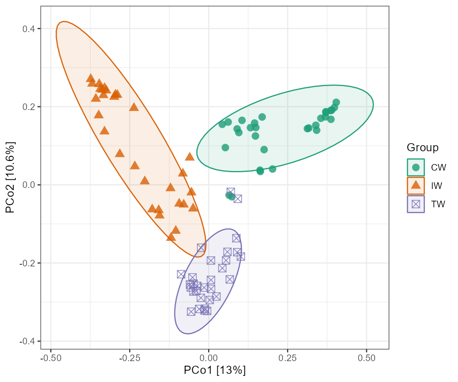
```

More examples on different options.

```{r, echo = TRUE, eval = FALSE}
t1$plot_ordination(plot_color = "Type", plot_type = "point")
t1$plot_ordination(plot_color = "Group", point_size = 5, point_alpha = .2, plot_type = c("point", "ellipse"), ellipse_chull_fill = FALSE)
t1$plot_ordination(plot_color = "Group", plot_shape = "Group", plot_type = c("point", "centroid"))
t1$plot_ordination(plot_color = "Group", plot_shape = "Group", plot_type = c("point", "ellipse", "centroid"))
t1$plot_ordination(plot_color = "Group", plot_shape = "Group", plot_type = c("point", "chull"))
t1$plot_ordination(plot_color = "Group", plot_shape = "Group", plot_type = c("point", "chull", "centroid"))
t1$plot_ordination(plot_color = "Group", plot_shape = "Group", plot_type = c("chull", "centroid"))
t1$plot_ordination(plot_color = "Group", plot_shape = "Group", plot_type = c("point", "chull", "centroid"), add_sample_label = "SampleID")
t1$plot_ordination(plot_color = "Group", plot_shape = "Group", plot_type = "centroid")
t1$plot_ordination(plot_color = "Group", plot_shape = "Group", plot_type = "centroid", centroid_segment_alpha = 0.9, centroid_segment_size = 1, centroid_segment_linetype = 1)
t1$plot_ordination(plot_type = c("point", "centroid"), plot_color = "Type", centroid_segment_linetype = 1)
t1$plot_ordination(plot_color = "Saline", point_size = 5, point_alpha = .2, plot_type = c("point", "chull"), ellipse_chull_fill = FALSE, ellipse_chull_alpha = 0.1)
t1$plot_ordination(plot_color = "Group") + theme(panel.grid = element_blank()) + geom_vline(xintercept = 0, linetype = 2) + geom_hline(yintercept = 0, linetype = 2)
```

One example for PCA or DCA with Genus data and loading arrow.

```{r, echo = TRUE, eval = FALSE}
tmp <- mt_rarefied$merge_taxa(taxa = "Genus")
tmp$tax_table %<>% .[.$Genus != "g__", ]
tmp$tidy_dataset()
rownames(tmp$otu_table) <- tmp$tax_table[rownames(tmp$otu_table), "Genus"]
rownames(tmp$tax_table) <- tmp$tax_table[, "Genus"]
t1 <- trans_beta$new(dataset = tmp)
t1$cal_ordination(method = "PCA")
t1$plot_ordination(plot_color = "Group", loading_arrow = TRUE, loading_text_italic = TRUE)
t1$cal_ordination(method = "DCA")
t1$plot_ordination(plot_color = "Group", loading_arrow = TRUE, loading_text_italic = TRUE)
```

Then we plot and compare the group distances.

```{r, echo = TRUE, eval = FALSE}
t1 <- trans_beta$new(dataset = mt_rarefied, group = "Group", measure = "bray")
# calculate and plot sample distances within groups
t1$cal_group_distance(within_group = TRUE)
# return t1$res_group_distance
# perform Wilcoxon Rank Sum and Signed Rank Tests
t1$cal_group_distance_diff(method = "wilcox")
# plot_group_order parameter can be used to adjust orders in x axis
t1$plot_group_distance(add = "mean")
```

```{r, out.width = "500px", fig.align="center", echo = FALSE}
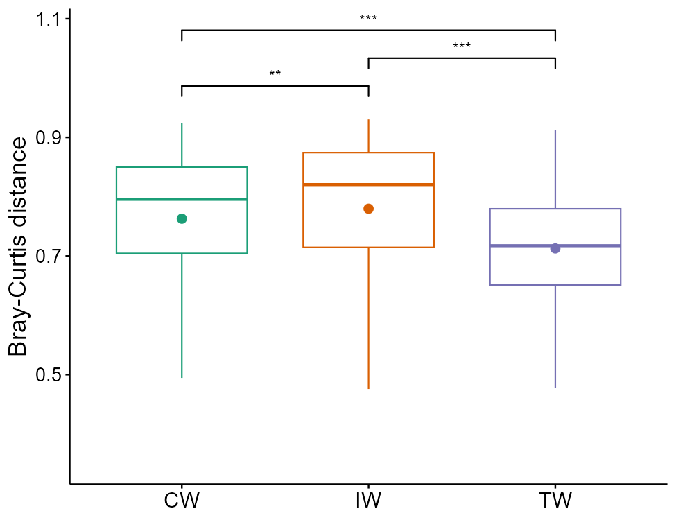
```

```{r, echo = TRUE, eval = FALSE}
# calculate and plot sample distances between groups
t1$cal_group_distance(within_group = FALSE)
t1$cal_group_distance_diff(method = "wilcox")
# parameters in plot_group_distance function will be passed to the plot_alpha function of trans_alpha class
t1$plot_group_distance(plot_type = "ggviolin", add = "mean_se")
t1$plot_group_distance(add = "mean")
```

```{r, out.width = "500px", fig.align="center", echo = FALSE}
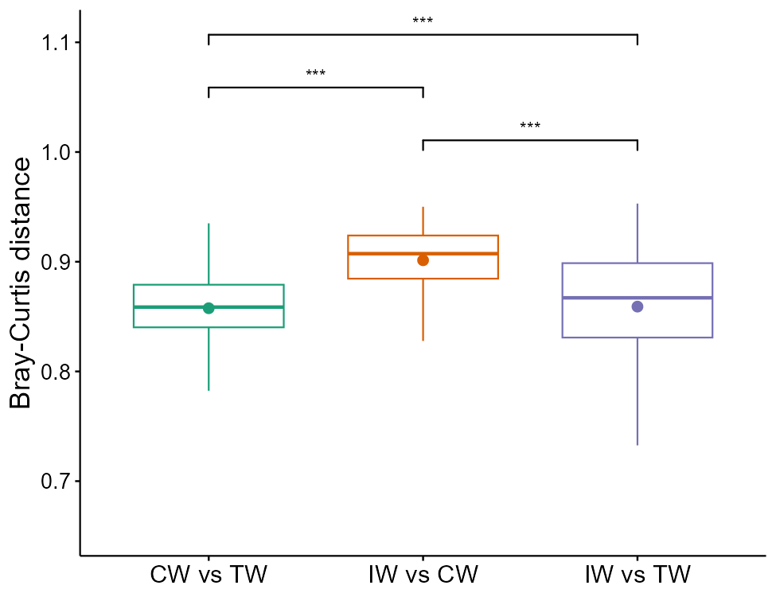
```

Clustering plot is also a frequently used method.

```{r, echo = TRUE, eval = FALSE}
# extract a part of data
tmp <- clone(mt_rarefied)
tmp$sample_table %<>% subset(Group %in% c("CW", "TW"))
tmp$tidy_dataset()
t1 <- trans_beta$new(dataset = tmp, group = "Group")
# use replace_name to set the label name, group parameter used to set the color
t1$plot_clustering(group = "Type", replace_name = c("Type"))
```

```{r, out.width = "550px", fig.align="center", echo = FALSE}
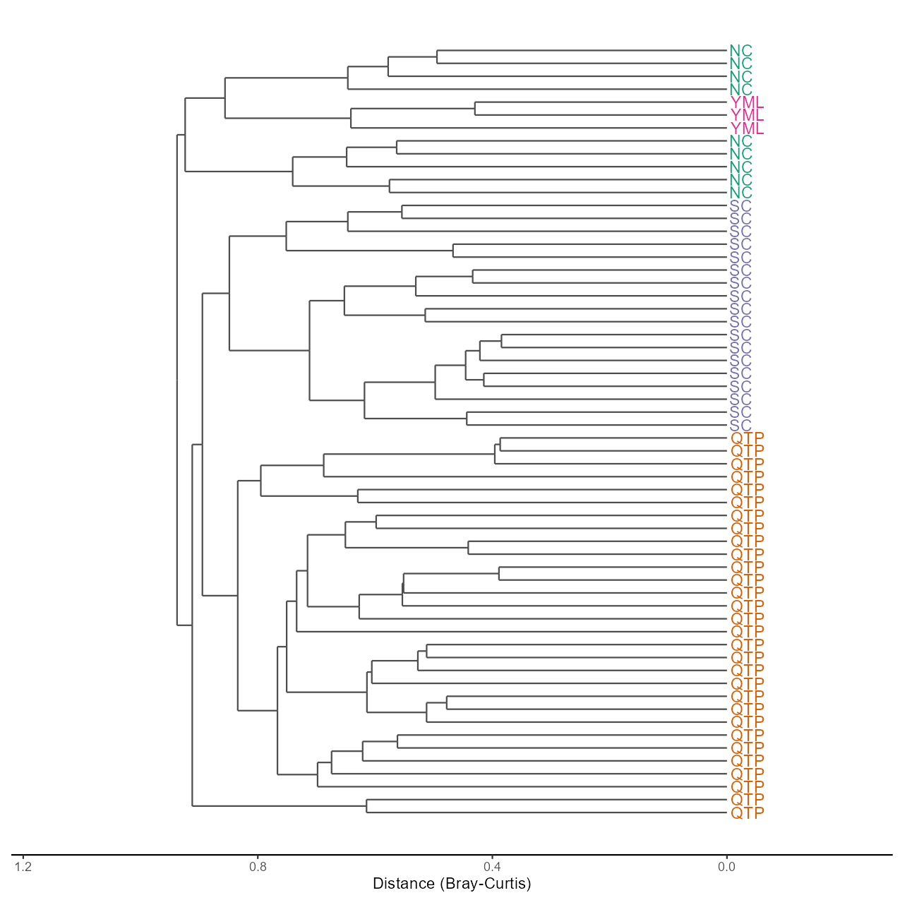
```


PerMANOVA[@Anderson_Austral_2001] can be applied to the differential test of distances among groups via the `cal_manova` function developed 
based on the `adonis2` function of vegan package.

```{r, echo = TRUE, eval = FALSE}
t1 <- trans_beta$new(dataset = mt_rarefied, group = "Group", measure = "bray")
# manova for all groups when manova_all = TRUE
t1$cal_manova(manova_all = TRUE)
t1$res_manova
```

```{r, echo = FALSE}
t1$cal_manova(manova_all = TRUE)
pander::pander(t1$res_manova)
```

The parameter `manova_all = FALSE` can make the test switch to paired group comparison.


```{r, echo = TRUE, eval = FALSE}
# manova for each paired groups
t1$cal_manova(manova_all = FALSE)
t1$res_manova
```

```{r, echo = FALSE}
t1$cal_manova(manova_all = FALSE)
pander::pander(t1$res_manova)
```

When there are too many comparison pairs or when comparisons are valuable only within certain categories, the `by_group` parameter can be used.

```{r, echo = TRUE, eval = FALSE}
t1$cal_manova(manova_all = FALSE, group = "Type", by_group = "Group")
t1$res_manova
```

```{r, echo = FALSE}
t1$cal_manova(manova_all = FALSE, group = "Type", by_group = "Group")
pander::pander(t1$res_manova)
```


The parameter `manova_set` has higher priority than `manova_all`. If `manova_set` is provided, manova_all parameter will be disabled.

```{r, echo = TRUE, eval = FALSE}
# manova for specified group set: such as "Group + Type"
t1$cal_manova(manova_set = "Group + Type")
t1$res_manova
```

```{r, echo = FALSE}
t1$cal_manova(manova_set = "Group + Type")
pander::pander(t1$res_manova)
```

From v1.0.0, ANOSIM method is also available.

```{r, echo = TRUE, eval = FALSE}
# the group parameter is not necessary when it is provided in creating the object
t1$cal_anosim(group = "Group")
t1$res_anosim
t1$cal_anosim(group = "Group", paired = TRUE)
t1$res_anosim
```

PERMDISP[@Anderson_Navigating_2011] is implemented to test multivariate homogeneity of groups dispersions (variances) based on the `betadisper` function of vegan package.

```{r, echo = TRUE}
# for the whole comparison and for each paired groups
t1$cal_betadisper()
t1$res_betadisper
```

For the explanation of statistical methods in microbial ecology, please read the references [@Ramette_Multivariate_2007; @Buttigieg_guide_2014].


### Key points

  + trans_beta$new: creating `trans_beta` object with `measure` parameter can invoke `beta_diversity` in `microtable` object for transformation
  + cal_ordination(): PCoA, PCA and NMDS approaches are all available
  + cal_manova(): `cal_manova` function can be used for paired comparisons, overall test and multi-factors test
  + plot_group_distance(): manipulating `object$res_group_distance_diff` can control what statistical results are presented in the plot.


## trans_rarefy class

The class trans_rarefy can be used for the rarefaction and the following plotting to see whether 
the sequencing depth is enough to cover all the so-called species in the microbial community.
Rarefying a community means to repeatedly subsample a fixed number of reads from each sample, so that 
all the samples become comparable in sequencing depth, and the alpha diversity is recalculated after 
each rarefying.
The resulting curve, i.e. the rarefaction curve, usually rises steeply in the low-depth region and then 
flattens out once the sequencing depth is enough to cover most of the species in the community.
The class is a wrapper of two other classes: the rarefying is performed by the `norm` function of the 
`trans_norm` class, and the alpha diversity is calculated by the `cal_alphadiv` function of the 
`microtable` class, in which the measurements are computed by the vegan package [@Jari_vegan_2019].
All the results shown in this section were checked with microeco v2.4.0.


### Example

The `alphadiv` parameter accepts one or more alpha diversity measurements, and `"Observed"` means the 
observed species number, i.e. the richness.
The `depth` parameter determines at which sequencing depths the data are rarefied.
The rarefying and the calculation of the alpha diversity are run once per depth.

```{r, echo = TRUE, eval = FALSE}
library(microeco)
data(sample_info_16S)
data(otu_table_16S)
# set.seed is used to fix the random number generation to make the results repeatable
set.seed(123)
tmp <- microtable$new(sample_table = sample_info_16S, otu_table = otu_table_16S)
tmp$tidy_dataset()
# trans_rarefy class: rarefy the data at the provided depths and calculate the alpha diversity
t1 <- trans_rarefy$new(tmp, alphadiv = "Observed", depth = c(0, 10, 50, 500, 2000, 6000, 10000, 15000, 20000))
```

As the `norm` function removes the features and the samples that do not survive the random subsampling, 
several messages are printed for each depth.
The expected messages are (truncated):

```
Rarefy data at depth 10 ...
12915 features are removed because they are no longer present in any sample after random subsampling ...
12915 taxa with 0 abundance are removed from the otu_table ...
Rarefy data at depth 50 ...
11235 features are removed because they are no longer present in any sample after random subsampling ...
11235 taxa with 0 abundance are removed from the otu_table ...
...
Rarefy data at depth 15000 ...
36 samples are removed because of fewer reads than input sample.size ...
246 taxa with 0 abundance are removed from the otu_table ...
246 features with 0 abundance are removed after filtering samples ...
569 features are removed because they are no longer present in any sample after random subsampling ...
569 taxa with 0 abundance are removed from the otu_table ...
Rarefy data at depth 20000 ...
65 samples are removed because of fewer reads than input sample.size ...
...
The rarefied data is stored in object$res_rarefy ...
```

The result is a data.frame stored in `t1$res_rarefy`, and the measurements and depths used are also 
saved in the object.

```{r, echo = TRUE, eval = FALSE}
# return t1$res_rarefy; SampleID: sample name, seqnum: rarefying depth
head(t1$res_rarefy)
# the measurements and depths used
t1$measure
t1$depth
# the print method of the class
t1
```

```
  SampleID seqnum Observed
1       S1      0        0
2       S2      0        0
3       S3      0        0
4       S4      0        0
5       S5      0        0
6       S6      0        0
[1] "Observed"
[1]     0    10    50   500  2000  6000 10000 15000 20000
trans_rarefy class:
The measures used: Observed 
res_rarefy have been calculated at depths: 0, 10, 50, 500, 2000, 6000, 10000, 15000, 20000 
```

Some important details:

* `depth = 0` is a special value: the data are not rarefied and all the diversity values are directly set 
  to 0, so it works as the common starting point of the curve.
* The sample sums of the example data range from 10364 to 37374, so all the depths used here are available 
  for every sample.
* For a sample whose sequencing depth is smaller than the rarefying depth, the sample is removed by the 
  `norm` function, so it is absent at this depth and its curve stops earlier.
  In this example the numbers of retained samples are 90 at the depths 0-10000, 54 at 15000 and 25 at 
  20000, so `t1$res_rarefy` has 709 rows in total.
* The rarefying is a random subsampling, but the results are repeatable, as the `norm` function fixes the 
  random seed (`rngseed = 123` by default); see the following More options section.

Then the rarefaction curve can be plotted directly with the `plot_rarefy` function, which returns a 
ggplot object.

```{r, echo = TRUE, eval = FALSE}
# the color parameter can be any column name of the sample_table
p1 <- t1$plot_rarefy(color = "Group", show_point = TRUE, add_fitting = FALSE)
p1
# use a fitted curve instead of the points and lines
p2 <- t1$plot_rarefy(color = "Group", show_point = FALSE, add_fitting = TRUE)
p2
# show the sample names at the end of the curves
p3 <- t1$plot_rarefy(show_samplename = TRUE, color_values = rep("grey70", 100), show_legend = FALSE)
p3
```

```{r, out.width = "600px", fig.align="center", echo = FALSE}
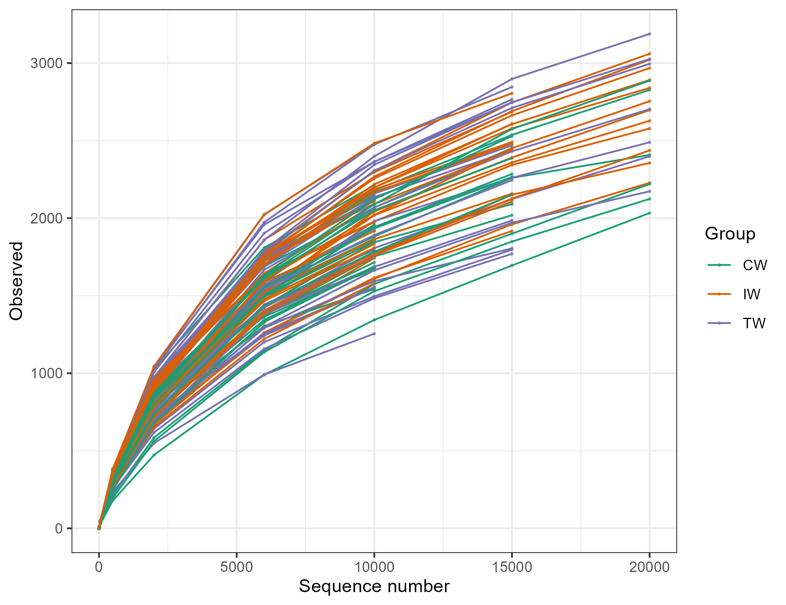
```

```{r, out.width = "600px", fig.align="center", echo = FALSE}
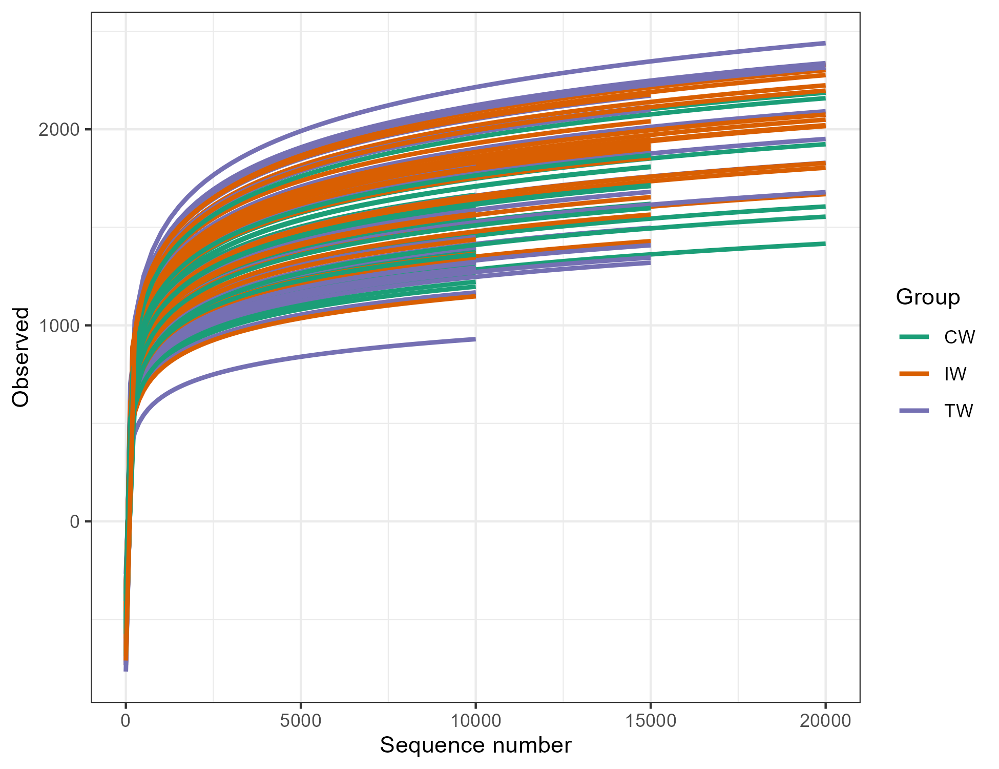
```

```{r, out.width = "600px", fig.align="center", echo = FALSE}
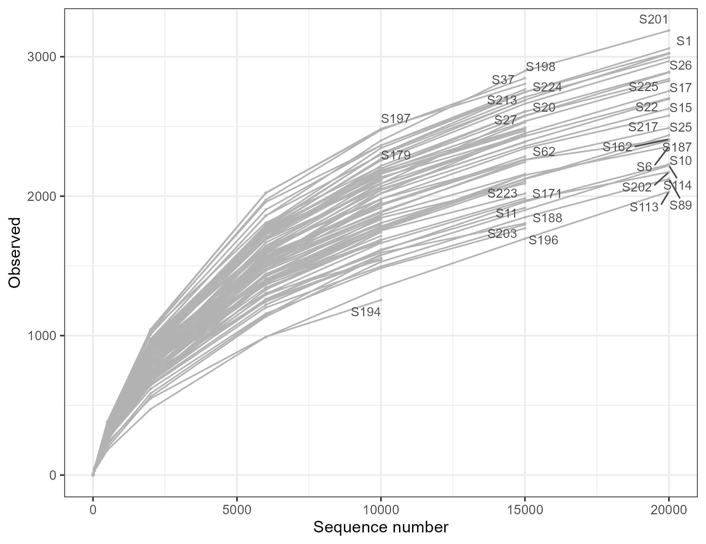
```

`color` defaults to `"SampleID"`; `"Group"` is used in the first two plots just to keep the legend 
readable.
In the third plot all the curves are drawn in grey and each sample is labelled at its own last available 
depth.
As the label colours are taken from `color_values`, don't forget to provide enough colours; if the colours 
provided are fewer than the groups, the class prints a message and expands them automatically by colour 
interpolation.


### More options

#### Multiple measurements at the same time

One or more measurements can be calculated in the same rarefying process, so that they share the same 
rarefied data and no extra random subsampling is needed.

```{r, echo = TRUE, eval = FALSE}
t1 <- trans_rarefy$new(tmp, alphadiv = c("Observed", "Shannon"), depth = c(0, 50, 500, 2000, 6000, 10000, 15000))
# the plot is faceted by the measurements when more than one measurement is used
t1$plot_rarefy(color = "Group")
# only one of the measurements can be shown with the measure parameter
t1$plot_rarefy(color = "Group", measure = "Shannon")
```

```{r, out.width = "700px", fig.align="center", echo = FALSE}
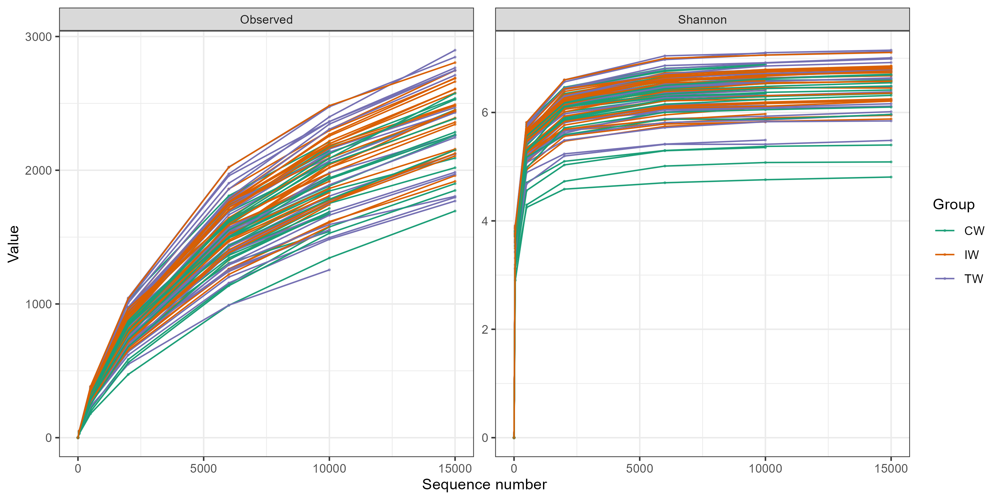
```

When multiple measurements are used, each measurement is shown in its own panel with a free y axis 
(`facet_wrap(~ measure, scales = "free_y")`) and the y axis title defaults to `"Value"`.
The names of the measurements are case-insensitive, and both the long names and the short names used in 
the vegan package are accepted, e.g. `"Observed"`/`"s.obs"`, `"Chao1"`/`"s.chao1"`, `"ACE"`/`"s.ace"`.
The available measurements are Observed, Coverage, Chao1, ACE, Shannon, Simpson, InvSimpson, Fisher, 
Pielou and PD.

#### Automatic generation of the depths

When `depth` is not provided, a sequence of 10 depths ranging from 0 to the maximum of the sample sums is 
generated automatically with a quadratic spacing.

```{r, echo = TRUE, eval = FALSE}
# the depth is generated automatically when it is not provided
t1 <- trans_rarefy$new(tmp, alphadiv = "Observed")
t1$depth
```

```
The parameter depth is not provided! Use the automatically generated depths: 0, 461, 1846, 4153, 7383, 11535, 16611, 22609, 29530, 37374 ...
[1]     0   461  1846  4153  7383 11535 16611 22609 29530 37374
```

The depths are calculated as `round(max(sample_sums) * seq(0, 1, length.out = 10)^2)`, i.e. the intervals 
become larger and larger.
Such a spacing puts more depths in the low-depth region, where the curve rises steeply, and fewer in the 
high-depth region, where the curve has already become flat.
The default measurement is `"Shannon"` when `alphadiv` is not provided.

#### Alternative rarefying method

The `method` and `rngseed` parameters are passed to the `norm` function of the `trans_norm` class.
Besides the default `"rarefy"`, the `"SRS"` method (scaling with ranked subsampling) is available and can 
be used to avoid the information loss of the classic rarefaction [@Beule_normalization_2020].

```{r, echo = TRUE, eval = FALSE}
# "SRS" is the scaling with ranked subsampling method
t1 <- trans_rarefy$new(tmp, alphadiv = "Observed", depth = c(0, 2000), method = "SRS")
# change the random seed used by the subsampling; the rarefying is repeatable for a fixed seed
t1 <- trans_rarefy$new(tmp, alphadiv = "Observed", depth = c(0, 2000), rngseed = 1)
```

Note that `sample.size` in `...` is ignored, as the library size is controlled by the `depth` parameter; 
a message is printed when it is provided.

#### Plot adjustments

```{r, echo = TRUE, eval = FALSE}
# axes titles, legend and the size and transparency of the points
t1$plot_rarefy(color = "Group", x_axis_title = "Sequencing depth", y_axis_title = "Observed richness",
  show_point = TRUE, point_size = .5, point_alpha = .8)
# the parameters in ... are passed to geom_line (add_fitting = FALSE) or geom_smooth (add_fitting = TRUE)
t1$plot_rarefy(linewidth = 1, alpha = .5)
t1$plot_rarefy(color = "Group", show_point = FALSE, add_fitting = TRUE,
  fitting_method = "lm", fitting_formula = y ~ x)
# the returned object is a ggplot, so it can be further customized
t1$plot_rarefy(color = "Group") + ggplot2::theme_classic()
```

`add_fitting = TRUE` fits the curve with `ggplot2::geom_smooth`; the default `fitting_method = "lm"` and 
`fitting_formula = y ~ log(x + 1)` avoid the warnings of the default `"loess"` method, as there are 
usually only a few depths for each sample.
Note that `x + 1` is used instead of `x` in the default formula, because the depth 0 makes `log(x)` 
invalid.
The `se` argument of `geom_smooth` is fixed to `FALSE` inside the class, so passing `se` in `...` raises 
an error when `add_fitting = TRUE`.


### Key points

* The class is a wrapper: the rarefying comes from `trans_norm$norm` and the alpha diversity from 
  `microtable$cal_alphadiv`; one rarefied `microtable` object is rebuilt from the original data at each 
  depth, so the rarefying at different depths is independent.
* `depth = 0` is kept as an artificial starting point of the curve, where all the diversity values are 0 
  rather than the real values of the original data.
* The `depth` values must be non-negative integers and not larger than `max(dataset$sample_sums())`; 
  duplicated values are removed and the depths are sorted internally.
* Samples are removed at the depths larger than their own sequencing depth, so the curves are interrupted 
  and the number of rows per depth decreases; the total number of rows of `res_rarefy` is therefore 
  smaller than `length(depth) * n_samples`.
* Rarefying is random but repeatable: `rngseed = 123` by default, and the results are identical for the 
  same seed.
* Very low depths should be used with care: the `"Fisher"` measurement may be unavailable, and `"Pielou"` 
  returns `NaN` when only one species is present at a depth. The class prints a message listing the 
  measurements and the number of rows with missing values, e.g. `Pielou (90 rows)` at depth 1 for the 
  example data.
* `alphadiv` is case-insensitive; the available measurements are Observed, Coverage, Chao1, ACE, Shannon, 
  Simpson, InvSimpson, Fisher, Pielou and PD.
* Parameters in `...` of `new` are passed to the `norm` function, such as `method`, `rngseed` and 
  `replace`, except `sample.size`, which is controlled by `depth`.
* `color` of `plot_rarefy` can be any column of `sample_table` and defaults to `"SampleID"`; 
  `color_values` are expanded automatically when they are not enough.
* `plot_rarefy` returns a ggplot object, so the plot can be further customized with the ggplot2 syntax.

