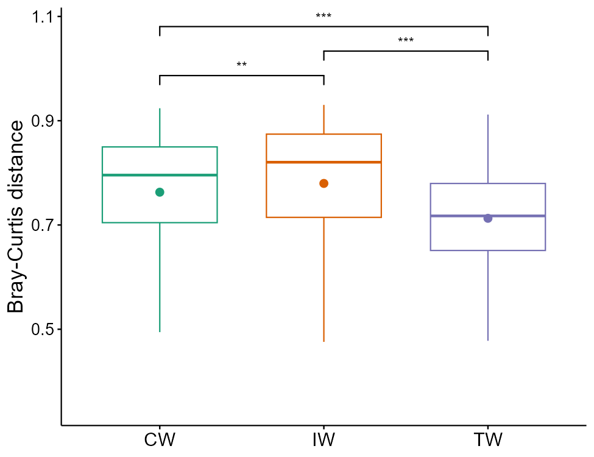
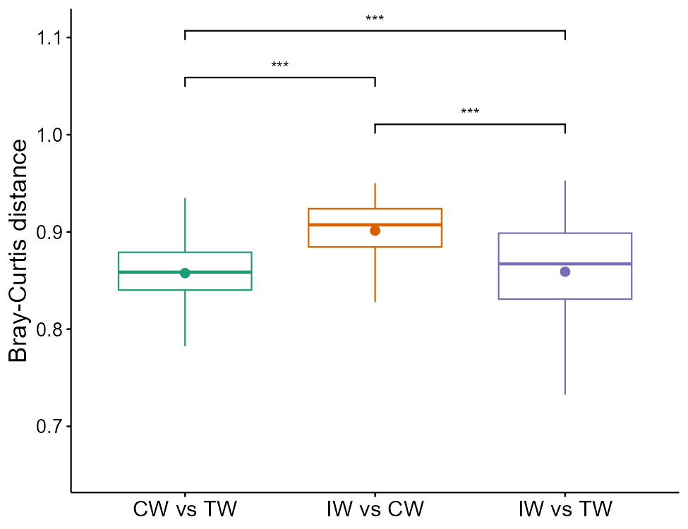

# Diversity-based class

Diversity is one of the core topics in community ecology.
It refers to alpha diversity, beta diversity and gamma diversity.


## trans_alpha class

　Alpha diversity can be transformed and visualized using the `trans_alpha` class.
Creating an object of `trans_alpha` class can invoke the alpha_diversity data stored in the microtable object.


### Example

Creating a `trans_alpha` object can return two data.frame with the prefix 'data_': `data_alpha` and `data_stat`.
`data_alpha` is used for subsequent differential test and visualization.


```{r, echo = TRUE, eval = FALSE}
t1 <- trans_alpha$new(dataset = dataset, group = "Group")
# return t1$data_stat
head(t1$data_stat)
```

```{r, echo = FALSE}
t1 <- trans_alpha$new(dataset = dataset, group = "Group")
pander::pander(head(t1$data_stat))
```

Then, we test the differences among groups using Kruskal-Wallis Rank Sum Test (overall test when groups > 2), Wilcoxon Rank Sum Tests (for paired groups),
Dunn's Kruskal-Wallis Multiple Comparisons (for paired groups when groups > 2) and anova with multiple comparisons.

```{r, echo = TRUE, eval = FALSE}
t1$cal_diff(method = "KW")
# return t1$res_diff
head(t1$res_diff)
```

```{r, echo = FALSE}
suppressWarnings(t1$cal_diff(method = "KW"))
pander::pander(head(t1$res_diff[, -3]))
```

```{r, echo = TRUE, eval = FALSE}
t1$cal_diff(method = "KW_dunn")
# return t1$res_diff
head(t1$res_diff)
```

```{r, echo = FALSE}
t1$cal_diff(method = "KW_dunn")
pander::pander(head(t1$res_diff))
```

```{r, echo = TRUE, eval = FALSE}
# more options
t1$cal_diff(method = "KW_dunn", KW_dunn_letter = FALSE)
head(t1$res_diff)
t1$cal_diff(method = "wilcox")
head(t1$res_diff)
t1$cal_diff(method = "t.test")
```

Then, let's try to use anova. 
From v1.0.0, the `alpha` parameter can be used to adjust the significance threshold (default: 0.05) of multiple comparisons when method is 'anova' or 'KW_dunn'.


```{r, echo = TRUE, eval = FALSE}
t1$cal_diff(method = "anova")
# return t1$res_diff
head(t1$res_diff)
```

```{r, echo = FALSE}
suppressMessages(library(agricolae))
t1$cal_diff(method = "anova")
pander::pander(head(t1$res_diff))
```

The multi-factor analysis of variance is also supported with the `formula` parameter, such as two-way anova. 

```{r, echo = TRUE, eval = FALSE}
t1 <- trans_alpha$new(dataset = dataset, group = "Group")
t1$cal_diff(method = "anova", formula = "Group+Type")
head(t1$res_diff)
# see the help document for the usage of formula
```


The plot_alpha function add the significance label by searching the results in **object$res_diff** instead of recalculating the significance.
Now, let's plot the alpha diversity for each group and include the anova result.

```{r, echo = TRUE, eval = FALSE}
t1$cal_diff(method = "anova")
# y_increase can adjust the distance from the letters to the highest point
t1$plot_alpha(measure = "Chao1", y_increase = 0.3)
t1$plot_alpha(measure = "Chao1", y_increase = 0.1)
# add_sig_text_size: letter size adjustment
t1$plot_alpha(measure = "Chao1", add_sig_text_size = 6, add = "jitter", order_x_mean = TRUE)
```

```{r, out.width = "600px", fig.align="center", echo = FALSE}
knitr::include_graphics("Images/trans_alpha_group_letter.png")
```

```{r, echo = TRUE, eval = FALSE}
t1$cal_diff(method = "wilcox")
t1$plot_alpha(measure = "Chao1", shape = "Group")
# y_start: starting height for the first label
# y_increase: increased height for each label
t1$plot_alpha(measure = "Chao1", shape = "Group", add = "jitter", y_start = 0.1, y_increase = 0.1)
```

```{r, out.width = "600px", fig.align="center", echo = FALSE}
knitr::include_graphics("Images/trans_alpha_group_wilcox.png")
```

Let's try to remove the 'ns' in the label by manipulating the `object$res_diff`.

```{r, echo = TRUE, eval = FALSE}
t1$res_diff %<>% base::subset(Significance != "ns")
t1$plot_alpha(measure = "Chao1", add = "dotplot", xtext_size = 15)
```

```{r, out.width = "600px", fig.align="center", echo = FALSE}
knitr::include_graphics("Images/trans_alpha_wilcox_nons.png")
```

The trans_alpha class supports the differential test of groups within each group using the `by_group` parameter.

```{r, echo = TRUE, eval = FALSE}
t1 <- trans_alpha$new(dataset = dataset, group = "Type", by_group = "Group")
t1$cal_diff(method = "wilcox")
t1$plot_alpha(measure = "Shannon")
```

```{r, out.width = "600px", fig.align="center", echo = FALSE}
knitr::include_graphics("Images/trans_alpha_wilcox_bygroup.png")
```


Scheirer Ray Hare test is a nonparametric test that is suitable for a two-way factorial experiment.

```{r, echo = TRUE, eval = FALSE}
t1 <- trans_alpha$new(dataset = dataset)
# require rcompanion package to be installed
t1$cal_diff(method = "scheirerRayHare", formula = "Group+Type")
```


Linear mixed-effects model can be selected with the `method = "lme"`.
This model is implemented based on the `lmerTest` package.
For more parameters, please see `lmerTest::lmer` function.
Please use parameter passing when more parameters are needed.
For the formula usage, please follow this (https://mspeekenbrink.github.io/sdam-r-companion/linear-mixed-effects-models.html).
In the return table, conditional R2 is the total variance explained by fixed and random effects, 
and marginal R2 is the variance explained by fixed effects.

```{r, echo = TRUE, eval = FALSE}
if(!require("lmerTest")) install.packages("lmerTest")
t1 <- trans_alpha$new(dataset = dataset)
# just using (1|Type) as an example to show the random effect
t1$cal_diff(method = "lme", formula = "Group + (1|Type)")
View(t1$res_diff)
# return_model = TRUE can return original models, i.e. object$res_model
t1$cal_diff(method = "lme", formula = "Group + (1|Type)", return_model = TRUE)
```

Note that from v1.9.0, the parameter `plot_type` control which type of plot is employed.
All the options starting with "gg" (e.g., "ggboxplot", "ggdotplot", "ggviolin", "ggstripchart", "ggerrorplot") means they are the functions coming from the ggpubr package.

```{r, echo = TRUE, eval = FALSE}
t1 <- trans_alpha$new(dataset = dataset, group = "Type")
t1$cal_diff(method = "KW_dunn", KW_dunn_letter = TRUE)
t1$plot_alpha(plot_type = "ggboxplot", add = "none")

t1$plot_alpha(plot_type = "ggdotplot")
t1$plot_alpha(plot_type = "ggdotplot", fill = "Type", alpha = 0.3)
t1$plot_alpha(plot_type = "ggdotplot", add = "mean_se")
t1$plot_alpha(plot_type = "ggdotplot", add = c("mean_se", "violin"))
t1$plot_alpha(plot_type = "ggdotplot", add = c("mean_se", "violin"), fill = "Type", alpha = 0.2)

t1$plot_alpha(plot_type = "ggviolin")
t1$plot_alpha(plot_type = "ggviolin", y_increase = 0.4, add = "mean_se")
t1$plot_alpha(plot_type = "ggviolin", fill = "Type", alpha = 0.2, y_increase = 0.4, add = "mean_se", add_sig_text_size = 6)

t1$plot_alpha(plot_type = "ggstripchart", add = "mean_se")

t1$plot_alpha(plot_type = "ggerrorplot")
```


The option `plot_type = "errorbar"` in `plot_alpha` will invoke the `data_stat` instead of `data_alpha` for the Mean±SE (or SD) plot (based on the ggplot2).
The line is optional to be added between points (Mean) for the case with a gradient.

```{r, echo = TRUE, eval = FALSE}
t1 <- trans_alpha$new(dataset = dataset, group = "Group")
t1$cal_diff(method = "KW_dunn", measure = "Chao1", KW_dunn_letter = TRUE)
t1$plot_alpha(measure = "Chao1")
t1$plot_alpha(plot_type = "errorbar", measure = "Chao1")
t1$plot_alpha(plot_type = "errorbar", measure = "Chao1", y_increase = -0.2)
t1$plot_alpha(plot_type = "errorbar", measure = "Chao1", y_increase = -0.2, add_line = TRUE, line_type = 2, line_alpha = 0.5, errorbar_width = 0.1)
t1$plot_alpha(plot_type = "errorbar", plot_SE = FALSE, measure = "Chao1", y_increase = 0.2, add_line = TRUE, line_type = 2, line_alpha = 0.5, errorbar_width = 0.1)
# by_group example
# use example data in mecoturn package
library(microeco)
library(mecoturn)
library(magrittr)
data(wheat_16S)
wheat_16S$sample_table$Type %<>% factor(., levels = unique(.))
t1 <- trans_alpha$new(dataset = wheat_16S, group = "Region", by_group = "Type")
t1$cal_diff(method = "KW_dunn", measure = "Shannon", KW_dunn_letter = TRUE)
View(t1$res_diff)
t1$plot_alpha(plot_type = "errorbar", measure = "Shannon")
t1$plot_alpha(plot_type = "errorbar", measure = "Shannon", add_line = TRUE, line_type = 2)
t1$plot_alpha(plot_type = "errorbar", plot_SE = FALSE, measure = "Shannon", add_line = TRUE, line_type = 2)
```

From v1.4.0, the heatmap can be used to visualize the significances for the case with multiple factors in the formula.

```{r, echo = TRUE, eval = FALSE}
t1 <- trans_alpha$new(dataset = dataset, group = "Group")
t1$cal_diff(method = "anova", formula = "Group+Type+Group:Type")
t1$plot_alpha(color_palette = rev(RColorBrewer::brewer.pal(n = 11, name = "RdYlBu")), trans = "log10")
t1$plot_alpha(color_palette = c("#053061", "white", "#A50026"), trans = "log10")
t1$plot_alpha(color_values = c("#053061", "white", "#A50026"), trans = "log10")
t1$plot_alpha(color_values = c("#053061", "white", "#A50026"), trans = "log10", filter_feature = "", text_y_position = "left")
t1$plot_alpha(color_values = c("#053061", "white", "#A50026"), trans = "log10", filter_feature = "", text_y_position = "left", cluster_ggplot = "row")
```

### Key points

  + trans_alpha$new: creating `trans_alpha` object can invoke `alpha_diversity` in microtable for transformation
  + cal_diff: `formula` parameter applies to multi-factor analysis of variance.
  + cal_diff: From v1.2.0, `anova_post_test` can be used to change default post test method of anova.
  + plot_alpha: the significance label comes from the results in `object$res_diff`


## trans_beta class

　The trans_beta class is specifically designed for the beta diversity analysis, i.e. the dissimilarities among samples.
Beta diversity can be defined at different forms[@Tuomisto_diversity_2010] and can be explored with different ways[@Anderson_Navigating_2011].
We encapsulate some commonly-used approaches in microbial ecology[@Ramette_Multivariate_2007].
Note that the part of beta diversity related with environmental factors are placed into the trans_env class.
The distance matrix in beta_diversity list of microtable object will be invoked for transformation and ploting using trans_beta class when needed.
The analysis referred to the beta diversity in this class mainly include ordination, group distance, clustering and manova.


### Example

The available ordination methods include PCoA (principal coordinates analysis), NMDS (non-metric multidimensional scaling), 
PCA (principal component analysis), DCA (detrended correspondence analysis) and PLS-DA (partial least squares discriminant analysis).

```{r, echo = TRUE, eval = TRUE}
# create trans_beta object
# For PCoA and NMDS, measure parameter must be provided.
# measure parameter should be either one of names(dataset$beta_diversity) or a customized symmetric matrix
t1 <- trans_beta$new(dataset = dataset, group = "Group", measure = "bray")
```

```{r, echo = TRUE, eval = FALSE}
t1$cal_ordination(method = "PCoA")
# t1$res_ordination is the ordination result list
class(t1$res_ordination)
# plot the PCoA result with confidence ellipse
t1$plot_ordination(plot_color = "Group", plot_shape = "Group", plot_type = c("point", "ellipse"))
```

```{r, out.width = "650px", fig.align="center", echo = FALSE}
knitr::include_graphics("Images/trans_beta_ordination.png")
```

More examples on different options.

```{r, echo = TRUE, eval = FALSE}
t1$plot_ordination(plot_color = "Type", plot_type = "point")
t1$plot_ordination(plot_color = "Group", point_size = 5, point_alpha = .2, plot_type = c("point", "ellipse"), ellipse_chull_fill = FALSE)
t1$plot_ordination(plot_color = "Group", plot_shape = "Group", plot_type = c("point", "centroid"))
t1$plot_ordination(plot_color = "Group", plot_shape = "Group", plot_type = c("point", "ellipse", "centroid"))
t1$plot_ordination(plot_color = "Group", plot_shape = "Group", plot_type = c("point", "chull"))
t1$plot_ordination(plot_color = "Group", plot_shape = "Group", plot_type = c("point", "chull", "centroid"))
t1$plot_ordination(plot_color = "Group", plot_shape = "Group", plot_type = c("chull", "centroid"))
t1$plot_ordination(plot_color = "Group", plot_shape = "Group", plot_type = c("point", "chull", "centroid"), add_sample_label = "SampleID")
t1$plot_ordination(plot_color = "Group", plot_shape = "Group", plot_type = "centroid")
t1$plot_ordination(plot_color = "Group", plot_shape = "Group", plot_type = "centroid", centroid_segment_alpha = 0.9, centroid_segment_size = 1, centroid_segment_linetype = 1)
t1$plot_ordination(plot_type = c("point", "centroid"), plot_color = "Type", centroid_segment_linetype = 1)
t1$plot_ordination(plot_color = "Saline", point_size = 5, point_alpha = .2, plot_type = c("point", "chull"), ellipse_chull_fill = FALSE, ellipse_chull_alpha = 0.1)
t1$plot_ordination(plot_color = "Group") + theme(panel.grid = element_blank()) + geom_vline(xintercept = 0, linetype = 2) + geom_hline(yintercept = 0, linetype = 2)
```

One example for PCA or DCA with Genus data and loading arrow.

```{r, echo = TRUE, eval = FALSE}
d1 <- dataset$merge_taxa(taxa = "Genus")
d1$tax_table %<>% .[.$Genus != "g__", ]
d1$tidy_dataset()
rownames(d1$otu_table) <- d1$tax_table[rownames(d1$otu_table), "Genus"]
rownames(d1$tax_table) <- d1$tax_table[, "Genus"]
t1 <- trans_beta$new(dataset = d1)
t1$cal_ordination(method = "PCA")
t1$plot_ordination(plot_color = "Group", loading_arrow = TRUE, loading_text_italic = TRUE)
t1$cal_ordination(method = "DCA")
t1$plot_ordination(plot_color = "Group", loading_arrow = TRUE, loading_text_italic = TRUE)
```

Then we plot and compare the group distances.

```{r, echo = TRUE, eval = FALSE}
t1 <- trans_beta$new(dataset = dataset, group = "Group", measure = "bray")
# calculate and plot sample distances within groups
t1$cal_group_distance(within_group = TRUE)
# return t1$res_group_distance
# perform Wilcoxon Rank Sum and Signed Rank Tests
t1$cal_group_distance_diff(method = "wilcox")
# plot_group_order parameter can be used to adjust orders in x axis
t1$plot_group_distance(add = "mean")
```

```{r, out.width = "500px", fig.align="center", echo = FALSE}

```

```{r, echo = TRUE, eval = FALSE}
# calculate and plot sample distances between groups
t1$cal_group_distance(within_group = FALSE)
t1$cal_group_distance_diff(method = "wilcox")
# parameters in plot_group_distance function will be passed to the plot_alpha function of trans_alpha class
t1$plot_group_distance(plot_type = "ggviolin", add = "mean_se")
t1$plot_group_distance(add = "mean")
```

```{r, out.width = "500px", fig.align="center", echo = FALSE}

```

Clustering plot is also a frequently used method.

```{r, echo = TRUE, eval = FALSE}
# extract a part of data
d1 <- clone(dataset)
d1$sample_table %<>% subset(Group %in% c("CW", "TW"))
d1$tidy_dataset()
t1 <- trans_beta$new(dataset = d1, group = "Group")
# use replace_name to set the label name, group parameter used to set the color
t1$plot_clustering(group = "Type", replace_name = c("Type"))
```

```{r, out.width = "550px", fig.align="center", echo = FALSE}
knitr::include_graphics("Images/trans_beta_clustering.png")
```


PerMANOVA[@Anderson_Austral_2001] can be applied to the differential test of distances among groups via the `cal_manova` function developed 
based on the `adonis2` function of vegan package.

```{r, echo = TRUE, eval = FALSE}
t1 <- trans_beta$new(dataset = dataset, group = "Group", measure = "bray")
# manova for all groups when manova_all = TRUE
t1$cal_manova(manova_all = TRUE)
t1$res_manova
```

```{r, echo = FALSE}
t1$cal_manova(manova_all = TRUE)
pander::pander(t1$res_manova)
```

The parameter `manova_all = FALSE` can make the test switch to paired group comparison.


```{r, echo = TRUE, eval = FALSE}
# manova for each paired groups
t1$cal_manova(manova_all = FALSE)
t1$res_manova
```

```{r, echo = FALSE}
t1$cal_manova(manova_all = FALSE)
pander::pander(t1$res_manova)
```

When there are too many comparison pairs or when comparisons are valuable only within certain categories, the `by_group` parameter can be used.

```{r, echo = TRUE, eval = FALSE}
t1$cal_manova(manova_all = FALSE, group = "Type", by_group = "Group")
t1$res_manova
```

```{r, echo = FALSE}
t1$cal_manova(manova_all = FALSE, group = "Type", by_group = "Group")
pander::pander(t1$res_manova)
```


The parameter `manova_set` has higher priority than `manova_all`. If `manova_set` is provided, manova_all parameter will be disabled.

```{r, echo = TRUE, eval = FALSE}
# manova for specified group set: such as "Group + Type"
t1$cal_manova(manova_set = "Group + Type")
t1$res_manova
```

```{r, echo = FALSE}
t1$cal_manova(manova_set = "Group + Type")
pander::pander(t1$res_manova)
```

From v1.0.0, ANOSIM method is also available.

```{r, echo = TRUE, eval = FALSE}
# the group parameter is not necessary when it is provided in creating the object
t1$cal_anosim(group = "Group")
t1$res_anosim
t1$cal_anosim(group = "Group", paired = TRUE)
t1$res_anosim
```

PERMDISP[@Anderson_Navigating_2011] is implemented to test multivariate homogeneity of groups dispersions (variances) based on the `betadisper` function of vegan package.

```{r, echo = TRUE}
# for the whole comparison and for each paired groups
t1$cal_betadisper()
t1$res_betadisper
```

For the explanation of statistical methods in microbial ecology, please read the references [@Ramette_Multivariate_2007; @Buttigieg_guide_2014].


### Key points

  + trans_beta$new: creating `trans_beta` object with `measure` parameter can invoke `beta_diversity` in `microtable` object for transformation
  + cal_ordination(): PCoA, PCA and NMDS approaches are all available
  + cal_manova(): `cal_manova` function can be used for paired comparisons, overall test and multi-factors test
  + plot_group_distance(): manipulating `object$res_group_distance_diff` can control what statistical results are presented in the plot.


