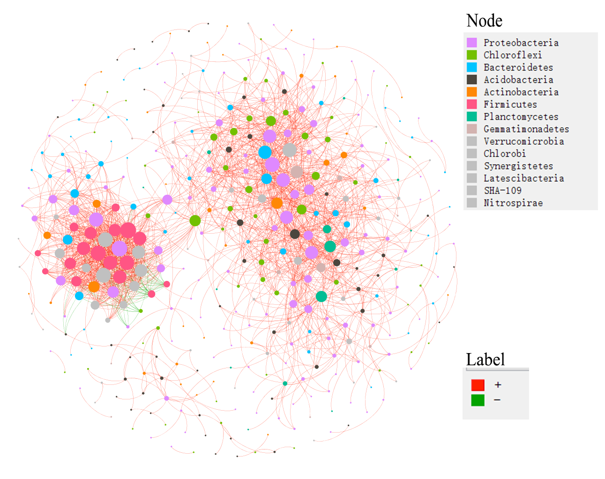
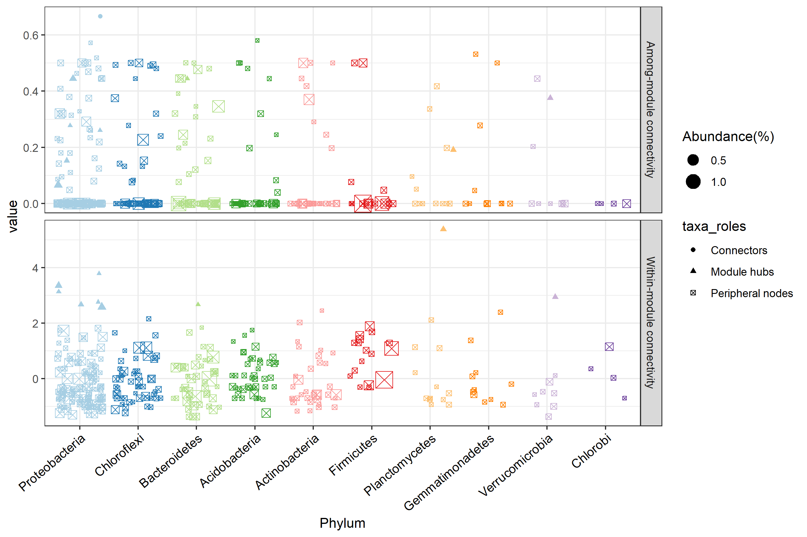

# Model-based class

We group all the classes with complex models into the type 'Model-based class'.


## trans_diff class

　Differential abundance test is a very important part in the microbial community data analysis.
It can be used to find the significant taxa in determining the community differences across groups.
Currently, trans_diff class have four famous approaches to perform this analysis: 
metastat[@White_Statistical_2009], LEfSe[@Segata_Metagenomic_2011], random forest and metagenomeSeq[@Paulson_Differential_2013].
Metastat depends on the permutations and t-test and performs well on the sparse data.
It is used for the comparisons of taxonomic abundance between two groups at any taxonomic level.
LEfSe and random forest in this class is mainly used for the identification of biomarkers including all taxonomic level.
metagenomeSeq method is implemented to find significant species between two groups at species level (OTU/ASV).


### Example

Let's first run metastat example.

```{r, echo = TRUE, eval = FALSE}
# metastat analysis at Genus level
t1 <- trans_diff$new(dataset = dataset, method = "metastat", group = "Group", metastat_taxa_level = "Genus")
# t1$res_metastat is the result
# t1$res_metastat_group_matrix is the group comparisons order for plotting
# plot the first paired groups, choose_group = 1
t1$plot_metastat(use_number = 1:10, qvalue = 0.05, choose_group = 1)
```

```{r, out.width = "650px", fig.align="center", echo = FALSE}
knitr::include_graphics("Images/plot_metastat_1.png")
```

LEfSe combines the non-parametric test and linear discriminant analysis [@Segata_Metagenomic_2011].


```{r, echo = TRUE, eval = FALSE}
t1 <- trans_diff$new(dataset = dataset, method = "lefse", group = "Group", alpha = 0.01, lefse_subgroup = NULL)
# t1$res_lefse is the LEfSe result
# t1$res_abund is the abundance information
t1$plot_lefse_bar(LDA_score = 4)
```

```{r, out.width = "700px", fig.align="center", echo = FALSE}
knitr::include_graphics("Images/plot_lefse_bar.png")
```


```{r, echo = TRUE, eval = FALSE}
t1$res_lefse[1:5, ]
```

```{r, echo = FALSE, eval = TRUE}
res_lefse <- read.csv("Files/res_lefse.csv")
t1 <- list()
t1[["res_lefse"]] <- res_lefse
pander::pander(t1$res_lefse[1:5, ])
```


Then, we plot the abundance of biomarkers detected by LEfSe.

```{r, echo = TRUE, eval = FALSE}
t1$plot_diff_abund(use_number = 1:30)
```

```{r, out.width = "650px", fig.align="center", echo = FALSE}
knitr::include_graphics("Images/plot_lefse_diff_abund.png")
```

Then, we show the cladogram of the differential features in the taxonomic tree.
There are too many taxa in this dataset.
As an example, we only use the highest 200 abundant taxa in the tree and 50 differential features.
We only show the full taxonomic label at Phylum level and use letters at other levels to reduce the text overlap.

```{r, echo = TRUE, eval = FALSE}
# clade_label_level 5 represent phylum level in this analysis
# require ggtree package
t1$plot_lefse_cladogram(use_taxa_num = 200, use_feature_num = 50, clade_label_level = 5)
```

```{r, out.width = "1000px", fig.align="center", echo = FALSE}
knitr::include_graphics("Images/plot_lefse_cladogram.png")
```

There may be a problem related with the taxonomic labels in the plot.
When the levels used are too many, the taxonomic labels may have too much overlap.
However, if you only indicate the Phylum labels, the taxa in the legend with marked letters are too many.
At this time, you can select the taxa that you want to show in the plot manually like the following operation.

```{r, echo = TRUE, eval = FALSE}
# choose some taxa according to the positions in the previous picture; those taxa labels have minimum overlap
use_labels <- c("c__Deltaproteobacteria", "c__Actinobacteria", "o__Rhizobiales", "p__Proteobacteria", "p__Bacteroidetes", 
	"o__Micrococcales", "p__Acidobacteria", "p__Verrucomicrobia", "p__Firmicutes", 
	"p__Chloroflexi", "c__Acidobacteria", "c__Gammaproteobacteria", "c__Betaproteobacteria", "c__KD4-96",
	"c__Bacilli", "o__Gemmatimonadales", "f__Gemmatimonadaceae", "o__Bacillales", "o__Rhodobacterales")
# then use parameter select_show_labels to show
t1$plot_lefse_cladogram(use_taxa_num = 200, use_feature_num = 50, select_show_labels = use_labels)
# Now we can see that more taxa names appear in the tree
```

```{r, out.width = "1000px", fig.align="center", echo = FALSE}
knitr::include_graphics("Images/plot_lefse_cladogram_1.png")
```

If you are interested in taxonomic tree, you can also use metacoder package[@Foster_Metacoder_2017] to plot the taxonomic tree based on the selected taxa. 
We do not show the usage here.


The third approach is rf, which depends on the random forest[@Beck_Machine_2014; @Yatsunenko_Human_2012] and the non-parametric test.
The current method can calculate random forest by bootstrapping like the method in LEfSe and only use the significant features.
MeanDecreaseGini is selected as the indicator value in the analysis.

```{r, echo = TRUE, eval = FALSE}
# use Genus level for parameter rf_taxa_level, if you want to use all taxa, change to "all"
# nresam = 1 and boots = 1 represent no bootstrapping and use all samples directly
t1 <- trans_diff$new(dataset = dataset, method = "rf", group = "Group", rf_taxa_level = "Genus")
# t1$res_rf is the result stored in the object
# plot the result
t2 <- t1$plot_diff_abund(use_number = 1:20, only_abund_plot = FALSE)
gridExtra::grid.arrange(t2$p1, t2$p2, ncol=2, nrow = 1, widths = c(2,2))
# the middle asterisk represent the significances
```

```{r, out.width = "800px", fig.align="center", echo = FALSE}
knitr::include_graphics("Images/plot_diff_abund.png")
```

### Key points

  + trans_diff$new: this class have a strict requirement on the taxonomic information, make sure tidy_taxonomy() function has been performed before the analysis
  + trans_diff$new: creating this class will invoke taxa_abund stored in microtable object


## trans_network class

　Network is a frequently used approach to study the co-occurrence patterns in microbial ecology [@Deng_Molecular_2012; @Faust_Microbial_2012; @Coyte_Theecology_2015].
In this part, we describe all the core contents in the trans_network class.
The network construction approaches can be classified into two types: correlation-based and non correlation-based.
Several approaches can be used to calculate correlations and significances.


### Example

We first introduce the correlation-based network. The parameter cal_cor in trans_network is used for selecting the correlation calculation method.


```{r, echo = TRUE, eval=FALSE}
# Use R base cor.test, a little slow
t1 <- trans_network$new(dataset = dataset, cal_cor = "base", taxa_level = "OTU", filter_thres = 0.0001, cor_method = "spearman")
# return t1$res_cor_p list; one table: correlation; another: p value
```

```{r, echo = TRUE, eval=FALSE}
# SparCC method, require SpiecEasi package, see https://chiliubio.github.io/microeco_tutorial/intro.html#spieceasi for the installation
# SparCC is very slow, so consider filtering more species with low abundance
t1 <- trans_network$new(dataset = dataset, cal_cor = "SparCC", taxa_level = "OTU", filter_thres = 0.001, SparCC_simu_num = 100)
```

```{r, echo = TRUE, eval=FALSE}
# When the OTU number is large, using R WGCNA package to replace "base" will be faster
# require WGCNA package, see https://chiliubio.github.io/microeco_tutorial/intro.html#wgcna for the installation
t1 <- trans_network$new(dataset = dataset, cal_cor = "WGCNA", taxa_level = "OTU", filter_thres = 0.0001, cor_method = "spearman")
```

The parameter COR_cut can be used to select the correlation threshold.
Furthermore, COR_optimization = TRUE represent using RMT theory to find the optimized correlation threshold instead of the COR_cut[@Deng_Molecular_2012].

```{r, echo = TRUE, eval=FALSE}
# construct network; require igraph package
t1$cal_network(p_thres = 0.01, COR_optimization = TRUE)
# return t1$res_network
```

```{r, echo = TRUE, eval=FALSE}
# use arbitrary coefficient threshold to contruct network
t1$cal_network(p_thres = 0.01, COR_cut = 0.7)
```

```{r, echo = TRUE, eval=FALSE}
# add modules in the network
t1$cal_module()
```

```{r, echo = TRUE, eval=FALSE}
# save network
# open the gexf file using Gephi(https://gephi.org/)
# require rgexf package
t1$save_network(filepath = "network.gexf")
```

We plot the network and present the node colors according to the calculated modules in Gephi.
```{r, out.width = "550px", fig.align="center", echo = FALSE}
knitr::include_graphics("Images/network1_spearman.png")
```

Now, we show the node colors with the Phylum information and the edges colors with the positive and negative correlations.
All the data used has been stored in the network.gexf file, including modules classifications, Phylum information and edges classifications.

```{r, out.width = "550px", fig.align="center", echo = FALSE}

```


```{r, echo = TRUE, eval = FALSE}
# calculate network attributes
t1$cal_network_attr()
# return t1$res_network_attr
```

```{r, echo = FALSE}
# read
res_network_attr <- read.csv("Files/res_network_attr.csv", check.names = FALSE)
```
```{r, echo = FALSE}
pander::pander(res_network_attr)
```

```{r, echo = TRUE, eval = FALSE}
# classify the node; return t1$res_node_type
t1$cal_node_type()
# return t1$res_node_type
# we retain the file for the following example in trans_func part
network_node_type <- t1$res_node_type
```

```{r, echo = FALSE}
# read
network_node_type <- read.csv("Files/res_node_type.csv", row.names = 1, check.names = FALSE)
```

```{r, echo = FALSE}
pander::pander(network_node_type[1:5, c(1:4)])
```

```{r, echo = TRUE, eval = FALSE}
# plot node roles in terms of the within-module connectivity and among-module connectivity
t1$plot_taxa_roles(use_type = 1)
```

```{r, out.width = "700px", fig.align="center", echo = FALSE}
knitr::include_graphics("Images/plot_taxa_roles.png")
```

```{r, echo = TRUE, eval = FALSE}
# plot node roles with phylum information
t1$plot_taxa_roles(use_type = 2)
```

```{r, out.width = "800px", fig.align="center", echo = FALSE}

```

Now, we show the eigengene analysis of modules.
The eigengene of a module, i.e. the first principal component of PCA, represents the main variance of the abundance in the species of the module.

```{r, echo = TRUE, eval = FALSE}
t1$cal_eigen()
# return t1$res_eigen
```

Then we perform correlation heatmap to show the relationships between eigengenes and environmental factors.

```{r, echo = TRUE, eval = FALSE}
# create trans_env object like the above operation
t2 <- trans_env$new(dataset = dataset, add_data = env_data_16S[, 4:11])
# calculate correlations
t2$cal_cor(add_abund_table = t1$res_eigen)
# plot the correlation heatmap
t2$plot_cor()
```

```{r, out.width = "600px", fig.align="center", echo = FALSE}
knitr::include_graphics("Images/Env_module_eigen.png")
```

The subset_network() function can be used to extract a part of nodes and edges among these nodes from the network.
In this function, you should provide the nodes you need using the node parameter.

```{r, echo = TRUE, eval = FALSE}
# extract a sub network that contains all nodes in module M1
t1$subset_network(node = t1$res_node_type %>% .[.$module == "M1", ] %>% rownames, rm_single = TRUE)
# return a new network with igraph class
# extract sub network in which all edge labels are "+", i.e. positive edges
t1$subset_network(edge = "+")
```

**Then let's show how to extract sub-network for samples and the whole analysis flow.**

```{r, echo = TRUE, eval = FALSE}
# extract the sub-network of sample 'S1'
sub1 <- t1$subset_network(node = dataset$otu_table[, "S1", drop = FALSE] %>% .[.[, 1] !=0, , drop = FALSE] %>% rownames, rm_single = TRUE)
t2 <- clone(t1)
t2$res_network <- sub1
# then t2 have a network for 'S1' and can be used for further analysis
t2$cal_module()
t2$save_network("S1.gexf")
# use a loop for more samples
```


Then we show the next implemented network construction approach: 
SPIEC-EASI (SParse InversE Covariance Estimation for Ecological Association Inference) network in SpiecEasi R package [@Kurtz_Sparse_2015].


```{r, echo = TRUE, eval=FALSE}
# cal_cor select NA
t1 <- trans_network$new(dataset = dataset, cal_cor = NA, taxa_level = "OTU", filter_thres = 0.0005)
# require SpiecEasi package  https://github.com/zdk123/SpiecEasi
t1$cal_network(network_method = "SpiecEasi")
# see t1$res_network
```


We also introduce the third network construction approach: Probabilistic Graphical Models (PGM), which is implemented in julia package FlashWeave[@Tackmann_Rapid_2019].
It predicts ecological interactions among microbes from large-scale compositional abundance data (i.e. OTU tables constructed from sequencing data) 
through statistical co-occurrence.
If you want to use this method like the following code, you should first install julia language in your computer and the FlashWeave package, 
and add the julia in the computer path.

1. download and install julia from https://julialang.org/downloads/  
2. Put julia in the computer env PATH, such as  your_directory_path\Julia\bin  
3. Open terminal or cmd or Powershell, open julia, install FlashWeave following the operation in https://github.com/meringlab/FlashWeave.jl  


```{r, echo = TRUE, eval=FALSE}
# cal_cor select NA
t1 <- trans_network$new(dataset = dataset, cal_cor = NA, taxa_level = "OTU", filter_thres = 0.0001)
# require Julia in the computer path, and the package FlashWeave
t1$cal_network(network_method = "PGM")
# see t1$res_network
```


### Key points

  + subset_network(): this function can extract any sub-network according to the input nodes, e.g. sub-network for modules or samples

### Other functions

  + get_edge_table(): get the table of edges, including connected nodes, labels and weight.
  + cal_powerlaw_p(): perform a bootstrapping hypothesis test to determine whether degrees follows a power law distribution
  + cal_powerlaw_p(): fit degrees to a power law distribution.


## trans_nullmodel class
  In recent decades, 
the integration of phylogenetic analysis and null model promotes the inference of niche and neutral influences on community assembly more powerfully 
by adding a phylogeny dimension [@Webb_Phylogenies_2002; @Stegen_Quantifying_2013].
The trans_nullmodel class provides an encapsulation, including the calculation of the phylogenetic signal, 
beta mean pairwise phylogenetic distance (betaMPD), beta mean nearest taxon distance (betaMNTD), 
beta nearest taxon index (betaNTI), beta net relatedness index (betaNRI) and Bray-Curtis-based Raup-Crick (RCbray).
The approach for phylogenetic signal analysis is based on the mantel correlogram [@Liu_Long_term_2017], 
in which the change of phylogenetic signal is intuitional and clear compared to other approaches.
The algorithms of betaMNTD and betaMPD have been optimized to be faster than those in the picante package [@Picante_Kembel_2010].
The combinations between RCbray and betaNTI (or betaNRI) can be used to infer the strength of each ecological process dominating the community assembly 
under the specific hypothesis [@Stegen_Quantifying_2013].
This can be achievable by the function cal_process() to parse the percentage of each inferred process.


### Example

We first check the phylogenetic signal.

```{r, echo = TRUE}
# generate trans_nullmodel object; use 1000 OTUs as example
t1 <- trans_nullmodel$new(dataset, taxa_number = 1000, add_data = env_data_16S)
```

```{r, echo = TRUE, eval=FALSE}
# use pH as the test variable
t1$cal_mantel_corr(use_env = "pH")
# return t1$res_mantel_corr
# plot the mantel correlogram
t1$plot_mantel_corr()
```

```{r, out.width = "600px", fig.align="center", echo = FALSE}
knitr::include_graphics("Images/plot_mantel_corr.png")
```


betaNRI(ses.betampd) is used to show the 'basal' phylogenetic turnover[@Liu_Long_term_2017].
Compared to betaNTI, it can capture more turnover information associated with the deep phylogeny.
It is noted that there are many null models with the development in the several decades.
In the trans_nullmodel class, we randomized the phylogenetic relatedness of species.
This shuffling approach fix the observed levels of species α-diversity and β-diversity to
explore whether the observed phylogenetic turnover significantly differ from null model that phylogenetic relatedness among species are random.

```{r, echo = TRUE, eval=FALSE}
# null model run 500 times
t1$cal_ses_betampd(runs=500, abundance.weighted = TRUE)
# return t1$res_ses_betampd
```

If we want to plot the betaNRI, we can use plot_group_distance function in trans_beta class.
For example, the results showed that the mean betaNRI of TW is extremely and significantly larger that those in CW and IW,
revealing that the basal phylogenetic turnover in TW is high.

```{r, echo = TRUE, eval=FALSE}
# add betaNRI matrix to beta_diversity list
dataset$beta_diversity[["betaNRI"]] <- t1$res_ses_betampd
# create trans_beta class, use measure "betaNRI"
t2 <- trans_beta$new(dataset = dataset, group = "Group", measure = "betaNRI")
# transform the distance for each group
t2$cal_group_distance()
# plot the results
g1 <- t2$plot_group_distance(distance_pair_stat = TRUE)
g1 + geom_hline(yintercept = -2, linetype = 2) + geom_hline(yintercept = 2, linetype = 2)
```

```{r, out.width = "550px", fig.align="center", echo = FALSE}
knitr::include_graphics("Images/plot_betaNRI_one_dataset.png")
```

Sometimes, if you want to perform null model analysis for each group individually, such as one group as one species pool,
you can calculate the results for each group, respectively.
We can find that, when we perform betaNRI for each group respectively, 
mean betaNRI between CW and TW are not significantly different, and they are both significantly higher than that in IW, 
revealing that the strength of variable selection in CW and TW may be similar under the condition that each area is considered as a specific species pool.

```{r, echo = TRUE, eval=FALSE}
# we create a list to store the trans_nullmodel results.
sesbeta_each <- list()
group_col <- "Group"
all_groups <- unique(dataset$sample_table[, group_col])
# calculate for each group, respectively
for(i in all_groups){
	# like the above operation, but need provide 'group' and 'select_group'
	test <- trans_nullmodel$new(dataset, group = group_col, select_group = i, taxa_number = 1000, add_data = env_data_16S)
	test$cal_ses_betampd(runs = 500, abundance.weighted = TRUE)
	sesbeta_each[[i]] <- test$res_ses_betampd
}
# merge and reshape to generate one symmetrical matrix
test <- lapply(sesbeta_each, melt) %>% do.call(rbind, .) %>%
	reshape2::dcast(., Var1~Var2, value.var = "value") %>% `row.names<-`(.[,1]) %>% .[, -1, drop = FALSE]
# like the above operation
dataset$beta_diversity[["betaNRI"]] <- test
t2 <- trans_beta$new(dataset = dataset, group = "Group", measure = "betaNRI")
t2$cal_group_distance()
g1 <- t2$plot_group_distance(distance_pair_stat = TRUE)
g1 + geom_hline(yintercept = -2, linetype = 2) + geom_hline(yintercept = 2, linetype = 2)
```

```{r, out.width = "550px", fig.align="center", echo = FALSE}
knitr::include_graphics("Images/plot_betaNRI_each_dataset.png")
```


BetaNTI(ses.betamntd) can be used to indicate the phylogenetic terminal turnover [@Stegen_Quantifying_2013].

```{r, echo = TRUE, eval=FALSE}
# null model run 500 times
t1$cal_ses_betamntd(runs=500, abundance.weighted = TRUE)
# return t1$res_ses_betamntd
```

```{r, echo = FALSE}
# read
t1$res_ses_betamntd <- as.matrix(read.csv("Files/cal_ses_betamntd.csv", row.names = 1, check.names = FALSE))
```

```{r, echo = FALSE}
# show t1$res_ses_betamntd
pander::pander(t1$res_ses_betamntd[1:5, 1:5])
```


RCbray (Bray-Curtis-based Raup-Crick) can be calculated using function cal_rcbray()
to assess whether the compositional turnover was governed primarily by drift [@Chase_null_2011].
We applied null model to simulate species distribution by randomly sampling individuals from each 
species pool with preserving species occurrence frequency and sample species richness [@Liu_Long_term_2017].

```{r, echo = TRUE, eval=FALSE}
# result stored in t1$res_rcbray
t1$cal_rcbray(runs = 1000)
# return t1$res_rcbray
```

```{r, echo = FALSE}
# read
t1$res_rcbray <- as.matrix(read.csv("Files/cal_rcbray.csv", row.names = 1, check.names = FALSE))
```

As an example, we also calculate the proportion of the inferred processes on the community assembly as shown in the references [@Stegen_Quantifying_2013; @Liu_Long_term_2017].
In the example, the fraction of pairwise comparisons with significant betaNTI values (|βNTI| > 2) is the estimated influence of Selection;
βNTI > 2 represents the heterogeneous selection; βNTI < -2 represents the homogeneous selection.
The value of RCbray characterizes the magnitude of deviation between observed Bray–Curtis and Bray–Curtis expected under the randomization;
a value of |RCbray| > 0.95 was considered significant.
The fraction of all pairwise comparisons with |βNTI| < 2 and RCbray > +0.95 was taken as the influence of Dispersal Limitation combined with Drift.
The fraction of all pairwise comparisons with |βNTI| < 2 and RCbray < -0.95 was taken as an estimate for the influence of Homogenizing Dispersal.
The fraction of all pairwise comparisons with |βNTI| < 2 and |RCbray| < 0.95 estimates the influence of Drift acting alone.

```{r, echo = TRUE}
# use betaNTI and rcbray to evaluate processes
t1$cal_process(use_betamntd = TRUE)
# return t1$res_process
```

```{r, echo = TRUE, eval = FALSE}
t1$res_process
```

```{r, echo = FALSE}
pander::pander(t1$res_process)
```


### Key points

  + trans_nullmodel$new: filter_thres parameter for the filtering of taxa with relative low abundance
  + cal_rcbray(): if you just need rcbray, ignore other operations
 
### Other function

  + cal_Cscore(): calculates the (normalised) mean number of checkerboard combinations (C-score) using C.score


