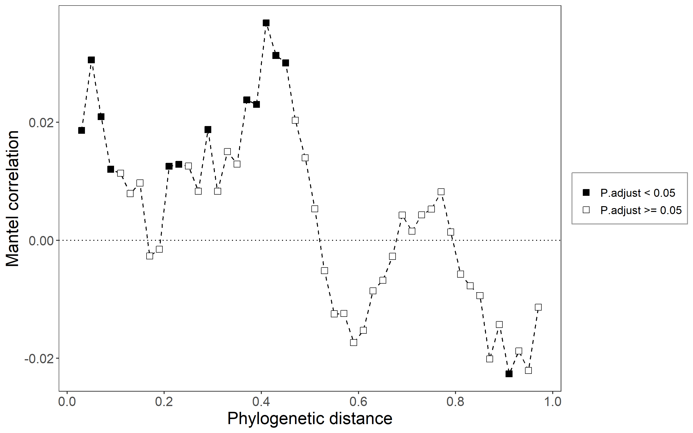
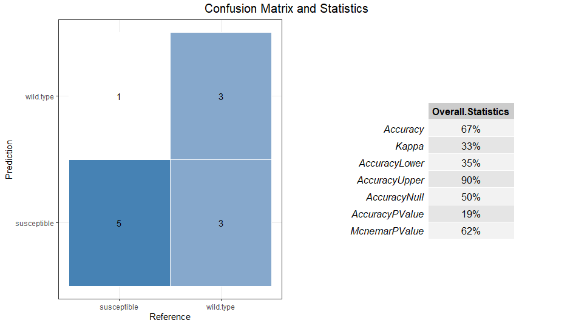
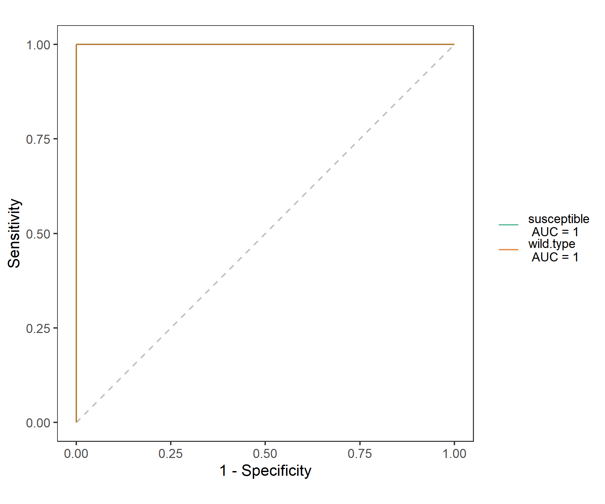

# Model-based class

We group all the classes with complex models into the type 'Model-based class'.


## trans_diff class

　Differential abundance test is a very important part in the microbial community data analysis [@Nearing_Microbiome_2022].
It can be used to find the significant taxa in determining the community differences across groups.
There are also several wrapped methods to better capture the important biomarkers,
such as the combination of machine-learning and differential abundance test.
Currently, trans_diff class have several famous approaches to perform this analysis: 
metastat[@White_Statistical_2009], LEfSe[@Segata_Metagenomic_2011], RF (random forest + differential test), metagenomeSeq[@Paulson_Differential_2013],
Kruskal-Wallis Rank Sum Test (for groups > 2), Wilcoxon Rank Sum Tests (for each paired group) and 
Dunn's Kruskal-Wallis Multiple Comparisons (for paired group in cases groups > 2),
t.test, ANOVA, ANCOMBC [@Lin_Analysis_2020] and ALDEx2 [@Fernandes_Unifying_2014].


### Example

All the differential test result is stored in the object$res_diff.
LEfSe combines the non-parametric test and linear discriminant analysis [@Segata_Metagenomic_2011].

```{r, echo = TRUE, eval = FALSE}
t1 <- trans_diff$new(dataset = dataset, method = "lefse", group = "Group", alpha = 0.01, lefse_subgroup = NULL)
# see t1$res_diff for the result
# From v0.8.0, threshold is used for the LDA score selection.
t1$plot_diff_bar(threshold = 4)
# we show 20 taxa with the highest LDA (log10)
t1$plot_diff_bar(use_number = 1:30, width = 0.8, group_order = c("CW", "IW", "TW"))
```

```{r, out.width = "700px", fig.align="center", echo = FALSE}
knitr::include_graphics("Images/plot_lefse_bar.png")
```

```{r, echo = TRUE, eval = FALSE}
# show part of the table
t1$res_diff[1:5, c(1, 3, 4, 6)]
```

```{r, echo = FALSE, eval = TRUE}
res_lefse <- read.csv("Files/res_lefse.csv")
pander::pander(res_lefse[1:5, c(1, 3, 4, 6)])
```

Then, we plot the abundance of biomarkers detected by LEfSe.

```{r, echo = TRUE, eval = FALSE}
t1$plot_diff_abund(use_number = 1:30, group_order = c("CW", "IW", "TW"))
```

```{r, out.width = "650px", fig.align="center", echo = FALSE}
knitr::include_graphics("Images/plot_lefse_diff_abund.png")
```

Then, we show the cladogram of the differential features in the taxonomic tree.
There are too many taxa in this dataset.
As an example, we only use the highest 200 abundant taxa in the tree and 50 differential features.
We only show the full taxonomic label at Phylum level and use letters at other levels to reduce the text overlap.
**Note that if an error occurs in this function, the reason with a high probability is the chaotic taxonomy in the user's data.**.
**Please see the tidy_taxonomy function of microtable part to solve this issue.**.

```{r, echo = TRUE, eval = FALSE}
# clade_label_level 5 represent phylum level in this analysis
# require ggtree package
t1$plot_diff_cladogram(use_taxa_num = 200, use_feature_num = 50, clade_label_level = 5, group_order = c("CW", "IW", "TW"))
```

```{r, out.width = "1000px", fig.align="center", echo = FALSE}
knitr::include_graphics("Images/plot_lefse_cladogram.png")
```

There may be a problem related with the taxonomic labels in the plot.
When the levels used are too many, the taxonomic labels may have too much overlap.
However, if you only indicate the Phylum labels, the taxa in the legend with marked letters are too many.
At this time, you can select the taxa that you want to show in the plot manually like the following operation.

```{r, echo = TRUE, eval = FALSE}
# choose some taxa according to the positions in the previous picture; those taxa labels have minimum overlap
use_labels <- c("c__Deltaproteobacteria", "c__Actinobacteria", "o__Rhizobiales", "p__Proteobacteria", "p__Bacteroidetes", 
	"o__Micrococcales", "p__Acidobacteria", "p__Verrucomicrobia", "p__Firmicutes", 
	"p__Chloroflexi", "c__Acidobacteria", "c__Gammaproteobacteria", "c__Betaproteobacteria", "c__KD4-96",
	"c__Bacilli", "o__Gemmatimonadales", "f__Gemmatimonadaceae", "o__Bacillales", "o__Rhodobacterales")
# then use parameter select_show_labels to show
t1$plot_diff_cladogram(use_taxa_num = 200, use_feature_num = 50, select_show_labels = use_labels)
# Now we can see that more taxa names appear in the tree
```

```{r, out.width = "1000px", fig.align="center", echo = FALSE}
knitr::include_graphics("Images/plot_lefse_cladogram_1.png")
```

The 'rf' method depends on the random forest[@Beck_Machine_2014; @Yatsunenko_Human_2012] and the non-parametric test.
The current method can calculate random forest by bootstrapping like the method in LEfSe and only use the significant features.
MeanDecreaseGini is selected as the indicator value in the analysis.

```{r, echo = TRUE, eval = FALSE}
# use Genus level for parameter taxa_level, if you want to use all taxa, change to "all"
# nresam = 1 and boots = 1 represent no bootstrapping and use all samples directly
t1 <- trans_diff$new(dataset = dataset, method = "rf", group = "Group", taxa_level = "Genus")
# plot the MeanDecreaseGini bar
g1 <- t1$plot_diff_bar(use_number = 1:20, group_order = c("TW", "CW", "IW"))
# plot the abundance using same taxa in g1
g2 <- t1$plot_diff_abund(group_order = c("TW", "CW", "IW"), select_taxa = t1$plot_diff_bar_taxa)
# now the y axis in g1 and g2 is same, so we can merge them
# remove g1 legend; remove g2 y axis text and ticks
g1 <- g1 + theme(legend.position = "none")
g2 <- g2 + theme(axis.text.y = element_blank(), axis.ticks.y = element_blank())
gridExtra::grid.arrange(g1, g2, ncol = 2, nrow = 1, widths = c(2, 1.7))
```

```{r, out.width = "800px", fig.align="center", echo = FALSE}
knitr::include_graphics("Images/plot_rf_diff_abund.png")
```

The significance label can also be added in the abundance plot controlled by add_sig parameter and other related parameters.
Now adding label support all the differential test methods.

```{r, echo = TRUE, eval = FALSE}
t1 <- trans_diff$new(dataset = dataset, method = "wilcox", group = "Group", taxa_level = "Genus", filter_thres = 0.001)
# filter something not needed to show
t1$res_diff %<>% subset(Significance %in% "***")
t1$plot_diff_abund(use_number = 1:20, add_sig = T, add_sig_label = "Significance")
```

```{r, out.width = "700px", fig.align="center", echo = FALSE}
knitr::include_graphics("Images/plot_diff_abund_siglabel_wilcox.png")
```

```{r, echo = TRUE, eval = FALSE}
t1 <- trans_diff$new(dataset = dataset, method = "anova", group = "Group", taxa_level = "Genus", filter_thres = 0.001)
t1$plot_diff_abund(use_number = 1:10, add_sig = T, coord_flip = F)
```

```{r, out.width = "700px", fig.align="center", echo = FALSE}
knitr::include_graphics("Images/plot_diff_abund_siglabel_anova.png")
```

Metastat depends on the permutations and t-test and performs well on the sparse data for paired groups test.
It can be used for the comparisons of taxonomic abundance between any paired groups at any taxonomic level.

```{r, echo = TRUE, eval = FALSE}
# metastat analysis at Genus level
t1 <- trans_diff$new(dataset = dataset, method = "metastat", group = "Group", taxa_level = "Genus")
# t1$res_diff is the differential test result
# t1$res_abund is the group abundance
```

Because the example 'Group' in sample_table has three groups, 
the metastat can run the comparisons for each paired group. So there are three pairs in t1\$res_diff\$Comparison.
For the abundance plotting, the user should use select_group to select the required pair.

```{r, echo = TRUE, eval = FALSE}
# select_group should be one of groups in t1$res_diff$Comparison
t1$plot_diff_abund(use_number = 1:20, select_group = "CW - TW")
```

```{r, out.width = "650px", fig.align="center", echo = FALSE}
knitr::include_graphics("Images/plot_metastat_1.png")
```


The following are the examples for the methods 'KW', 'KW_dunn', 'wilcox', 't.test' and 'anova'.

```{r, echo = TRUE, eval = FALSE}
# Kruskal-Wallis Rank Sum Test for all groups (>= 2)
t1 <- trans_diff$new(dataset = dataset, method = "KW", group = "Group", taxa_level = "all", filter_thres = 0.001)
t1$plot_diff_abund(use_number = 1:20)
# Dunn's Kruskal-Wallis Multiple Comparisons when group number > 2; require FSA package
t1 <- trans_diff$new(dataset = dataset, method = "KW_dunn", group = "Group", taxa_level = "Genus", filter_thres = 0.0001)
t1$plot_diff_abund(use_number = 1:20, select_group = "CW - IW", group_order = c("CW", "IW"))
# Wilcoxon Rank Sum and Signed Rank Tests for all paired groups
t1 <- trans_diff$new(dataset = dataset, method = "wilcox", group = "Group", taxa_level = "Genus", filter_thres = 0.001)
t1$plot_diff_bar(use_number = 1:20, select_group = "CW - TW")
# t.test
t1 <- trans_diff$new(dataset = dataset, method = "t.test", group = "Group", taxa_level = "all", filter_thres = 0.001)
# anova
t1 <- trans_diff$new(dataset = dataset, method = "anova", group = "Group", taxa_level = "Phylum", filter_thres = 0.001)
t1$res_diff
```

The method 'metagenomeSeq' and 'ANCOMBC' depend on the metagenomeSeq package and ANCOMBC package, respectively.
The method 'ALDEx2_t' and 'ALDEx2_kw' depend on the ALDEx2 package.
These three packages are all deposited on the Bioconductor.

```{r, echo = TRUE, eval = FALSE}
# zero-inflated log-normal model-based differential test method from metagenomeSeq package
# please first install metagenomeSeq package
if(!require("BiocManager", quietly = TRUE)) install.packages("BiocManager")
BiocManager::install("metagenomeSeq")
t1 <- trans_diff$new(dataset = dataset, method = "metagenomeSeq", group = "Group", taxa_level = "Genus")
t1 <- trans_diff$new(dataset = dataset, method = "metagenomeSeq", group = "Group", taxa_level = "OTU")
t1$plot_diff_abund(use_number = 1:30, group_order = c("TW", "CW", "IW"))
t1$plot_diff_bar(use_number = 1:20)
```

```{r, echo = TRUE, eval = FALSE}
# 'ALDEx2_t' and 'ALDEx2_kw' methods; use ?trans_diff to see the description of the methods
BiocManager::install("ALDEx2")
# 'ALDEx2_t'
t1 <- trans_diff$new(dataset = dataset, method = "ALDEx2_t", group = "Group", taxa_level = "Phylum")
t1$plot_diff_abund(use_number = 1:20, group_order = c("TW", "CW", "IW"))
t1$plot_diff_abund(use_number = 1:20, select_group = "CW - TW")
t1$plot_diff_abund(use_number = 1:20, select_group = "CW - TW", add_sig = TRUE)
t1 <- trans_diff$new(dataset = dataset, method = "ALDEx2_t", group = "Group", taxa_level = "OTU", filter_thres = 0.0005)
# ALDEx2_kw
t1 <- trans_diff$new(dataset = dataset, method = "ALDEx2_kw", group = "Group", taxa_level = "Phylum")
t1$plot_diff_abund(use_number = 1:30, group_order = c("TW", "CW", "IW"))
t1$plot_diff_bar(use_number = 1:20)
t1$plot_diff_abund(use_number = 1:30, group_order = c("TW", "CW", "IW"), add_sig = TRUE)
```


```{r, echo = TRUE, eval = FALSE}
# ANCOMBC method
BiocManager::install("ANCOMBC")
t1 <- trans_diff$new(dataset = dataset, method = "ANCOMBC", group = "Group", taxa_level = "Family")
t1$plot_diff_abund(use_number = 1:20, select_group = "CW - TW")
t1$plot_diff_abund(use_number = 1:20, group_order = c("TW", "CW", "IW"), add_sig = TRUE)
t1$plot_diff_bar(use_number = 1:20)
```


### Key points

  + trans_diff\$new: In trans_diff\$new, p_adjust_method = NULL can shut down the p value adjustment for method != "metastat" or "anova". 
    This can be used in cases where very few significant taxa are found (generally no significant taxa found after adjustment) and 
	where the results need to be compared with that from Galaxy server or other LEfSe python version.
  + trans_diff$new: this class have a strict requirement on the taxonomic information, make sure tidy_taxonomy() function has been performed before creating your dataset
  + trans_diff$new: creating this class will invoke taxa_abund stored in microtable object
  + trans_diff$plot_diff_cladogram: clade_label_size, clade_label_size_add and clade_label_size_log are used to control the text size in the cladogram


## trans_network class

　Network is a frequently used approach to study the co-occurrence patterns in microbial ecology [@Deng_Molecular_2012; @Faust_Microbial_2012; @Coyte_Theecology_2015].
In this part, we describe part of the implemented methods in the trans_network class.


```{r, out.width = "8000px", fig.align="center", echo = FALSE}
knitr::include_graphics("Images/network_framework.png")
```

The objects inside the rectangle with full line represent functions.
The dashed line denotes the key objects (input or output). The `res_network` inside the ellipse with dashed line means it is a hub object for other analysis.


### Example

We use the correlation-based network to show the main operations for users. 
This is only intended to show some operations conveniently. 
**Does not mean we are suggesting this approach in any case**.
Please check the final part for other network construction methods.

```{r, echo = TRUE, eval=FALSE}
# The parameter cor_method in trans_network is used for selecting the correlation calculation method.
# default pearson or spearman correlation invoke R base cor.test, a little slow
t1 <- trans_network$new(dataset = dataset, cor_method = "spearman", filter_thres = 0.001)
# return t1$res_cor_p list, containing two tables: correlation coefficient table and p value table
```

Those are other available correlation/association options, 
such as Bray–Curtis (1-dissimilarity), SparCC [@Friedman_Inferring_2012], CCLasso [@Fang_CCLasso_2015], 
Pearson or Spearman with data normalization based on NetCoMi package [@Peschel_NetCoMi_2021].

```{r, echo = TRUE, eval=FALSE}
# use Bray–Curtis index (1-dissimilarity)
t1 <- trans_network$new(dataset = dataset, cor_method = "bray", filter_thres = 0.001)
# Pearson correlation
t1 <- trans_network$new(dataset = dataset, cor_method = "pearson", filter_thres = 0.001)
# Pearson correlation using WGCNA package
# install WGCNA package
if(!require("WGCNA")) install.packages("WGCNA", repos = BiocManager::repositories())
t1 <- trans_network$new(dataset = dataset, cor_method = "pearson", use_WGCNA_pearson_spearman = TRUE, filter_thres = 0.001)
# Pearson correlation using NetCoMi package; install it from https://github.com/stefpeschel/NetCoMi
t1 <- trans_network$new(dataset = dataset, cor_method = "pearson", use_NetCoMi_pearson_spearman = TRUE, filter_thres = 0.001)
# Spearman correlation using WGCNA package
t1 <- trans_network$new(dataset = dataset, cor_method = "spearman", use_WGCNA_pearson_spearman = TRUE, filter_thres = 0.001)
# Spearman correlation using NetCoMi package
t1 <- trans_network$new(dataset = dataset, cor_method = "spearman", use_NetCoMi_pearson_spearman = TRUE, filter_thres = 0.001)
# SparCC method, from SpiecEasi package, see https://github.com/zdk123/SpiecEasi for the installation
t1 <- trans_network$new(dataset = dataset, cor_method = "sparcc", use_sparcc_method = "SpiecEasi", filter_thres = 0.001)
# SparCC method, from NetCoMi package; https://github.com/stefpeschel/NetCoMi
t1 <- trans_network$new(dataset = dataset, cor_method = "sparcc", use_sparcc_method = "NetCoMi", filter_thres = 0.001)
# CCLasso method based on NetCoMi package
t1 <- trans_network$new(dataset = dataset, cor_method = "cclasso", filter_thres = 0.001)
# CCREPE method based on NetCoMi package
t1 <- trans_network$new(dataset = dataset, cor_method = "ccrepe", filter_thres = 0.001)
```

We use Spearman correlation based on WGCNA package (use_WGCNA_pearson_spearman = TRUE) to show all the following operations.

```{r, echo = TRUE, eval=FALSE}
# require WGCNA package; installation command: install.packages("WGCNA", repos = BiocManager::repositories())
t1 <- trans_network$new(dataset = dataset, cor_method = "spearman", use_WGCNA_pearson_spearman = TRUE, filter_thres = 0.0001)
```

The parameter COR_cut can be used to select the correlation threshold. 
Furthermore, COR_optimization = TRUE can be used to find the optimized coefficient threshold (potential transition point of network eigenvalues) 
instead of the COR_cut based on the RMT theory [@Deng_Molecular_2012].

```{r, echo = TRUE, eval=FALSE}
# construct network; require igraph package
t1$cal_network(COR_p_thres = 0.01, COR_optimization = TRUE)
# use arbitrary coefficient threshold to contruct network
t1$cal_network(COR_p_thres = 0.01, COR_cut = 0.7)
# return t1$res_network
```

```{r, echo = TRUE, eval=FALSE}
# # modularity for this undirected network with igraph cluster_fast_greedy function
t1$cal_module(method = "cluster_fast_greedy")
```

```{r, echo = TRUE, eval=FALSE}
# save network
# open network.gexf file using Gephi(https://gephi.org/)
# require rgexf package
t1$save_network(filepath = "network.gexf")
```

For the current version of microeco package, the node properties have no abundance information.
If the user want to use abundance of features to scale up node size in the Gephi network plot,
please check the solution in GitHub Issues (https://github.com/ChiLiubio/microeco/issues/152).
Then, we plot the network and present the node colors according to the calculated modules in Gephi.

```{r, out.width = "550px", fig.align="center", echo = FALSE}
knitr::include_graphics("Images/network1_spearman.png")
```

Now, we show the node colors with the Phylum information and the edges colors with the positive and negative correlations.
All the data used has been stored in the network.gexf file, including modules classifications, Phylum information and edge labels.

```{r, out.width = "550px", fig.align="center", echo = FALSE}
knitr::include_graphics("Images/network2_spearman.png")
```


```{r, echo = TRUE, eval = FALSE}
# calculate network attributes
t1$cal_network_attr()
t1$res_network_attr
```

```{r, echo = FALSE}
# read
res_network_attr <- read.csv("Files/res_network_attr.csv", check.names = FALSE)
```
```{r, echo = FALSE}
pander::pander(res_network_attr)
```

The function get_node_table, get_edge_table and get_adjacency_matrix are designed to 
get node properties table, edge properties table and adjacency matrix from network, respectively.

```{r, echo = TRUE, eval = FALSE}
# get node properties
t1$get_node_table(node_roles = TRUE)
# return t1$res_node_table
```

```{r, echo = FALSE}
# read
network_node_table <- read.csv("Files/res_node_table.csv", row.names = 1, check.names = FALSE)
```

```{r, echo = FALSE}
pander::pander(network_node_table[1:5, c(1:6)])
```

```{r, echo = TRUE, eval = FALSE}
# get edge properties
t1$get_edge_table()
# return t1$res_edge_table 
t1$get_adjacency_matrix()
# return t1$res_adjacency_matrix
```

Then, let’s plot the node classification in terms of the within-module connectivity and among-module connectivity.

```{r, echo = TRUE, eval = FALSE}
# add_label = TRUE can be used to directly add text label for points
t1$plot_taxa_roles(use_type = 1)
```

```{r, out.width = "700px", fig.align="center", echo = FALSE}
knitr::include_graphics("Images/plot_taxa_roles.png")
```

```{r, echo = TRUE, eval = FALSE}
# plot node roles with phylum information
t1$plot_taxa_roles(use_type = 2)
```

```{r, out.width = "800px", fig.align="center", echo = FALSE}
knitr::include_graphics("Images/plot_taxa_roles_2.png")
```

Now, we show the eigengene analysis of modules.
The eigengene of a module, i.e. the first principal component of PCA, represents the main variance of the abundance in the species of the module.

```{r, echo = TRUE, eval = FALSE}
t1$cal_eigen()
# return t1$res_eigen
```

Then we perform correlation heatmap to show the relationships between eigengenes and environmental factors.

```{r, echo = TRUE, eval = FALSE}
# create trans_env object
t2 <- trans_env$new(dataset = dataset, add_data = env_data_16S[, 4:11])
# calculate correlations
t2$cal_cor(add_abund_table = t1$res_eigen)
# plot the correlation heatmap
t2$plot_cor()
```

```{r, out.width = "600px", fig.align="center", echo = FALSE}
knitr::include_graphics("Images/Env_module_eigen.png")
```

The subset_network() function can be used to extract a part of nodes and edges among these nodes from the network.
In this function, you should provide the nodes you need using the node parameter.

```{r, echo = TRUE, eval = FALSE}
# extract a sub network that contains all nodes in module M1
t1$subset_network(node = t1$res_node_table %>% base::subset(module == "M1") %>% rownames, rm_single = TRUE)
# return a new network with igraph class
# extract sub network in which all edge labels are "+", i.e. positive edges
t1$subset_network(edge = "+")
```

**Then let's show how to extract sub-network for samples and the whole analysis flow.**

```{r, echo = TRUE, eval = FALSE}
# extract the sub-network of sample 'S1'
sub1 <- t1$subset_network(node = dataset$otu_table %>% .[.[, "S1"] != 0, ] %>% rownames, rm_single = TRUE)
# see https://chiliubio.github.io/microeco_tutorial/notes.html#clone for the 'clone' function explanation
t2 <- clone(t1)
t2$res_network <- sub1
# then t2 have a network for 'S1' and can be used for further analysis
t2$cal_module()
t2$save_network("S1.gexf")
# please use a loop for more samples
```

We also add the function `plot_network` to directly plot the network in R, including the static network and dynamic network.
The static network is suitable for the case with relatively few nodes, while dynamic network can be better applied to a large network.
See https://yunranchen.github.io/intro-net-r/advanced-network-visualization.html and https://kateto.net/network-visualization for more
details on the network visualization in R.

```{r, echo = TRUE, eval = FALSE}
# default parameter represents using igraph plot.igraph function
t2$plot_network()
# use ggraph method; require ggraph package
# If ggraph is not installed; first install it with command: install.packages("ggraph")
t2$plot_network(method = "ggraph", node_color = "Phylum")
# use networkD3 package method for the dynamic network visualization in R
# If networkD3 is not installed; first install it with command: install.packages("networkD3")
t1$plot_network(method = "networkD3", node_color = "module")
t1$plot_network(method = "networkD3", node_color = "Phylum")
```

The trans_comm function can be used to transform the node classification to a new microtable object for other analysis.

```{r, echo = TRUE, eval = FALSE}
# use_col is used to select a column of t1$res_node_table
tmp <- t1$trans_comm(use_col = "module", abundance = FALSE)
tmp
tmp$otu_table[tmp$otu_table > 0] <- 1
tmp$tidy_dataset()
tmp$cal_abund()
tmp2 <- trans_abund$new(tmp, taxrank = "Phylum", ntaxa = 10)
tmp2$data_abund$Sample %<>% factor(., levels = rownames(tmp$sample_table))
tmp2$plot_line(xtext_type_hor = TRUE, color_values = RColorBrewer::brewer.pal(12, "Paired")) + ylab("OTUs ratio (%)")
```

The function cal_sum_links can sum the links (edge) number from one taxa to another or within the same taxa. 
The function plot_sum_links() is used to show the result from the function cal_sum_links(). 
This is very useful to fast see how many nodes are connected between different taxa or within one taxa. 
In terms of 'Phylum' level in the tutorial, the function cal_sum_links() sum the linkages number from one Phylum to another Phylum or the linkages in the same Phylum. 
So the numbers along the outside of the circular plot represent how many edges or linkages are related with the Phylum. 
For example, in terms of Proteobacteria, there are roughly total 900 edges associated with the OTUs in Proteobacteria, 
in which roughly 200 edges connect both OTUs in Proteobacteria and roughly 150 edges connect the OTUs from Proteobacteria with the OTUs from Chloroflexi.

```{r, echo = TRUE, eval = FALSE}
t1$cal_sum_links(taxa_level = "Phylum")
# require chorddiag package; see https://github.com/mattflor/chorddiag
t1$plot_sum_links(plot_pos = TRUE, plot_num = 10)
```

```{r, out.width = "700px", fig.align="center", echo = FALSE}
knitr::include_graphics("Images/plot_sum_links.png")
```


**Then let's show other implemented network construction approaches**:  
SPIEC-EASI (SParse InversE Covariance Estimation for Ecological Association Inference) approach of SpiecEasi R package [@Kurtz_Sparse_2015]
has two network construction approaches based on graph model, which relies on algorithms for sparse neighborhood and inverse covariance selection.
See https://github.com/zdk123/SpiecEasi for the package installation.
It is very slow for SpiecEasi_method = 'glasso' when there is a large number (such as hundreds to thousands) according to our test experience.

```{r, echo = TRUE, eval=FALSE}
t1 <- trans_network$new(dataset = dataset, cor_method = NULL, taxa_level = "OTU", filter_thres = 0.001)
# require SpiecEasi package installed https://github.com/zdk123/SpiecEasi
# also see SpiecEasi::spiec.easi for available model parameters
t1$cal_network(network_method = "SpiecEasi", SpiecEasi_method = "mb")
# see t1$res_network
```

Another network construction approach comes from julia package FlashWeave [@Tackmann_Rapid_2019].
This is a probabilistic graph-based method to obtain the conditional independence. 
It predicts direct associations among microbes from large-scale compositional abundance data through statistical co-occurrence. 
To repeat the following code, please first install julia language in your computer and the FlashWeave package, and add the julia in the computer path.


1. download and install julia from https://julialang.org/downloads/  
2. Put julia in the computer env PATH, such as  your_directory_path\Julia\bin  
3. Open terminal or cmd or Powershell, open julia, install FlashWeave following the operation in https://github.com/meringlab/FlashWeave.jl  

```{r, echo = TRUE, eval=FALSE}
t1 <- trans_network$new(dataset = dataset, cor_method = NULL, taxa_level = "OTU", filter_thres = 0)
# require Julia in the computer path, and the package FlashWeave
# different with the direct parameter passing of 'SpiecEasi' network_method, FlashWeave_other_para is used to pass parameters to Julia FlashWeave
# assign FlashWeave_tempdir parameter can change the temporary working directory
t1$cal_network(network_method = "FlashWeave", FlashWeave_other_para = "alpha=0.01,sensitive=true,heterogeneous=true")
# see t1$res_network
```

The final method we want to show comes from beemStatic package [@Li_BEEMStatic_2021].
This method can be applied to cross-sectional datasets to infer interaction network based on the generalized Lotka-Volterra model,
which is typically used in the microbial time-series data. 
So the network from this approach is a directed network.
Please see https://github.com/CSB5/BEEM-static for installing the R beemStatic package.

```{r, echo = TRUE, eval=FALSE}
t1 <- trans_network$new(dataset = dataset, cor_method = NULL, taxa_level = "OTU", filter_thres = 0.001)
# require beemStatic package installed
t1$cal_network(network_method = "beemStatic")
# we use cluster_optimal method for the directed network
t1$cal_module(method = "cluster_optimal")
```


### Key points

  + cal_network(): get a network named res_network based on different methods
  + get_node_table(): get node properties table
  + subset_network(): this function can extract any sub-network according to the input nodes, e.g. sub-network for modules or samples

### Other functions

  + cal_powerlaw(): perform bootstrapping hypothesis test to determine whether degrees follows a power law distribution and fit degrees to a power law distribution.


## trans_nullmodel class
  In recent decades, 
the integration of phylogenetic analysis and null model promotes the inference of niche and neutral influences on community assembly more powerfully 
by adding a phylogeny dimension [@Webb_Phylogenies_2002; @Picante_Kembel_2010; @Stegen_Quantifying_2013].
The trans_nullmodel class provides an encapsulation, including the calculation of the phylogenetic signal, 
beta mean pairwise phylogenetic distance (betaMPD), beta mean nearest taxon distance (betaMNTD), 
beta nearest taxon index (betaNTI), beta net relatedness index (betaNRI) and Bray-Curtis-based Raup-Crick (RCbray).
The approach for phylogenetic signal analysis is based on the mantel correlogram [@Liu_Long_term_2017], 
in which the change of phylogenetic signal is intuitional and clear compared to other approaches.
The combinations between RCbray and betaNTI can be used to infer the strength of each ecological process dominating the community assembly 
under the specific hypothesis [@Stegen_Quantifying_2013].

### Example

We first check the phylogenetic signal.

```{r, echo = TRUE}
# generate trans_nullmodel object
# as an example, we only use high abundance OTU with mean relative abundance > 0.0005
t1 <- trans_nullmodel$new(dataset, filter_thres = 0.0005, add_data = env_data_16S)
```

```{r, echo = TRUE, eval=FALSE}
# use pH as the test variable
t1$cal_mantel_corr(use_env = "pH")
# return t1$res_mantel_corr
# plot the mantel correlogram
t1$plot_mantel_corr()
```

```{r, out.width = "600px", fig.align="center", echo = FALSE}

```

betaNRI(ses.betampd) is used to show the 'basal' phylogenetic turnover[@Liu_Long_term_2017].
Compared to betaNTI, it can capture more turnover information associated with the deep phylogeny.
It is noted that there are many null models with the development in the several decades of community ecology.
In the trans_nullmodel class, 
the default null mode of betaNTI and betaNRI is the randomization of the phylogenetic relatedness among species.
This shuffling approach fix the observed levels of species α-diversity and β-diversity to
explore whether the observed phylogenetic turnover significantly differ from null model that phylogenetic relatedness among species are random.

```{r, echo = TRUE, eval=FALSE}
# see null.model parameter for other null models
# null model run 500 times for the example
t1$cal_ses_betampd(runs=500, abundance.weighted = TRUE)
# return t1$res_ses_betampd
```

If we want to plot the betaNRI, we can use plot_group_distance function in trans_beta class.
For example, the results showed that the mean betaNRI of TW is extremely and significantly larger that those in CW and IW,
revealing that the basal phylogenetic turnover in TW is high.

```{r, echo = TRUE, eval=FALSE}
# add betaNRI matrix to beta_diversity list
dataset$beta_diversity[["betaNRI"]] <- t1$res_ses_betampd
# create trans_beta class, use measure "betaNRI"
t2 <- trans_beta$new(dataset = dataset, group = "Group", measure = "betaNRI")
# transform the distance for each group
t2$cal_group_distance()
# plot the results
g1 <- t2$plot_group_distance(distance_pair_stat = TRUE)
g1 + geom_hline(yintercept = -2, linetype = 2) + geom_hline(yintercept = 2, linetype = 2)
```

```{r, out.width = "550px", fig.align="center", echo = FALSE}
knitr::include_graphics("Images/plot_betaNRI_one_dataset.png")
```

Sometimes, if you want to perform null model analysis for each group individually, such as one group as one species pool,
you should calculate the results for each group, respectively.
The results show that, when we perform betaNRI for each group respectively, 
mean betaNRI between CW and TW are not significantly different, and they are both significantly higher than that in IW, 
revealing that the strength of variable selection in CW and TW may be similar under the condition that each area is considered as a specific species pool.

```{r, echo = TRUE, eval=FALSE}
# we create a list to store the trans_nullmodel results.
sesbeta_each <- list()
group_col <- "Group"
all_groups <- unique(dataset$sample_table[, group_col])
# calculate for each group, respectively
for(i in all_groups){
	# like the above operation, but need provide 'group' and 'select_group'
	test <- trans_nullmodel$new(dataset, group = group_col, select_group = i, filter_thres = 0.0005)
	test$cal_ses_betampd(runs = 500, abundance.weighted = TRUE)
	sesbeta_each[[i]] <- test$res_ses_betampd
}
# merge and reshape to generate one symmetrical matrix
test <- lapply(sesbeta_each, reshape2::melt) %>% 
	do.call(rbind, .) %>%
	reshape2::dcast(., Var1~Var2, value.var = "value")
rownames(test) <- test[, 1]
test <- test[, -1, drop = FALSE]
# like the above operation
dataset$beta_diversity[["betaNRI"]] <- test
t2 <- trans_beta$new(dataset = dataset, group = "Group", measure = "betaNRI")
t2$cal_group_distance()
g1 <- t2$plot_group_distance(distance_pair_stat = TRUE)
g1 + geom_hline(yintercept = -2, linetype = 2) + geom_hline(yintercept = 2, linetype = 2)
```

```{r, out.width = "550px", fig.align="center", echo = FALSE}
knitr::include_graphics("Images/plot_betaNRI_each_dataset.png")
```


BetaNTI(ses.betamntd) can be used to indicate the phylogenetic terminal turnover [@Stegen_Quantifying_2013].

```{r, echo = TRUE, eval=FALSE}
# null model run 500 times
t1$cal_ses_betamntd(runs=500, abundance.weighted = TRUE)
# return t1$res_ses_betamntd
```

```{r, echo = FALSE}
# read
t1$res_ses_betamntd <- as.matrix(read.csv("Files/cal_ses_betamntd.csv", row.names = 1, check.names = FALSE))
```

```{r, echo = FALSE}
# show t1$res_ses_betamntd
pander::pander(t1$res_ses_betamntd[1:5, 1:5])
```


RCbray (Bray-Curtis-based Raup-Crick) can be calculated using function cal_rcbray()
to assess whether the compositional turnover was governed primarily by drift [@Chase_null_2011].
We applied null model to simulate species distribution by randomly sampling individuals from each 
species pool with preserving species occurrence frequency and sample species richness [@Liu_Long_term_2017].

```{r, echo = TRUE, eval=FALSE}
# result stored in t1$res_rcbray
t1$cal_rcbray(runs = 1000)
# return t1$res_rcbray
```

```{r, echo = FALSE}
# read
t1$res_rcbray <- as.matrix(read.csv("Files/cal_rcbray.csv", row.names = 1, check.names = FALSE))
```

As an example, we also calculate the proportion of the inferred processes on the community assembly as shown in the references [@Stegen_Quantifying_2013; @Liu_Long_term_2017].
In the example, the fraction of pairwise comparisons with significant betaNTI values (|βNTI| > 2) is the estimated influence of Selection;
βNTI > 2 represents the heterogeneous selection; βNTI < -2 represents the homogeneous selection.
The value of RCbray characterizes the magnitude of deviation between observed Bray–Curtis and Bray–Curtis expected under the randomization;
a value of |RCbray| > 0.95 was considered significant.
The fraction of all pairwise comparisons with |βNTI| < 2 and RCbray > +0.95 was taken as the influence of Dispersal Limitation combined with Drift.
The fraction of all pairwise comparisons with |βNTI| < 2 and RCbray < -0.95 was taken as an estimate for the influence of Homogenizing Dispersal.
The fraction of all pairwise comparisons with |βNTI| < 2 and |RCbray| < 0.95 estimates the influence of Drift acting alone.

```{r, echo = TRUE}
# use betaNTI and rcbray to evaluate processes
t1$cal_process(use_betamntd = TRUE)
# return t1$res_process
```

```{r, echo = TRUE, eval = FALSE}
t1$res_process
```

```{r, echo = FALSE}
pander::pander(t1$res_process)
```

The cal_tNST function can be used to calculate normalized stochasticity ratio based on the NST package [@Ning_general_2019].

```{r, echo = TRUE, eval = FALSE}
t1$cal_tNST(group = "Group", dist.method = "bray", abundance.weighted = TRUE, output.rand = TRUE, SES = TRUE)
# result: t1$res_tNST
t1$res_tNST$index.grp
```

```{r, echo = FALSE}
t1$cal_tNST(group = "Group", dist.method = "bray", abundance.weighted = TRUE, output.rand = TRUE, SES = TRUE)
pander::pander(t1$res_tNST$index.grp)
```


```{r, echo = TRUE, eval = FALSE}
# test the NST difference between each pair of groups
t1$cal_tNST_test(method = "nst.boot")
```

For nearest Taxon Index (NTI) and nearest Relative Index (NRI), please use cal_NTI and cal_NRI, respectively.

```{r, echo = TRUE, eval = FALSE}
t1$cal_NRI(null.model = "taxa.labels", abundance.weighted = FALSE, runs = 999)
t1$cal_NTI(null.model = "taxa.labels", abundance.weighted = TRUE, runs = 999)
```


### Key points

  + trans_nullmodel$new: filter_thres parameter for the filtering of taxa with relative low abundance
  + cal_rcbray(): if only need rcbray, ignore other phylogenetic operations
 
### Other function

  + cal_Cscore(): calculates the (normalised) mean number of checkerboard combinations (C-score) using C.score


## trans_classifier class

The trans_classifier class is a wrapper for methods of machine-learning-based classification models.
Microbiome-based supervised machine-learning has been successful in predicting human health status [@Poore_Microbiome_2020]
and soil categories [@Wilhelm_Predicting_2021]. 


### Dependencies

Before starting the examples, make sure those packages have been installed.

```{r, echo = TRUE, eval = FALSE}
packages <- c("Boruta", "parallel", "rsample", "randomForest", "caret", "gridExtra", "multiROC")
# Now check or install
for(x in packages){
	if(!require(x, character.only = TRUE)) {
		install.packages(x, dependencies = TRUE)
	}
}
```

### Examples
In this tutorial, we use the example data in file2meco to demonstrate the feature selection, data training and prediction with random forest algorithm.

```{r, echo = TRUE, eval=FALSE}
library(file2meco)
abund_file_path <- system.file("extdata", "dada2_table.qza", package="file2meco")
sample_file_path <- system.file("extdata", "sample-metadata.tsv", package="file2meco")
taxonomy_file_path <- system.file("extdata", "taxonomy.qza", package="file2meco")
# construct microtable object
d1 <- qiime2meco(ASV_data = abund_file_path, sample_data = sample_file_path, taxonomy_data = taxonomy_file_path)
d1$cal_abund()

# initialize: use "genotype" as response variable
# x.predictors parameter is used to select the taxa; here we use all the taxa data in d1$taxa_abund
t1 <- trans_classifier$new(dataset = d1, y.response = "genotype", x.predictors = "All")
```

We silit the data into training and testing set.

```{r, echo = TRUE, eval=FALSE}
# generate train and test set
t1$cal_split(prop.train = 3/4)
```

Before training the model, we run the set_trainControl to invoke the trainControl function of caret package to generate the parameters used for training.
Here we use the default parameters in trainControl function.

```{r, echo = TRUE, eval=FALSE}
# require caret package
t1$set_trainControl()
```

Now let's start model training with rf method.

```{r, echo = TRUE, eval=FALSE}
# use default parameter method = "rf"
t1$cal_train(max.ntree = 500)
```

We can use cal_predict function to predict the testing data set.

```{r, echo = TRUE, eval=FALSE}
t1$cal_predict()
# plot the confusionMatrix to check out the performance
t1$plot_confusionMatrix()
```

```{r, out.width = "600px", fig.align="center", echo = FALSE}

```

Using cal_ROC and plot_ROC can get the ROC (Receiver Operator Characteristic) curve.

```{r, echo = TRUE, eval=FALSE}
t1$cal_ROC()
t1$plot_ROC(size = 0.5, alpha = 0.7)
```

```{r, out.width = "500px", fig.align="center", echo = FALSE}
knitr::include_graphics("Images/plot_ROC_without_selection.png")
```

While building a machine learning model for microbiome data,
the huge diversity of microbial community and/or associated relationships among taxa accross phylogeny can lead to a large number of unnecessary features,
which can reduce the overall accuracy, increase the complexity and overfit of the model and decrease the generalization capability of the model.
So, feature selection is one important step in building machine-learning model.
Then, we attempt to use Boruta package [@Kursa_Feature_2010] to do feature selection.

```{r, echo = TRUE, eval=FALSE}
# require Boruta package
t1$cal_feature_sel(boruta.maxRuns = 300, boruta.pValue = 0.01)
```

To compare the results between the procedure with feature selection and that without feature selection,
we also perfom all the analysis with feature selection to show the whole results.

```{r, echo = TRUE, eval=FALSE}
t2 <- trans_classifier$new(dataset = d1, y.response = "genotype", x.predictors = "All")
t2$cal_feature_sel(boruta.maxRuns = 300, boruta.pValue = 0.01)
t2$cal_split(prop.train = 3/4)
t2$set_trainControl()
t2$cal_train(max.ntree = 500)
t2$cal_predict()
t2$plot_confusionMatrix()
t2$cal_ROC()
t2$plot_ROC(size = 0.5, alpha = 0.7)
```

```{r, out.width = "600px", fig.align="center", echo = FALSE}
knitr::include_graphics("Images/plot_confusionMatrix_with_selection.png")
```
```{r, out.width = "500px", fig.align="center", echo = FALSE}

```

To plot the Precision-Recall curve (PR curve), please make plot_type = "PR" in plot_ROC function.

```{r, echo = TRUE, eval=FALSE}
t2$plot_ROC(plot_type = "PR", size = 0.5, alpha = 0.7)
```
```{r, out.width = "500px", fig.align="center", echo = FALSE}
knitr::include_graphics("Images/plot_PR_with_selection.png")
```

To show the ROC curve or PR curve of the training result, please make input = "train" in plot_ROC function.

```{r, echo = TRUE, eval=FALSE}
t2$cal_ROC(input = "train")
t2$plot_ROC(plot_type = "ROC", size = 0.5, alpha = 0.7)
```
```{r, out.width = "500px", fig.align="center", echo = FALSE}
knitr::include_graphics("Images/plot_ROC_with_selection_training.png")
```

For other machine-learning models, please use method parameter in cal_train function.
```{r, echo = TRUE, eval=FALSE}
# use SVM method
t2$al_train(method = "svmRadial", tuneLength = 15)
```


### Key points

  + cal_feature_sel(): perform feature selection
  
### Other function

  + cal_feature_imp(): get feature importance from the training model when method is "rf"
  + cal_preProcess(): Pre-process (centering, scaling etc.) of the feature data based on the caret::preProcess function.


 