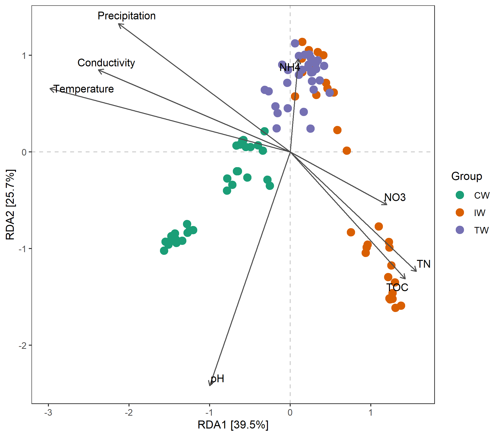
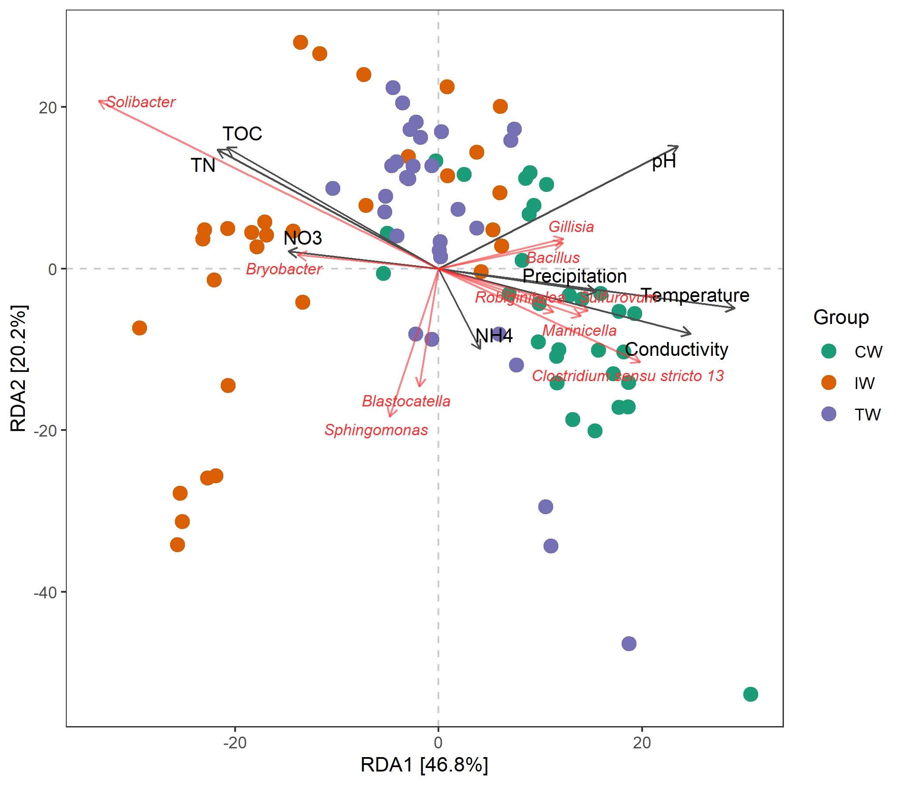
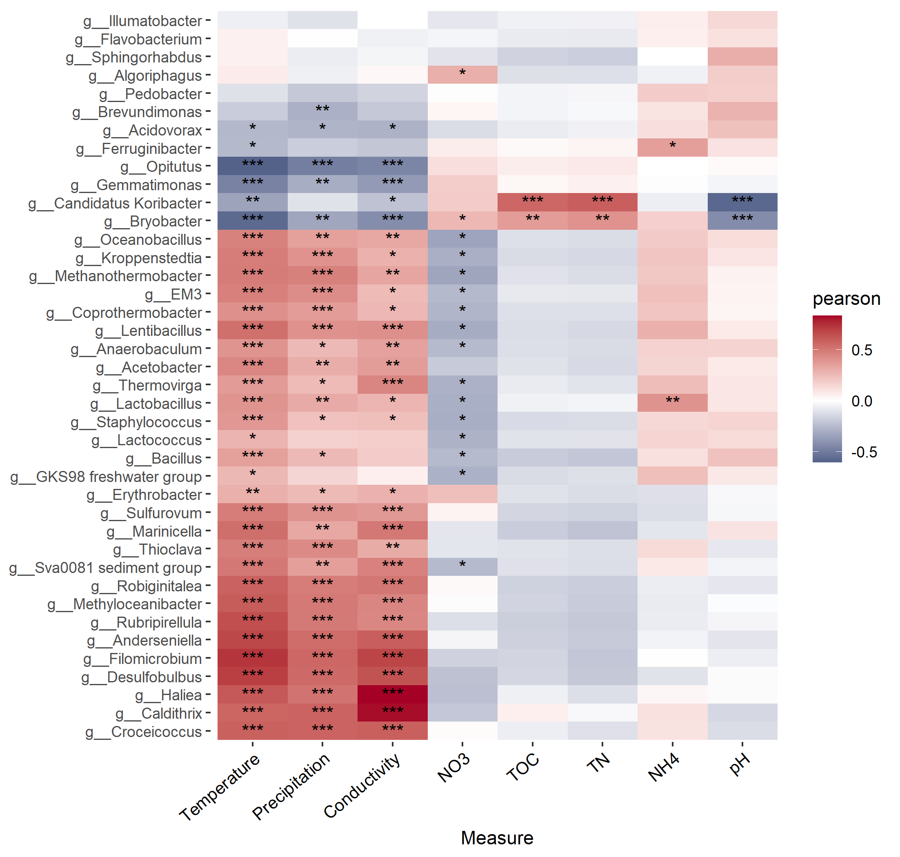
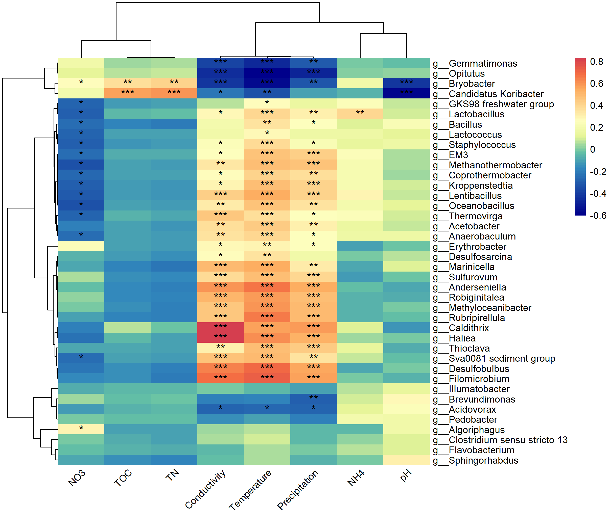
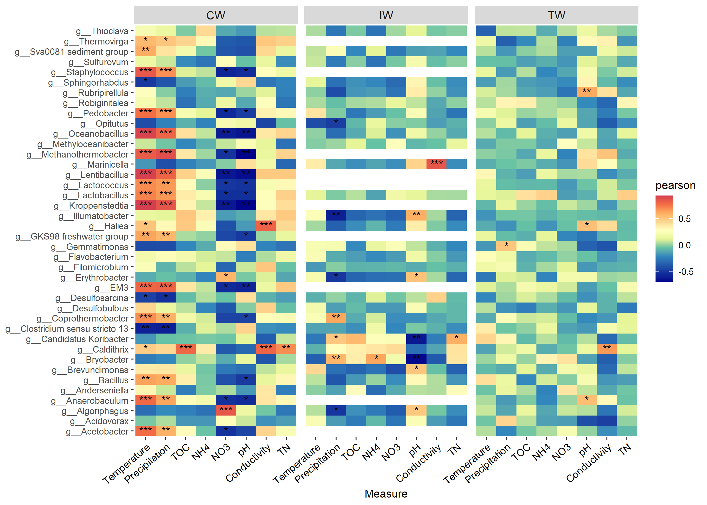
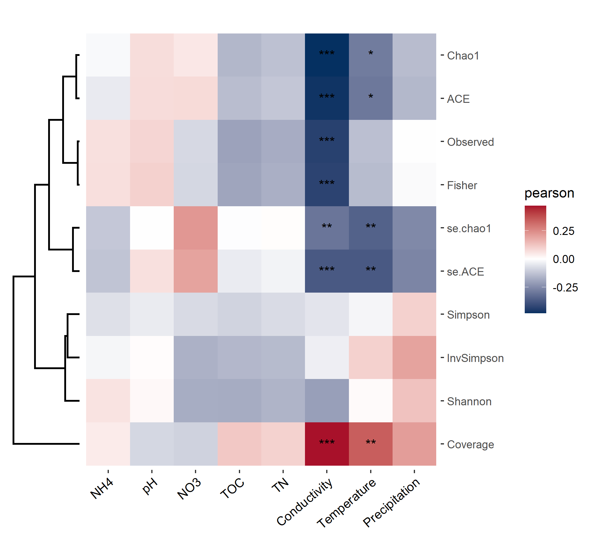
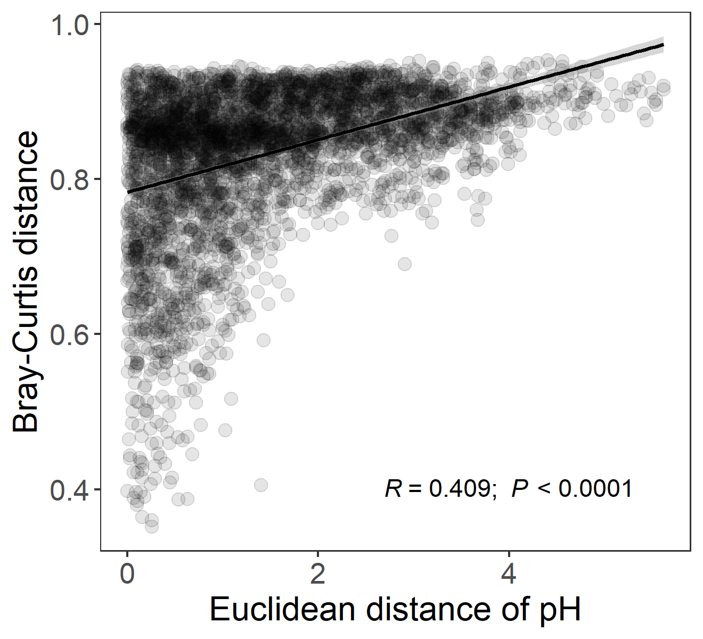
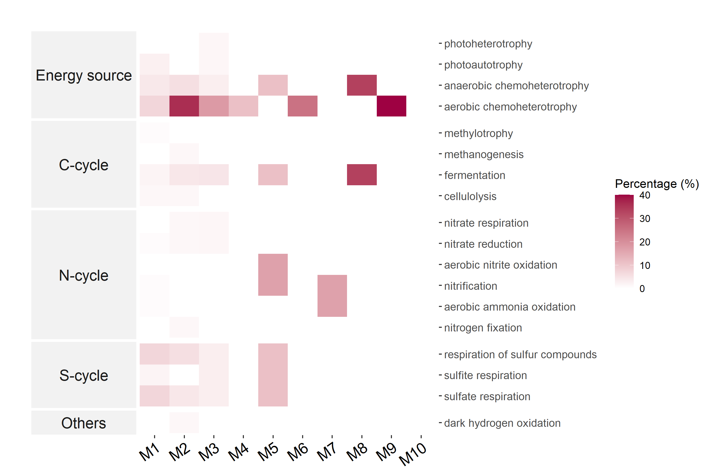

# Explainable class

We group trans_env and trans_func classes into 'Explainable class', 
as the environmental measurements and functional data are generally explainable factors.


## trans_env class

　The environmental variables are explainable indices in analyzing microbial community structure and assembly mechanisms.

### Example

We first show the RDA analysis (db-RDA and RDA).

```{r, echo = TRUE}
# add_data is used to add the environmental data
t1 <- trans_env$new(dataset = dataset, add_data = env_data_16S[, 4:11])
```

```{r, echo = TRUE, eval = FALSE}
# use bray-curtis distance to do dbrda
t1$cal_ordination(method = "dbRDA", use_measure = "bray")
# t1$res_rda is the result list stored in the object
t1$trans_ordination(adjust_arrow_length = TRUE, max_perc_env = 1.5)
# t1$res_rda_trans is the transformed result for plotting
t1$plot_ordination(plot_color = "Group")
```

```{r, out.width = "650px", fig.align="center", echo = FALSE}

```

```{r, echo = TRUE, eval = FALSE}
# use Genus
t1$cal_ordination(method = "RDA", taxa_level = "Genus")
# As the main results of RDA are related with the projection and angles between different arrows,
# we adjust the length of the arrow to show them clearly using several parameters.
t1$trans_ordination(show_taxa = 10, adjust_arrow_length = TRUE, max_perc_env = 1.5, max_perc_tax = 1.5, min_perc_env = 0.2, min_perc_tax = 0.2)
# t1$res_rda_trans is the transformed result for plotting
t1$plot_ordination(plot_color = "Group")
```

```{r, out.width = "650px", fig.align="center", echo = FALSE}

```

Mantel test can be used to check whether there is significant correlations between environmental variables and distance matrix.

```{r, echo = TRUE, eval = FALSE}
t1$cal_mantel(use_measure = "bray")
# return t1$res_mantel
t1$res_mantel
```

```{r, echo = FALSE}
t1$cal_mantel(use_measure = "bray")
pander::pander(t1$res_mantel)
```

The correlations between environmental variables and taxa are important in analyzing and inferring the factors affecting community structure.
Let's first perform a correlation heatmap using Genus level data.

```{r, echo = TRUE}
t1 <- trans_env$new(dataset = dataset, add_data = env_data_16S[, 4:11])
t1$cal_cor(use_data = "Genus", p_adjust_method = "fdr")
# return t1$res_cor
```

Then, we can plot the correlation results using plot_cor function.

```{r, echo = TRUE, eval = FALSE}
# default ggplot2 method with clustering
t1$plot_cor()
```

There are too many genera.
We can use the filter_feature parameter in plot_cor to filter some taxa that do not have any significance < 0.001.

```{r, echo = TRUE, eval = FALSE}
# filter genera that do not have at least one ***
t1$plot_cor(filter_feature = c("", "*", "**"))
```

Sometimes, if the user want to conduct the correlation analysis between the environmental factors and some important taxa detected in the biomarker analysis,
please use **other_taxa parameter** in cal_cor function.

```{r, echo = TRUE, eval = FALSE}
# first create trans_diff object as a demonstration
t2 <- trans_diff$new(dataset = dataset, method = "rf", group = "Group", rf_taxa_level = "Genus")
# then create trans_env object
t1 <- trans_env$new(dataset = dataset, add_data = env_data_16S[, 4:11])
# use other_taxa to select taxa you need
t1$cal_cor(use_data = "other", p_adjust_method = "fdr", other_taxa = t2$res_rf$Taxa[1:40])
t1$plot_cor()
```

```{r, out.width = "700px", fig.align="center", echo = FALSE}

```

The pheatmap method is also available.
Note that, besides the **color_vector parameter**, 
**color_palette** can also be used to control color palette with customized colors.

```{r, echo = TRUE, eval = FALSE}
# clustering heatmap; require pheatmap package
# Let's take another color pallete
t1$plot_cor(pheatmap = TRUE, color_palette = rev(RColorBrewer::brewer.pal(n = 9, name = "RdYlBu")))
```

```{r, out.width = "700px", fig.align="center", echo = FALSE}

```

Sometimes, if it is necessary to study the correlations between environmental variables and taxa for different groups,
**by_group parameter** can be used for this goal.

```{r, echo = TRUE, eval = FALSE}
# calculate correlations for different groups using parameter by_group
t1$cal_cor(by_group = "Group", use_data = "other", p_adjust_method = "fdr", other_taxa = t2$res_rf$Taxa[1:40])
# return t1$res_cor
t1$plot_cor()
```

```{r, out.width = "700px", fig.align="center", echo = FALSE}

```


If the user is concerned with the relationship between environmental factors and alpha diversity, 
please use **add_abund_table parameter** in the cal_cor function.

```{r, echo = TRUE, eval = FALSE}
t1 <- trans_env$new(dataset = dataset, add_data = env_data_16S[, 4:11])
# use add_abund_table parameter to add the extra data table
t1$cal_cor(add_abund_table = dataset$alpha_diversity)
# Let's try to use ggplot2 with clustering plot
t1$plot_cor(cluster_ggplot = "row")
```

```{r, out.width = "600px", fig.align="center", echo = FALSE}

```

The function plot_scatterfit() in trans_env class is designed for the scatter plot, adding the fitted line and statistics of correlation or regression.

```{r, echo = TRUE, eval = FALSE}
# use pH and bray-curtis distance
t1$plot_scatterfit(
	x = "pH", 
	y = dataset$beta_diversity$bray[rownames(t1$env_data), rownames(t1$env_data)], 
	use_cor = TRUE,
	alpha = .1,
	x_axis_title = "Euclidean distance of pH", 
	y_axis_title = "Bray-Curtis distance", 
	text_x_pos = 4, 
	text_y_pos = .4)
```

```{r, out.width = "550px", fig.align="center", echo = FALSE}

```


### Key points

  + complete_na parameter in trans_env$new: used to fill the NA (missing value) of the environmental data based on the mice package.
  + add_abund_table parameter in cal_cor: other customized data can be also provided for the correlation analysis.
  + use_cor parameter in plot_scatterfit: both the correlation and regression are available in this function.
  + cal_mantel(): partial_mantel = TRUE can be used for partial mantel test.


## trans_func class

　Ecological researchers are usually interested in the the funtional profiles of microbial communities,
because functional or metabolic data is powerful to explain the structure and dynamics of microbial communities and to infer the underlying mechanisms.
As metagenomic sequencing is complicated and expensive, using amplicon sequencing data to predict functional profiles is an alternative choice. 
Several software are often used for this goal, such as PICRUSt[@Langille_Predictive_2013], Tax4Fun[@Aßhauer_Tax4Fun_2015] and FAPROTAX[@Louca_High_2016; @Louca_Decoupling_2016].
These tools are great to be used for the prediction of functional profiles based on the prokaryotic communities from sequencing results.
In addition, it is also important to obtain the functions for each taxa or OTU, not just the whole profile of communities.
But it is hard to know exact functions of each OTU.
FAPROTAX database is a collection of the traits and functions of prokaryotes based on the known research results published in books and literatures.
We match the taxonomic information of prokaryotes against this database to predict the traits of prokaryotes on biogeochemical roles.
The NJC19 database[@Lim_Large_2020] is also available for animal-associated prokaryotic data, such as human gut microbiota.
We also implement the FUNGuild [@Nguyen_FUNGuild_2016] and FungalTraits [@Polme_FungalTraits_2020] databases to predict the fungal traits.

### Example

We first identify/predict traits of taxa with the prokaryotic example data.

```{r, echo = TRUE}
# create object of trans_func
t2 <- trans_func$new(dataset)
# mapping the taxonomy to the database
# this can recognize prokaryotes or fungi automatically if the names of taxonomic levels are standard.
# default database for prokaryotes is FAPROTAX database
t2$cal_spe_func(prok_database = "FAPROTAX")
# return t2$res_spe_func, 1 represent trait exists, 0 represent no or cannot confirmed.
```

```{r, echo = TRUE, eval = FALSE}
t2$res_spe_func[1:5, 1:2]
```

```{r, echo = FALSE}
pander::pander(t2$res_spe_func[1:5, 1:2])
```

The percentages of the OTUs having the same trait can reflect the functional redundancy of this function in the community or the module in the network.

```{r, echo = TRUE, eval = FALSE}
# calculate the percentages of OTUs for each trait in each module of network
# use_community = TRUE; for community
t2$cal_spe_func_perc(use_community = TRUE)
# return t2$res_spe_func_perc for each sample
# Then, let's explore network modules; use_community = FALSE
# node_type_table is generated in the trans_network part
t2$cal_spe_func_perc(use_community = FALSE, node_type_table = network_node_type)
# we only plot some important traits, so we use the default group list to filter and show the traits.
t2$plot_spe_func_perc(select_samples = paste0("M", 1:10))
# M represents module, ordered by the nodes number from high to low
```

```{r, out.width = "700px", fig.align="center", echo = FALSE}

```

```{r, echo = TRUE, eval = FALSE}
# If you want to change the group list, reset the list t2$func_group_list
t2$func_group_list
# use show_prok_func to see the detailed information of prokaryotic traits
t2$show_prok_func("methanotrophy")
```


```{r, echo = TRUE}
# calculate the percentages for communities
t2$cal_spe_func_perc(use_community = TRUE)
# t2$res_spe_func_perc[1:5, 1:2]
```

```{r, echo = FALSE}
pander::pander(t2$res_spe_func_perc[1:5, 1:2])
```

```{r, echo = TRUE, eval = FALSE}
# then we try to correlate the res_spe_func_perc of communities to environmental variables
t3 <- trans_env$new(dataset = dataset, add_data = env_data_16S[, 4:11])
t3$cal_cor(add_abund_table = t2$res_spe_func_perc, cor_method = "spearman")
t3$plot_cor(pheatmap = TRUE)
```

```{r, out.width = "800px", fig.align="center", echo = FALSE}
knitr::include_graphics("Images/plot_func_perc_corr.png")
```


Tax4Fun requires a strict input file format associated with the taxonomic information.
To analyze the trimmed or changed OTU data in R with Tax4Fun, we provide a link to the Tax4Fun functional prediction.
Please check out the dependence part https://chiliubio.github.io/microeco_tutorial/intro.html#tax4fun for installing Tax4Fun package and download SILVA123 ref data.

```{r, echo = TRUE, eval = TRUE, message=FALSE}
t1 <- trans_func$new(dataset)
# https://chiliubio.github.io/microeco_tutorial/intro.html#tax4fun for the installation description
# and provide the file path of SILVA123
t1$cal_tax4fun(folderReferenceData = "./SILVA123")
# return two files: t1$tax4fun_KO: KO file; t1$tax4fun_path: pathway file.
# t1$tax4fun_KO$Tax4FunProfile[1:5, 1:2]
```


```{r, echo = FALSE}
pander::pander(t1$tax4fun_KO$Tax4FunProfile[1:5, 1:2])
```


Now, we use pathway file to analyze the abundance of pathway.

```{r, echo = TRUE, eval = TRUE}
# must transpose to taxa row, sample column
pathway_file <- t1$tax4fun_path$Tax4FunProfile %>% t %>% as.data.frame
# filter rownames, only keep ko+number
rownames(pathway_file) %<>% gsub("(^.*);\\s.*", "\\1", .)
# load the pathway hierarchical metadata
data(Tax4Fun2_KEGG)
# further create a microtable object, familiar?
func1 <- microtable$new(otu_table = pathway_file, tax_table = Tax4Fun2_KEGG$ptw_desc, sample_table = t1$sample_table)
print(func1)
```

Now, we need to trim data and calculate abundance.
```{r, echo = TRUE, eval = TRUE}
func1$tidy_dataset()
# calculate abundance automatically at three levels: Level.1, Level.2, Level.3
func1$cal_abund()
print(func1)
```

Then, we can plot the abundance.
```{r, echo = TRUE, eval = FALSE}
# bar plot at Level.1
func2 <- trans_abund$new(func1, taxrank = "Level.1", groupmean = "Group")
func2$plot_bar(legend_text_italic = FALSE)
```

```{r, out.width = "600px", fig.align="center", echo = FALSE}
knitr::include_graphics("Images/plot_bar_tax4fun1.png")
```

We can also do something else. For example, we can use lefse to test the differences of the abundances and find the important enriched pathways across groups.

```{r, echo = TRUE, eval = FALSE}
func2 <- trans_diff$new(dataset = func1, method = "lefse", group = "Group", alpha = 0.05, lefse_subgroup = NULL)
func2$plot_lefse_bar(LDA_score = 3, width = 0.8)
```

```{r, out.width = "600px", fig.align="center", echo = FALSE}
knitr::include_graphics("Images/plot_lefse_bar_tax4fun.png")
```

Tax4Fun2 [@Wemheuer_Tax4Fun2_2020] is another R package for the prediction of functional profiles of prokaryotic communities from 16S rRNA gene sequences.
It also provides two indexes for the evaluation of functional gene redundancies.
If you want to use Tax4Fun2 method, you must add the representative fasta file to the microtable object.
Please check out https://chiliubio.github.io/microeco_tutorial/intro.html#tax4fun2 for downloading ncbi-blast and Ref99NR/Ref100NR.

```{r, echo = TRUE, eval = FALSE}
# create a microtable object with the fasta file
data(sample_info_16S)
data(otu_table_16S)
data(taxonomy_table_16S)
# representative sequences are necessary for this analysis
# use read.fasta() of seqinr package or readDNAStringSet() of Biostrings package to read fasta file
# https://chiliubio.github.io/microeco_tutorial/intro.html#tax4fun2  for the reading example
data(rep_fasta_16S)

use_dataset <- microtable$new(sample_table = sample_info_16S, otu_table = otu_table_16S, tax_table = taxonomy_table_16S, rep_fasta = rep_fasta_16S)
use_dataset$filter_pollution(taxa = c("mitochondria", "chloroplast"))
use_dataset$tidy_dataset()
use_dataset

t1 <- trans_func$new(use_dataset)
# create a directory for result and log files
dir.create("test_prediction")
# https://chiliubio.github.io/microeco_tutorial/intro.html#tax4fun2 for installation
# ignore blast_tool_path parameter if blast tools have been in path
# the function can search whether blast tool directory is in the path, if not, automatically use provided blast_tool_path parameter
t1$cal_tax4fun2(blast_tool_path = "ncbi-blast-2.5.0+/bin", path_to_reference_data = "Tax4Fun2_ReferenceData_v2",
  database_mode = "Ref99NR", path_to_temp_folder = "test_prediction")

# prepare feature table and metadata
data(Tax4Fun2_KEGG)
# create a microtable object for pathways
func2 <- microtable$new(otu_table = t1$res_tax4fun2_pathway, tax_table = Tax4Fun2_KEGG$ptw_desc, sample_table = use_dataset$sample_table)
func2$tidy_dataset()
func2$cal_abund()

# calculate functional gene redundancies
t1$cal_tax4fun2_FRI()
```

### Key points

  + blast_tool_path parameter in cal_tax4fun2: if the blast tool has been in 'environment variable' of computer, it is ok to use blast_tool_path = NULL 
  + blast version: tax4fun2 require NCBI blast tool. However, some errors can come from the latest versions (https://www.biostars.org/p/413294/). An easy solution is to use previous version (such as 2.5.0).


