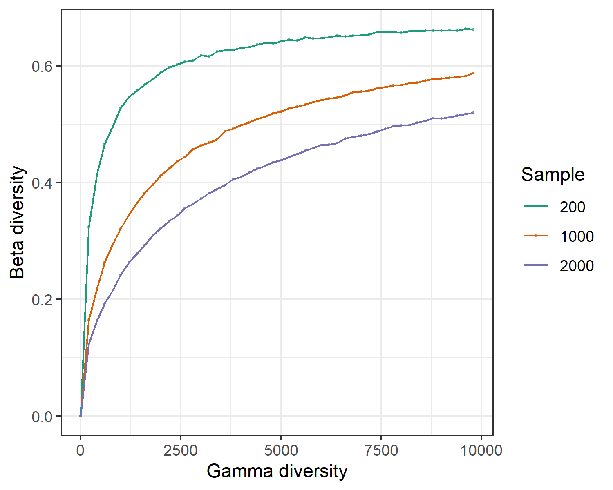

# mecodev package
The mecodev package (https://github.com/ChiLiubio/mecodev/) is designed to develop more classes for data analysis based on the microeco package.

## trans_rarefy
The class trans_rarefy in mecodev package can be used for the rarefaction and the following plotting to see whether 
the sequencing depth is enough to cover all the so-called species in the microbial community.


```{r, echo = TRUE, eval = FALSE}
library(microeco)
library(mecodev)
data(sample_info_16S)
data(otu_table_16S)
# set.seed is used to fix the random number generation to make the results repeatable
set.seed(123)
dataset <- microtable$new(sample_table = sample_info_16S, otu_table = otu_table_16S)
dataset$tidy_dataset()
# trans_rarefy class
t1 <- trans_rarefy$new(dataset, alphadiv = "Shannon", depth = c(0, 10, 50, 500, 2000, 4000, 6000, 8000))
t1$plot_rarefy(color_values = rep("grey", 100), show_point = TRUE, add_fitting = FALSE, show_legend = FALSE)
```

```{r, out.width = "550px", fig.align="center", echo = FALSE}
knitr::include_graphics("Images/plot_trans_rarefy.png")
```


## trans_convert
The class trans_convert provide several data transformation approaches for the microtable object.
The output will also be a microtable object.

```{r, echo = TRUE, eval = FALSE}
data(dataset)
test1 <- trans_convert$new(dataset = dataset)
test2 <- test1$convert(method = "log")
# returned test2 is another microtable object
```


## trans_netchord
The class trans_netchord is developed to sum and plot the links number from one taxa to another or in the same taxa in the network.
The input dataset must be a trans_network object.
Creating the trans_netchord object can sum the links (edge) number from one taxa to another or in the same taxa.
The function plot_sum_links() is used to show the result from the function cal_sum_links(). 
This is very useful to fast see how many nodes are connected between different taxa or within one taxa.
In terms of "Phylum" level in the tutorial, 
the function cal_sum_links() sum the linkages number from one Phylum to another Phylum or the linkages in the same Phylum.
So the numbers along the outside of the circular plot represent how many edges or linkages are related with the Phylum.
For example, in terms of Proteobacteria,
there are roughly total 900 edges associated with the OTUs in Proteobacteria, 
in which roughly 200 edges connect both OTUs in Proteobacteria and roughly 150 edges connect the OTUs from Proteobacteria with the OTUs from Chloroflexi.


```{r, echo = TRUE, eval = FALSE}
# Let's first create a network
data(sample_info_16S)
data(otu_table_16S)
data(taxonomy_table_16S)
dataset <- microtable$new(sample_table = sample_info_16S, otu_table = otu_table_16S, tax_table = taxonomy_table_16S)
dataset$tidy_dataset()
t1 <- trans_network$new(dataset = dataset, cal_cor = "WGCNA", taxa_level = "OTU", filter_thres = 0.0001, cor_method = "spearman")
t1$cal_network(p_thres = 0.01, COR_cut = 0.7)
# trans_netchord
test1 <- trans_netchord$new(dataset = t1, taxa_level = "Phylum")
test1$plot_sum_links(plot_pos = TRUE, plot_num = 10)
```

```{r, out.width = "700px", fig.align="center", echo = FALSE}
knitr::include_graphics("Images/plot_sum_links.png")
```


## trans_gamma

The class trans_gamma is developed to explore the relationship between gamma diversity and beta diversity 
based on the methods from biogeographic studies[@Zhang_Local_2020].
Currently, the contents include the observed beta-gamma diversity relationship, simulated beta-gamma diversity relationship and the following plotting.
If the observed gamma diversity and beta diversity are significantly correlated,
species pool at regional scale (or maybe your defined scale, e.g., different treatments in the lab) can have large effect on the beta diversity.
Thus, species pool should be first considered to explain beta diversity patterns.
This class also provide simulation function to explore the relation between gamma diversity and beta diversity in the absence of any process
other than random sampling based on the species log-normal distribution.
We use the wetland data to show the observed beta-gamma diversity relationship.


```{r, echo = TRUE, eval = FALSE}
library(microeco)
library(mecodev)
# load the example data
data(sample_info_16S)
data(otu_table_16S)
test <- microtable$new(sample_table = sample_info_16S, otu_table = otu_table_16S)
test$tidy_dataset()
test$rarefy_samples(sample.size = 10000)
# then create trans_gamma object
test1 <- trans_gamma$new(dataset = test, group = "Type", method = "bray")
test1$cal_observed(sample_size = NULL)
test1$res_observed
# plot the result; default statistic: Spearman correlation
test1$plot_observed()
```

```{r, out.width = "550px", fig.align="center", echo = FALSE}
knitr::include_graphics("Images/plot_gamma_obs.png")
```


Let's simulate the relation between gamma diversity and beta diversity in the absence of any process
other than random sampling based on the species log-normal distribution.

```{r, echo = TRUE, eval = FALSE}
# if you only run the simulation, dataset parameter is not necessary
test1 <- trans_gamma$new(method = "bray")
# use individul numbers at 200, 1000 and 2000, and hypothesize each species pool have 20 samples.
test1$cal_simulation(ncom = 20, ind_vect = c(200, 1000, 2000))
test1$plot_simulation(add_fitting = FALSE)
```


```{r, out.width = "600px", fig.align="center", echo = FALSE}

```


