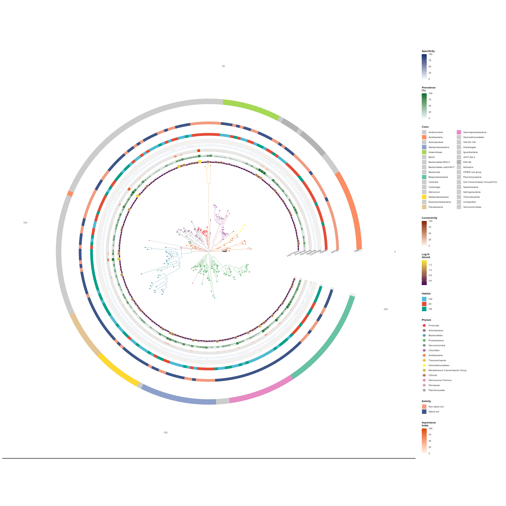
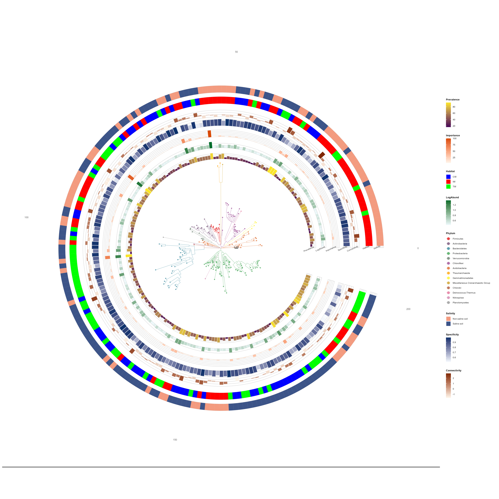

# trans_niche and trans_phylo


Starting from version 2.3.0, two new classes have been added: trans_niche and trans_phylo.
The trans_niche class is used to calculate niche breadth and niche overlap.
The trans_phylo class relies on the ggtree package to visualize phylogenetic trees of ASVs/OTUs/Species and annotate attributes on the outer layers of trees.
Demonstrations are provided using sample datasets herein.


```{r, echo = TRUE, eval = FALSE}

library(microeco)
library(magrittr)
library(ggtree)
library(ggtreeExtra)
library(ggplot2)
library(ape)
library(RColorBrewer)


mt <- clone(dataset)
mt200 <- clone(mt)

# Subset to top 200 OTUs
top_otus <- names(sort(mt200$taxa_sums(), decreasing = TRUE))[1:200]
mt200$otu_table %<>% .[top_otus, ]
mt200$tidy_dataset()

# ========================================================================
# Build rich ring annotation data
# ========================================================================

otu <- mt200$otu_table
tax <- mt200$tax_table
si  <- mt200$sample_table
n_otus <- nrow(otu)

# Relative abundance (mean %)
total_rel_abund <- trans_norm$new(mt)$norm(method = "TSS")$otu_table
rel_abund   <- total_rel_abund[rownames(otu), ]
mean_abund  <- rowMeans(rel_abund) * 100

# Prevalence (% of samples where detected)
prevalence <- rowMeans(otu > 0) * 100

# Log10 abundance
log_abund <- log10(rowMeans(otu) + 1)

# ---- Simulated ecological indicators ----
# Importance index: composite of abundance and prevalence
# (mimics indicators like indicator species analysis or random forest importance)
importance_raw <- mean_abund * sqrt(prevalence / 100)
importance <- round(importance_raw / max(importance_raw, na.rm = TRUE) * 100, 2)

# Specificity: how concentrated is an OTU in its preferred habitat; Use niche breadth value from trans_niche class
# (low = generalist, high = specialist)
niche <- trans_niche$new(mt)$cal_niche_breadth()
specificity <- 1 - niche$res_niche_breadth[rownames(otu), "Levins_Standardized"]

# network metrics with trans_network class example
net <- trans_network$new(mt, cor_method = "pearson")$cal_network()$get_node_table()
centrality <- net$res_node_table[rownames(otu), "closeness_centrality"]
connectivity <- net$res_node_table[rownames(otu), "z"]

# Habitat
mt$add_rownames2tax("OTU")
mt$cal_abund()
mt_diff <- trans_diff$new(dataset = mt, method = "rf", taxa_level = "OTU", group = "Group", alpha = 1)
mt_diff_res <- mt_diff$res_diff 
rownames(mt_diff_res) %<>% gsub(".*\\|", "", .)
dominant_habitat <- mt_diff_res[rownames(otu), "Group"]

# Salinity
mt_diff <- trans_diff$new(dataset = mt, method = "rf", taxa_level = "OTU", group = "Saline", alpha = 1)
mt_diff_res <- mt_diff$res_diff 
rownames(mt_diff_res) %<>% gsub(".*\\|", "", .)
dominant_salinity <- mt_diff_res[rownames(otu), "Group"]


# Class taxonomy
class_col <- if ("Class" %in% colnames(tax)) tax$Class else rep("Unknown", n_otus)


# Assemble ring data
ring_df <- data.frame(
  label        = rownames(otu),
  RelAbund     = round(mean_abund, 4),
  Prevalence   = round(prevalence, 1),
  LogAbund     = round(log_abund, 3),
  Importance   = importance,
  Specificity  = specificity,
  Connectivity = connectivity,
  Habitat      = dominant_habitat,
  Salinity     = dominant_salinity,
  Class        = class_col,
  stringsAsFactors = FALSE
)

# Clean Class column
ring_df$Class <- gsub("^c__", "", ring_df$Class)
ring_df$Class[ring_df$Class == "" | is.na(ring_df$Class)] <- "Unclassified"


# ============================================================================
# Create trans_phylo object and plot tree
# ============================================================================

OPEN_ANGLE <- 18   # degrees — slightly wider opening for ring label text

pviz <- trans_phylo$new(
  dataset             = mt200,
  group_col           = "Phylum",
  group_prefix_remove = "p__",
  ring_data           = ring_df,
  color_palette       = NULL,
  clade_coloring      = TRUE
)

pviz$plot_tree(
  open_angle       = OPEN_ANGLE,
  branch_size      = 0.15,
  tip_point_size   = 1.2,
  tip_point_shape  = 21,
  tip_point_stroke = 0.1,
  tip_point_alpha  = 0.80,
  legend_title     = "Phylum"
)

```


```{r, echo = TRUE, eval = FALSE}
# ============================================================================
# Add ring layers
# ============================================================================
# Two approaches are shown below:
#   (A) Individual add_ring() calls — maximum per-ring control
#   (B) Batch add_rings_batch() with vector parameters — concise alternative
# ============================================================================

# ---------- Approach A: Individual add_ring() calls ----------

# ---------- Numeric rings ----------

# Ring 1: Log10 Abundance — viridis-style purple-to-yellow
pviz$add_ring(
  col_name            = "LogAbund",
  geom                = "bar",
  ring_width          = 0.038,
  ring_offset         = 0.012,
  color_low           = "#440154",
  color_high          = "#FDE725",
  na_fill             = "grey95",
  legend_title_custom = "Log10\nAbund.",
  ring_label          = "Log10 Abund."
)

# Ring 2: Prevalence (%) — green gradient
pviz$add_ring(
  col_name            = "Prevalence",
  geom                = "bar",
  color_low           = "#EDF8FB",
  color_high          = "#006D2C",
  limits              = c(0, 100),
  na_fill             = "grey95",
  legend_title_custom = "Prevalence\n(%)",
  ring_label          = "Prevalence"
)

# Ring 3: Ecological Importance — orange-red gradient
pviz$add_ring(
  col_name            = "Importance",
  geom                = "bar",
  color_low           = "#FFF5EB",
  color_high          = "#D94801",
  limits              = c(0, 100),
  na_fill             = "grey95",
  legend_title_custom = "Importance\nIndex",
  ring_label          = "Importance"
)

# Ring 4: Habitat Specificity — blue gradient
pviz$add_ring(
  col_name            = "Specificity",
  geom                = "bar",
  color_low           = "#F7FBFF",
  color_high          = "#08306B",
  limits              = c(0, 100),
  na_fill             = "grey95",
  legend_title_custom = "Specificity"
)

# Ring 5: Network Connectivity — warm gradient
pviz$add_ring(
  col_name            = "Connectivity",
  geom                = "bar",
  color_low           = "#FFF7EC",
  color_high          = "#7F2704",
  limits              = c(0, 100),
  na_fill             = "grey95",
  legend_title_custom = "Connectivity"
)

# ---------- Categorical rings ----------

# Ring 6: Habitat preference
pviz$add_ring(
  col_name            = "Habitat",
  na_fill             = "grey95",
  legend_title_custom = "Habitat",
  categorical_colors  = c("IW" = "#E64B35", "CW" = "#4DBBD5", "TW" = "#00A087")
)

# Ring 7: Salinity preference
pviz$add_ring(
  col_name            = "Salinity",
  ring_offset         = 0.1,
  na_fill             = "grey95",
  legend_title_custom = "Salinity",
  categorical_colors  = c(
    "Non-saline soil" = "#F39B7F",
    "Saline soil"     = "#3C5488"
  )
)

# Ring 8: Class taxonomy
class_counts  <- sort(table(ring_df$Class), decreasing = TRUE)
top_classes   <- names(class_counts)[1:min(8, length(class_counts))]
other_classes <- setdiff(names(class_counts), top_classes)

n_top     <- length(top_classes)
class_pal <- c(
  brewer.pal(max(3, n_top), "Set2")[1:n_top],
  rep("grey80", length(other_classes))
)
names(class_pal) <- c(top_classes, other_classes)

pviz$add_ring(
  col_name            = "Class",
  ring_width          = 0.06,
  ring_offset         = 0.2,
  na_fill             = "grey95",
  legend_title_custom = "Class",
  categorical_colors  = class_pal
)


# ============================================================================
# Auto-label all rings at the fan opening
# ============================================================================
# Now fully automated via add_ring_labels() — no manual geometry table needed.
# The ring geometry (offset, width) is automatically tracked by add_ring().

pviz$add_ring_labels(size = 1.8, color = "grey25")


pviz$add_scale_bar(x = 0.2, y = 0, label = "0.05")


# ============================================================================
# Apply publication theme and save
# ============================================================================

pviz$theme_publication(base_size = 7)

pviz$save_plot(
  "Phylotree_addring.png",
  width  = 16,
  height = 16,
  dpi    = 300
)


```


```{r, out.width = "800px", fig.align="center", echo = FALSE}

```


```{r, echo = TRUE, eval = FALSE}

# ---------- Approach B: Equivalent batch call with vector parameters ----------
# The code below produces the same 5 numeric rings as Approach A above,
# but in a single add_rings_batch() call with per-ring vector parameters.
#

pviz <- trans_phylo$new(
  dataset             = mt200,
  group_col           = "Phylum",
  group_prefix_remove = "p__",
  ring_data           = ring_df,
  clade_coloring      = TRUE
)

pviz$plot_tree(
  open_angle       = OPEN_ANGLE,
  branch_size      = 0.15,
  tip_point_size   = 1.2,
  tip_point_shape  = 21,
  tip_point_stroke = 0.1,
  tip_point_alpha  = 0.80,
  legend_title     = "Phylum"
)


pviz$add_rings_batch(
  col_names    = c("LogAbund", "Prevalence", "Importance", "Specificity", "Connectivity", "Habitat", "Salinity"),
  numeric_geom = "bar",
  ring_offset  = 0.05,
  color_low    = c("#440154", "#EDF8FB", "#FFF5EB", "#F7FBFF", "#FFF7EC"),
  color_high   = c("#FDE725", "#006D2C", "#D94801", "#08306B", "#7F2704"),
  categorical_palette = list(Habitat = c("IW" = "red", "CW" = "blue", "TW" = "green"), Salinity = c("Non-saline soil" = "#F39B7F", "Saline soil" = "#3C5488")),
  show_legend  = TRUE
)

pviz$add_scale_bar(x = 0.2, y = 0, label = "0.05")

pviz$add_ring_labels(size = 1.8, color = "grey25")

pviz$theme_publication(base_size = 7)

pviz$save_plot(
  "Phylotree_addringbatch.png",
  width  = 16,
  height = 16,
  dpi    = 300
)


```


```{r, out.width = "800px", fig.align="center", echo = FALSE}

```


