# trans_multiomics and trans_mst class


## trans_multiomics class

The `trans_multiomics` class integrates two or more omics data sets (typically a microbiome `microtable` plus one or more other `microtable` objects such as metabolome or transcriptome) and provides a complete supervised/unsupervised multi-block workflow powered by the `mixOmics` package [@Rohart_mixOmics_2017].
It wraps the most common `mixOmics` models (`block.splsda`, `block.spls`, `spls`) and adds several analysis layers that are useful in microbiome studies: cross-omics feature extraction and stability, a trans-kingdom correlation network (TkNA-style) with a bridge to the `trans_network` class, mediation analysis (bridging to the `multimedia` package), and exporters for knowledge-driven mechanism tools (MIMOSA2 / AMON / anansi).

```{r, out.width = "750px", fig.align="center", echo = FALSE}
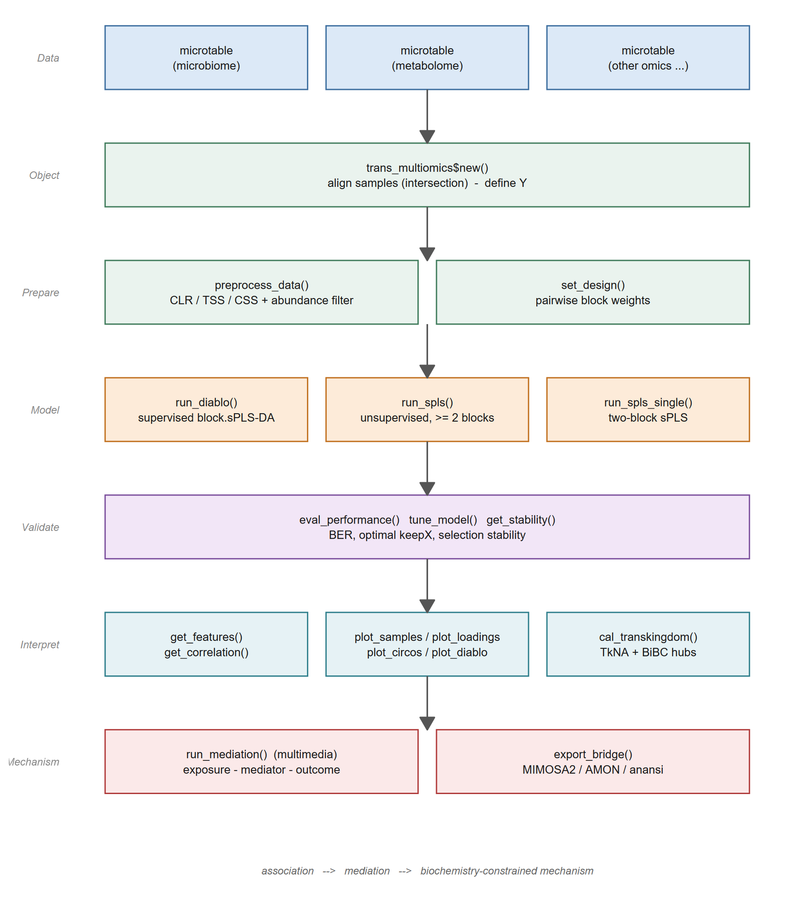
```

As with the other classes of `microeco`, each method returns the object itself (invisibly), so the steps can be chained with `$`, and every intermediate result is kept in the object, for example `data_list`, `model`, `perf_result`, `res_features`, `res_stability`, `res_transkingdom` and `res_mediation`.
The example below follows the whole pipeline on the two omics data sets shipped with `microeco`: prokaryotic amplicon sequencing and untargeted metabolomics from the same agricultural field experiment.
All the results shown in this section were checked with microeco 2.4.0 and mixOmics 6.36.0.

### Prerequisites

Install the required packages first.
`mixOmics` is on Bioconductor; `multimedia` is only needed for the mediation analysis section and can be skipped if you do not use it.

```{r, echo = TRUE, eval = FALSE}
install.packages("microeco")
if (!requireNamespace("BiocManager", quietly = TRUE)) install.packages("BiocManager")
BiocManager::install("mixOmics")
# optional, only for mediation analysis
install.packages("multimedia")
```

### Prepare the example data

The example uses two data sets shipped with `microeco`: `soil_microb` (prokaryotic amplicon sequencing, 1245 taxa x 90 samples) and `soil_metab` (untargeted metabolomics, 160 metabolites x 60 samples).
Both come from the same agricultural field experiment with crop rotation and fertilization treatments and share 60 samples across six treatment groups [@Liu_microeco_2021; @Liu_workflow_2026].

Each omics layer must be a `microtable` object.
The `sample_table` must contain a grouping column (e.g. `Group`) that will be used as the supervised response `Y` in DIABLO.
The names of the list become the block names in `mixOmics`.
For your own data, create one `microtable` per omics layer (see the microtable class section) and pass them as a named list.

```{r, echo = TRUE, eval = FALSE}
library(microeco)
library(mixOmics)
data(soil_microb)
data(soil_metab)
# soil_microb: 1245 taxa x 90 samples; soil_metab: 160 metabolites x 60 samples
# both share 60 samples from the same field experiment
```

### Create the trans_multiomics object

`trans_multiomics$new` takes a named list of `microtable` objects, aligns samples by intersection, and extracts the response `Y` from `group_col` of the first `sample_table`.

```{r, echo = TRUE, eval = FALSE}
t1 <- trans_multiomics$new(
  microtables = list(microb = soil_microb, metab = soil_metab),
  group_col   = "Group"
)
```

Expected messages:

```
30 sample(s) removed to align samples across all blocks (intersection) ...
Multi-omics data loaded with 60 samples and 2 blocks: microb, metab ...
```

Important details:

* Samples are aligned by **intersection** across all blocks.
  The number in the message is the total number of sample rows dropped over all blocks, so here it is 30: the 30 samples occurring only in `soil_microb` are removed while `soil_metab` keeps its 60 samples.
* `Y` must contain at least two levels.
  You can also pass a named factor/character vector via the `group` argument to override `group_col`.
  A named vector is matched by sample name (a warning is issued if the names are missing and the samples are then matched by order).
* The original `microtable` objects are deep-cloned inside the class so later changes to the user's data do not affect the model.
  All preprocessing therefore happens on the cloned data.

### Preprocess the data

`preprocess_data` reuses the `trans_norm` machinery to apply a normalization method to each block.
For compositional microbiome/metabolome data, **CLR (centered log-ratio) is recommended** because it removes the compositional constraint and produces values whose sum is zero within each sample.

```{r, echo = TRUE, eval = FALSE}
t1$preprocess_data(
  method      = "clr",      # CLR transformation
  pseudocount = 1,          # added before log for zero values
  filter_freq = 0.2         # keep features present in at least 20% of samples
)
```

The feature filtering is delegated to `microtable$filter_taxa`, so the usual filtering messages of the microtable class are printed first.
Expected output (truncated):

```
Filter features for otu_table in the object ...
Use converted freq integer: 12 for the following filtering ...
Block 'microb': 60 samples x 1241 features after preprocessing ...
Block 'metab': 60 samples x 144 features after preprocessing ...
```

The processed matrices (rows are samples, columns are features) are stored in `t1$data_list` and will be passed to `mixOmics`.

The argument `method` accepts any value supported by `trans_norm$norm` (e.g. `"clr"`, `"rclr"`, `"css"`, `"tss"`, `"log"`).
For `filter_freq < 1`, the threshold is computed as `round(n_samples * filter_freq)` (here `0.2 * 60 = 12`); features observed in fewer samples than this threshold are removed.
Pass an integer >= 1 if you prefer an absolute count threshold.
`filter_thres` adds a relative abundance threshold on the same call.
Setting `filter_freq = 1` and `filter_thres = NULL` keeps all features.

### Set the design matrix

The design matrix specifies how strongly two blocks should be correlated.
A small off-diagonal weight (e.g. `0.1`) tends to favour classification accuracy, whereas `1` maximises the covariance between blocks and is more useful for exploratory association analysis [@Singh_DIABLO_2019].

```{r, echo = TRUE, eval = FALSE}
t1$set_design(weight = 0.1)
t1$design
```

```
       microb metab
microb    0.0   0.1
metab     0.1   0.0
```

You can also supply a full design matrix manually:

```{r, echo = TRUE, eval = FALSE}
design_full <- matrix(c(0, 1, 1, 0), nrow = 2,
  dimnames = list(c("microb", "metab"), c("microb", "metab")))
t1$set_design(design = design_full)
t1$set_design(weight = 0.1)  # reset to the default
```

### Supervised integration (block.splsda)

DIABLO [@Singh_DIABLO_2019] extends sparse PLS-DA to multiple data sets and selects correlated features across blocks that best discriminate the groups in `Y`.

```{r, echo = TRUE, eval = FALSE}
t1$run_diablo(
  ncomp  = 2,
  keepX  = list(microb = c(10, 10), metab = c(15, 15))
)
```

The fitted model is stored in `t1$model`.
Its class is `block.splsda` and the latent components live on `comp1` and `comp2`.
Choosing `keepX` requires balancing interpretability (small `keepX` -> sparse biomarker panels) and classification performance (larger `keepX` retains more signal).
The rule of thumb "5-20 features per block per component" works well for tens of samples per group.
The tuning section below shows how to choose `keepX` automatically.

### Performance evaluation

`eval_performance` runs `mixOmics::perf` to estimate the classification error rate via cross-validation.
`perf` aggregates the per-block predictions with four strategies: `AveragedPredict` and `WeightedPredict` average the predicted classes over the blocks, while `MajorityVote` and `WeightedVote` take the majority (or weighted majority) class over the blocks.
The error rate of the two voting strategies is computed for each of the three distance metrics (`max.dist`, `centroids.dist`, `mahalanobis.dist`), so `MajorityVote.error.rate` and `WeightedVote.error.rate` are lists containing one matrix per distance metric, whereas `AveragedPredict.error.rate` and `WeightedPredict.error.rate` are single matrices (no distance is involved).
Every one of those matrices has one row per predicted class plus an `Overall.ER` and an `Overall.BER` row, and one column per component.

```{r, echo = TRUE, eval = FALSE}
t1$eval_performance(method = "Mfold", folds = 5, nrepeat = 1, seed = 123)
# overall balanced error rate (BER) across prediction strategies
t1$perf_result$MajorityVote.error.rate$centroids.dist["Overall.BER", ]
t1$perf_result$WeightedVote.error.rate$centroids.dist["Overall.BER", ]
# per-block error rate (which block is more informative?)
t1$perf_result$error.rate$microb
t1$perf_result$error.rate$metab
```

With our example data (`folds = 5, nrepeat = 1, seed = 123`) the WeightedVote BER drops from `0.533` (comp1) to `0.400` (comp2, centroids.dist) and further to `0.333` (mahalanobis.dist), while MajorityVote remains high because the majority vote is conservative on a six-class problem.
BER values are cross-validated estimates, so they change with `folds`, `nrepeat` and `seed`; interpret the trend rather than the exact numbers.
In practice, **WeightedVote or AveragedPredict** are usually more informative than MajorityVote when the class sizes are balanced.

`error.rate` is a list with one matrix per block, each giving the error rate of that single block (rows: components, columns: distance metrics).
It complements the four aggregated strategies above and helps to decide which block carries the classification signal.
The cross-validation takes about 20 s for `folds = 5, nrepeat = 10` on 60 samples.

Always set `seed` for reproducible cross-validation; the value is forwarded to `mixOmics` when supported (>= 6.3.2) and otherwise applied via `set.seed()`.

### Feature selection stability

The features selected by a single DIABLO fit are subject to sampling noise.
`get_stability` averages the selection frequency across all folds and repeats of the cross-validation performed by `eval_performance`, returning a tidy `data.frame` with columns `Feature`, `Block`, `Comp`, and `Stability` in `[0, 1]`.
A stability close to `1` means the feature is robust across resamples; low stability suggests the feature may be an artefact of a particular data split [@Liquet_stability_2012].

```{r, echo = TRUE, eval = FALSE}
# eval_performance must be called first with folds/nrepeat > 1 for a meaningful stability
t1$eval_performance(folds = 5, nrepeat = 10, seed = 123)
stab <- t1$get_stability()
head(stab, 10)
# robust biomarker candidates on the first component
subset(stab, Comp == 1 & Stability >= 0.8)
```

Typical output (truncated):

```
                            Feature  Block Comp Stability
2  7acd7a55f455134030d80f19811abf4c microb    1      1.00
3  9a39a41375516bcc9c073e73b57a86df microb    1      1.00
91                     Elaidic acid  metab    1      1.00
93                 arachidonic acid  metab    1      1.00
94                       oleic acid  metab    1      1.00
95                 palmitoleic acid  metab    1      1.00
97                           ribose  metab    1      1.00
5  dcebcca13a3e634371704c988df13605 microb    1      0.98
96                        phosphate  metab    1      0.98
1  15068cd31c9596bb39a69d9a28ba9bac microb    1      0.96
```

The leading integers are the internal row indices of the assembled table and carry no meaning.

With this example (`folds = 5, nrepeat = 10, seed = 123`), the subset on `Comp == 1 & Stability >= 0.8` keeps 15 features on comp1.
Increase `nrepeat` (e.g. `50`) for publication-grade stability; `nrepeat = 1` only shows whether the feature survives all folds of a single split.

Note that `get_stability` needs the selection frequency table that `perf` stores in `perf_result$features$stable`, so it requires a sparse model fitted with `keepX` and evaluated with `eval_performance()`.

### Hyperparameter tuning (keepX)

`mixOmics::tune.block.splsda` searches an optimal `keepX` per block per component via cross-validation.
The class provides a thin wrapper `tune_model`.
When `test_keepX` is not supplied, an adaptive grid of 5%, 10% and 20% of the number of features per block is used.

```{r, echo = TRUE, eval = FALSE}
t1$tune_model(
  ncomp       = 2,
  test_keepX  = list(microb = c(5, 10, 20), metab = c(5, 10, 20)),
  folds       = 5,
  nrepeat     = 1,
  seed        = 123
)
t1$best_keepX
```

```
$microb
[1] 20 20

$metab
[1] 20  5
```

The optimal `keepX` is stored in `t1$best_keepX` and can be reused to refit the model.
As a refit replaces every panel computed from the object, the refitted model is built in a separate copy here, so that the results in the following sections remain reproducible with the initial `keepX` of the supervised integration section.

```{r, echo = TRUE, eval = FALSE}
# refit with the tuned keepX in a copy of the object
t1_tuned <- t1$clone(deep = TRUE)
t1_tuned$run_diablo(ncomp = 2, keepX = t1$best_keepX)
t1_tuned$get_features(comp = 1)   # 40 features on comp1 (20 + 20) instead of 25
```

Run the same refit directly on `t1` (i.e. without the copy) if you want the tuned model to become the working model; the feature panels and the correlation matrix shown below will then change accordingly.

Notes and pitfalls:

* `mixOmics` does not provide a tune function for the unsupervised `block.spls`, so `method` must be `"block.splsda"` (which requires `Y`).
* `folds` must not exceed the smallest class size; with ten samples per group `folds <= 10`.
* The grid search cost grows multiplicatively with the number of candidate values per block.
  A 3 x 3 grid with `folds = 5`, `nrepeat = 1` and 60 samples takes ~10 s on a laptop; increase `nrepeat` only when you really need it.

### Feature extraction and cross-block correlation

After a DIABLO fit, `get_features` extracts the selected variables on each component and returns a tidy `data.frame` sorted by the absolute loading.

```{r, echo = TRUE, eval = FALSE}
features <- t1$get_features(comp = 1)
head(features)
table(features$Block)
# comp = 2
features2 <- t1$get_features(comp = 2)
head(features2, 6)
```

Typical output:

```
                           Feature  Block Comp Loading_value
11                palmitoleic acid  metab    1     0.6524757
1  9a39a41375516bcc9c073e73b57a86df microb    1    -0.6001810
2  dcebcca13a3e634371704c988df13605 microb    1    -0.4671889
...
```

Again the leading integers are the internal row indices of the table.

`get_correlation` returns the cross-block similarity matrix of the selected features on a component, thresholded by an absolute cutoff.
The result is stored in `t1$res_correlation` and can be exported for downstream network or pathway analyses.

```{r, echo = TRUE, eval = FALSE}
cm <- t1$get_correlation(comp = 1, cutoff = 0.7)
dim(cm)   # 10 rows x 15 cols in this example (microb x metab)
range(cm)
```

Note: in `mixOmics` >= 6.x the returned similarity matrix has `colnames` but `rownames` may be `NULL`; the rows correspond to the selected features of the first block and the order follows `mixOmics::selectVar`.
The column names carry the block name as a suffix (e.g. `palmitoleic acid_metab`), because `mixOmics::network` labels the variables by block.
Restore the names manually if you need them:

```{r, echo = TRUE, eval = FALSE}
if (is.null(rownames(cm))) {
  sel <- mixOmics::selectVar(t1$model, comp = 1, block = "microb")
  rownames(cm) <- sel$microb$name
}
# remove the "_<block>" suffix from the column names
colnames(cm) <- sub("_metab$", "", colnames(cm))
```

`mixOmics::network` opens a graphics device internally even though no plot is requested, so a stray `Rplots.pdf` may appear in the working directory; it can simply be deleted.

### Visualizations

#### Sample projection

`plot_samples` calls `mixOmics::plotIndiv` with `style = "ggplot2"` and returns a `ggplot` object that can be customised with `+ theme_xx()`.

```{r, echo = TRUE, eval = FALSE}
p1 <- t1$plot_samples(comp = c(1, 2), blocks = "average", ellipse = TRUE)
p1
p1b <- t1$plot_samples(comp = c(1, 2), blocks = "microb", ellipse = TRUE)
p1b
```

`blocks = "average"` plots the consensus components (weighted average across all blocks), which is the standard view to check whether the blocks separate the groups jointly.
Pick a single block name/index to inspect the within-block projection.

```{r, out.width = "650px", fig.align="center", echo = FALSE}
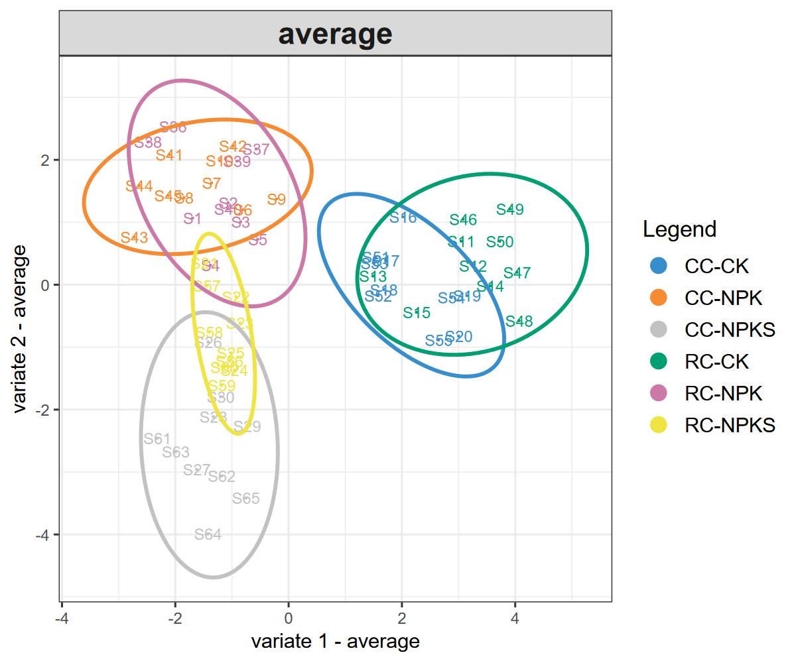
```

```{r, out.width = "650px", fig.align="center", echo = FALSE}
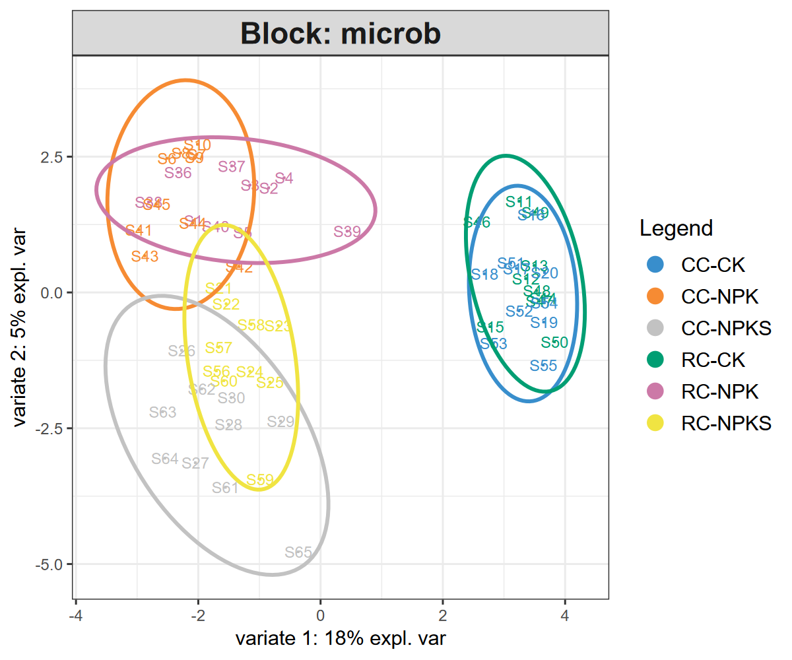
```


#### Variable loadings

`plot_loadings` calls `mixOmics::plotLoadings` and draws a bar plot of the loadings on the current graphics device.
The function returns the loading values as a `list` (one element per block, each a `data.frame` with the columns `importance` and `names`), **not** a `ggplot` object, so use it directly without `ggsave()`:

```{r, echo = TRUE, eval = FALSE}
t1$plot_loadings(comp = 1, block = "microb")
loadings <- t1$plot_loadings(comp = 1, block = "metab")
head(loadings$metab)  # the loading values
```

The `block` argument must always be given for the multi-block models; the default `NULL` is not resolved to the first block and raises an error.

```{r, out.width = "650px", fig.align="center", echo = FALSE}
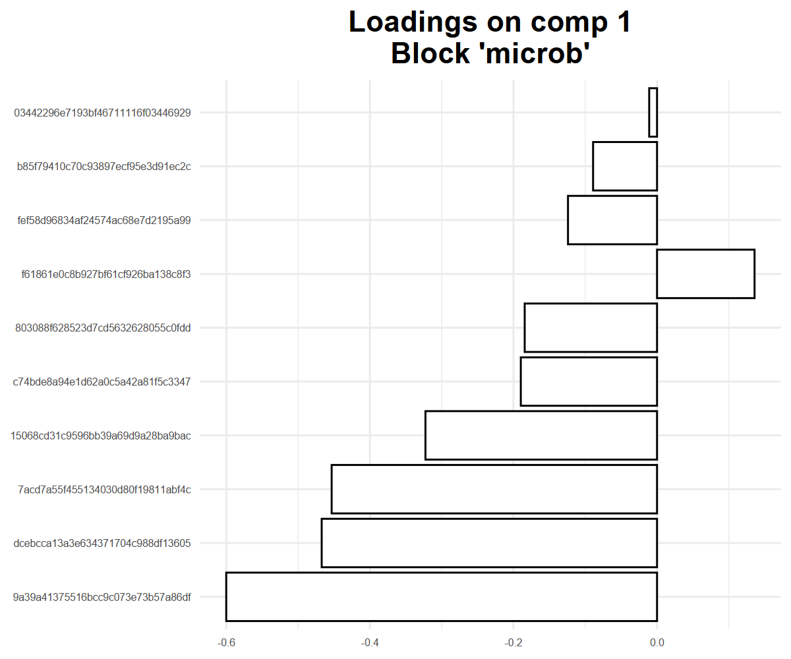
```


#### DIABLO diagnostic plot

`plot_diablo` shows the correlation between the latent components of each block on the specified `ncomp`.
The lower panel gives the Pearson correlation coefficient and the upper panel the corresponding scatter plot, so the plot is used to check whether DIABLO succeeded in maximising the correlation between the components of the different blocks [@Singh_DIABLO_2019].
Note that the design weight is a link weight and not the expected correlation value: the paired components of the two blocks are correlated by `0.75` and `0.61` here with `weight = 0.1`, i.e. well above the design value.
Raising the weight to `1` enforces the link more strongly and usually increases the correlation of the paired components.

```{r, echo = TRUE, eval = FALSE}
t1$plot_diablo(ncomp = 1)
```

```{r, out.width = "650px", fig.align="center", echo = FALSE}
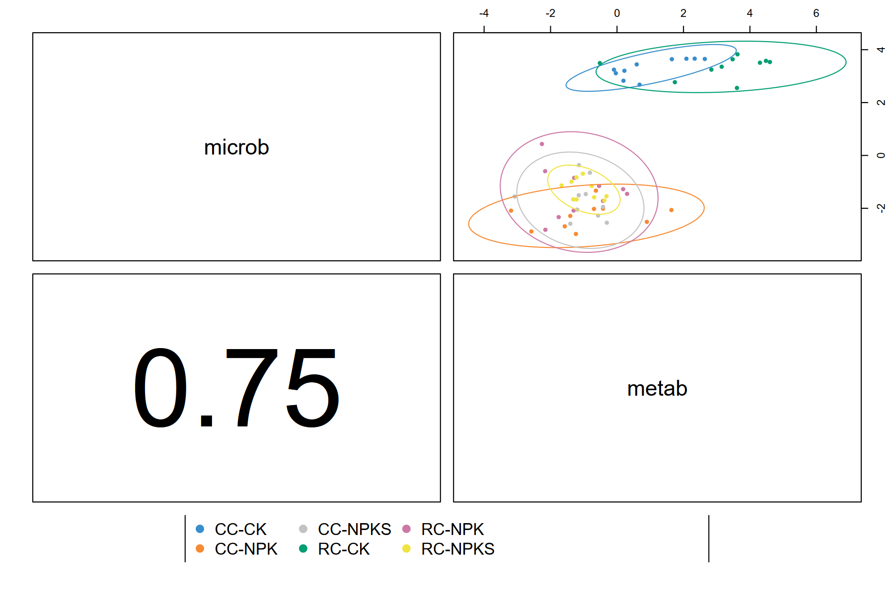
```


#### Relevance network and circos plot

`plot_cor_network` displays the cross-block correlation network of the selected features, thresholded by `cutoff`.
`plot_circos` shows the same information in a circos layout.
Both rely on the underlying `mixOmics::network` and `mixOmics::circosPlot`; pass additional arguments through `...` when needed.

```{r, echo = TRUE, eval = FALSE}
t1$plot_cor_network(comp = 1, cutoff = 0.7)
t1$plot_circos(comp = 1, cutoff = 0.7)
```

The default `cutoff = 0.7` requires that at least some of the selected features are correlated above `0.7`; `mixOmics` stops when the cutoff exceeds the largest value of the similarity matrix.
Check `range(t1$get_correlation(comp = 1))` (here `-0.85` to `0.78`) and lower the cutoff when the panel is only weakly correlated.

```{r, out.width = "650px", fig.align="center", echo = FALSE}
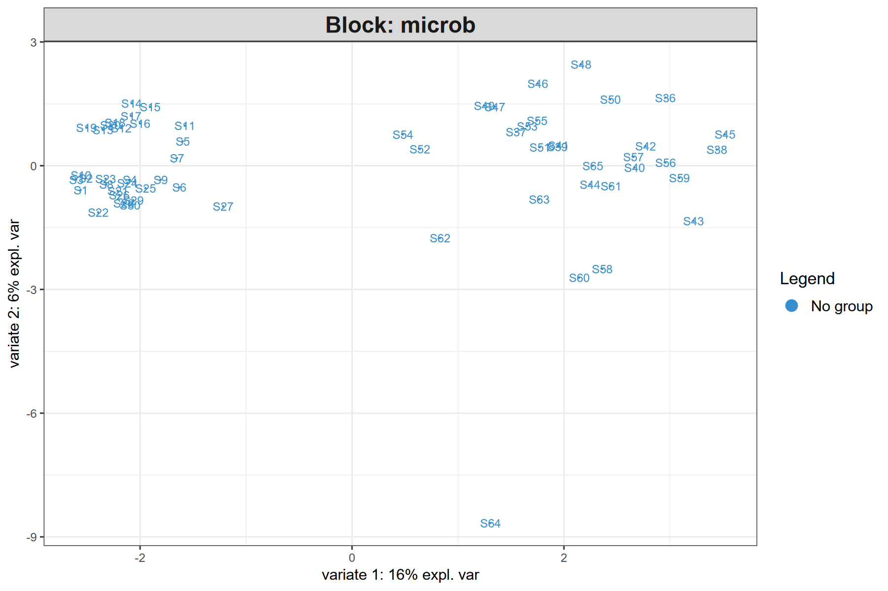
```

```{r, out.width = "650px", fig.align="center", echo = FALSE}
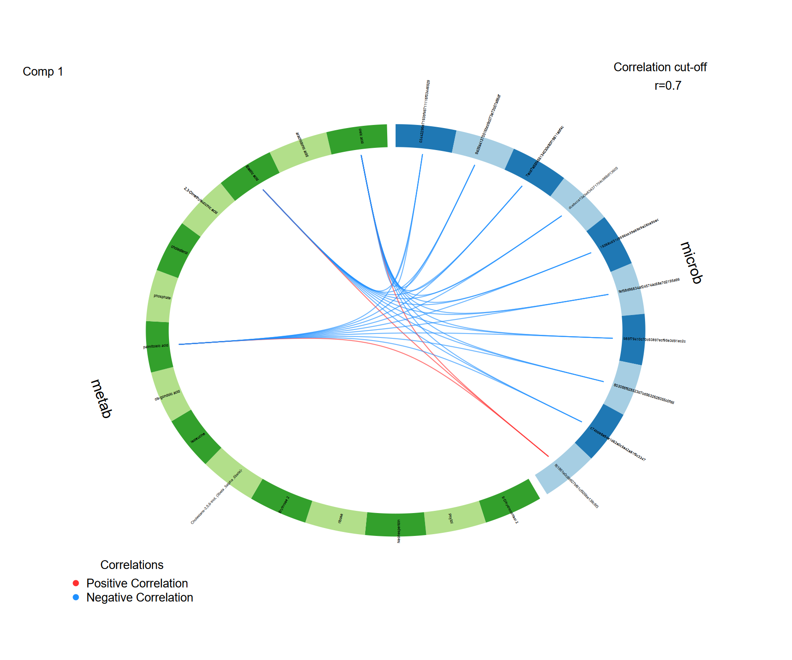
```


#### Clustered image map

`plot_heatmap` calls `mixOmics::cimDiablo` to draw a clustered image map (CIM) of the selected features across samples.

```{r, echo = TRUE, eval = FALSE}
t1$plot_heatmap(comp = 1)
```

```{r, out.width = "650px", fig.align="center", echo = FALSE}
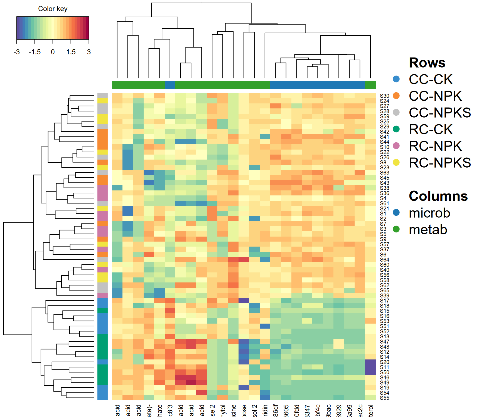
```


#### Per-class AUC

`cal_auroc` runs `mixOmics::auroc` for each block and each component, returning per-class AUCs and a `ggplot` ROC plot.
The function detects the correct `roc.comp` vs `comp` argument name across `mixOmics` versions, so it is safe to use with both 6.3.x and 6.4.x.

```{r, echo = TRUE, eval = FALSE}
au <- t1$cal_auroc(comp = 1)
au$metab  # AUC for the metabolome block on each class (vs all others)
```

```
$comp1
                      AUC   p-value
CC-CK vs Other(s)   0.712 3.550e-02
CC-NPK vs Other(s)  0.644 1.532e-01
CC-NPKS vs Other(s) 0.624 2.188e-01
RC-CK vs Other(s)   0.932 1.832e-05   # RC-CK is best separated by metabolites
RC-NPK vs Other(s)  0.706 4.105e-02
RC-NPKS vs Other(s) 0.670 9.179e-02
```

The AUC tables of all blocks are the list elements named after the blocks (`au$microb`, `au$metab`), one table per component.
The ROC plot is stored separately as `au$graph.<block>` (a list with one `ggplot` per component).
`mixOmics::auroc` only builds the plot of the first block by default, so use `au$graph.microb`; pass `roc.block = 2` to `cal_auroc` to get the plot of the second block instead.


### Unsupervised alternatives

When no grouping is available, or when the goal is to explore the covariance structure between two data sets rather than to classify samples, use the unsupervised `block.spls` or `spls` engines.

`run_spls` performs multi-block sparse PLS.
Because `mixOmics::block.spls` requires a numeric response matrix, one block must be designated as the response via `Y_block` (passed internally as `indY`).
In that case `keepX` must be supplied for **all** blocks (including the response block) because `mixOmics` ignores `keepY` when `indY` is used.

```{r, echo = TRUE, eval = FALSE}
t2 <- trans_multiomics$new(
  microtables = list(microb = soil_microb, metab = soil_metab),
  group       = NULL,
  group_col   = NULL
)
t2$preprocess_data(method = "clr", filter_freq = 0.2)
t2$run_spls(
  ncomp   = 2,
  Y_block = "metab",
  mode    = "regression",
  keepX   = list(microb = c(10, 10), metab = c(10, 10))
)
p <- t2$plot_samples(comp = c(1, 2))  # blocks = "average" may fall back to a single block on block.spls
print(p)
```

```{r, out.width = "650px", fig.align="center", echo = FALSE}
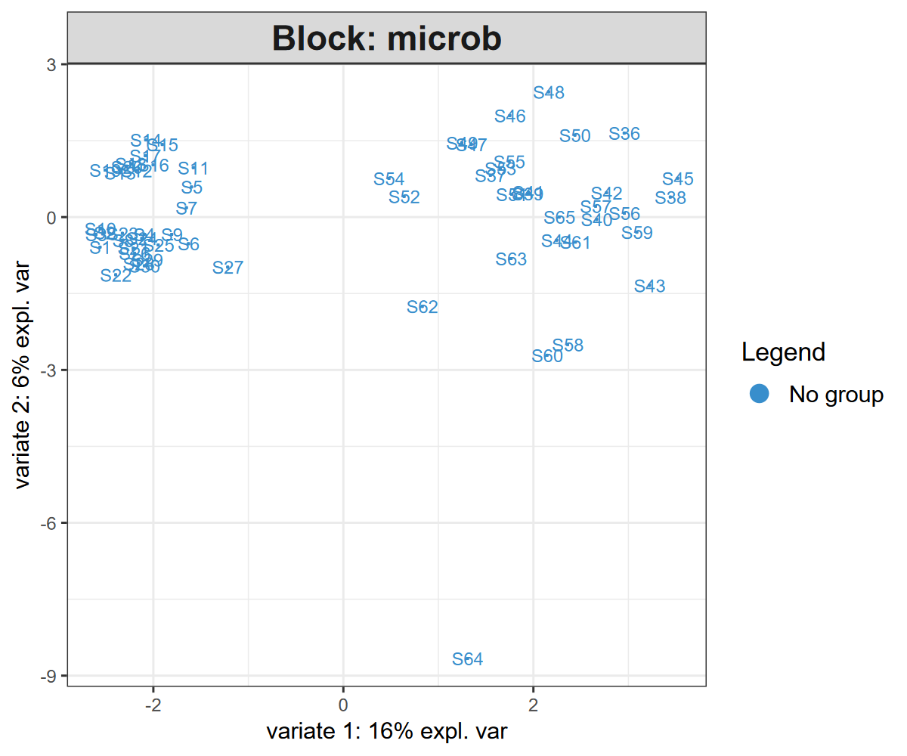
```

For a strictly two-block association, use `run_spls_single` which wraps `mixOmics::spls`:

```{r, echo = TRUE, eval = FALSE}
t3 <- trans_multiomics$new(
  microtables = list(microb = soil_microb, metab = soil_metab),
  group_col   = "Group"
)
t3$preprocess_data(method = "clr", filter_freq = 0.2)
t3$run_spls_single(
  X_block = "microb", Y_block = "metab",
  ncomp   = 2,
  keepX   = c(10, 10), keepY = c(10, 10)
)
```

On these unsupervised models, `get_features`, `get_correlation`, `plot_samples` and `plot_cor_network` work as described above (on the two-block `spls` model, `plot_samples` warns that `blocks` is ignored because the model is not multiblock).
`plot_loadings` also works: on a `block.spls` object use the original block names (`microb`, `metab`), but on the two-block `spls` model `mixOmics` internally renames the blocks to `X` and `Y`, so you must pass `block = "X"` or `block = "Y"`.
However, `plot_circos`, `plot_heatmap` and `plot_diablo` only support the supervised `block.splsda` model: their underlying `mixOmics` functions (`circosPlot`, `cimDiablo`, `plotDiablo`) expect a supervised object and fail on unsupervised models.


### Trans-kingdom network (TkNA)

Beyond block-level integration, `trans_multiomics` can build a **bipartite** cross-omics association network following the Transkingdom Network Analysis (TkNA) framework.
The pipeline has three steps [@Newman_TkNA_2024]:

1. **Differential feature filtering** within each block (optional).
   Features whose adjusted p-value is above `diff_p` (Kruskal-Wallis, ANOVA or Wilcoxon, depending on `diff_test`) are dropped.
   This step removes uninformative background noise before computing associations.
2. **Cross-block correlation** between every remaining feature of one block and every remaining feature of the other block(s).
   Spearman is recommended for CLR-transformed compositional data.
   Pearson is also available.
   A `covariates` `data.frame` (with rownames matching the sample names) is regressed out from every feature before the correlation, mirroring the MaAsLin2 confounder handling [@Mallick_MaAsLin2_2021].
3. **Bipartite Betweenness Centrality (BiBC)** quantifies how often a node lies on the shortest path between two nodes of different blocks.
   Features with high BiBC are flagged as **cross-omics hubs** (top `hub_quantile` among nodes with BiBC > 0).

```{r, echo = TRUE, eval = FALSE}
t1$cal_transkingdom(
  corr_method = "spearman",
  corr_thres  = 0.6,
  p_thres     = 0.05,
  p_adjust    = "BH",
  diff_test   = "kruskal",
  diff_p      = 0.05
)
# node table: Feature, Block, Diff_p, BiBC, Hub
head(t1$res_transkingdom$nodes)
# edge table: From, To, Corr, P, P_adj, weight
head(t1$res_transkingdom$edges)
# cross-omics hub candidates
subset(t1$res_transkingdom$nodes, Hub)
```

Typical output (truncated):

```
Differential filtering (kruskal, BH-adjusted p <= 0.05) retained 798/1385 features ...
Cross-block correlation (spearman, BH-adjusted p <= 0.05, |corr| >= 0.6) retained 13/2385 candidate edges ...
Trans-kingdom network built: 798 nodes, 13 edges, 2 hub(s) ...
```

```
             Feature Block      Diff_p BiBC  Hub
796 palmitoleic acid  metab 0.009163057    6 TRUE
797 arachidonic acid   metab 0.026647565    4 TRUE
```

The `weight` column of the edge table is the distance-like weight `1 - |Corr|` used internally for the shortest paths of the BiBC computation; it is not the association strength (use `Corr` for that).

`plot_transkingdom` draws the bipartite network with `ggplot2` (Fruchterman-Reingold layout weighted by `|correlation|`, or a circle layout):

```{r, echo = TRUE, eval = FALSE}
t1$plot_transkingdom(label = "hub")         # only label hubs
t1$plot_transkingdom(label = "all", layout = "circle")
```

```{r, out.width = "700px", fig.align="center", echo = FALSE}
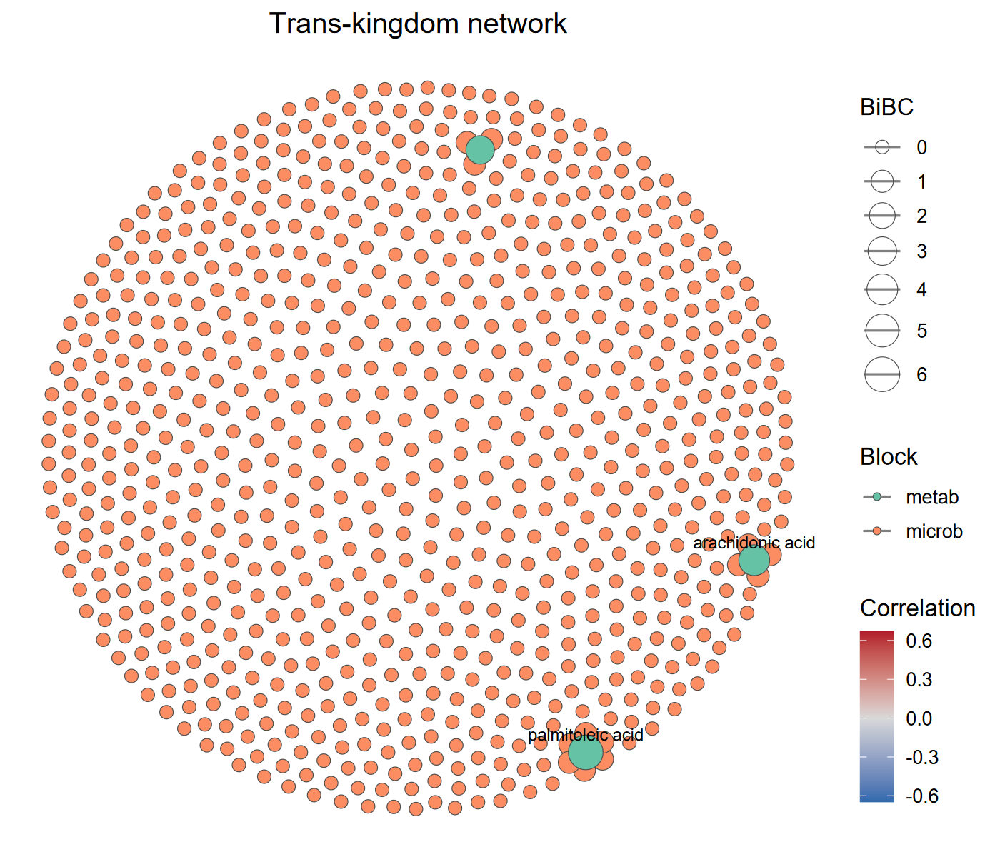
```

Regressing out confounders (e.g. sequencing batch, host age) reduces spurious cross-layer edges.
The `covariates` argument must be a `data.frame` whose rownames match the sample names:

```{r, echo = TRUE, eval = FALSE}
cov_df <- data.frame(
  batch = factor(rep(c("B1", "B2"), length.out = nrow(t1$data_list$microb))),
  row.names = rownames(t1$data_list$microb)
)
t1$cal_transkingdom(covariates = cov_df, corr_thres = 0.5)
```

Caveats:

* The network is a **data-driven association network**, not a causal network.
  Prioritised hubs/edges should be validated with independent cohorts or perturbation experiments.
* If `diff_test` removes **all** features from a block, the block is automatically retained with a warning.
  Lower `diff_p` or change the test to keep enough candidates.
* If no edge passes the `corr_thres` / `p_thres` thresholds, a warning is issued and an empty graph is returned.
* `diff_test = "wilcox"` requires exactly two groups in `Y`; use `"kruskal"` or `"aov"` for multi-group data.

### Bridge to the trans_network class

`convert_transkingdom` converts the trans-kingdom network into a `trans_network` object, so that the whole downstream network toolkit of the trans_network class becomes available: module detection (`cal_module`), node/edge property tables (`get_node_table` / `get_edge_table`), network topological attributes (`cal_network_attr`), sub-network extraction (`subset_network`), eigengene analysis (`cal_eigen`), random network comparison (`random_network`) and network visualization (`plot_network`).

```{r, echo = TRUE, eval = FALSE}
net1 <- t1$convert_transkingdom()
net1$cal_module()
net1$get_node_table(node_roles = TRUE)
head(net1$res_node_table)
```

The conversion follows the conventions of the correlation networks created by `trans_network$cal_network`: the edge weight is re-defined as the absolute correlation and the edge label as the correlation sign ("+"/"-"), while the node attributes `Block`, `Diff_p`, `BiBC` and `Hub` are kept, so they appear in the node table together with the usual network attributes (degree, betweenness, module, z, p, ...).
The original (non-transformed) abundances of the network features are taken from `dataset_list` to fill `data_abund`, `data_relabund` and `sample_table`, and the `tax_table` slots of all blocks are merged, which is convenient for a microbe-metabolite network.
The returned object can then be plotted with the trans_network visualizations, for example:

```{r, echo = TRUE, eval = FALSE}
net1$cal_network_attr()
net1$res_network_attr
net1$plot_network(method = "ggraph", node_color = "module")
```

Note that the taxonomy-dependent functions of `trans_network`, e.g. `cal_sum_links` and `plot_sum_links`, need a taxonomic column shared by all the involved blocks; for a bipartite cross-omics network (e.g. microbe vs metabolite) such a column usually does not exist, so those functions are not applicable unless the blocks use the same feature annotation.
Feature names must be unique across the blocks; duplicated names are reported with an error and should be renamed before the conversion.


### Mediation analysis (multimedia bridge)

High-dimensional mediation analysis asks whether the effect of an **exposure** on an **outcome** is transmitted through a set of **mediators**.
The `multimedia` package implements a sparse, high-dimensional mediation workflow [@Jiang_multimedia_2024] that fits naturally on top of `trans_multiomics`.
A typical microbiome question is "do specific metabolites mediate the effect of a microbial community on a host phenotype?".

The `run_mediation` method:

* takes the exposure, mediator and outcome as either `microtable` blocks (named in `data_list_names`) or low-dimensional named vectors/factors,
* reuses the CLR-transformed matrices from `t1$data_list`,
* optionally restricts the analysis to features previously selected by `get_features` via `features`,
* caps the number of features per block with `max_features` to keep the regression tractable,
* supports three model engines: `"glmnet"` (default, recommended for high-dimensional blocks), `"lm"` (low-dimensional exposure only) and `"rf"`.

```{r, echo = TRUE, eval = FALSE}
if (!requireNamespace("multimedia", quietly = TRUE)) {
  install.packages("multimedia")
}
set.seed(123)
# simulate a continuous phenotype (replace with your real phenotype vector)
pheno <- t1$data_list$metab[, 1] + rnorm(nrow(t1$data_list$metab), sd = 0.5)
names(pheno) <- rownames(t1$data_list$metab)

t1$run_mediation(
  exposure     = "microb",        # microbial block (high-dimensional)
  mediator     = "metab",         # metabolite block
  outcome      = pheno,           # named vector matching the samples
  model        = "glmnet",
  max_features = 50,             # cap each block at the top 50 most variable features
  n_boot       = 0               # 0 = skip bootstrap (use 1000 for final results)
)
# total effect decomposed
t1$res_mediation$direct_effect       # exposure -> outcome bypassing the mediator
t1$res_mediation$indirect_overall    # total indirect effect through mediators
head(t1$res_mediation$indirect_pathwise)  # per-mediator pathway effect
```

To focus the analysis on DIABLO-prioritised features, pass them via `features`:

```{r, echo = TRUE, eval = FALSE}
features <- t1$get_features(comp = 1)
t1$run_mediation(
  exposure = "microb", mediator = "metab", outcome = pheno,
  features = list(
    microb = unique(features$Feature[features$Block == "microb"]),
    metab  = unique(features$Feature[features$Block  == "metab"])
  )
)
```

Implementation notes:

* `multimedia` builds R formulas from the variable names, so metabolite names like `"trehalose+d-Glucoheptose 1"` would crash the formula parser.
  `run_mediation` transparently replaces the names with syntactically valid synthetic names (`V1`, `V2`, ...) and restores the original names in the returned effect tables.
  The mapping is preserved in `t1$res_mediation$name_map`.
* The engine chosen by `model` is passed to `multimedia` as the **outcome** estimator; the mediator model keeps the default `lm_model()` of `multimedia`, i.e. a plain linear model of each mediator on the exposure variables.
  Keep `max_features` (or `features`) small when the exposure is high-dimensional, otherwise that inner model becomes over-parameterised.
* `n_boot > 0` adds `res_mediation$bootstrap` with the bootstrap distributions of the direct, overall indirect and pathwise indirect effects.
* The "causal" interpretation of the indirect effects still relies on the assumed chain ordering and on the strong ignorability assumption; longitudinal or perturbation data are needed for causal claims.
* For binary factors in `exposure` or `outcome`, pass a 2-level factor or a 0/1 numeric vector.

### Export feature tables for knowledge tools

DIABLO and TkNA produce data-driven candidate associations, but they say nothing about the **biochemical plausibility** of a microbe -> metabolite link.
Knowledge-driven tools fill this gap by constraining associations to known reactions.
`export_bridge` writes the abundance tables of two blocks into the input formats expected by three popular tools:

| Target    | Output                                                                                                                                         |
|-----------|------------------------------------------------------------------------------------------------------------------------------------------------|
| `mimosa2` | two tab-separated abundance tables (`<file>_ko.txt`, `<file>_metabolites.txt`), features as rows and samples as columns                          |
| `amon`    | two plain-text ID lists (`<file>_ko_ids.txt`, `<file>_metabolite_ids.txt`), one KEGG ID per line                                                |
| `anansi`  | the same two tab-separated tables as `mimosa2`                                                                                                  |

```{r, echo = TRUE, eval = FALSE}
t1$export_bridge(
  target      = "mimosa2",
  file        = "./bridge/mimosa_input",
  ko_block    = "microb",
  metab_block = "metab"
)
# export only the DIABLO-prioritised features
features <- t1$get_features(comp = 1)
t1$export_bridge(
  target      = "mimosa2",
  file        = "./bridge/mimosa_selected",
  ko_block    = "microb",
  metab_block = "metab",
  features    = list(
    microb = unique(features$Feature[features$Block == "microb"]),
    metab  = unique(features$Feature[features$Block  == "metab"])
  )
)
```

For the metabolite names, `metab_id_table` (a two-column `data.frame`: original name + KEGG ID) converts them to KEGG compound IDs, which is what all three tools expect.
Without it, the original names are kept and a message reminds you that KEGG IDs are expected.
When `ko_block` / `metab_block` are not given, the first block and the block whose name contains "metab" are used.

Note that the exported tables come from `t1$dataset_list` (the **original** abundances), not from the CLR-transformed `t1$data_list`, because these tools expect raw counts or relative abundances.


### Suggested workflow

A practical ladder from data to mechanism for a typical microbe + metabolite study:

1. **Load and align** (`trans_multiomics$new`): make sure each `microtable` carries the same sample IDs and a clean grouping column.
2. **Preprocess** with `preprocess_data(method = "clr", filter_freq = 0.2)` for compositional blocks; consider additional `filter_thres` for very sparse features.
3. **Run DIABLO** with a small initial `keepX` (e.g. `c(10, 10)` per block per component) to get a first sanity-check plot (`plot_samples`).
4. **Evaluate performance** with `eval_performance(folds = 5, nrepeat = 10, seed = ...)`; compare WeightedVote vs AveragedPredict to choose the best `ncomp`.
5. **Tune** `keepX` with `tune_model` (start with a coarse grid; refine around the optimum).
6. **Refit** with `run_diablo(keepX = t1$best_keepX)` and extract the final `get_features` panel.
7. **Stability-check** with `get_stability` and keep only the features with `Stability >= 0.8` for downstream interpretation.
8. **Visualise** with `plot_samples`, `plot_loadings`, `plot_diablo`, `plot_circos` (or `plot_cor_network` for an explicit graph).
9. **Cross-omics associations** with `cal_transkingdom`; explore with `plot_transkingdom` and follow up on the `Hub` features, then hand the network over to the trans_network class with `convert_transkingdom`.
10. **Mediation** with `run_mediation` (requires `multimedia`) to quantify exposure -> mediator -> outcome pathways, optionally restricted to the DIABLO / TkNA-prioritised features.
11. **Mechanism filtering** with `export_bridge` to feed the candidates into MIMOSA2 / AMON / anansi and retain only biochemically plausible links.

### Key points

* **Block sizes:** `mixOmics::block.splsda` requires at least 2 levels of `Y`; `block.spls` does not use `Y` and needs `indY` (handled by `Y_block` in `run_spls`).
* **Small class sizes:** `folds` in `eval_performance` and `tune_model` must not exceed the smallest class size in `Y`.
  With 10 samples per group use `folds <= 10`.
* **Reproducibility:** always pass `seed` to `tune_model` and `eval_performance`.
  The seed is forwarded to `mixOmics` when supported, otherwise applied via `set.seed`.
* **Plot types:** `plot_samples` returns a `ggplot`; `plot_loadings` draws on the current device and returns a `list` of loading `data.frame`s, **not** a `ggplot` -- do not pipe it to `ggsave()`.
* **`plot_loadings` block argument:** it must be supplied explicitly for multi-block models; for the two-block `spls` model use `block = "X"` or `"Y"`.
* **`get_correlation` names:** in `mixOmics` >= 6.x the returned similarity matrix has column names with a `_<block>` suffix, while the row names may be `NULL`; restore the rows from `mixOmics::selectVar` if needed.
* **`cutoff` of the correlation network:** `mixOmics` stops when `cutoff` exceeds the largest value of the similarity matrix, so lower it for weakly correlated blocks (check `range(t1$get_correlation(comp = 1))`).
* **More than two blocks:** `mixOmics::network` returns one similarity matrix per block pair, so `get_correlation` needs exactly two blocks selected via `block = c(...)` (or a model with two blocks).
* **Large feature panels:** DIABLO with thousands of features per block is slow.
  Apply `filter_freq` and/or `filter_thres` in `preprocess_data` before the tuning step.
* **Refitting:** a new `run_diablo` replaces the model and invalidates the panels and tables computed from the previous one; refit a copy of the object (`t1$clone(deep = TRUE)`) if both models must be kept.
* **Unsupervised models:** `plot_circos`, `plot_heatmap` and `plot_diablo` only work on the supervised `block.splsda` model.


## trans_mst class

Microbial source tracking (MST) [@Shenhav_FEAST_2019] is used to answer a simple but important question:
for a given community, where do its members come from?
In such an analysis, the community of interest is called the **sink**,
and the candidate communities that may contribute to it are called **sources**.
The output is usually a set of proportions, i.e., how much of the sink can be attributed
to each source plus an unknown (unassigned) fraction.
Typical applications include tracing the transmission of microbes along the soil-plant continuum
(e.g., bulk soil -> rhizosphere soil -> root endophyte), detecting contamination in low-biomass samples,
and tracking the formation of developing microbial communities.

Starting from version 2.4.0, the microeco package provides the `trans_mst` class for microbial source tracking.
It is a wrapper of **FEAST** (Fast Expectation-maximization for microbial Source Tracking) [@Shenhav_FEAST_2019],
a scalable expectation-maximization framework that can estimate the contribution of thousands of
potential source environments simultaneously.
The advantage of integrating FEAST into microeco is that the whole analysis can be performed
directly on a `microtable` object, so that the preprocessing power of the microeco package
(e.g., taxonomic filtering, sample subsetting and data transformation) is fully reused.

The main functions of the `trans_mst` class are:

* `trans_mst$new`: create the object from a microtable object.
* `cal_mst`: run the source tracking for one transmission step.
* `cal_mst_chain`: run a chain of transmission steps in one call.
* `plot_mst`: plot the contribution proportions as a stacked barplot with ggplot2.

Please install the FEAST package first, as it is not on CRAN but on GitHub.

```{r, echo = TRUE, eval = FALSE}
# install.packages("remotes")
remotes::install_github("cozygene/FEAST")

library(microeco)
# for the pipe operator %>%
library(magrittr)
library(ggplot2)
```

### Prepare the example data

The example data is `soil_microb`, a microtable object of prokaryotic amplicon sequencing data
from an agricultural field experiment with crop rotation and fertilization treatments.
The `Compartment` column in `sample_table` represents the sampling compartments,
i.e., 'Bulk soil', 'Rhizosphere' and 'Endophyte' (root endophyte), with 30 samples for each compartment.
The `Plant_ID` column denotes the unique plant individual that each sample belongs to,
so that the three samples sharing the same `Plant_ID` are from the same plant
and can be treated as a paired source-sink set.
The `Cropping` and `Fertilization` columns are the two experimental factors and
the `Group` column is the combination of them.

Note that FEAST requires **raw counts (integers)**, not a relative abundance or rarefied table,
because the estimation relies on the multinomial sampling of reads.
If non-integer values are detected in the `otu_table`, they are automatically converted by `ceiling()` with a message.

```{r, echo = TRUE, eval = FALSE}
data(soil_microb)
soil_microb
# number of samples in each compartment
table(soil_microb$sample_table$Compartment)
# check that samples with the same Plant_ID form a paired set across compartments
table(soil_microb$sample_table$Plant_ID, soil_microb$sample_table$Compartment)
```

### Create the object

There are three parameters that can be used when creating a `trans_mst` object:
`dataset` is the microtable object;
`env_col` is a column name in `sample_table` used to describe the environment of each sample,
i.e., the 'Env' information required by FEAST;
`filter_thres` is the relative abundance threshold used to filter low-abundance taxa
(delegated to the `filter_taxa` function of the microtable class;
taxa with a total relative abundance lower than the threshold across all samples are removed).
Filtering the very low-abundance taxa is often useful to reduce the noise and speed up the estimation.

It should be noted that the input microtable object is deep-copied inside the object,
so all subsequent operations concerning the data filtering will not change the original microtable object.

```{r, echo = TRUE, eval = FALSE}
t1 <- trans_mst$new(dataset = soil_microb, env_col = "Compartment", filter_thres = 0)
t1
```

### Source tracking with a shared source pool

The most simple case is that all sink samples share one source pool.
For example, all the rhizosphere soil samples (sinks) may receive microbes from the whole bulk soil pool (sources).
Let's use the `sources` and `sinks` parameters to assign the environments,
which are matched against the `env_col` column of `sample_table`.
The results are always stored in the object, so multiple runs can be performed with the same object by
assigning a different `label` to each run.

```{r, echo = TRUE, eval = FALSE}
t1$cal_mst(sources = "Bulk soil", sinks = "Rhizosphere", EM_iterations = 1000, label = "bulk2rhizo")
```

Two key parameters of the FEAST algorithm deserve attention.
`EM_iterations` is the number of expectation-maximization iterations.
The default is 1000, which is enough for most cases; a smaller value (e.g., 100) can largely reduce the running time for a quick try.
The running time mainly depends on the number of sink samples, as the contribution is estimated sink by sink,
and also on the number of source samples in the shared-source-pool mode.
`COVERAGE` is the rarefaction depth used internally by FEAST.
By default (NULL), it is set to the minimum sequencing depth across all involved source and sink samples,
so that the samples with a larger sequencing depth are randomly downsampled to this depth
(samples already below or equal to it are kept unchanged).
Please note all the involved samples should have a sequencing depth larger than 0,
otherwise the function stops with an error message.
As the rarefaction is performed by randomly sampling reads, repeated runs may give slightly different results.

Three results are stored for each run:

* `res_mst[[label]]`: Sink x Source matrix at the **sample level**. Each row sums to 1.
* `res_mst_env[[label]]`: Sink x Source matrix at the **environment (source pooled) level**. Each row sums to 1.
* `res_mst_param[[label]]`: the input parameters and the involved sample information of the run.

The column 'Unknown' in the result matrices denotes the proportion of the sink that cannot be attributed to any known source.

```{r, echo = TRUE, eval = FALSE}
# sample level result: rows are sinks, columns are sources
t1$res_mst[["bulk2rhizo"]][1:5, 1:5]
# environment level result: contributions of the source environments
head(t1$res_mst_env[["bulk2rhizo"]])
# check the row sum
rowSums(t1$res_mst_env[["bulk2rhizo"]])
# mean contribution of each source environment
colMeans(t1$res_mst_env[["bulk2rhizo"]])
# parameters and sample information of the run
t1$res_mst_param[["bulk2rhizo"]]
```

### Source tracking with different source sets

In many experimental designs, each sink has its own source set.
For instance, a root endophyte sample should be traced back to the bulk soil and rhizosphere soil of
**the same plant individual**, instead of a general pool containing all the plants.
This is realized by `different_sources_flag = 1` together with the `id_col` parameter.
Samples sharing the same value of `id_col` (here `Plant_ID`) are considered as one paired group,
and only the source samples within the same group are used for the sink of that group.
Therefore, each pairing group can contain at most one sink sample
(a group with multiple sinks stops with an error),
and each sink must have at least one source sample in the same group;
the source samples without any paired sink are excluded automatically with a message.

```{r, echo = TRUE, eval = FALSE}
t1$cal_mst(sources = c("Bulk soil", "Rhizosphere"), sinks = "Endophyte",
	different_sources_flag = 1, id_col = "Plant_ID", EM_iterations = 1000, label = "soil2root")
# now there are two runs stored in the object
t1
head(t1$res_mst_env[["soil2root"]])
```

In the different-sources mode, the sources that do not belong to the source set of a given sink are `NA` in `res_mst`.
These `NA` values are automatically removed in the plot, and they are also skipped when aggregating
the contributions by source environment in `res_mst_env`.
For each sink, the non-`NA` contributions (including 'Unknown') still sum to 1.

### Run sequential steps in one call

The transmission of microbes is often a chain rather than a single step.
The `cal_mst_chain` function is a convenient wrapper of `cal_mst`,
where each element of the `steps` argument is a list of the parameters passed to `cal_mst`.
The results are stored with the labels 'step1', 'step2', ... unless a custom `label` is provided.

```{r, echo = TRUE, eval = FALSE}
t1 <- trans_mst$new(dataset = soil_microb, env_col = "Compartment")
t1$cal_mst_chain(steps = list(
	list(sources = "Bulk soil", sinks = "Rhizosphere", EM_iterations = 1000, label = "bulk2rhizo"),
	list(sources = c("Bulk soil", "Rhizosphere"), sinks = "Endophyte",
		different_sources_flag = 1, id_col = "Plant_ID", EM_iterations = 1000, label = "soil2root")
))
# all the stored runs
names(t1$res_mst)
```

### Specify sources and sinks by sample names

Instead of using environment values, the sources and sinks can also be assigned by explicit sample names
with the `source_samples` and `sink_samples` parameters.
This is useful when the source/sink assignment has no correspondence with any existing column of `sample_table`.
Note that `sources` and `source_samples` cannot be provided at the same time (the same for `sinks` and `sink_samples`),
and no sample can be assigned to both sources and sinks.

```{r, echo = TRUE, eval = FALSE}
# pick some bulk soil samples as sources and some rhizosphere samples as sinks
st_tmp <- soil_microb$sample_table
source_samples <- rownames(st_tmp)[st_tmp$Compartment == "Bulk soil"][1:10]
sink_samples <- rownames(st_tmp)[st_tmp$Compartment == "Rhizosphere"][1:10]
t1$cal_mst(source_samples = source_samples, sink_samples = sink_samples, EM_iterations = 1000, label = "custom")
```

### Visualization

The `plot_mst` function returns a ggplot2 object, so that it can be further modified before saving.
By default, the environment-level result (`res_mst_env`) of the first run is plotted.
The `group_sink` parameter is used to group (and facet) the sinks according to a column of `sample_table`,
which is very useful to compare the contribution patterns among treatments.

```{r, echo = TRUE, eval = FALSE}
# the first run with the environment-level result
t1$plot_mst(use_run = "bulk2rhizo", group_sink = "Group")
```
```{r, out.width = "900px", fig.align="center", echo = FALSE}
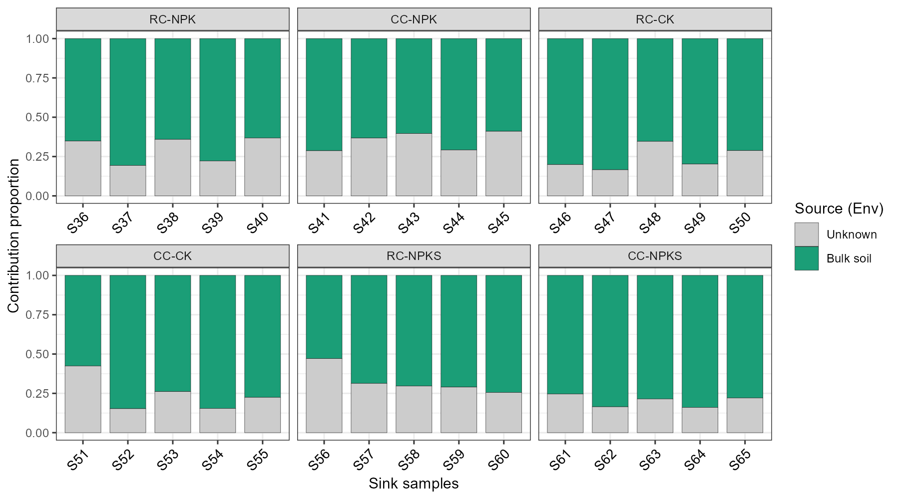
```

In this example, the bulk soil explains most of the rhizosphere soil communities
(around 60% - 80% for individual samples),
and the remaining part is assigned to the unknown sources.

The second step of the transmission is shown below, in which each root endophyte sample uses
the bulk soil and rhizosphere soil of the same plant individual as sources.
Please note that the running time of this step is much shorter than the first one,
as only two paired source samples are used for each sink in the different-sources mode.

```{r, echo = TRUE, eval = FALSE}
t1$plot_mst(use_run = "soil2root", group_sink = "Cropping")
```
```{r, out.width = "900px", fig.align="center", echo = FALSE}
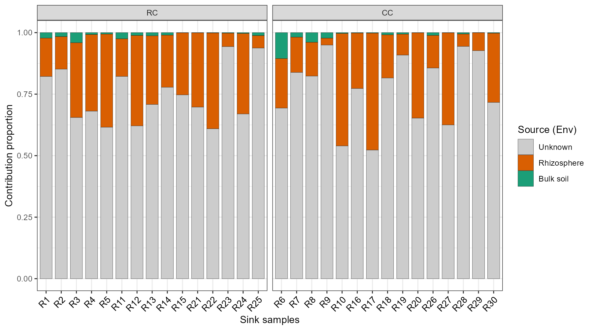
```

Consistent with the ecological expectation, the rhizosphere soil contributes more to the root endophyte
communities than the bulk soil, indicating the directional transfer of microbes along the soil-plant continuum.

The `use_env = FALSE` parameter switches to the sample-level result (`res_mst`),
where each source sample is shown separately.
It is helpful to check whether particular source samples dominate the contribution.
Please note that a large number of source samples can make the legend too crowded,
so this option is more suitable for a small source set, such as the small example above.

```{r, echo = TRUE, eval = FALSE}
t1$plot_mst(use_run = "custom", use_env = FALSE)
```
```{r, out.width = "900px", fig.align="center", echo = FALSE}
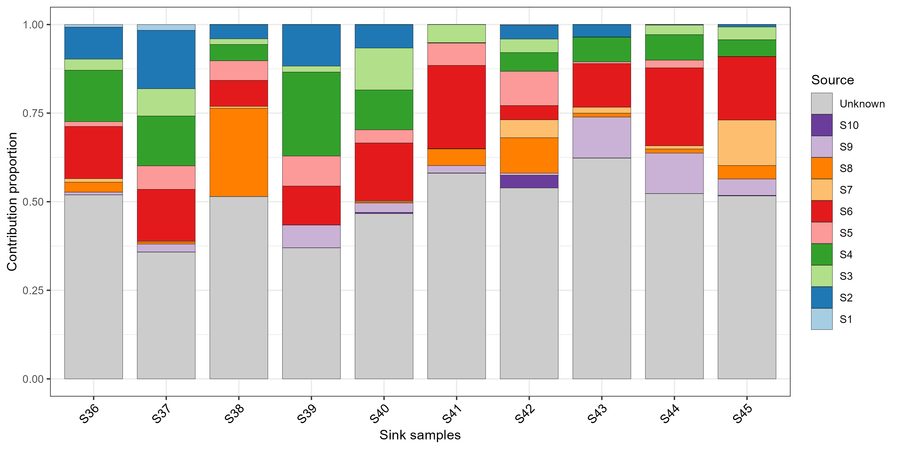
```

More parameters are available for the details of the plot, e.g., `show_unknown` (whether to show the 'Unknown' proportion),
`colors`, `unknown_color`, `bar_width`, `xtext_size`, `xtext_angle`,
`legend_title` (the legend title) and `facet_scales` (the scales argument of `facet_wrap`).
Filling each bar with the same order in all facets is controlled by the levels of the Source factor,
which follows the column order of the result matrix.

```{r, echo = TRUE, eval = FALSE}
# hide the Unknown proportion and customize the colors
t1$plot_mst(use_run = "soil2root", group_sink = "Cropping", show_unknown = FALSE,
	colors = c("#E64B35FF", "#4DBBD5FF"), xtext_size = 8, xtext_angle = 90)
# save the plot
ggsave("MST_soil2root.pdf", t1$plot_mst(use_run = "soil2root", group_sink = "Cropping"), width = 8, height = 4)
```

### Downstream analysis of the results

As the results are stored as plain matrices, they can be easily combined with the other classes of microeco
for further analysis. For instance, the contribution proportions can be compared among the fertilization treatments.

```{r, echo = TRUE, eval = FALSE}
# take the environment-level result of the soil -> root step
contrib <- t1$res_mst_env[["soil2root"]]
# add the group information of the sinks
contrib_df <- data.frame(SampleID = rownames(contrib), contrib, check.names = FALSE)
contrib_df$Fertilization <- soil_microb$sample_table[contrib_df$SampleID, "Fertilization"]
# make a long table for plotting
plot_df <- reshape2::melt(contrib_df, measure.vars = c("Bulk soil", "Rhizosphere", "Unknown"),
	variable.name = "Source", value.name = "Contribution")
ggplot(plot_df, aes(x = Fertilization, y = Contribution, fill = Source)) +
	geom_boxplot(width = 0.6, outlier.alpha = 0) +
	stat_summary(fun = mean, geom = "point", position = position_dodge(width = 0.6)) +
	scale_y_continuous(expand = expansion(mult = c(0, 0.05))) +
	labs(x = NULL, y = "Contribution proportion") +
	theme_bw()
# save the tables for further use
write.csv(t1$res_mst[["soil2root"]], "MST_soil2root_sample_level.csv")
write.csv(t1$res_mst_env[["soil2root"]], "MST_soil2root_env_level.csv")
```
