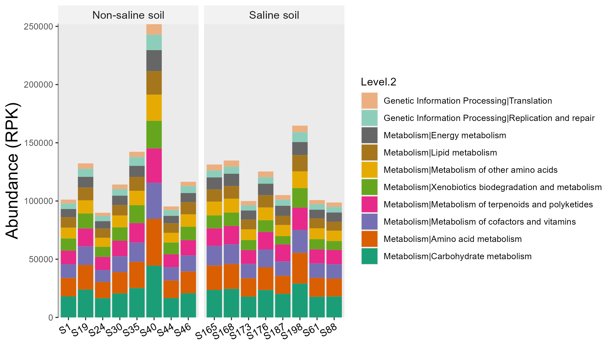

# Other dataset

## Fungi data

Another ITS sequencing dataset [@Gao_Strong_2019] is also stored in the example data of the package.
Here, we use it as an example to show the use of FUNGuild database[@Nguyen_FUNGuild_2016].
FungalTraits [@Polme_FungalTraits_2020] database is also available for identifying fungal traits.


```{r, echo = TRUE, eval = FALSE}
library(microeco)
library(magrittr)
# load ITS data
data(sample_info_ITS)
data(otu_table_ITS)
data(taxonomy_table_ITS)
# create microtable object
mt_fungi <- microtable$new(sample_table = sample_info_ITS, otu_table = otu_table_ITS, tax_table = taxonomy_table_ITS)
# remove the taxa not assigned in the Kingdom "k__Fungi"
mt_fungi$tax_table %<>% base::subset(Kingdom == "k__Fungi")
# use tidy_dataset() to make OTUs and samples information consistent across files
mt_fungi$tidy_dataset()
```

Then, let's perform the fungal trait prediction.

```{r, echo = TRUE, eval = FALSE}
t1 <- trans_func$new(mt_fungi)
# Both FungalTraits and FUNGuild are available
t1$cal_spe_func(fungi_database = "FungalTraits")
t1$cal_spe_func_perc(abundance_weighted = TRUE)
# return: t1$res_spe_func_perc
```

Then we show an example on the differential test of traits across groups.

```{r, echo = TRUE, eval = FALSE}
# clone mt_fungi for differential test
tmp_mt <- clone(mt_fungi)
# we need assign the table to taxa_abund manually
tmp_mt$taxa_abund$func <- as.data.frame(t(t1$res_spe_func_perc), check.names = FALSE)
# use trans_diff class to perform differential test
t2 <- trans_diff$new(dataset = tmp_mt, method = "anova", group = "sample_type", taxa_level = "func")
t2$plot_diff_abund(add_sig = T, simplify_names = FALSE) + ggplot2::ylab("Relative abundance (%)")
```

Then we show the distribution of traits across modules in network.

```{r, echo = TRUE, eval = FALSE}
# create trans_network object
t1 <- trans_network$new(dataset = mt_fungi, cal_cor = "WGCNA", taxa_level = "OTU", filter_thres = 0.000001, cor_method = "spearman")
# create correlation network 
t1$cal_network(COR_p_thres = 0.05, COR_cut = 0.6)
# add modules
t1$cal_module()
# convert module info to microtable object
meco_module <- t1$trans_comm(use_col = "module")
# create trans_func object
t2 <- trans_func$new(meco_module)
# identify species traits, automatically select database for prokaryotes or fungi
# fungi_database = "FungalTraits" for the FungalTraits database
t2$cal_spe_func(fungi_database = "FUNGuild")
# calculate abundance-unweighted functional redundancy of each trait for each network module
t2$cal_spe_func_perc(abundance_weighted = FALSE)
# plot the functional redundancy of network modules
t2$plot_spe_func_perc(order_x = paste0("M", 1:10))
```


## Metagenomic data

In the file2meco package part,
we provide several examples to transform the output files of some famous metagenomic tools (e.g. HUMAnN and kraken2) to 
the microtable object directly.
Here, we show some detailed examples using KEGG pathway results.

```{r, echo = TRUE, eval = FALSE}
library(microeco)
library(file2meco)
library(magrittr)
?humann2meco
sample_file_path <- system.file("extdata", "example_metagenome_sample_info.tsv", package="file2meco")
match_file_path <- system.file("extdata", "example_metagenome_match_table.tsv", package="file2meco")
# use KEGG pathway based HUMAnN result
abund_file_path <- system.file("extdata", "example_HUMAnN_KEGG_abund.tsv", package="file2meco")
# match_table parameter can be used to replace sample names
test <- humann2meco(abund_file_path, db = "KEGG", sample_table = sample_file_path, match_table = match_file_path)
# remove the unclassified pathway in Level.1
test$tax_table %<>% subset(Level.1 != "unclassified")
test$tidy_dataset()
# rel = FALSE donot use relative abundance, use the raw RPK
test$cal_abund(select_cols = 1:3, rel = FALSE)
# use_percentage = FALSE disable percentage for relative abundance
test1 <- trans_abund$new(test, taxrank = "Level.2", ntaxa = 10, use_percentage = FALSE)
test1$plot_bar(facet = "Group", bar_full = FALSE, xtext_angle = 30) + ggplot2::ylab("Abundance (RPK)")
```

```{r, out.width = "800px", fig.align="center", echo = FALSE}

```

Then, we select both function and taxa to see which taxa those high abundant pathways come from.

```{r, echo = TRUE, eval = FALSE}
# This operation is more flexible
test$cal_abund(select_cols = c("Level.1", "Phylum", "Genus"), rel = FALSE)
test$taxa_abund$Level.1 %<>% .[!grepl("unclass", rownames(.)), ]
test$taxa_abund$Phylum %<>% .[!grepl("unclass", rownames(.)), ]
test1 <- trans_abund$new(test, taxrank = "Phylum", ntaxa = 10, use_percentage = FALSE)
test1$plot_bar(facet = "Group", bar_full = FALSE, xtext_angle = 30) + ggplot2::ylab("Abundance (RPK)")
```

```{r, out.width = "800px", fig.align="center", echo = FALSE}
knitr::include_graphics("Images/file2meco_HUMANN_KEGG_bar_taxafunc.png")
```

Let's run LEfSe to find some functional biomarkers to differentiate two groups.

```{r, echo = TRUE, eval = FALSE}
# functional biomarker
test$cal_abund(select_cols = 1:3, rel = TRUE)
test1 <- trans_diff$new(test, method = "lefse", group = "Group")
test1$plot_diff_bar(threshold = 3)
```

```{r, out.width = "700px", fig.align="center", echo = FALSE}
knitr::include_graphics("Images/file2meco_HUMANN_KEGG_lefse_bar.png")
```


## Gut microbiome

We use mouse gut data stored in file2meco package to show the input of QIIME2 file and the use of metabolic trait database NJC19 database[@Lim_Large_2020].

```{r, echo = TRUE, eval = FALSE}
library(microeco)
library(file2meco)
library(ggplot2)

# use data files inside the file2meco package.
abund_file_path <- system.file("extdata", "dada2_table.qza", package="file2meco")
sample_file_path <- system.file("extdata", "sample-metadata.tsv", package="file2meco")
taxonomy_file_path <- system.file("extdata", "taxonomy.qza", package="file2meco")
# construct microtable object
tmp <- qiime2meco(abund_file_path, sample_table = sample_file_path, taxonomy_table = taxonomy_file_path)
tmp$tidy_dataset()
# revise the species names in tax_table as the information in the example file is not standard
select_rows <- tmp$tax_table$Species != "s__"
tmp$tax_table$Species[select_rows] <- paste0("s__", gsub("g__", "", tmp$tax_table$Genus[select_rows]), " ", gsub("s__", "", tmp$tax_table$Species[select_rows]))
# taxonomic abundance
tmp$cal_abund()

# create object of trans_func
data2 <- trans_func$new(tmp)
# Select NJC19 database
data2$cal_spe_func(prok_database = "NJC19")
# get the trait percentage data
data2$cal_spe_func_perc(abundance_weighted = FALSE)
# inset the trait percentage result into taxa_abund of microtable object
tmp$taxa_abund$Trait <- as.data.frame(t(data2$res_spe_func_perc))
# use trans_abund to plot
t1 <- trans_abund$new(dataset = tmp, taxrank = "Trait", ntaxa = 10, use_percentage = FALSE)
t1$plot_box(group = "donor_status", xtext_angle = 30) + ylab("Relative population abundance (%)") + theme(axis.text.x = element_text(size = 13))
```

```{r, out.width = "800px", fig.align="center", echo = FALSE}
knitr::include_graphics("Images/plot_mouse_NJC19.png")
```


```{r, echo = TRUE, eval = FALSE}
# differential abundance test of the traits percentage and use random forest to find biomarkers
t1 <- trans_diff$new(dataset = tmp, method = "rf", group = "donor_status", taxa_level = "Trait")
t1$plot_diff_bar(use_number = 1:30)
```

```{r, out.width = "800px", fig.align="center", echo = FALSE}
knitr::include_graphics("Images/plot_mouse_NJC19_rf.png")
```


