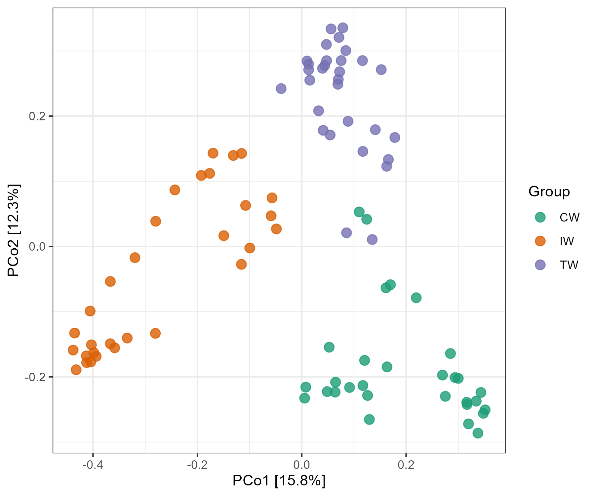

# Notes
We show some other important points here.

## `clone` function
R6 class has a special copy mechanism which is different from S3 and S4.
**If you want to copy an object completely, you should use the function `clone` instead of direct assignment.**

```{r, echo = TRUE}
# use clone to copy completely
t1 <- clone(dataset)
t2 <- clone(t1)
t2$sample_table <- NULL
identical(t2, t1)
```

```{r, echo = TRUE}
# this operation is usually unuseful, because changing t2 will also affect t1
t2 <- t1
t2$sample_table <- NULL
identical(t2, t1)
```


## `save` function

As an R6 object is an encapsulated environment, there is also another useful advantage, i.e. the data repeatability.
By applying R6 classes, the analyzed data in 'R Environment' can have fewest intermediate files.
It is also very convenient to save the analyzed data (i.e. object) to local computer with `save` function for back-up and communication with others.
This is the recommended way to send data for the test in 'Github Issues'.

```{r, echo = TRUE, eval = FALSE}
# save 'dataset' to local computer
save(dataset, file = "dataset.RData")
# load the data by others in their R project
load("dataset.RData")
```

The `dataset.RData` can be compressed into zip format for the upload in 'Github Issues' (https://github.com/ChiLiubio/microeco/issues).
If you want to use R to compress it, please run the following command.

```{r, echo = TRUE, eval = FALSE}
zip("test_data.zip", "dataset.RData")
```

The 'test_data.zip' is the final compressed file for the upload.
This saved object is only related with the package version when you save it and has no matter with the updated package when one load it again.
So it is repeatable.


## Github Issues

Please write the question/bug/suggestion in 'Github Issues' (https://github.com/ChiLiubio/microeco/issues).
Several points are recommended.

  + Before creating a 'New issue', please first skim through the 'Issues' including 'Open' and 'Closed'.
Then go ahead if no similar issue is found or the similar issue has not been addressed.

  + Please remember to provide your package version when writing a 'New issue'.

  + For the specific issue related with data, please provide the data and scripts for the reproduction.
If the data has not been published, please provide a toy example or a subset data as far as possible.

  + To provide the data, please use save function as previous part shows (https://chiliubio.github.io/microeco_tutorial/notes.html#save-function), 
and paste the compressed zip format data.

  + When pasting the script directly, please use \`\`\` at the beginning and end of scripts to mark the code block for the readability 
as \# can cause format chaos without code tag.


## change object
All the classes are set public, meaning that you can **change, add or remove the objects stored in them as you want**.

```{r, echo = TRUE}
# add a matrix you think useful
dataset$my_matrix <- matrix(1, nrow = 4, ncol = 4)
# change the information
dataset$sample_table %<>% .[, -2]
```

## group order
If the user want to reorder the groups, **assigning factors may be the simplest way.**

```{r, echo = TRUE, eval = FALSE}
data(dataset)
t1 <- trans_beta$new(dataset = dataset, measure = "bray")
t1$cal_ordination(ordination = "PCoA")
t1$plot_ordination(plot_color = "Group")
```

```{r, out.width = "500px", fig.align="center", echo = FALSE}

```

Then we assign factors to the 'Group' in sample_table of dataset.
We can find the changed group order in the legend and colors in the plot.

```{r, echo = TRUE, eval = FALSE}
dataset$sample_table$Group %<>% factor(., levels = c("IW", "TW", "CW"))
str(dataset$sample_table)
t1 <- trans_beta$new(dataset = dataset, measure = "bray")
t1$cal_ordination(ordination = "PCoA")
t1$plot_ordination(plot_color = "Group")
```

```{r, out.width = "500px", fig.align="center", echo = FALSE}
knitr::include_graphics("Images/Notes_group_order_2.png")
```


## add layers to plot
Most of the plots are generated by applying the ggplot2 package.
The important parameters in the plotting functions are configured according to our experience.
If the inner parameters can not enough, the user can add the layers to the plot like the following operation or
make the plot using the data (generally data.frame class) stored in the object.


```{r, echo = TRUE, eval = FALSE}
t1 <- trans_abund$new(dataset = dataset, taxrank = "Phylum", ntaxa = 10, groupmean = "Group")
g1 <- t1$plot_bar(others_color = "grey70", legend_text_italic = FALSE)
g1 + theme_classic() + theme(axis.title.y = element_text(size = 18))
```

```{r, out.width = "400px", fig.align="center", echo = FALSE}
knitr::include_graphics("Images/plot_bar_mean_classic.png")
```

## colors for more groups

Within the R microeco package, for the visualization of discrete data, 
`RColorBrewer::brewer.pal(8, "Dark2")` is employed as the default color generation option. 
As this palette encompasses merely eight unique colors, 
users who require additional variations or seek to switch to a different color palette are advised to utilize the `paletteer` package (https://r-charts.com/color-palettes/).

```{r, echo = TRUE, eval = FALSE}
install.packages("paletteer")
library("paletteer")
# examples
paletteer_d("RColorBrewer::Spectral")
paletteer_d("RColorBrewer::Set3")
paletteer_d("RColorBrewer::Paired")
paletteer_d("ggsci::nrc_npg")
paletteer_d("ggsci::default_aaas")
paletteer_d("ggsci::lanonc_lancet")
paletteer_d("ggsci::default_nejm")
paletteer_d("ggsci::category10_d3")
paletteer_d("ggthemes::Classic_10_Light")
paletteer_d("ggthemes::Classic_10_Medium")
paletteer_d("ggthemes::Classic_Cyclic")
# 20 color values
paletteer_d("ggsci::category20c_d3")
paletteer_d("ggsci::category20_d3")
paletteer_d("ggthemes::Classic_20")
```

```{r, echo = TRUE, eval = FALSE}
t1 <- trans_abund$new(dataset = dataset, taxrank = "Phylum", ntaxa = 10, groupmean = "Group")
t1$plot_bar(color_values = paletteer_d("ggthemes::Classic_10_Medium"))
t1 <- trans_abund$new(dataset = dataset, taxrank = "Phylum", ntaxa = 20, groupmean = "Group")
t1$plot_bar(color_values = paletteer_d("ggthemes::Classic_20"))
```

## customized data input

From v0.7.0, trans_alpha, trans_env and trans_venn classes can accept NULL dataset input for some customized usage of some functions in those classes.

```{r, echo = TRUE, eval = FALSE}
t1 <- trans_env$new()
t1 <- trans_alpha$new(dataset = NULL, group = NULL)
```


