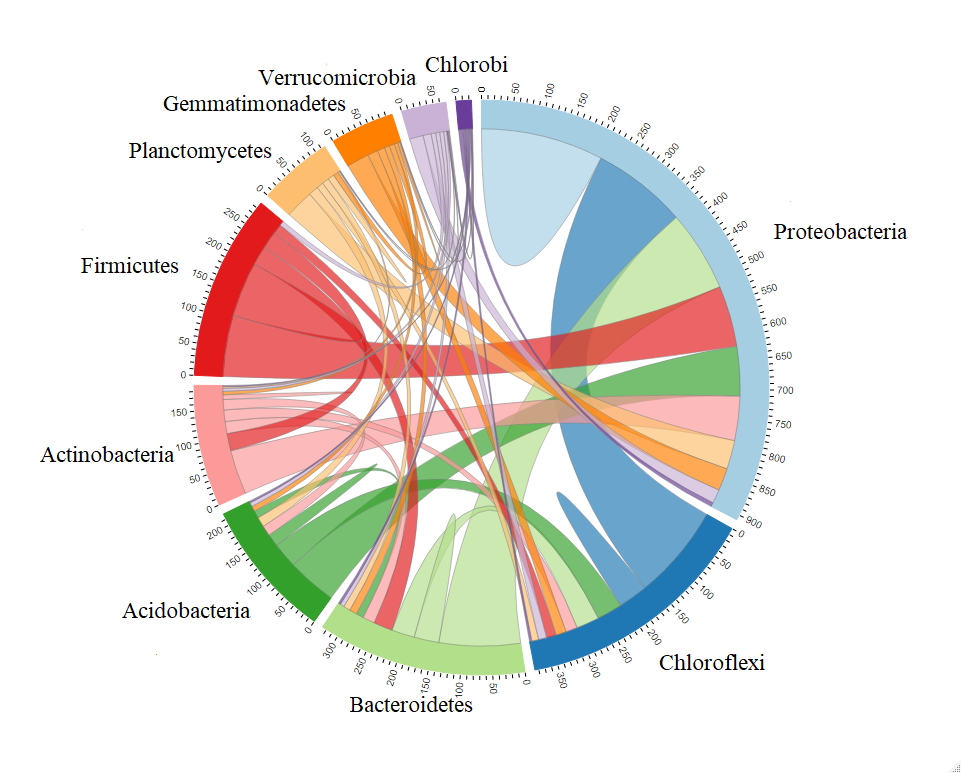
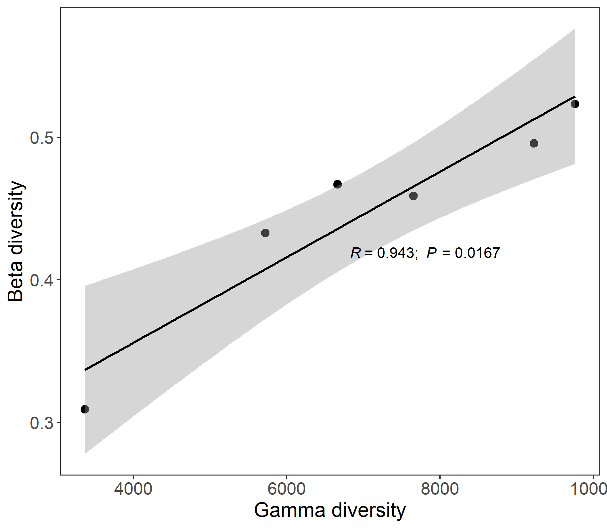

# mecodev package
The mecodev package (https://github.com/ChiLiubio/mecodev/) is designed to develop more classes for data analysis based on the microeco package.

## trans_rarefy
The class trans_rarefy in mecodev package can be used for the rarefaction and the following plotting to see whether 
the sequencing depth is enough to cover all the so-called species in the microbial community.


```{r, echo = TRUE, eval = FALSE}
library(microeco)
library(mecodev)
data(sample_info_16S)
data(otu_table_16S)
# set.seed is used to fix the random number generation to make the results repeatable
set.seed(123)
dataset <- microtable$new(sample_table = sample_info_16S, otu_table = otu_table_16S)
dataset$tidy_dataset()
# trans_rarefy class
t1 <- trans_rarefy$new(dataset, alphadiv = "Shannon", depth = c(0, 10, 50, 500, 2000, 4000, 6000, 8000))
t1$plot_rarefy(color_values = rep("grey", 100), show_point = TRUE, add_fitting = FALSE, show_legend = FALSE)
```

```{r, out.width = "550px", fig.align="center", echo = FALSE}
knitr::include_graphics("Images/plot_trans_rarefy.png")
```


## trans_convert
The class trans_convert provide several data transformation approaches for the microtable object.
The output is also a microtable object.

```{r, echo = TRUE, eval = FALSE}
data(dataset)
test1 <- trans_convert$new(dataset = dataset)
test2 <- test1$convert(method = "log")
# returned test2 is another transformed microtable object
```


## trans_netchord
The class trans_netchord is developed to sum and plot the links number from one taxa to another or in the same taxa in the network.
The input dataset must be a trans_network object.
Creating the trans_netchord object can sum the links (edge) number from one taxa to another or in the same taxa.
The function plot_sum_links() is used to show the result from the function cal_sum_links(). 
This is very useful to fast see how many nodes are connected between different taxa or within one taxa.
In terms of "Phylum" level in the tutorial, 
the function cal_sum_links() sum the linkages number from one Phylum to another Phylum or the linkages in the same Phylum.
So the numbers along the outside of the circular plot represent how many edges or linkages are related with the Phylum.
For example, in terms of Proteobacteria,
there are roughly total 900 edges associated with the OTUs in Proteobacteria, 
in which roughly 200 edges connect both OTUs in Proteobacteria and roughly 150 edges connect the OTUs from Proteobacteria with the OTUs from Chloroflexi.


```{r, echo = TRUE, eval = FALSE}
# Let's first create a network
data(sample_info_16S)
data(otu_table_16S)
data(taxonomy_table_16S)
dataset <- microtable$new(sample_table = sample_info_16S, otu_table = otu_table_16S, tax_table = taxonomy_table_16S)
dataset$tidy_dataset()
t1 <- trans_network$new(dataset = dataset, cal_cor = "WGCNA", taxa_level = "OTU", filter_thres = 0.0001, cor_method = "spearman")
t1$cal_network(p_thres = 0.01, COR_cut = 0.7)
# trans_netchord
test1 <- trans_netchord$new(dataset = t1, taxa_level = "Phylum")
# require chorddiag package (https://github.com/mattflor/chorddiag)
test1$plot_sum_links(plot_pos = TRUE, plot_num = 10)
```

```{r, out.width = "700px", fig.align="center", echo = FALSE}

```

## trans_ts

The class trans_ts is designed for the time series data analysis.
A commonly used approach for modeling microbial ecology for time series data is the generalized Lotka-Volterra (gLV) model, the classical predator-prey systems.
gLV models are based on ordinary differential equations that model the logistic growth of species; 
naturally capture predator-prey, amensalistic, and competitive interactions; and have been applied to study dynamics of microbial ecosystems.
More importantly, from a practical perspective, gLV models have been used for a range of applications including identifying potential probiotics
against pathogens, forecasting changes in microbial density, characterizing important community members (e.g., keystone species), 
and analyzing community stability (see [@Li_expectation_2019] and the references therein).
Currently, the biomass estimation and biological interaction prediction approaches are implemented based on the beem package [@Li_expectation_2019].
The example data 'gut_microb_ts' comes from the article [@Gibbons_twodynamic_2017].


```{r, echo = TRUE, eval = FALSE}
# R package beem should be first installed; see https://github.com/ChiLiubio/mecodev for installation steps
library(mecodev)
# load the example data in mecodev package; the input must be a microtable object
# There are several strict requirements on the sample_table; see the document of the class.
data("gut_microb_ts")
# generally, using filter_thres to filter the taxa with low abundance is crutial
# there are only 22 taxa in the example data, we use 0
t1 <- trans_ts$new(dataset = gut_microb_ts, filter_thres = 0)
# we use minimal 50 times for iteration
t1$cal_biomass(min_iter = 50)
# return t1$res_biomass and t1$res_param
# generate the inferred biological network
t1$cal_network()
# Now let's use trans_network class to add the modules
library(microeco)
t2 <- trans_network$new(dataset = gut_microb_ts, cal_cor = NA)
t2$res_network <- t1$res_network
# use cluster_optimal; as the default cluster_fast_greedy can not be used for the directed network
t2$cal_module(method = "cluster_optimal")
plot(t2$res_network)
```


## trans_gamma

The class trans_gamma is developed to explore the relationship between gamma diversity and beta diversity 
based on the methods from biogeographic studies[@Zhang_Local_2020].
Currently, the contents include the observed beta-gamma diversity relationship, simulated beta-gamma diversity relationship and the following plotting.
If the observed gamma diversity and beta diversity are significantly correlated,
species pool at regional scale (or maybe your defined scale, e.g., different treatments in the lab) can have large effect on the beta diversity.
Thus, species pool should be first considered to explain beta diversity patterns.
This class also provide simulation function to explore the relation between gamma diversity and beta diversity in the absence of any process
other than random sampling based on the species log-normal distribution.
We use the wetland data to show the observed beta-gamma diversity relationship.


```{r, echo = TRUE, eval = FALSE}
library(microeco)
library(mecodev)
# load the example data
data(sample_info_16S)
data(otu_table_16S)
test <- microtable$new(sample_table = sample_info_16S, otu_table = otu_table_16S)
test$tidy_dataset()
test$rarefy_samples(sample.size = 10000)
# then create trans_gamma object
test1 <- trans_gamma$new(dataset = test, group = "Type", method = "bray")
test1$cal_observed(sample_size = NULL)
test1$res_observed
# use Spearman correlation
test1$plot_observed(cor_method = "spearman")
```

```{r, out.width = "550px", fig.align="center", echo = FALSE}

```


Let's simulate the relation between gamma diversity and beta diversity in the absence of any process
other than random sampling based on the species log-normal distribution.

```{r, echo = TRUE, eval = FALSE}
# if you only run the simulation, dataset parameter is not necessary
test1 <- trans_gamma$new(method = "bray")
# use individul numbers at 200, 1000 and 2000, and hypothesize each species pool have 20 samples.
test1$cal_simulation(ncom = 20, ind_vect = c(200, 1000, 2000))
test1$plot_simulation(add_fitting = FALSE)
```


```{r, out.width = "600px", fig.align="center", echo = FALSE}
knitr::include_graphics("Images/plot_gamma_simu.png")
```


