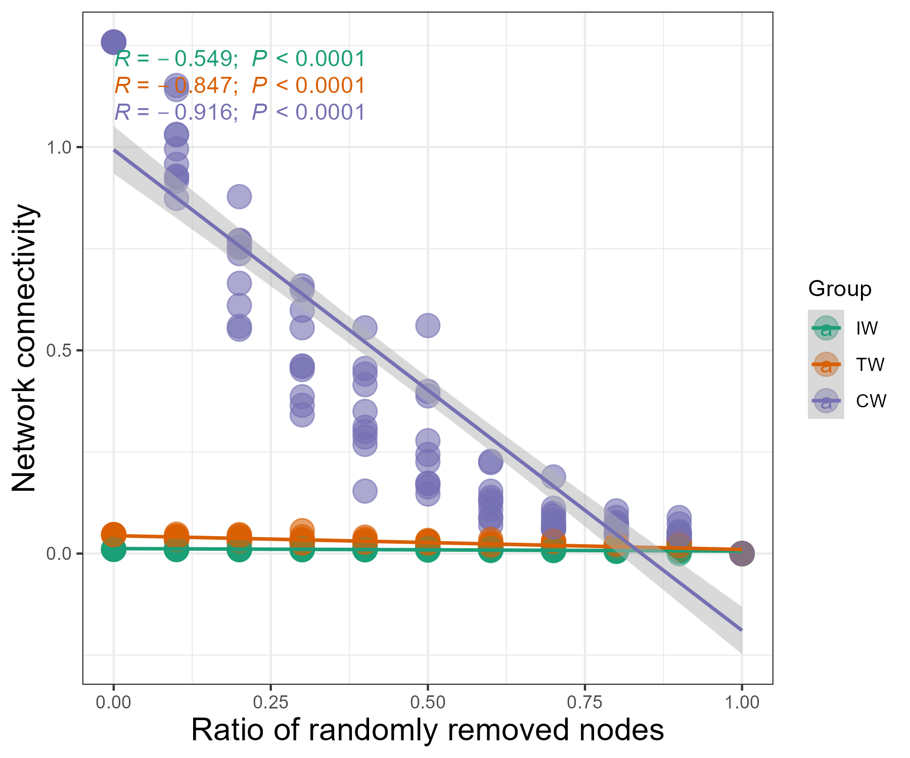

# meconetcomp package

To facilitate microbial co-occurrence network comparison, 
R package meconetcomp (https://github.com/ChiLiubio/meconetcomp) was developed.
The basic strategy is to use R list to put into all the trans_network objects and perform the following analysis.
The flow chart and following contents are adapted from the published article [@Liu_meconetcomp_2023].
For more details, please see the online paper (https://doi.org/10.1002/imt2.71).
To cite meconetcomp in publications use:

  Chi Liu, Chaonan Li, Yanqiong Jiang, Raymond Jianxiong Zeng, Minjie Yao, and Xiangzhen Li. 2023. 
  A guide for comparing microbial co-occurrence networks. iMeta. 2(1): e71.

The BibTeX in LaTeX and markdown is:

```
  @Article{meconetcomp_2023,
    title = {A guide for comparing microbial co-occurrence networks},
    author = {Liu, Chi and Li, Chaonan and Jiang, Yanqiong and Zeng, Raymond J. and Yao, Minjie and Li, Xiangzhen},
    year = {2023},
    journal = {iMeta},
    volume = {2},
    issue = {1},
    pages = {e71},
    doi = {10.1002/imt2.71},
    url = {https://doi.org/10.1002/imt2.71},
  }
```
 

```{r, out.width = "650px", fig.align="center", echo = FALSE}
knitr::include_graphics("Images/meconetcomp.png")
```

```{r, echo = TRUE, eval = FALSE}
# install the required packages
# aplot: one dependency of the trans_venn class of microeco package
# agricolae: for Duncan's new multiple range test
packages <- c("meconetcomp", "rgexf", "pheatmap", "aplot", "agricolae")
# Now check or install
for(x in packages){
	if(!require(x, character.only = TRUE)) {
		install.packages(x, dependencies = TRUE)
	}
}
```

```{r, echo = TRUE, eval = FALSE}
library(microeco)
library(meconetcomp)
# use pipe operator in magrittr package
library(magrittr)
library(igraph)
library(ggplot2)
theme_set(theme_bw())
# load soil amplicon sequencing dataset
data(soil_amp)
```

First reconstruct three correlation networks for the three groups 'IW', 'TW' and 'CW' as the example.

```{r, echo = TRUE, eval = FALSE}
# first create a list
soil_amp_network <- list()
# select samples of "IW" group
# use clone to get a deep copy of soil_amp (R6 object)
tmp <- clone(soil_amp)
# change sample_table directly
tmp$sample_table %<>% subset(Group == "IW")
# trim all files in the object
tmp$tidy_dataset()
# use filter_thres parameter to filter the feature with low relative abundance
tmp <- trans_network$new(dataset = tmp, cor_method = "spearman", filter_thres = 0.0005)
# COR_p_thres represents the p value threshold
# COR_cut denotes the correlation coefficient threshold
tmp$cal_network(COR_p_thres = 0.01, COR_cut = 0.6)
# put the network into the list
soil_amp_network$IW <- tmp
# select samples of "TW" group
tmp <- clone(soil_amp)
tmp$sample_table %<>% subset(Group == "TW")
tmp$tidy_dataset()
tmp <- trans_network$new(dataset = tmp, cor_method = "spearman", filter_thres = 0.0005)
tmp$cal_network(COR_p_thres = 0.01, COR_cut = 0.6)
soil_amp_network$TW <- tmp
# select samples of "CW" group
tmp <- clone(soil_amp)
tmp$sample_table %<>% subset(Group == "CW")
tmp$tidy_dataset()
tmp <- trans_network$new(dataset = tmp, cor_method = "spearman", filter_thres = 0.0005)
tmp$cal_network(COR_p_thres = 0.01, COR_cut = 0.6)
soil_amp_network$CW <- tmp
# Now we have the list soil_amp_network
```


## Network modularity for all networks

The function cal_module in meconetcomp package is designed to partition modules for all the networks in the list.

```{r, echo = TRUE, eval = FALSE}
soil_amp_network %<>% cal_module(undirected_method = "cluster_fast_greedy")
```

## Network topological attributes for all networks

we extracted all the res_network_attr tables in the networks and merged them into one final table by using cal_network_attr function in meconetcomp package.

```{r, echo = TRUE, eval = FALSE}
tmp <- cal_network_attr(soil_amp_network)
# tmp is a data.frame object
```

## Node and edge properties extraction for all networks

The get_node_table and get_edge_table functions of meconetcomp package can be used to directly extract node and edge properties for all the networks.
The return table is stored in each network object.

```{r, echo = TRUE, eval = FALSE}
soil_amp_network %<>% get_node_table(node_roles = TRUE) %>% get_edge_table
```

## Compare nodes across networks

The nodes in all the networks can be converted to a new microtable object by using the node_comp function of meconetcomp package.
Then, it is easy to analyse the nodes overlap with trans_venn class.

```{r, echo = TRUE, eval = FALSE}
# obtain the node distributions by searching the res_node_table in the object
tmp <- node_comp(soil_amp_network, property = "name")
# obtain nodes intersection
tmp1 <- trans_venn$new(tmp, ratio = "numratio")
g1 <- tmp1$plot_venn(fill_color = FALSE)
ggsave("soil_amp_node_overlap.pdf", g1, width = 7, height = 6)
# calculate jaccard distance to reflect the overall differences of networks
tmp$cal_betadiv(method = "jaccard")
tmp$beta_diversity$jaccard
```

## Compare edges across networks

The pipeline of studying edges overlap is similar with the above operations of nodes comparison.
The edge_comp function of meconetcomp package is used to convert edges distribution to a new microtable object.

```{r, echo = TRUE, eval = FALSE}
# get the edge distributions across networks
tmp <- edge_comp(soil_amp_network)
# obtain edges intersection
tmp1 <- trans_venn$new(tmp, ratio = "numratio")
g1 <- tmp1$plot_venn(fill_color = FALSE)
ggsave("soil_amp_edge_overlap.pdf", g1, width = 7, height = 6)
# calculate jaccard distance
tmp$cal_betadiv(method = "jaccard")
tmp$beta_diversity$jaccard
```

## Extract overlapped edges of networks to a new network

Then we extracted the subset of edges according to the intersections of edges across networks,
which can be accomplished with the subset_network function in meconetcomp package.


```{r, echo = TRUE, eval = FALSE}
# first obtain edges distribution and intersection
tmp <- edge_comp(soil_amp_network)
tmp1 <- trans_venn$new(tmp)
# convert intersection result to a microtable object
tmp2 <- tmp1$trans_comm()
# extract the intersection of all the three networks ("IW", "TW" and "CW")
# please use colnames(tmp2$otu_table) to find the required name
Intersec_all <- subset_network(soil_amp_network, venn = tmp2, name = "IW&TW&CW")
# Intersec_all is a trans_network object
# for example, save Intersec_all as gexf format
Intersec_all$save_network("Intersec_all.gexf")
```

## Compare phylogenetic distances of paired nodes in edges

The edge_node_distance class (R6 class) in meconetcomp package is designed to compare the distribution of distance values of paired nodes in all the edges across networks.
Here, we indicated the phylogenetic distance distributions and performed the differential test among networks.
The input parameter dis_matrix can be any symmetric matrix with both the column names and row names (i.e. feature names).
So it is also feasible to compare other properties of features, such as Levin's niche overlap.


```{r, echo = TRUE, eval = FALSE}
# filter useless features to speed up the calculation
node_names <- unique(unlist(lapply(soil_amp_network, function(x){colnames(x$data_abund)})))
filter_soil_amp <- microeco::clone(soil_amp)
filter_soil_amp$otu_table <- filter_soil_amp$otu_table[node_names, ]
filter_soil_amp$tidy_dataset()
# obtain phylogenetic distance matrix
phylogenetic_distance_soil <- as.matrix(cophenetic(filter_soil_amp$phylo_tree))
# use both the positive and negative labels
tmp <- edge_node_distance$new(network_list = soil_amp_network, dis_matrix = phylogenetic_distance_soil, label = c("+", "-"))
tmp$cal_diff(method = "anova")
# visualization
g1 <- tmp$plot(add = "none", add_sig = TRUE, add_sig_text_size = 5) + ylab("Phylogenetic distance")
ggsave("soil_amp_phylo_distance.pdf", g1, width = 7, height = 6)

# show different modules with at least 10 nodes and positive edges
tmp <- edge_node_distance$new(network_list = soil_amp_network, dis_matrix = phylogenetic_distance_soil, 
	label = "+", with_module = TRUE, module_thres = 10)
tmp$cal_diff(method = "anova")
g1 <- tmp$plot(add = "none", add_sig = TRUE, add_sig_text_size = 5) + ylab("Phylogenetic distance")
ggsave("soil_amp_phylo_distance_modules.pdf", g1, width = 8, height = 6)
```


## Compare node sources of edges across networks

To know which taxa constitute the nodes in edges is important in understanding species co-occurrence patterns and answering ecological questions.
In this part, as an instance, we used edge_tax_comp function of meconetcomp package to get the sums of node sources (at Phylum level) in the positive edges.
In other words, how many linked nodes of positive edges come from different phyla or the same phyla.
Then, to make the results comparable, the ratio was calculated with the positive edge number as denominator.

```{r, echo = TRUE, eval = FALSE}
soil_amp_network_edgetax <- edge_tax_comp(soil_amp_network, taxrank = "Phylum", label = "+", rel = TRUE)
# filter the features with small number
soil_amp_network_edgetax <- soil_amp_network_edgetax[apply(soil_amp_network_edgetax, 1, mean) > 0.01, ]
# visualization
g1 <- pheatmap::pheatmap(soil_amp_network_edgetax, display_numbers = TRUE)
ggsave("soil_amp_edge_tax_comp.pdf", g1, width = 7, height = 7)
```

## Compare topological properties of sub-networks

In this part, we extracted the sub-networks according to the OTU existed in each sample of soil_amp dataset for each network in soil_amp_network.
Then, the global topological properties of sub-networks were calculated.
All the operations were encapsulated into the subnet_property function of meconetcomp package.

```{r, echo = TRUE, eval = FALSE}
# calculate global properties of all sub-networks
tmp <- subnet_property(soil_amp_network)
# then prepare the data for the correlation analysis
# use sample names (second column) as rownames
rownames(tmp) <- tmp[, 2]
# delete first two columns (network name and sample name)
tmp <- tmp[, -c(1:2)]
# load ready-made abiotic factor and diversity table
data(soil_measure_diversity)
tmp1 <- trans_env$new(dataset = soil_amp, add_data = soil_measure_diversity)
tmp1$cal_cor(use_data = "other", by_group = "Group", add_abund_table = tmp, cor_method = "spearman")
# generate correlation heatmap
g1 <- tmp1$plot_cor()
ggsave("soil_amp_subnet_property.pdf", g1, width = 11, height = 5)
```

## Robustness of network

The robustness analysis is implemented in the robustness class based on 
several edge and node removal strategies and robustness measures [@Bellingeri_comprem_2020; @LiuJing_comprobust_2017].
For the details of each method, please refer to the help document with the command `?robustness`.
Available options of `remove_strategy` parameter include "edge_rand" (edges are randomly removed),
"edge_strong" (edges are removed in decreasing order of weight), "node_rand" (nodes are removed randomly),
"node_hub" (node hubs are randomly removed, including network hubs and module hubs),
"node_degree_high" (nodes are removed in decreasing order of degree), etc.
Available options of `measure` include "Eff", "Eigen" and "Pcr".
"Eff" denotes the network efficiency [@LiuJing_comprobust_2017]. 
The average efficiency of the network is defined:
$$ Eff = \frac{1}{N(N - 1)} \sum_{i \neq j \in G}\frac{1}{d(i, j)} $$
where N is the total number of nodes and $d(i,j)$ is the shortest path between node $i$ and node $j$. 
When the weight is found in the edge attributes, $d(i,j)$ denotes the weighted shortest path between node $i$ and node $j$.
"Eigen" represents the natural connectivity.
The natural connectivity can be regarded as an average eigenvalue that changes strictly monotonically with the addition or deletion of edges. 
It is defined:
$$ \bar{\lambda} = \ln(\frac{1}{N} \sum_{i=1}^{N} e^{\lambda~i~}) $$
where $\lambda~i~$ is the $i$th eigenvalue of the graph adjacency matrix. The larger the value of $\bar{\lambda}$ is, the more robust the network is.
"Pcr" means the critical removal fraction of vertices (edges) for the disintegration of networks.
This is a robustness measure based on random graph theory.
The critical fraction against random attacks is labeled as $P_{c}^r$. It is defined:
$$ P_{c}^r = 1 - \frac{1}{\frac{\langle k^2 \rangle}{\langle k \rangle} - 1} $$
where $\langle k \rangle$ is the average nodal degree of the original network, and $\langle k^2 \rangle$ is the average of square of nodal degree. 


```{r, echo = TRUE, eval = FALSE}
tmp <- robustness$new(soil_amp_network, remove_strategy = c("edge_rand", "edge_strong", "node_rand", "node_degree_high"), 
	remove_ratio = seq(0, 0.99, 0.1), measure = c("Eff", "Eigen", "Pcr"), run = 10)
View(tmp$res_table)
View(tmp$res_summary)
tmp$plot(linewidth = 1)
```

```{r, out.width = "700px", fig.align="center", echo = FALSE}
knitr::include_graphics("Images/meconetcomp_robustness.png")
```

We can also extract the result for a specified metric and perform the visualization, such as the scatter plot.

```{r, echo = TRUE, eval = FALSE}
tmp1 <- tmp$res_table %>% .[.$remove_strategy == "node_rand" & .$measure == "Eigen", ]

t1 <- trans_env$new(dataset = NULL, add_data = tmp1)
t1$dataset$sample_table <- t1$data_env
t1$plot_scatterfit(x = "remove_ratio", y = "value", type = "cor", group = "Network") + 
	xlab("Ratio of randomly removed nodes") + ylab("Network connectivity") + theme(axis.title = element_text(size = 15))

# another way; for microeco version >= 1.8.0
t1$plot_scatterfit(x = tmp1$remove_ratio, y = tmp1$value, type = "cor", group = tmp1$Network)
```

```{r, out.width = "550px", fig.align="center", echo = FALSE}

```


## Vulnerability of nodes

From v0.4.0, the vulnerability of nodes can be calculated with the `vulnerability` function.
The vulnerability of one node is defined as the efficiency of network after removing this targeted node [@Yuan_Climatewarm_2021].
For the details, please swith to the help document.


```{r, echo = TRUE, eval = FALSE}
vul_table <- vulnerability(soil_amp_network)
View(vul_table)
```


## Cohesion

The cohesion is a method for quantifying the connectivity of microbial communities [@Herren_Cohesion_2017].
From v0.5.0, the cohesion is implemented in cohesionclass.
It is defined:
$$   C_{j}^{pos} = \sum_{i=1}^{n} a_{i} \cdot \bar{r_{i}}_{|r>0}   $$
$$   C_{j}^{neg} = \sum_{i=1}^{n} a_{i} \cdot \bar{r_{i}}_{|r<0}   $$
where $C_{j}^{pos}$ is the positive cohesion, and $C_{j}^{neg}$ is the negative cohesion.
$a_{i}$ is the relative abundance of species $i$ in sample $j$.
$\bar{r_{i}}_{|r>0}$ denotes the mean weight (correlation coefficient, interaction strength) of all the edges (related with species $i$) with positive association.


```{r, echo = TRUE, eval = FALSE}
t1 <- cohesionclass$new(soil_amp_network)
View(t1$res_list$sample)
View(t1$res_list$feature)
t1$cal_diff(measure = "r_pos", method = "anova")
t1$plot()

# without statistical result
t1 <- cohesionclass$new(soil_amp_network)
t1$plot(measure = "c_neg")
```


