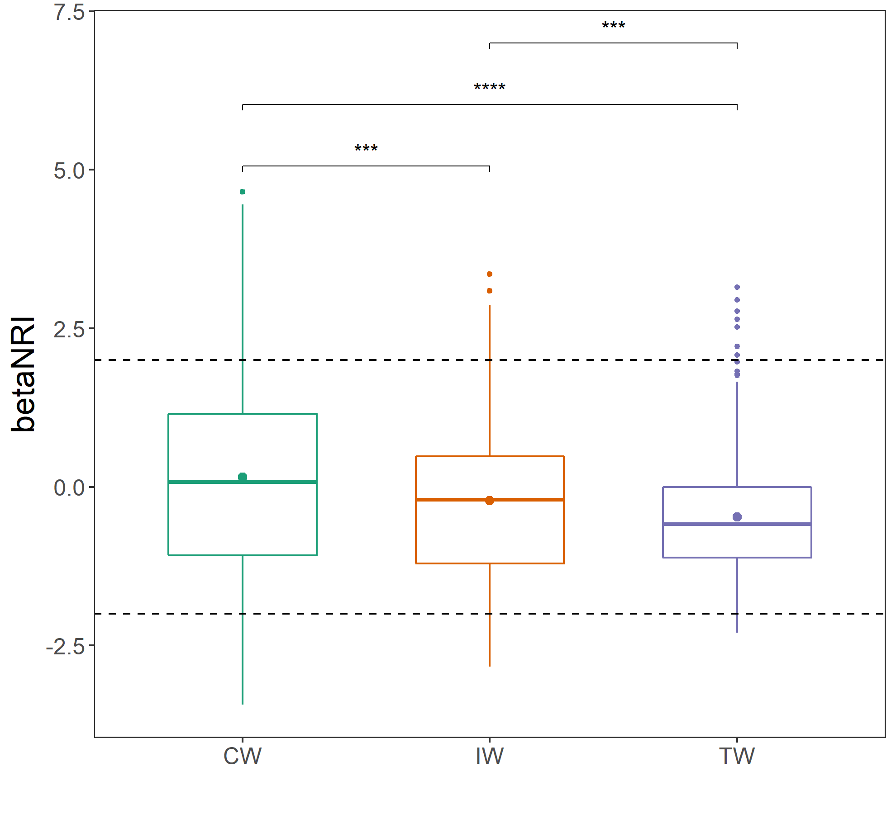

# Other examples

We've gathered a few tricks to make several issues easier to solve.
We encourage users to contribute some unique, special or helpful examples inspired by the packages.


## Custom taxa order in bar plot

The flexibility of the package design can be reflected on many aspects.
In some cases, it is possible to tactfully handle some particular challenges.
For example, Dr.Jarrod contribute a cool answer to the question that how to use custom taxa and the order in bar plot by modifying the data inside the object.
This is a discussion topic in microeco Discussions (https://github.com/ChiLiubio/microeco/discussions/45).


## tidy_taxonomy function

The taxonomic classification with standard prefix is very important for some analyses,
e.g. taxonomic abundance plotting and biomarker finding.
The `tidy_taxonomy` function in microeco package is designed to make the taxa having standard prefix.
See those Issues with the detailed examples: (https://github.com/ChiLiubio/microeco/issues/32), (https://github.com/ChiLiubio/microeco/issues/22),
(https://github.com/ChiLiubio/microeco/issues/231), (https://github.com/ChiLiubio/microeco/issues/254) and (https://github.com/ChiLiubio/microeco/issues/338).


## Show the abundance of unknown taxa

In the `trans_abund` class, the default operation can filter the unclassified taxa, such as those with 'g__'.
Sometimes, these unknown taxa may be useful to represent uncultured species.
Under the circumstance, the abundance of unknown taxa can be used to show the ratio of unknown taxa in the system.
Please see the solution in this topic (https://github.com/ChiLiubio/microeco/issues/165).


## Question of prefix in the taxa

The prefix of taxa in taxonomic table may affect the following performance of plotting, e.g. text in legend.
Please see those Issues (https://github.com/ChiLiubio/microeco/issues/32), (https://github.com/ChiLiubio/microeco/issues/7) 
and (https://github.com/ChiLiubio/microeco/issues/15).


## The use of phylogenetic tree

One of Issues referred to the basic use of phylogenetic tree in the microeco package (https://github.com/ChiLiubio/microeco/issues/33).


## trans_norm

The class trans_norm in microeco package (>= 1.6.0) provides several data normalization or transformation approaches for the microtable object or data.frame object.
The format of output is same with the input.
For the details and references of the approaches, please refer to the help document of the class with the command `?trans_norm`.


```{r, echo = TRUE, eval = FALSE}
library(microeco)
data(dataset)
t1 <- trans_norm$new(dataset = dataset)
# Geometric mean of pairwise ratios
d1 <- t1$norm(method = "GMPR")
# Centered log-ratio normalization
d2 <- t1$norm(method = "clr")
# Robust centered log-ratio normalization
d2 <- t1$norm(method = "rclr")
# d2 is another microtable object
# Cumulative sum scaling normalization
d2 <- t1$norm(method = "CCS")
# Total sum scaling, dividing counts by the sequencing depth
d2 <- t1$norm(method = "TSS")

# log transformation
d3 <- t1$norm(method = "log")
```


## Mantel test + Correlation heatmap

Sometimes, mantel test results and correlations of environmental factors are visualized together to deliver more information.
In this example, we show how to extend the mantel test results from `trans_env` class with the package ggcor.
Please install `ggcor` package according to the document (https://chiliubio.github.io/microeco_tutorial/intro.html#github-packages).

```{r, echo = TRUE, eval = FALSE}
# prepare data
library(microeco)
library(magrittr)
data(dataset)
data(env_data_16S)
dataset$sample_table <- data.frame(dataset$sample_table, env_data_16S[rownames(dataset$sample_table), ])
# extract two phyla to show the steps
d1 <- clone(dataset)
d1$tax_table <- d1$tax_table[d1$tax_table$Phylum == "p__Proteobacteria", ]
d1$tidy_dataset()
d1$cal_betadiv()
d2 <- clone(dataset)
d2$tax_table <- d2$tax_table[d2$tax_table$Phylum == "p__Bacteroidetes", ]
d2$tidy_dataset()
d2$cal_betadiv()
# first perform mantel test
t1 <- trans_env$new(dataset = d1, env_cols = 8:15)
t1$cal_mantel(use_measure = "bray", partial_mantel = TRUE)
t2 <- trans_env$new(dataset = d2, env_cols = 8:15)
t2$cal_mantel(use_measure = "bray", partial_mantel = TRUE)
# extract a part of the results 
x1 <- data.frame(spec = "Proteobacteria", t1$res_mantel) %>% .[, c(1, 3, 6, 8)]
x2 <- data.frame(spec = "Bacteroidetes", t2$res_mantel) %>% .[, c(1, 3, 6, 8)]
# rename columns
colnames(x1) <- colnames(x2) <- c("spec", "env", "r", "p.value")
# generate interval data
x1 %<>% dplyr::mutate(rd = cut(r, breaks = c(-Inf, 0.3, 0.6, Inf), labels = c("< 0.3", "0.3 - 0.6", ">= 0.6")),
	pd = cut(p.value, breaks = c(-Inf, 0.01, 0.05, Inf), labels = c("< 0.01", "0.01 - 0.05", ">= 0.05")))
x2 %<>% dplyr::mutate(rd = cut(r, breaks = c(-Inf, 0.3, 0.6, Inf), labels = c("< 0.3", "0.3 - 0.6", ">= 0.6")),
	pd = cut(p.value, breaks = c(-Inf, 0.01, 0.05, Inf), labels = c("< 0.01", "0.01 - 0.05", ">= 0.05")))

# cobine two tables
plot_table <- rbind(x1, x2)
# install ggcor following the steps (https://chiliubio.github.io/microeco_tutorial/intro.html#github-packages)
library(ggplot2)
library(ggcor)
set_scale()

g1 <- quickcor(t1$data_env, type = "upper", cor.test = TRUE, show.diag = FALSE) +
    geom_square() +
	geom_mark(sig.thres = 0.05, markonly = TRUE, color = "black", size = 6) +
    anno_link(aes(colour = pd, size = rd), data = plot_table) +
    scale_size_manual(values = c(0.5, 1.5, 3)) +
    scale_colour_manual(values = c("#D95F02", "#1B9E77", "#A2A2A288")) +
    guides(size = guide_legend(title = "Mantel's r", override.aes = list(colour = "grey35"), order = 2),
           colour = guide_legend(title = "Mantel's p", override.aes = list(size = 3), order = 1),
           fill = guide_colorbar(title = "Pearson's r", order = 3))

g1
```

```{r, out.width = "650px", fig.align="center", echo = FALSE}
knitr::include_graphics("Images/plot_env_mantel_ggcor.png")
```


## PCoA + boxplot

In the sections involving trans_venn and trans_env classes, 
we mentioned some combination graphs generated based on the `aplot` package. 
Here, we continue to use the `aplot` and `microeco` packages to demonstrate how to add boxplots of coordinate scores to PCoA graphs. 
Similar combination graphs can be easily manipulated, so we no longer include this type of visualization in the plotting functions of ordination methods. 
Firstly, we use `trans_beta` class to compute PCoA, then perform differential test based on the `cal_diff` function in `trans_env` class.

```{r, echo = TRUE, eval = FALSE}
library(microeco)
library(magrittr)
library(ggplot2)
library(aplot)
theme_set(theme_bw())
data(dataset)
# PCoA
t1 <- trans_beta$new(dataset = dataset, group = "Group", measure = "bray")
t1$cal_ordination(method = "PCoA")
# extract the axis scores
tmp <- t1$res_ordination$scores
# differential test with trans_env class
t2 <- trans_env$new(dataset = dataset, add_data = tmp[, 1:2])
# 'KW_dunn' for non-parametric test
t2$cal_diff(group = "Group", method = "anova")
```

Then, employ the plotting functions in `t1` and `t2` objects for visualization.

```{r, echo = TRUE, eval = FALSE}
p1 <- t1$plot_ordination(plot_color = "Group", plot_shape = "Group", plot_type = c("point", "ellipse"))
# groups order in p2 is same with p1; use legend.position = "none" to remove redundant legend
p2 <- t2$plot_diff(measure = "PCo1", add_sig = T) + theme_bw() + coord_flip() + 
	theme(legend.position = "none", axis.title.x = element_blank(), axis.text.y = element_blank(), axis.ticks.y = element_blank())
p3 <- t2$plot_diff(measure = "PCo2", add_sig = T) + theme_bw() + 
	theme(legend.position = "none", axis.title.y = element_blank(), axis.text.x = element_blank(), axis.ticks.x = element_blank())
# height of the upper figure and width of the right-hand figure are both 0.2-fold of the main figure
g <- p1 %>% insert_top(p2, height = 0.2) %>% insert_right(p3, width = 0.2)
g
```

```{r, out.width = "650px", fig.align="center", echo = FALSE}

```


At this point, 
we notice that the horizontal axis of the upper figure and the vertical axis of the right-hand figure do not correspond precisely with those of the main figure. 
Therefore, if we proceed with these graphs, 
the axis ticks of the upper and right-hand figures should be kept. 
If the user requires complete correspondence of the ticks, 
further control over the coordinate axes should be implemented. 
Here, we manually control the coordinate range.

```{r, echo = TRUE, eval = FALSE}
# use 1.4-fold of the scores as axis ranges
x_lim <- range(tmp[, 1]) * 1.4
y_lim <- range(tmp[, 2]) * 1.4
# limit x and y axis without any extension
p1 <- p1 + scale_y_continuous(limits = y_lim, expand = c(0, 0)) + 
	scale_x_continuous(limits = x_lim, expand = c(0, 0))
# limit x axis of upper figure (it's y axis when flipped)
p2 <- p2 + scale_y_continuous(limits = x_lim, expand = c(0, 0))
# limit y axis of right-hand figure
p3 <- p3 + scale_y_continuous(limits = y_lim, expand = c(0, 0))
g <- p1 %>% insert_top(p2, height = 0.2) %>% insert_right(p3, width = 0.2)
g
```

Now, the ticks of the coordinate axes fully correspond, and we may selectively remove the ticks on the upper and right-hand figures.

```{r, echo = TRUE, eval = FALSE}
p2 <- p2 + theme(axis.text.x = element_blank(), axis.ticks.x = element_blank())
p3 <- p3 + theme(axis.text.y = element_blank(), axis.ticks.y = element_blank())
g <- p1 %>% insert_top(p2, height = 0.2) %>% insert_right(p3, width = 0.2)
g
# save g to computer
ggsave("test1.pdf", g, width = 7, height= 6)
```

```{r, out.width = "650px", fig.align="center", echo = FALSE}
knitr::include_graphics("Images/Other_PCoA_boxplot2.png")
```


## FAPROTAX + differential test

In the `trans_func` section, we showed an example of correlations between the abundances of OTUs with the traits from FAPROTAX database and environmental factors.
Now, we go ahead and use `trans_diff` class to demonstrate the differential test of the abundances of OTUs with the traits across groups.

```{r, echo = TRUE, eval = FALSE}
library(microeco)
data(dataset)
t1 <- trans_func$new(dataset)
t1$cal_spe_func(prok_database = "FAPROTAX")
t1$cal_spe_func_perc(abundance_weighted = TRUE)
# it is better to clone a dataset
tmp_mt <- clone(dataset)
# transpose res_spe_func_perc to be a data.frame like taxonomic abundance
tmp <- as.data.frame(t(t1$res_spe_func_perc), check.names = FALSE)
# assign the table back to taxa_abund list for further analysis
tmp_mt$taxa_abund$func <- tmp
# select the "func" in taxa_abund list in trans_diff
t2 <- trans_diff$new(dataset = tmp_mt, method = "anova", group = "Group", taxa_level = "func")
t2$plot_diff_abund(add_sig = T) + ggplot2::ylab("Relative abundance (%)")
```

## RDA results output

In some analyses, it is often necessary to preserve intermediate files of various analysis results, 
and not all files are in the data.frame format. 
For example, in RDA analysis, the `res_ordination_R2` generated by `cal_ordination` function is a numeric vector, 
and the `res_ordination_envfit` generated by the `cal_ordination_envfit` function is of envfit class. 
For those outputs, we can utilize the `capture.output` function to redirect the contents displayed in the dialogue box into a file.

```{r, echo = TRUE, eval = FALSE}
library(microeco)
data(dataset)
data(env_data_16S)
t1 <- trans_env$new(dataset = dataset, add_data = env_data_16S[, 4:11])
t1$cal_ordination(method = "RDA", taxa_level = "Genus")
# get the significance of the terms
t1$cal_ordination_anova()
# fit factors onto the ordination to get R2 for each factor
t1$cal_ordination_envfit()
t1$trans_ordination(adjust_arrow_length = TRUE)
g1 <- t1$plot_ordination(plot_color = "Group", plot_shape = "Group")
ggplot2::ggsave("RDA.pdf", g1, width = 8, height = 6.5)
# use capture.output to save output
capture.output(t1$res_ordination_R2, file = "RDA_R2.txt")
capture.output(t1$res_ordination_envfit, file = "RDA_envfit.txt")
# save data.frame objects
write.table(t1$res_ordination_terms, "RDA_anova_termsig.txt", sep = "\t")
write.table(t1$res_ordination_axis, "RDA_anova_axissig.txt", sep = "\t")
write.table(t1$res_ordination_trans$df_sites, "RDA_axis_sample.txt", sep = "\t")
write.table(t1$res_ordination_trans$df_arrows, "RDA_axis_term.txt", sep = "\t")
write.table(t1$res_ordination_trans$df_arrows_spe, "RDA_axis_taxa.txt", sep = "\t")
```


## betaNRI/betaNTI for each group

Sometimes, if you want to perform betaNRI/betaNTI for each group individually (one group is considered one species pool),
you should calculate the index for each group, respectively.

```{r, echo = TRUE, eval=FALSE}
library(ggplot2)
library(microeco)
# we create a list to store the trans_nullmodel results.
sesbeta_each <- list()
group_col <- "Group"
all_groups <- unique(dataset$sample_table[, group_col])
# calculate for each group, respectively
for(i in all_groups){
	# like the above operation, but need provide 'group' and 'select_group'
	test <- trans_nullmodel$new(dataset, group = group_col, select_group = i, filter_thres = 0.0005)
	test$cal_ses_betampd(runs = 500, abundance.weighted = TRUE)
	sesbeta_each[[i]] <- test$res_ses_betampd
}
# merge and reshape to generate one symmetrical matrix
test <- lapply(sesbeta_each, reshape2::melt) %>% 
	do.call(rbind, .) %>%
	reshape2::dcast(., Var1~Var2, value.var = "value")
rownames(test) <- test[, 1]
test <- test[, -1, drop = FALSE]
# like the above operation
dataset$beta_diversity[["betaNRI"]] <- test
t2 <- trans_beta$new(dataset = dataset, group = "Group", measure = "betaNRI")
t2$cal_group_distance()
# statistical analysis
t2$cal_group_distance_diff(method = "wilcox")
g1 <- t2$plot_group_distance(boxplot_add = "mean")
g1 + geom_hline(yintercept = -2, linetype = 2) + geom_hline(yintercept = 2, linetype = 2)
```

```{r, out.width = "550px", fig.align="center", echo = FALSE}

```


