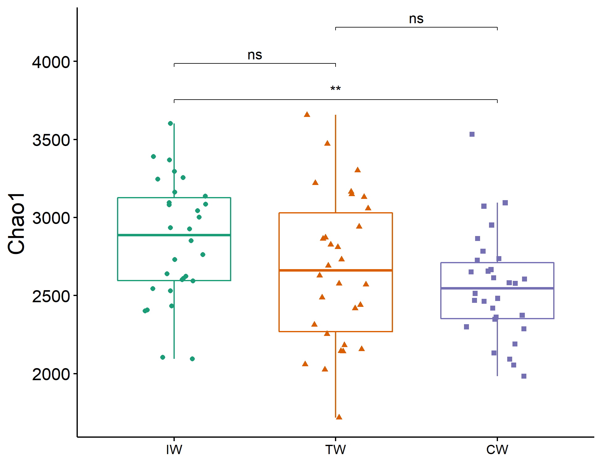

--- 
title: "microeco: an R package for data mining in microbial community ecology"
author: "Chi Liu, Felipe Mansoldo, Chenhao Li, Yang Cao, Jarrod J. Scott, Alane B. Vermelho, Xiangzhen Li, Minjie Yao"
date: "`r Sys.Date()`"
site: bookdown::bookdown_site
output: bookdown::gitbook
documentclass: book
bibliography: [book.bib, packages.bib]
biblio-style: apalike
link-citations: yes
github-repo: rstudio/bookdown-demo
description: "The tutorial for microeco package"
---

# Background

　R language [@R-base] and its packages ecosystem are wonderful tools for data analysis.
In microbial community ecology field, many packages can be used for the data analysis, 
such as vegan[@Jari_vegan_2019], ape[@Paradis_ape_2018] and picante[@Picante_Kembel_2010].
However, with the development of the high-throughput sequencing techniques,
the increasing data amount and complexity make the data mining a challenge.
There have been some R packages created for the statistics and visualization in microbial community ecology, such as phyloseq[@Mcmurdie_phyloseq_2013],
microbiome (https://github.com/microbiome/microbiome), microbiomeSeq (http://www.github.com/umerijaz/microbiomeSeq), 
ampvis2 (https://madsalbertsen.github.io/ampvis2/reference/index.html), MicrobiomeR(https://github.com/vallenderlab/MicrobiomeR),
theseus[@Price_theseus_2018], rANOMALY[@Theil_rANOMALY_2021], 
MicrobiomeExplorer[@Reeder_MicrobiomeExplorer_2021],
tidyMicro[@Carpenter_tidyMicro_2021] 
and so on.
However, we lack a flexible, comprehensive and modularized R package to analyze and manage the data.
So we create the microeco R package[@Liu_microeco_2021] for this goal (https://github.com/ChiLiubio/microeco).
Besides, we also develop the file2meco package (https://github.com/ChiLiubio/file2meco) for the data input from other tools easily
and mecodev package (https://github.com/ChiLiubio/mecodev) for some extending approaches in the area.


<!--chapter:end:index.Rmd-->

# Introduction {#intro}

The microeco package has several advantages compared to other packages in R.
The main goal of developing this package is to help users analyse communtiy ecology data fast.
So a series of commonly-used approaches are implemented.
Some new methods are in active development.
To facilitate the data mining, the whole structure of microeco package are modularized to
make users conveniently remember, search and use.
It is notable that, beside the demonstration in the tutorial, users can also save the intermediate files in each object and
apply those files to other tools according to the format requirement.
Main files stored in the objects of microeco package is the commonly used data.frame format.
So the intermediate and result files are easily saved, modified and used for other tools in microbial ecology.


## Features
  + R6 Class; fast, flexible and modularized
  + Taxa abundance plotting
  + Venn diagram
  + Alpha diversity
  + Beta diversity
  + Differential abundance analysis
  + Environmental data analysis
  + Null model analysis
  + Network analysis
  + Functional analysis


## R6 Class

All the classes in microeco package depend on the R6 class [@R6_Winston]. 
R6 uses the encapsulated object-oriented programming paradigm, 
which means that R6 is a profoundly different OO system from S3 and S4 because it is built on encapsulated objects, rather than generic functions. 
If you are interested in the class feature, read more from 'Advanced R' book.

  + A generic is a regular function, so it lives in the global namespace. An R6 method belongs to an object so it lives in a local namespace. 
This influences how we think about naming. The methods belong to objects, not generics, and you call them like object$method().

  + R6’s reference semantics allow methods to simultaneously return a value and modify an object.
  
  + Every R6 object has an S3 class that reflects its hierarchy of R6 class.

## Help

The use of help documents in the microeco package may be a little different from other packages we often used.
If you wish to see one of help documents of functions, you should search the name of the class (not the name of the function) 
and click the link of the function.

```{r, echo = TRUE}
# first install microeco, see https://github.com/ChiLiubio/microeco
# load package microeco
library(microeco)
```

```{r, echo = TRUE, eval = FALSE}
# this can show all the functions and the detailed descriptions in the microtable class
?microtable
```


<!--chapter:end:01-intro.Rmd-->

# basic class

## microtable class

　Many tools can be used for the bioinformatic analysis, such as QIIME[@Caporaso_QIIME_2010], usearch(https://www.drive5.com/usearch/), 
mothur[@Schloss_Introducing_2009], and RDP(http://rdp.cme.msu.edu/).
Although the format of results may be different from various tools, the main files can be classified into the following parts:
(1) OTU or ASV table, i.e. the species-sample abundance table; 
(2) taxonomy table, the taxonomy assignments information table;
(3) phylogenetic tree;
(4) representative sequences.
(5) Generally, it is useful to create a detailed sample information table to store all the sample information, 
including the environmental data and the missing values (NA).

　The microtable class is the basic class and designed to store the basic data for all the downstream analysis in the microeco package.
At least, the OTU table (i.e. species-sample abundance table) should be provided to create microtable object.
Thus, the microtable class can recognize the sample information table is missing and create a default sample table according to
the sample names of otu_table.
To make the file reading more convenient,
we also build another R package file2meco (https://github.com/ChiLiubio/file2meco) to read the output files of some tools into microtable object.
Currently, those tools/softwares include not only commonly-used QIIME [@Caporaso_QIIME_2010] and QIIME2[@Bolyen_Reproducible_2019], 
but also some metagenomic tools, such as HUMAnN [@Franzosa_Species_2018].
In this tutorial, we use the data inside the package microeco to show some operations.

　The 16S rRNA sequencing results in the example data of the package is used to show the main part of the tutorial.
This dataset is the 16S rRNA gene Miseq sequencing results of wetland soils in China published by An et al.[@An_Soil_2019], 
who surveyed soil bacterial communities in Chinese inland wetlands (IW), 
coastal wetland (CW) and Tibet plateau wetlands (TW) using 16S rRNA gene amplicon sequencing method.
These wetlands include both saline and non-saline samples.
The sample information table have 4 columns: "SampleID", "Group", "Type" and "Saline".
The column "SampleID" is same with the rownames.
The column "Group" represents the IW, CW and TW.
The column "Type" represents the sampling region: northeastern region (NE), northwest region (NW), North China area (NC),
middle-lower reaches of the Yangtze River (YML), southern coastal area (SC), upper reaches of the Yangtze River (YU), Qinghai-Tibet Plateau (QTP). 
The column "Saline" represents the saline soils and non-saline soils.
In this dataset, the environmental factor table is separated from the sample information table.
Another ITS sequencing dataset is also stored in the example data of the package[@Gao_Strong_2019].


```{r, echo = TRUE}
library(microeco)
# load the example data; 16S rRNA gene amplicon sequencing dataset
data(sample_info_16S)
data(otu_table_16S)
data(taxonomy_table_16S)
data(phylo_tree_16S)
# load the environmental data which is detached from sample table
data(env_data_16S)
# use pipe operator in magrittr package
library(magrittr)
# set.seed is used to fix the random number generation to make the results repeatable
set.seed(123)
# make the plotting background same with the tutorial
library(ggplot2)
theme_set(theme_bw())
```

Make sure that the data types of sample_table, otu_table and tax_table are all data.frame as the following part shows.

```{r, echo = TRUE}
class(otu_table_16S)
```

```{r, echo = TRUE, eval = FALSE}
otu_table_16S[1:5, 1:5]
```

```{r, echo = FALSE}
pander::pander(otu_table_16S[1:5, 1:5])
```

```{r, echo = TRUE}
class(taxonomy_table_16S)
```

```{r, echo = TRUE, eval = FALSE}
taxonomy_table_16S[1:5, 1:3]
```

```{r, echo = FALSE}
pander::pander(taxonomy_table_16S[1:5, 1:3])
```

Sometimes, your taxonomic table may have some chaotic information, such NA, unidentified and unknown.
These information can influence the following taxonomic abundance calculation.
So it is necessary to clean this file using the following code.
Another important part of this operation is to unify the taxonomic prefix,
e.g. transforming D_1__ to p__ for phylum level.


```{r, echo = TRUE, eval = FALSE}
# make the taxonomic information unified, important
taxonomy_table_16S %<>% tidy_taxonomy
```


The rownames of sample_table in microtable object (i.e. sample names) are used for selecting samples/groups in all the related operations in the package.
Before you create microtable object, make sure that the rownames of sample information table are the correct sample names.


```{r, echo = TRUE}
class(sample_info_16S)
```

```{r, echo = TRUE, eval = FALSE}
sample_info_16S[1:5, ]
```

```{r, echo = FALSE}
pander::pander(sample_info_16S[1:5, ])
```

In this example, the environmental data is stored in the env_data_16S alone. 
The user can also directly integrate those data into the sample information table.

```{r, echo = TRUE}
class(env_data_16S)
```

```{r, echo = FALSE}
pander::pander(env_data_16S[1:5, 1:5])
```

```{r, echo = TRUE}
class(phylo_tree_16S)
```

Then, we create an object of microtable class.
This operation is very similar with the package phyloseq[@Mcmurdie_phyloseq_2013], but microeco is more brief and simpler.
The otu_table in the microtable class must be the species-sample format: rownames must be OTU names, colnames must be sample names.
The required sample names must be same in rownames of sample_table and colnames of otu_table.

```{r, echo = TRUE}
# In R6 class, '$new' is the original method used to create a new object of class
dataset <- microtable$new(sample_table = sample_info_16S, otu_table = otu_table_16S, tax_table = taxonomy_table_16S, phylo_tree = phylo_tree_16S)
class(dataset)
print(dataset)
```

To make the species and sample information consistent across different files in the dataset object, we can use function tidy_dataset() to trim the dataset.


```{r, echo = TRUE}
dataset$tidy_dataset()
print(dataset)
```


Then, we remove OTUs which are not assigned in the Kingdom "k__Archaea" or "k__Bacteria". 
```{r, echo = TRUE}
dataset$tax_table %<>% base::subset(Kingdom == "k__Archaea" | Kingdom == "k__Bacteria")
print(dataset)
```

We also remove OTUs with the taxonomic assignments "mitochondria" or "chloroplast".

```{r, echo = TRUE}
# This will remove the lines containing the taxa word regardless of taxonomic ranks and ignoring word case in the tax_table.
# So if you want to filter some taxa not considerd pollutions, please use subset like the previous operation.
dataset$filter_pollution(taxa = c("mitochondria", "chloroplast"))
print(dataset)
```

Then, to make the OTUs same in otu_table, tax_table and phylo_tree, we use tidy_dataset() again.

```{r, echo = TRUE}
dataset$tidy_dataset()
print(dataset)
```


Then we use sample_sums() to check the sequence numbers in each sample.

```{r, echo = TRUE}
dataset$sample_sums() %>% range
```

Sometimes, in order to reduce the effects of sequencing depth on the diversity measurements, 
we need to perform the resampling to make the sequence number equal for each sample.
The function rarefy_samples can invoke the function tidy_dataset automatically before and after the rarefying.

```{r, echo = TRUE}
# As an example, we use 10000 sequences in each sample
dataset$rarefy_samples(sample.size = 10000)
dataset$sample_sums() %>% range
```

Then, we calculate the taxa abundance at each taxonomic rank using cal_abund().
This function return a list called taxa_abund containing several data frame of the abundance information at each taxonomic rank.
The list is stored in the microtable object automatically.
It's worth noting that the cal_abund() function can be used to solve some complex cases,
such as supporting both the relative and absolute abundance calculation and selecting the partial taxonomic columns.
Those have been shown in README of file2meco package (https://github.com/ChiLiubio/file2meco).

```{r, echo = TRUE}
dataset$cal_abund()
# return dataset$taxa_abund
class(dataset$taxa_abund)
```

If you want to save the taxa abundance file to a local place, use save_abund().

```{r, echo = TRUE, eval = FALSE}
dir.create("taxa_abund")
dataset$save_abund(dirpath = "taxa_abund")
```

Then, let's calculate the alpha diversity.
The result is also stored in the object microtable automatically.
As an example, we do not calculate phylogenetic diversity.

```{r, echo = TRUE}
# If you want to add Faith's phylogenetic diversity, use PD = TRUE, this will be a little slow
dataset$cal_alphadiv(PD = FALSE)
# return dataset$alpha_diversity
class(dataset$alpha_diversity)
```

```{r, echo = TRUE, eval = FALSE}
# save dataset$alpha_diversity to a directory
dir.create("alpha_diversity")
dataset$save_alphadiv(dirpath = "alpha_diversity")
```

We also calculate the distance matrix of beta diversity using function cal_betadiv().
We provide four most frequently used indexes: Bray-curtis, Jaccard, weighted Unifrac and unweighted unifrac.

```{r, echo = FALSE, eval = TRUE, message = FALSE}
invisible(dataset$cal_betadiv(unifrac = FALSE))
```

```{r, echo = TRUE, eval = FALSE}
# If you do not want to calculate unifrac metrics, use unifrac = FALSE
# require GUniFrac package
dataset$cal_betadiv(unifrac = TRUE)
# return dataset$beta_diversity
class(dataset$beta_diversity)
# save dataset$beta_diversity to a directory
dir.create("beta_diversity")
dataset$save_betadiv(dirpath = "beta_diversity")
```


<!--chapter:end:02-basic_class.Rmd-->

# Extended class
All the extended classes depend on the microtable class.
Generally, one class can work alone.
In some cases, one function of a class may interact with the object from another class to complete a method.


## trans_abund class
　The trans_abund class is used to transform taxonomic abundance data for plotting the taxa abundance with the ggplot2 package.
As a premise, the taxa_abund list in the object of microtable class must be first calculated.
We first use this class for the bar plot.


```{r, echo = TRUE}
# create trans_abund object
# use 10 Phyla with the highest abundance in the dataset.
t1 <- trans_abund$new(dataset = dataset, taxrank = "Phylum", ntaxa = 10)
# t1 object now include the transformed abundance data t1$abund_data and other elements for the following plotting
```

We remove the sample names in x axis and add the facet to show abundance according to groups.

```{r, echo = TRUE, eval = FALSE}
t1$plot_bar(others_color = "grey70", facet = "Group", xtext_keep = FALSE, legend_text_italic = FALSE)
# return a ggplot2 object
```

```{r, out.width = "750px", fig.align="center", echo = FALSE}
knitr::include_graphics("Images/plot_bar.png")
```

```{r, echo = TRUE, eval = FALSE}
# The groupmean parameter can be used to obtain the group-mean barplot.
t1 <- trans_abund$new(dataset = dataset, taxrank = "Phylum", ntaxa = 10, groupmean = "Group")
t1$plot_bar(others_color = "grey70", legend_text_italic = FALSE)
```

```{r, out.width = "400px", fig.align="center", echo = FALSE}
knitr::include_graphics("Images/plot_bar_mean.png")
```

Then alluvial plot is implemented in the plot_bar function with the use_alluvium parameter.

```{r, echo = TRUE, eval = FALSE}
t1 <- trans_abund$new(dataset = dataset, taxrank = "Phylum", ntaxa = 8)
# use_alluvium = TRUE make the alluvial plot, clustering = TRUE can be used to reorder the samples by clustering
t1$plot_bar(use_alluvium = TRUE, clustering = TRUE, xtext_type_hor = FALSE, xtext_size = 6)
```

```{r, fig.align="center", echo = FALSE}
knitr::include_graphics("Images/plot_bar_allu.png")
```


The box plot is an excellent way to intuitionally show data distribution across groups.

```{r, echo = TRUE, eval = FALSE}
# show 15 taxa at Class level
t1 <- trans_abund$new(dataset = dataset, taxrank = "Class", ntaxa = 15)
t1$plot_box(group = "Group")
```

```{r, out.width = "700px", fig.align="center", echo = FALSE}
knitr::include_graphics("Images/plot_box.png")
```

Then we show the heatmap with the high abundant genera.

```{r, echo = TRUE, eval = FALSE}
# show 40 taxa at Genus level
t1 <- trans_abund$new(dataset = dataset, taxrank = "Genus", ntaxa = 40)
t1$plot_heatmap(facet = "Group", xtext_keep = FALSE, withmargin = FALSE)
```

```{r, out.width = "750px", fig.align="center", echo = FALSE}
knitr::include_graphics("Images/plot_heatmap.png")
```

Then, we show the pie chart with the group mean values.

```{r, echo = TRUE, eval = FALSE}
t1 <- trans_abund$new(dataset = dataset, taxrank = "Phylum", ntaxa = 6, groupmean = "Group")
# all pie chart in one row
t1$plot_pie(facet_nrow = 1)
```

```{r, out.width = "600px", fig.align="center", echo = FALSE}
knitr::include_graphics("Images/plot_pie.png")
```


## trans_venn class
The trans_venn class is used for venn analysis.
To analyze the unique and shared OTUs of groups,
we first merge samples according to the "Group" column of sample_table.

```{r, echo = TRUE, eval = FALSE}
# merge samples as one community for each group
dataset1 <- dataset$merge_samples(use_group = "Group")
# dataset1 is a new microtable object
# create trans_venn object
t1 <- trans_venn$new(dataset1, ratio = "seqratio")
t1$plot_venn()
# The integer data is OTU number
# The percentage data is the sequence number/total sequence number
```

```{r, out.width = "500px", fig.align="center", echo = FALSE}
knitr::include_graphics("Images/trans_venn_1.png")
```

When the groups are too many to show with venn plot, we can use petal plot.

```{r, echo = TRUE, eval = FALSE}
# use "Type" column in sample_table
dataset1 <- dataset$merge_samples(use_group = "Type")
t1 <- trans_venn$new(dataset1)
t1$plot_venn(petal_plot = TRUE)
```

```{r, out.width = "500px", fig.align="center", echo = FALSE}
knitr::include_graphics("Images/trans_venn_2.png")
```

Sometimes, we are interested in the unique and shared species. In another words,
the composition of the unique or shared species may account for the different and similar parts of ecological characteristics across groups[@Mendes_Deciphering_2011].
For this goal, we first transform the results of venn plot to the traditional species-sample table, that is, another object of microtable class.

```{r, echo = TRUE, eval = TRUE}
dataset1 <- dataset$merge_samples(use_group = "Group")
t1 <- trans_venn$new(dataset1)
# transform venn results to the sample-species table, here do not consider abundance, only use presence/absence information.
t2 <- t1$trans_venn_com(use_OTUs_frequency = TRUE)
# t2 is a new microtable class, each part is considered as a sample
class(t2)
```

We use bar plot to show the composition at the Genus level.


```{r, echo = TRUE, eval = FALSE}
# calculate taxa abundance, that is, the frequency
t2$cal_abund()
# transform and plot
t3 <- trans_abund$new(dataset = t2, taxrank = "Genus", ntaxa = 10)
t3$plot_bar(bar_type = "part", legend_text_italic = T, ylab_title = "Frequency (%)", xtext_type_hor = FALSE)
```

```{r, out.width = "650px", fig.align="center", echo = FALSE}
knitr::include_graphics("Images/trans_venn_bar.png")
```

We also try to use pie chart to show the compositions at the Phylum level.

```{r, echo = TRUE, eval = FALSE}
t3 <- trans_abund$new(dataset = t2, taxrank = "Phylum", ntaxa = 8)
t3$plot_pie(facet_nrow = 3, use_colors = rev(c(RColorBrewer::brewer.pal(8, "Dark2"), "grey50")))
```

```{r, out.width = "800px", fig.align="center", echo = FALSE}
knitr::include_graphics("Images/trans_venn_pie.png")
```


## trans_alpha class

　Alpha diversity can be transformed and plotted using trans_alpha class.
Creating the object of trans_alpha class can invoke the alpha_diversity data from the microtable object.
The trans_alpha object have two data frame: alpha_data and alpha_stat.

```{r, echo = TRUE, eval = FALSE}
t1 <- trans_alpha$new(dataset = dataset, group = "Group")
# return t1$alpha_stat
t1$alpha_stat[1:5, ]
```

```{r, echo = FALSE}
t1 <- trans_alpha$new(dataset = dataset, group = "Group")
pander::pander(t1$alpha_stat[1:5, ])
```

Then, we test the differences among groups using the KW rank sum test and anova with multiple comparisons.

```{r, echo = TRUE, eval = FALSE}
t1$cal_diff(method = "KW")
# return t1$res_alpha_diff
t1$res_alpha_diff[1:5, ]
```

```{r, echo = FALSE}
t1$cal_diff(method = "KW")
pander::pander(t1$res_alpha_diff[1:5, ])
```

```{r, echo = TRUE, eval = FALSE}
t1$cal_diff(method = "anova")
# return t1$res_alpha_diff
t1$res_alpha_diff
```


```{r, echo = FALSE}
t1$cal_diff(method = "anova")
pander::pander(t1$res_alpha_diff)
```

Now, let us plot the mean and se of alpha diversity for each group, and add the duncan.test (agricolae package) result.
```{r, echo = TRUE, eval = FALSE}
t1$plot_alpha(add_letter = T, measure = "Chao1", use_boxplot = FALSE)
```

```{r, out.width = "600px", fig.align="center", echo = FALSE}
knitr::include_graphics("Images/plot_alpha_letter.png")
```

We can also use the boxplot to show the paired comparisons directly.
```{r, echo = TRUE, eval = FALSE}
t1$plot_alpha(pair_compare = TRUE, measure = "Chao1", shape = "Group")
```

```{r, out.width = "600px", fig.align="center", echo = FALSE}

```

## trans_beta class

　The distance matrix of beta diversity can be transformed and plotted using trans_beta class.
The analysis referred to the beta diversity in this class mainly include ordination, group distance, clustering and manova.
We first show the ordination using PCoA.


```{r, echo = TRUE, eval = TRUE}
# we first create an trans_beta object
# this operation invoke the distance matrix of bray in dataset$beta_diversity
t1 <- trans_beta$new(dataset = dataset, group = "Group", measure = "bray")
```

```{r, echo = TRUE, eval = FALSE}
t1$cal_ordination(ordination = "PCoA")
# t1$res_ordination is the ordination result list
class(t1$res_ordination)
# plot the PCoA result
t1$plot_ordination(plot_color = "Group", plot_shape = "Group", plot_group_ellipse = TRUE)
```

```{r, out.width = "650px", fig.align="center", echo = FALSE}
knitr::include_graphics("Images/plot_ordination.png")
```

Then we plot and compare the group distances.

```{r, echo = TRUE, eval = FALSE}
# calculate and plot sample distances within groups
t1$cal_group_distance()
# return t1$res_group_distance
t1$plot_group_distance(distance_pair_stat = TRUE)
```

```{r, out.width = "500px", fig.align="center", echo = FALSE}
knitr::include_graphics("Images/plot_group_distance_within.png")
```

```{r, echo = TRUE, eval = FALSE}
# calculate and plot sample distances between groups
t1$cal_group_distance(within_group = FALSE)
t1$plot_group_distance(distance_pair_stat = TRUE)
```

```{r, out.width = "500px", fig.align="center", echo = FALSE}
knitr::include_graphics("Images/plot_group_distance_between.png")
```

Clustering plot is also a frequently used method.

```{r, echo = TRUE, eval = FALSE}
# use replace_name to set the label name, group parameter used to set the color
t1$plot_clustering(group = "Group", replace_name = c("Saline", "Type"))
```

```{r, out.width = "550px", fig.align="center", echo = FALSE}
knitr::include_graphics("Images/plot_clustering.png")
```


perMANOVA[@Anderson_Austral_2001] is often used in the differential test of distances among groups.

```{r, echo = TRUE, eval = FALSE}
# manova for all groups
t1$cal_manova(cal_manova_all = TRUE)
t1$res_manova$aov.tab
```

```{r, echo = FALSE}
t1$cal_manova(cal_manova_all = TRUE)
pander::pander(t1$res_manova$aov.tab)
```

```{r, echo = TRUE, eval = FALSE}
# manova for each paired groups
t1$cal_manova(cal_manova_paired = TRUE)
t1$res_manova
```

```{r, echo = FALSE}
t1$cal_manova(cal_manova_paired = TRUE)
pander::pander(t1$res_manova)
```

```{r, echo = TRUE, eval = FALSE}
# manova for specified group set: here "Group + Type"
t1$cal_manova(cal_manova_set = "Group + Type")
t1$res_manova$aov.tab
```

```{r, echo = FALSE}
t1$cal_manova(cal_manova_set = "Group + Type")
pander::pander(t1$res_manova$aov.tab)
```


PERMDISP[@Anderson_Navigating_2011] is also implemented to check multivariate homogeneity of groups dispersions (variances).

```{r, echo = TRUE}
# PERMDISP for the whole comparison and for each paired groups
t1$cal_betadisper()
t1$res_betadisper
```


## trans_diff class

　Differential abundance test is a very important part in the microbial community data analysis.
It can be used to find the significant taxa in determining the community differences across groups.
Currently, trans_diff class have four famous approaches to perform this analysis: 
metastat[@White_Statistical_2009], LEfSe[@Segata_Metagenomic_2011], random forest and metagenomeSeq[@Paulson_Differential_2013].
Metastat depends on the permutations and t-test and performs well on the sparse data.
It is used for the comparisons of taxonomic abundance between two groups at any taxonomic level.
LEfSe and random forest in this class is mainly used for the identification of biomarkers including all taxonomic level.
metagenomeSeq method is implemented to find significant species between two groups at species level (OTU/ASV).


```{r, echo = TRUE, eval = FALSE}
# metastat analysis at Genus level
t1 <- trans_diff$new(dataset = dataset, method = "metastat", group = "Group", metastat_taxa_level = "Genus")
# t1$res_metastat is the result
# t1$res_metastat_group_matrix is the group comparisons order for plotting
# plot the first paired groups, choose_group = 1
t1$plot_metastat(use_number = 1:10, qvalue = 0.05, choose_group = 1)
```

```{r, out.width = "650px", fig.align="center", echo = FALSE}
knitr::include_graphics("Images/plot_metastat_1.png")
```

LEfSe combines the non-parametric test and linear discriminant analysis.
We implement this approach in this package instead of the python version.

```{r, echo = TRUE, eval = FALSE}
t1 <- trans_diff$new(dataset = dataset, method = "lefse", group = "Group", alpha = 0.01, lefse_subgroup = NULL)
# t1$res_lefse is the LEfSe result
# t1$res_abund is the abundance information
t1$plot_lefse_bar(LDA_score = 4)
```

```{r, out.width = "700px", fig.align="center", echo = FALSE}
knitr::include_graphics("Images/plot_lefse_bar.png")
```


```{r, echo = TRUE, eval = FALSE}
t1$res_lefse[1:5, ]
```

```{r, echo = FALSE, eval = TRUE}
res_lefse <- read.csv("Files/res_lefse.csv")
t1 <- list()
t1[["res_lefse"]] <- res_lefse
pander::pander(t1$res_lefse[1:5, ])
```


Then, we plot the abundance of biomarkers detected by LEfSe.

```{r, echo = TRUE, eval = FALSE}
t1$plot_diff_abund(use_number = 1:30)
```

```{r, out.width = "650px", fig.align="center", echo = FALSE}
knitr::include_graphics("Images/plot_lefse_diff_abund.png")
```

Then, we show the cladogram of the differential features in the taxonomic tree.
There are too many taxa in this dataset.
As an example, we only use the highest 200 abundant taxa in the tree and 50 differential features.
We only show the full taxonomic label at Phylum level and use letters at other levels to reduce the text overlap.

```{r, echo = TRUE, eval = FALSE}
# clade_label_level 5 represent phylum level in this analysis
# require ggtree package
t1$plot_lefse_cladogram(use_taxa_num = 200, use_feature_num = 50, clade_label_level = 5)
```

```{r, out.width = "1000px", fig.align="center", echo = FALSE}
knitr::include_graphics("Images/plot_lefse_cladogram.png")
```

There may be a problem related with the taxonomic labels in the plot.
When the levels used are too many, the taxonomic labels may have too much overlap.
However, if you only indicate the Phylum labels, the taxa in the legend with marked letters are too many.
At this time, you can select the taxa that you want to show in the plot manually like the following operation.

```{r, echo = TRUE, eval = FALSE}
# choose some taxa according to the positions in the previous picture; those taxa labels have minimum overlap
use_labels <- c("c__Deltaproteobacteria", "c__Actinobacteria", "o__Rhizobiales", "p__Proteobacteria", "p__Bacteroidetes", 
	"o__Micrococcales", "p__Acidobacteria", "p__Verrucomicrobia", "p__Firmicutes", 
	"p__Chloroflexi", "c__Acidobacteria", "c__Gammaproteobacteria", "c__Betaproteobacteria", "c__KD4-96",
	"c__Bacilli", "o__Gemmatimonadales", "f__Gemmatimonadaceae", "o__Bacillales", "o__Rhodobacterales")
# then use parameter select_show_labels to show
t1$plot_lefse_cladogram(use_taxa_num = 200, use_feature_num = 50, select_show_labels = use_labels)
# Now we can see that more taxa names appear in the tree
```

```{r, out.width = "1000px", fig.align="center", echo = FALSE}
knitr::include_graphics("Images/plot_lefse_cladogram_1.png")
```

If you are interested in taxonomic tree, you can also use metacoder package[@Foster_Metacoder_2017] to plot the taxonomic tree based on the selected taxa. 
We do not show the usage here.


The third approach is rf, which depends on the random forest[@Beck_Machine_2014; @Yatsunenko_Human_2012] and the non-parametric test.
The current method can calculate random forest by bootstrapping like the method in LEfSe and only use the significant features.
MeanDecreaseGini is selected as the indicator value in the analysis.

```{r, echo = TRUE, eval = FALSE}
# use Genus level for parameter rf_taxa_level, if you want to use all taxa, change to "all"
# nresam = 1 and boots = 1 represent no bootstrapping and use all samples directly
t1 <- trans_diff$new(dataset = dataset, method = "rf", group = "Group", rf_taxa_level = "Genus")
# t1$res_rf is the result stored in the object
# plot the result
t2 <- t1$plot_diff_abund(use_number = 1:20, only_abund_plot = FALSE)
gridExtra::grid.arrange(t2$p1, t2$p2, ncol=2, nrow = 1, widths = c(2,2))
# the middle asterisk represent the significances
```

```{r, out.width = "800px", fig.align="center", echo = FALSE}
knitr::include_graphics("Images/plot_diff_abund.png")
```


## trans_env class

　The environmental variables are very useful in analyzing microbial community structure and assembly mechanisms.
We first show the RDA analysis (db-RDA and RDA).

```{r, echo = TRUE}
# add_data is used to add the environmental data
t1 <- trans_env$new(dataset = dataset, add_data = env_data_16S[, 4:11])
```

```{r, echo = TRUE, eval = FALSE}
# use bray-curtis distance to do dbrda
t1$cal_rda(use_dbrda = TRUE, use_measure = "bray")
# t1$res_rda is the result list stored in the object
t1$trans_rda(adjust_arrow_length = TRUE, max_perc_env = 10)
# t1$res_rda_trans is the transformed result for plotting
t1$plot_rda(plot_color = "Group")
```

```{r, out.width = "650px", fig.align="center", echo = FALSE}
knitr::include_graphics("Images/plot_rda_dbrda.png")
```

```{r, echo = TRUE, eval = FALSE}
# use Genus
t1$cal_rda(use_dbrda = FALSE, taxa_level = "Genus")
# As the main results of RDA are related with the projection and angles between different arrows,
# we adjust the length of the arrow to show them clearly using several parameters.
t1$trans_rda(show_taxa = 10, adjust_arrow_length = TRUE, max_perc_env = 1500, max_perc_tax = 3000, min_perc_env = 200, min_perc_tax = 300)
# t1$res_rda_trans is the transformed result for plotting
t1$plot_rda(plot_color = "Group")
```

```{r, out.width = "650px", fig.align="center", echo = FALSE}
knitr::include_graphics("Images/plot_rda_genus.png")
```

Mantel test can be used to check whether there is significant correlations between environmental variables and distance matrix.

```{r, echo = TRUE, eval = FALSE}
t1$cal_mantel(use_measure = "bray")
# return t1$res_mantel
t1$res_mantel
```

```{r, echo = FALSE}
t1$cal_mantel(use_measure = "bray")
pander::pander(t1$res_mantel)
```

The correlations between environmental variables and taxa are important in analyzing and inferring the factors affecting community structure.
In this example, we first perform the differential abundance test and random forest analysis to obtain the important genera.
Then we use those taxa to perform correlation analysis.

```{r, echo = TRUE}
# first create trans_diff object
t2 <- trans_diff$new(dataset = dataset, method = "rf", group = "Group", rf_taxa_level = "Genus")
# then create trans_env object
t1 <- trans_env$new(dataset = dataset, add_data = env_data_16S[, 4:11])
# calculate correlation
t1$cal_cor(use_data = "other", p_adjust_method = "fdr", other_taxa = t2$res_rf$Taxa[1:40])
# return t1$res_cor 
```

Then, we can plot the correlation results using ggplot2 or pheatmap.

```{r, echo = TRUE, eval = FALSE}
# default ggplot2 method
t1$plot_cor()
```

```{r, out.width = "700px", fig.align="center", echo = FALSE}
knitr::include_graphics("Images/plot_corr_ggplot.png")
```

```{r, echo = TRUE, eval = FALSE}
# clustering heatmap; require pheatmap package
t1$plot_cor(pheatmap = TRUE)
```

```{r, out.width = "700px", fig.align="center", echo = FALSE}
knitr::include_graphics("Images/plot_corr_pheatmap.png")
```

Sometimes, it is necessary to study the correlations between environmental variables and taxa for different groups.

```{r, echo = TRUE, eval = FALSE}
# calculate correlations for different groups using parameter by_group
t1$cal_cor(by_group = "Group", use_data = "other", p_adjust_method = "fdr", other_taxa = t2$res_rf$Taxa[1:40])
# return t1$res_cor
t1$plot_cor()
```

```{r, out.width = "700px", fig.align="center", echo = FALSE}
knitr::include_graphics("Images/plot_corr_ggplot_groups.png")
```


If you are concerned with the relationship between environmental factors and alpha diversity, you can also use this function.

```{r, echo = TRUE, eval = FALSE}
t1 <- trans_env$new(dataset = dataset, add_data = env_data_16S[, 4:11])
# use add_abund_table parameter to add the extra data table
t1$cal_cor(add_abund_table = dataset$alpha_diversity)
t1$plot_cor()
```

```{r, out.width = "600px", fig.align="center", echo = FALSE}
knitr::include_graphics("Images/plot_corr_alpha_diversity.png")
```

The function plot_scatterfit() in trans_env class is designed for the scatter plot and adding the fitted line.


## trans_nullmodel class
  In recent decades, 
the integration of phylogenetic analysis and null model promotes the inference of niche and neutral influences on community assembly more powerfully 
by adding a phylogeny dimension [@Webb_Phylogenies_2002; @Stegen_Quantifying_2013].
The trans_nullmodel class provides an encapsulation, including the calculation of the phylogenetic signal, 
beta mean pairwise phylogenetic distance (betaMPD), beta mean nearest taxon distance (betaMNTD), 
beta nearest taxon index (betaNTI), beta net relatedness index (betaNRI) and Bray-Curtis-based Raup-Crick (RCbray).
The approach for phylogenetic signal analysis is based on the mantel correlogram [@Liu_Long_term_2017], 
in which the change of phylogenetic signal is intuitional and clear compared to other approaches.
The algorithms of betaMNTD and betaMPD have been optimized to be faster than those in the picante package [@Picante_Kembel_2010].
The combinations between RCbray and betaNTI (or betaNRI) can be used to infer the strength of each ecological process dominating the community assembly 
under the specific hypothesis [@Stegen_Quantifying_2013].
This can be achievable by the function cal_process() to parse the percentage of each inferred process.
We first check the phylogenetic signal.

```{r, echo = TRUE}
# generate trans_nullmodel object; use 1000 OTUs as example
t1 <- trans_nullmodel$new(dataset, taxa_number = 1000, add_data = env_data_16S)
```

```{r, echo = TRUE, eval=FALSE}
# use pH as the test variable
t1$cal_mantel_corr(use_env = "pH")
# return t1$res_mantel_corr
# plot the mantel correlogram
t1$plot_mantel_corr()
```

```{r, out.width = "600px", fig.align="center", echo = FALSE}
knitr::include_graphics("Images/plot_mantel_corr.png")
```


betaNRI(ses.betampd) is used to show the 'basal' phylogenetic turnover[@Liu_Long_term_2017].
Compared to betaNTI, it can capture more turnover information associated with the deep phylogeny.
It is noted that there are many null models with the development in the several decades.
In the trans_nullmodel class, we randomized the phylogenetic relatedness of species.
This shuffling approach fix the observed levels of species α-diversity and β-diversity to
explore whether the observed phylogenetic turnover significantly differ from null model that phylogenetic relatedness among species are random.

```{r, echo = TRUE, eval=FALSE}
# null model run 500 times
t1$cal_ses_betampd(runs=500, abundance.weighted = TRUE)
# return t1$res_ses_betampd
```

If we want to plot the betaNRI, we can use plot_group_distance function in trans_beta class.
For example, the results showed that the mean betaNRI of TW is extremely and significantly larger that those in CW and IW,
revealing that the basal phylogenetic turnover in TW is high.

```{r, echo = TRUE, eval=FALSE}
# add betaNRI matrix to beta_diversity list
dataset$beta_diversity[["betaNRI"]] <- t1$res_ses_betampd
# create trans_beta class, use measure "betaNRI"
t2 <- trans_beta$new(dataset = dataset, group = "Group", measure = "betaNRI")
# transform the distance for each group
t2$cal_group_distance()
# plot the results
g1 <- t2$plot_group_distance(distance_pair_stat = TRUE)
g1 + geom_hline(yintercept = -2, linetype = 2) + geom_hline(yintercept = 2, linetype = 2)
```

```{r, out.width = "550px", fig.align="center", echo = FALSE}
knitr::include_graphics("Images/plot_betaNRI_one_dataset.png")
```

Sometimes, if you want to perform null model analysis for each group individually, such as one group as one species pool,
you can calculate the results for each group, respectively.
We can find that, when we perform betaNRI for each group respectively, 
mean betaNRI between CW and TW are not significantly different, and they are both significantly higher than that in IW, 
revealing that the strength of variable selection in CW and TW may be similar under the condition that each area is considered as a specific species pool.

```{r, echo = TRUE, eval=FALSE}
# we create a list to store the trans_nullmodel results.
sesbeta_each <- list()
group_col <- "Group"
all_groups <- unique(dataset$sample_table[, group_col])
# calculate for each group, respectively
for(i in all_groups){
	# like the above operation, but need provide 'group' and 'select_group'
	test <- trans_nullmodel$new(dataset, group = group_col, select_group = i, taxa_number = 1000, add_data = env_data_16S)
	test$cal_ses_betampd(runs = 500, abundance.weighted = TRUE)
	sesbeta_each[[i]] <- test$res_ses_betampd
}
# merge and reshape to generate one symmetrical matrix
test <- lapply(sesbeta_each, melt) %>% do.call(rbind, .) %>%
	reshape2::dcast(., Var1~Var2, value.var = "value") %>% `row.names<-`(.[,1]) %>% .[, -1, drop = FALSE]
# like the above operation
dataset$beta_diversity[["betaNRI"]] <- test
t2 <- trans_beta$new(dataset = dataset, group = "Group", measure = "betaNRI")
t2$cal_group_distance()
g1 <- t2$plot_group_distance(distance_pair_stat = TRUE)
g1 + geom_hline(yintercept = -2, linetype = 2) + geom_hline(yintercept = 2, linetype = 2)
```

```{r, out.width = "550px", fig.align="center", echo = FALSE}
knitr::include_graphics("Images/plot_betaNRI_each_dataset.png")
```


BetaNTI(ses.betamntd) can be used to indicate the phylogenetic terminal turnover [@Stegen_Quantifying_2013].

```{r, echo = TRUE, eval=FALSE}
# null model run 500 times
t1$cal_ses_betamntd(runs=500, abundance.weighted = TRUE)
# return t1$res_ses_betamntd
```

```{r, echo = FALSE}
# read
t1$res_ses_betamntd <- as.matrix(read.csv("Files/cal_ses_betamntd.csv", row.names = 1, check.names = FALSE))
```

```{r, echo = FALSE}
# show t1$res_ses_betamntd
pander::pander(t1$res_ses_betamntd[1:5, 1:5])
```


RCbray (Bray-Curtis-based Raup-Crick) can be calculated using function cal_rcbray()
to assess whether the compositional turnover was governed primarily by drift [@Chase_null_2011].
We applied null model to simulate species distribution by randomly sampling individuals from each 
species pool with preserving species occurrence frequency and sample species richness [@Liu_Long_term_2017].

```{r, echo = TRUE, eval=FALSE}
# result stored in t1$res_rcbray
t1$cal_rcbray(runs = 1000)
# return t1$res_rcbray
```

```{r, echo = FALSE}
# read
t1$res_rcbray <- as.matrix(read.csv("Files/cal_rcbray.csv", row.names = 1, check.names = FALSE))
```

As an example, we also calculate the proportion of the inferred processes on the community assembly as shown in the references [@Stegen_Quantifying_2013; @Liu_Long_term_2017].
In the example, the fraction of pairwise comparisons with significant betaNTI values (|βNTI| > 2) is the estimated influence of Selection;
βNTI > 2 represents the heterogeneous selection; βNTI < -2 represents the homogeneous selection.
The value of RCbray characterizes the magnitude of deviation between observed Bray–Curtis and Bray–Curtis expected under the randomization;
a value of |RCbray| > 0.95 was considered significant.
The fraction of all pairwise comparisons with |βNTI| < 2 and RCbray > +0.95 was taken as the influence of Dispersal Limitation combined with Drift.
The fraction of all pairwise comparisons with |βNTI| < 2 and RCbray < -0.95 was taken as an estimate for the influence of Homogenizing Dispersal.
The fraction of all pairwise comparisons with |βNTI| < 2 and |RCbray| < 0.95 estimates the influence of Drift acting alone.

```{r, echo = TRUE}
# use betaNTI and rcbray to evaluate processes
t1$cal_process(use_betamntd = TRUE)
# return t1$res_process
```

```{r, echo = TRUE, eval = FALSE}
t1$res_process
```

```{r, echo = FALSE}
pander::pander(t1$res_process)
```


## trans_network class
　Network is a frequently used approach to study the co-occurrence patterns in microbial ecology[@Deng_Molecular_2012; @Faust_Microbial_2012; @Coyte_Theecology_2015].
In this part, we describe all the core contents in the trans_network class.
The network construction approaches can be classified into two types: correlation-based and non correlation-based.
Several approaches can be used to calculate correlations and significances.

We first introduce the correlation-based network. The parameter cal_cor in trans_network is used for selecting the correlation calculation method.


```{r, echo = TRUE, eval=FALSE}
# Use R base cor.test, slow
t1 <- trans_network$new(dataset = dataset, cal_cor = "base", taxa_level = "OTU", filter_thres = 0.0001, cor_method = "spearman")
# return t1$res_cor_p list; one table: correlation; another: p value
```

```{r, echo = TRUE, eval=FALSE}
# SparCC method, require SpiecEasi package
# SparCC is very slow, so consider filtering more species with low abundance
t1 <- trans_network$new(dataset = dataset, cal_cor = "SparCC", taxa_level = "OTU", filter_thres = 0.001, SparCC_simu_num = 100)
```

```{r, echo = TRUE, eval=FALSE}
# When the OTU number is large, use R WGCNA package to replace R base to calculate correlations
# require WGCNA package
t1 <- trans_network$new(dataset = dataset, cal_cor = "WGCNA", taxa_level = "OTU", filter_thres = 0.0001, cor_method = "spearman")
```

The parameter COR_cut can be used to select the correlation threshold.
Furthermore, COR_optimization = TRUE represent using RMT theory to find the optimized correlation threshold instead of the COR_cut[@Deng_Molecular_2012].

```{r, echo = TRUE, eval=FALSE}
# construct network; require igraph package
t1$cal_network(p_thres = 0.01, COR_optimization = TRUE)
# return t1$res_network
```

```{r, echo = TRUE, eval=FALSE}
# use arbitrary coefficient threshold to contruct network
t1$cal_network(p_thres = 0.01, COR_cut = 0.7)
```

```{r, echo = TRUE, eval=FALSE}
# add modules in the network
t1$cal_module()
```

```{r, echo = TRUE, eval=FALSE}
# save network
# open the gexf file using Gephi(https://gephi.org/)
# require rgexf package
t1$save_network(filepath = "network.gexf")
```

We plot the network and present the node colors according to the calculated modules in Gephi.
```{r, out.width = "550px", fig.align="center", echo = FALSE}
knitr::include_graphics("Images/network1_spearman.png")
```

Now, we show the node colors with the Phylum information and the edges colors with the positive and negative correlations.
All the data used has been stored in the network.gexf file, including modules classifications, Phylum information and edges classifications.

```{r, out.width = "550px", fig.align="center", echo = FALSE}
knitr::include_graphics("Images/network2_spearman.png")
```


```{r, echo = TRUE, eval = FALSE}
# calculate network attributes
t1$cal_network_attr()
# return t1$res_network_attr
```

```{r, echo = FALSE}
# read
res_network_attr <- read.csv("Files/res_network_attr.csv", check.names = FALSE)
```
```{r, echo = FALSE}
pander::pander(res_network_attr)
```

```{r, echo = TRUE, eval = FALSE}
# classify the node; return t1$res_node_type
t1$cal_node_type()
# return t1$res_node_type
# we retain the file for the following example in trans_func part
network_node_type <- t1$res_node_type
```

```{r, echo = FALSE}
# read
network_node_type <- read.csv("Files/res_node_type.csv", row.names = 1, check.names = FALSE)
```

```{r, echo = FALSE}
pander::pander(network_node_type[1:5, c(1:4)])
```

```{r, echo = TRUE, eval = FALSE}
# plot node roles in terms of the within-module connectivity and among-module connectivity
t1$plot_taxa_roles(use_type = 1)
```

```{r, out.width = "700px", fig.align="center", echo = FALSE}
knitr::include_graphics("Images/plot_taxa_roles.png")
```

```{r, echo = TRUE, eval = FALSE}
# plot node roles with phylum information
t1$plot_taxa_roles(use_type = 2)
```

```{r, out.width = "800px", fig.align="center", echo = FALSE}
knitr::include_graphics("Images/plot_taxa_roles_2.png")
```

Now, we show the eigengene analysis of modules.
The eigengene of a module, i.e. the first principal component of PCA, represents the main variance of the abundance in the species of the module.

```{r, echo = TRUE, eval = FALSE}
t1$cal_eigen()
# return t1$res_eigen
```

Then we perform correlation heatmap to show the relationships between eigengenes and environmental factors.

```{r, echo = TRUE, eval = FALSE}
# create trans_env object like the above operation
t2 <- trans_env$new(dataset = dataset, add_data = env_data_16S[, 4:11])
# calculate correlations
t2$cal_cor(add_abund_table = t1$res_eigen)
# plot the correlation heatmap
t2$plot_cor()
```

```{r, out.width = "600px", fig.align="center", echo = FALSE}
knitr::include_graphics("Images/Env_module_eigen.png")
```


The subset_network() function can be used to extract a part of nodes and edges among these nodes from the network.
In this function, you should provide the nodes you need using the node parameter.


```{r, echo = TRUE, eval = FALSE}
# extract a sub network that contains all nodes in module M1
t1$subset_network(node = t1$res_node_type %>% .[.$module == "M1", ] %>% rownames, rm_single = TRUE)
# return a new network with igraph class
# extract sub network in which all edge labels are "+", i.e. positive edges
t1$subset_network(edge = "+")
```

Then we show the next implemented network construction approach: 
SPIEC-EASI (SParse InversE Covariance Estimation for Ecological Association Inference) network in SpiecEasi R package [@Kurtz_Sparse_2015].


```{r, echo = TRUE, eval=FALSE}
# cal_cor select NA
t1 <- trans_network$new(dataset = dataset, cal_cor = NA, taxa_level = "OTU", filter_thres = 0.0005)
# require SpiecEasi package  https://github.com/zdk123/SpiecEasi
t1$cal_network(network_method = "SpiecEasi")
# see t1$res_network
```


We also introduce the third network construction approach: Probabilistic Graphical Models (PGM), which is implemented in julia package FlashWeave[@Tackmann_Rapid_2019].
It predicts ecological interactions among microbes from large-scale compositional abundance data (i.e. OTU tables constructed from sequencing data) 
through statistical co-occurrence.
If you want to use this method like the following code, you should first install julia language in your computer and the FlashWeave package, 
and add the julia in the computer path.

1. download and install julia from https://julialang.org/downloads/  
2. Put julia in the computer env PATH, such as  your_directory_path\Julia\bin  
3. Open terminal or cmd or Powershell, open julia, install FlashWeave following the operation in https://github.com/meringlab/FlashWeave.jl  


```{r, echo = TRUE, eval=FALSE}
# cal_cor select NA
t1 <- trans_network$new(dataset = dataset, cal_cor = NA, taxa_level = "OTU", filter_thres = 0.0001)
# require Julia in the computer path, and the package FlashWeave
t1$cal_network(network_method = "PGM")
# see t1$res_network
```


## trans_func class
　Ecological researchers are usually interested in the the funtional profiles of microbial communities,
because functional or metabolic data is powerful to explain the structure and dynamics of microbial communities and to infer the underlying mechanisms.
As metagenomic sequencing is complicated and expensive, using amplicon sequencing data to predict functional profiles is a good choice. 
Several software are often used for this goal, such as PICRUSt[@Langille_Predictive_2013], Tax4Fun[@Aßhauer_Tax4Fun_2015] and FAPROTAX[@Louca_High_2016; @Louca_Decoupling_2016].
These tools are great to be used for the prediction of functional profiles based on the prokaryotic communities from sequencing results.
In addition, it is also important to obtain the functions for each taxa or OTU, not just the whole profile of communities.
But it is hard to know exact functions of each OTU.
FAPROTAX database is a collection of the traits and characteristics of prokaryotes based on the known research results published in books and literatures.
We match the taxonomic information of prokaryotes against this database to identify the traits of prokaryotes on biogeochemical roles.
The NJC19 database[@Lim_Large_2020] is also available for animal associated prokaryotic data, such as human gut microbiota.
We also implement the FUNGuild [@Nguyen_FUNGuild_2016] and FungalTraits [@Polme_FungalTraits_2020] databases to identify the fungal traits.

```{r, echo = TRUE}
# Identify microbial traits
# create object of trans_func
t2 <- trans_func$new(dataset)
# mapping the taxonomy to the database
# this can recognize prokaryotes or fungi automatically.
# default database for prokaryotes is FAPROTAX database
t2$cal_spe_func()
# return t2$res_spe_func, 1 represent function exists, 0 represent no or cannot confirmed.
```

```{r, echo = TRUE, eval = FALSE}
t2$res_spe_func[1:5, 1:2]
```

```{r, echo = FALSE}
pander::pander(t2$res_spe_func[1:5, 1:2])
```

The percentages of the OTUs having the same trait can reflect the functional redundancy of this function in the community or the module in the network.

```{r, echo = TRUE, eval = FALSE}
# calculate the percentages of OTUs for each trait in each module of network
# use_community = FALSE represent calculating module, not community, node_type_table provide the module information
t2$cal_spe_func_perc(use_community = FALSE, node_type_table = network_node_type)
# return t2$res_spe_func_perc
# we only plot some important traits, so we use the default group list to filter and show the traits.
t2$plot_spe_func_perc(select_samples = paste0("M", 1:10))
# M represents module, ordered by the nodes number from high to low
```

```{r, out.width = "700px", fig.align="center", echo = FALSE}
knitr::include_graphics("Images/plot_func_perc.png")
```

```{r, echo = TRUE, eval = FALSE}
# If you want to change the group list, reset the list t2$func_group_list
t2$func_group_list
# use show_prok_func to see the detailed information of prokaryotic traits
t2$show_prok_func("methanotrophy")
```


```{r, echo = TRUE}
# calculate the percentages for communities
t2$cal_spe_func_perc(use_community = TRUE)
# t2$res_spe_func_perc[1:5, 1:2]
```

```{r, echo = FALSE}
pander::pander(t2$res_spe_func_perc[1:5, 1:2])
```

```{r, echo = TRUE, eval = FALSE}
# then we try to correlate the res_spe_func_perc of communities to environmental variables
t3 <- trans_env$new(dataset = dataset, add_data = env_data_16S[, 4:11])
t3$cal_cor(add_abund_table = t2$res_spe_func_perc, cor_method = "spearman")
t3$plot_cor(pheatmap = TRUE)
```

```{r, out.width = "800px", fig.align="center", echo = FALSE}
knitr::include_graphics("Images/plot_func_perc_corr.png")
```


Tax4Fun requires a strict input file demand on the taxonomic information.
To analyze the trimmed or changed OTU data in R with Tax4Fun, we provide a link to the Tax4Fun functional prediction.

```{r, echo = TRUE}
t1 <- trans_func$new(dataset)
# install Tax4Fun package and download SILVA123 ref data from  http://tax4fun.gobics.de/
# decompress SILVA123; provide path in folderReferenceData as you put
t1$cal_tax4fun(folderReferenceData = "./SILVA123")
# return two files: t1$tax4fun_KO: KO file; t1$tax4fun_path: pathway file.
# t1$tax4fun_KO$Tax4FunProfile[1:5, 1:2]
```

```{r, echo = FALSE}
pander::pander(t1$tax4fun_KO$Tax4FunProfile[1:5, 1:2])
```


Now, we use pathway file to analyze the abundance of pathway.

```{r, echo = TRUE, eval = TRUE}
# must transpose to taxa row, sample column
pathway_file <- t1$tax4fun_path$Tax4FunProfile %>% t %>% as.data.frame
# filter rownames, only keep ko+number
rownames(pathway_file) %<>% gsub("(^.*);\\s.*", "\\1", .)
# load the pathway hierarchical metadata
data(ko_map)
# create a microtable object, familiar?
func1 <- microtable$new(otu_table = pathway_file, tax_table = ko_map, sample_table = t1$sample_table)
print(func1)
```

Now, we need to trim data and calculate abundance.
```{r, echo = TRUE, eval = TRUE}
func1$tidy_dataset()
# calculate abundance automatically at three levels: level_1, level_2, level_3
func1$cal_abund()
print(func1)
```

Then, we can plot the abundance.
```{r, echo = TRUE, eval = FALSE}
# bar plot at level_1
func2 <- trans_abund$new(func1, taxrank = "level_1", groupmean = "Group")
func2$plot_bar(legend_text_italic = FALSE)
```

```{r, out.width = "600px", fig.align="center", echo = FALSE}
knitr::include_graphics("Images/plot_bar_tax4fun1.png")
```

We can also do something else. For example, we can use lefse to test the differences of the abundances and find the important enriched pathways across groups.

```{r, echo = TRUE, eval = FALSE}
func2 <- trans_diff$new(dataset = func1, method = "lefse", group = "Group", alpha = 0.05, lefse_subgroup = NULL)
func2$plot_lefse_bar(LDA_score = 3, width = 0.8)
```

```{r, out.width = "600px", fig.align="center", echo = FALSE}
knitr::include_graphics("Images/plot_lefse_bar_tax4fun.png")
```

Tax4Fun2 [@Wemheuer_Tax4Fun2_2020] is another R package for the prediction of functional profiles of prokaryotic communities from 16S rRNA gene sequences.
It can provides two indexes for the evaluation of functional gene redundancies.
We provide two functions cal_tax4fun2() and cal_tax4fun2_FRI() in trans_func class for the Tax4Fun2 analysis.  
If you want to use Tax4Fun2 method, you must add the fasta file to the microtable object.

```{r, echo = TRUE, eval = FALSE}
# create a microtable object with the fasta file
data(sample_info_16S)
data(otu_table_16S)
data(taxonomy_table_16S)
data(rep_fasta_16S)

use_dataset <- microtable$new(sample_table = sample_info_16S, otu_table = otu_table_16S, tax_table = taxonomy_table_16S, rep_fasta = rep_fasta_16S)
use_dataset$filter_pollution(taxa = c("mitochondria", "chloroplast"))
use_dataset$tidy_dataset()
use_dataset

t1 <- trans_func$new(use_dataset)
# create a directory for result and log files
dir.create("test_prediction")
# see https://github.com/ChiLiubio/microeco for downloading ncbi-blast and Ref99NR/Ref100NR
t1$cal_tax4fun2(blast_tool_path = "ncbi-blast-2.11.0+/bin", path_to_reference_data = "test_ReferenceData_v2",
  path_to_temp_folder = "test_prediction", database_mode = "Ref99NR")

# functional gene redundancies
t1$cal_tax4fun2_FRI()
```


<!--chapter:end:03-extended_class.Rmd-->

# Other data

## Fungi data

The above examples are shown with the prokaryotic data.
Now, we use the ITS amplicon sequencing dataset as an example to show the use of FUNGuild database[@Nguyen_FUNGuild_2016].
FungalTraits [@Polme_FungalTraits_2020] database is also available for identifying fungal traits.


```{r, echo = TRUE, eval = FALSE}
# load ITS data
data(sample_info_ITS)
data(otu_table_ITS)
data(taxonomy_table_ITS)
# create microtable object
dataset <- microtable$new(sample_table = sample_info_ITS, otu_table = otu_table_ITS, tax_table = taxonomy_table_ITS)
# remove the taxa not assigned in the Kingdom "k__Fungi"
dataset$tax_table %<>% base::subset(Kingdom == "k__Fungi")
# use tidy_dataset() to make OTUs and samples information consistent across files
dataset$tidy_dataset()
# create trans_network object
t1 <- trans_network$new(dataset = dataset, cal_cor = "WGCNA", taxa_level = "OTU", filter_thres = 0.000001, cor_method = "spearman")
# create correlation network 
t1$cal_network(p_thres = 0.05, COR_cut = 0.6)
# add modules
t1$cal_module()
# calculate node topological properties
t1$cal_node_type()
node_type_table <- t1$res_node_type
# create trans_func object
t2 <- trans_func$new(dataset)
# identify species traits, automatically select database for prokaryotes or fungi
# fungi_database = "FungalTraits" for the FungalTraits database
t2$cal_spe_func(fungi_database = "FUNGuild")
# calculate abundance-unweighted functional redundancy of each trait for each network module
t2$cal_spe_func_perc(use_community = FALSE, node_type_table = node_type_table)
# plot the functional redundancy of network modules
t2$plot_spe_func_perc(select_samples = paste0("M", 1:10))
```

```{r, out.width = "700px", fig.align="center", echo = FALSE}
knitr::include_graphics("Images/plot_func_perc_module_fungi.png")
```

## Metagenomic data

Many methods in microeco package can be used not only for the traditional species abundance data, i.e. species-sample table,
but also for other data, such as metagenomic and metabolomic data.
In the file2meco package (https://github.com/ChiLiubio/file2meco),
we provide several functions to transform the output files of some famous metagenomic tools (e.g. HUMAnN) to 
the microtable object directly.
HUMAnN[@Franzosa_Species_2018] is an excellent tool for functional profiling analysis of metagenomes and metatranscriptomes at species-level.
Certainly, it can also be used for the whole community profile of metabolic pathways if you do not need something at species-level.
The humann2meco() function can be used to creat the microtable object using metagenomic analysis files from HUMAnN2 and HUMAnN3 (https://huttenhower.sph.harvard.edu/humann). 
Currently, it supports both the MetaCyc (https://metacyc.org/) and KEGG pathway abundance file input.
Here, we show the example of KEGG pathway results.

```{r, echo = TRUE, eval = FALSE}
library(microeco)
library(file2meco)
library(magrittr)
?humann2meco
sample_file_path <- system.file("extdata", "example_metagenome_sample_info.tsv", package="file2meco")
match_file_path <- system.file("extdata", "example_metagenome_match_table.tsv", package="file2meco")
# use KEGG pathway based HUMAnN result
abund_file_path <- system.file("extdata", "example_HUMAnN_KEGG_abund.tsv", package="file2meco")
test <- humann2meco(abund_table = abund_file_path, db = "KEGG", sample_data = sample_file_path, match_table = match_file_path)
# remove the unclassified pathway in the top level
test$tax_table %<>% subset(level1 != "unclassified")
test$tidy_dataset()
# rel = FALSE donot use relative abundance, use the raw RPK
test$cal_abund(select_cols = 1:3, rel = FALSE)
test1 <- trans_abund$new(test, taxrank = "level2", ntaxa = 10)
test1$plot_bar(facet = "Group", ylab_title = "Abundance (RPK)", use_colors = RColorBrewer::brewer.pal(12, "Set3"))
```

```{r, out.width = "800px", fig.align="center", echo = FALSE}
knitr::include_graphics("Images/plot_HUMANN_KEGG_bar.png")
```

Then, we select both function and taxa to see which taxa the high abundant pathways come from.

```{r, echo = TRUE, eval = FALSE}
# This operation is more flexible
test$cal_abund(select_cols = c("level1", "Phylum", "Genus"), rel = FALSE)
test$taxa_abund$level1 %<>% .[!grepl("unclass", rownames(.)), ]
test$taxa_abund$Phylum %<>% .[!grepl("unclass", rownames(.)), ]
test1 <- trans_abund$new(test, taxrank = "Phylum", ntaxa = 10, delete_part_prefix = T)
test1$plot_bar(facet = "Group", ylab_title = "Abundance (RPK)", use_colors = RColorBrewer::brewer.pal(12, "Set3"))
```

```{r, out.width = "800px", fig.align="center", echo = FALSE}
knitr::include_graphics("Images/plot_HUMANN_KEGG_bar_taxafunc.png")
```

Let's run LEfSe to find some functional biomarkers to differentiate two groups.

```{r, echo = TRUE, eval = FALSE}
# functional biomarker
test$cal_abund(select_cols = 1:3, rel = TRUE)
test1 <- trans_diff$new(test, method = "lefse", group = "Group")
test1$plot_lefse_bar(LDA_score = 3)
```

```{r, out.width = "700px", fig.align="center", echo = FALSE}
knitr::include_graphics("Images/plot_HUMANN_KEGG_lefse_bar.png")
```


## Animal data

We use mouse gut data stored in file2meco package to show the input of QIIME2 file and the use of metabolic trait database NJC19 database[@Lim_Large_2020].

```{r, echo = TRUE, eval = FALSE}
library(microeco)
library(file2meco)
library(ggplot2)

# use data files inside the file2meco package.
abund_file_path <- system.file("extdata", "dada2_table.qza", package="file2meco")
sample_file_path <- system.file("extdata", "sample-metadata.tsv", package="file2meco")
taxonomy_file_path <- system.file("extdata", "taxonomy.qza", package="file2meco")
# construct microtable object
data1 <- qiime2meco(ASV_data = abund_file_path, sample_data = sample_file_path, taxonomy_data = taxonomy_file_path)
data1$tidy_dataset()
# We correct the species names in tax_table
select_rows <- data1$tax_table$Species != "s__"
data1$tax_table$Species[select_rows] <- paste0("s__", gsub("g__", "", data1$tax_table$Genus[select_rows]), " ", gsub("s__", "", data1$tax_table$Species[select_rows]))
# taxonomic abundance
data1$cal_abund()

# create object of trans_func
data2 <- trans_func$new(data1)
# Select NJC19 database
data2$cal_spe_func(prok_database = "NJC19")
# get the trait percentage data
data2$cal_spe_func_perc(use_community = TRUE)

# inset the trait percentage result into taxa_abund of microtable object
data1$taxa_abund$Trait <- as.data.frame(t(data2$res_spe_func_perc))
# use trans_abund to plot
t1 <- trans_abund$new(dataset = data1, taxrank = "Trait", ntaxa = 10, use_percentage = FALSE)
t1$plot_box(group = "donor_status") + ylab("Relative population abundance (%)") + theme(axis.text.x = element_text(size = 13))
```

```{r, out.width = "800px", fig.align="center", echo = FALSE}
knitr::include_graphics("Images/plot_mouse_NJC19.png")
```


<!--chapter:end:04-Otherdata.Rmd-->

# Notes
We show some important things here.

## clone
R6 class has a special copy mechanism which is different from S3 and S4.
If you want to copy an object completely, you should use the function clone() instead of direct assignment.

```{r, echo = TRUE}
# use clone to copy completely
t1 <- clone(dataset)
t2 <- clone(t1)
t2$sample_table <- NULL
identical(t2, t1)
```

```{r, echo = TRUE}
# this operation is usually unuseful, because changing t2 will also affect t1
t2 <- t1
t2$sample_table <- NULL
identical(t2, t1)
```

## subset of samples
We donnot provide the special function to filter samples in microtable class, as we think it is redundant.
We recommend user to directly manipulate the sample_table in microtable object.
For example, if we want to analyze samples from 'CW' and 'IW', respectively, we can operate like this: 

```{r, echo = TRUE}
# remember first clone the full dataset
group1 <- clone(dataset)
group1$sample_table <- subset(group1$sample_table, Group == "CW")
# this is necessary to make files in group1 corresponding
group1$tidy_dataset()

# similar with obove operation
group2 <- clone(dataset)
group2$sample_table <- subset(group2$sample_table, Group == "IW")
group2$tidy_dataset()
# now we get two microtable objects: group1 for CW and group2 for IW
```

## change object
All the classes are set public, meaning that you can change, add or remove the objects stored in them as you want.

```{r, echo = TRUE}
# add a matrix you think useful
dataset$my_matrix <- matrix(1, nrow = 4, ncol = 4)
# change the information
dataset$sample_table %<>% .[, -2]
```

## group order
If you want to reorder the groups, assign the factors may be the most simplest way.

```{r, echo = TRUE}
data(dataset)
t1 <- trans_beta$new(dataset = dataset, group = "Group", measure = "bray")
t1$cal_ordination(ordination = "PCoA")
t1$plot_ordination(plot_color = "Group", plot_shape = "Group", plot_group_ellipse = TRUE)
```

Then we assign factors to the 'Group' in sample_table of dataset.
We can find the changed group order in the legend and colors in the plot.

```{r, echo = TRUE}
dataset$sample_table$Group %<>% factor(., levels = c("IW", "TW", "CW"))
str(dataset$sample_table)
t1 <- trans_beta$new(dataset = dataset, group = "Group", measure = "bray")
t1$cal_ordination(ordination = "PCoA")
t1$plot_ordination(plot_color = "Group", plot_shape = "Group", plot_group_ellipse = TRUE)
```


## add layers to plot
Most of the plots are generated by applying the ggplot2 package.
The important parameters in the plotting functions are configured according to our experience.
If the inner parameters can not enough, the user can add the layers to the plot like the following operation or
make the plot using the data (generally data.frame class) stored in the object.


```{r, echo = TRUE, eval = FALSE}
# The groupmean parameter can be used to obtain the group-mean barplot.
t1 <- trans_abund$new(dataset = dataset, taxrank = "Phylum", ntaxa = 10, groupmean = "Group")
g1 <- t1$plot_bar(others_color = "grey70", legend_text_italic = FALSE)
g1 + theme_classic() + theme(axis.title.y = element_text(size = 18))
```

```{r, out.width = "400px", fig.align="center", echo = FALSE}
knitr::include_graphics("Images/plot_bar_mean_classic.png")
```

<!--chapter:end:05-Notes.Rmd-->

# mecodev package
The mecodev package (https://github.com/ChiLiubio/mecodev/) is designed to develop more classes for data analysis based on the microeco package.

## trans_rarefy
The class trans_rarefy in mecodev package can be used for the rarefaction and the following plotting to see whether 
the sequencing depth is enough to cover all the so-called species in the microbial community.


```{r, echo = TRUE, eval = FALSE}
library(microeco)
library(mecodev)
data(sample_info_16S)
data(otu_table_16S)
# set.seed is used to fix the random number generation to make the results repeatable
set.seed(123)
dataset <- microtable$new(sample_table = sample_info_16S, otu_table = otu_table_16S)
dataset$tidy_dataset()
# trans_rarefy class
t1 <- trans_rarefy$new(dataset, alphadiv = "Shannon", depth = c(0, 10, 50, 500, 2000, 4000, 6000, 8000))
t1$plot_rarefy(color_values = rep("grey", 100), show_point = TRUE, add_fitting = FALSE, show_legend = FALSE)
```

```{r, out.width = "550px", fig.align="center", echo = FALSE}
knitr::include_graphics("Images/plot_trans_rarefy.png")
```


## trans_convert
The class trans_convert provide several data transformation approaches for the microtable object.
The output will also be a microtable object.

```{r, echo = TRUE, eval = FALSE}
data(dataset)
test1 <- trans_convert$new(dataset = dataset)
test2 <- test1$convert(method = "log")
# returned test2 is another microtable object
```


## trans_netchord
The class trans_netchord is developed to sum and plot the links number from one taxa to another or in the same taxa in the network.
The input dataset must be a trans_network object.
Creating the trans_netchord object can sum the links (edge) number from one taxa to another or in the same taxa.
The function plot_sum_links() is used to show the result from the function cal_sum_links(). 
This is very useful to fast see how many nodes are connected between different taxa or within one taxa.
In terms of "Phylum" level in the tutorial, 
the function cal_sum_links() sum the linkages number from one Phylum to another Phylum or the linkages in the same Phylum.
So the numbers along the outside of the circular plot represent how many edges or linkages are related with the Phylum.
For example, in terms of Proteobacteria,
there are roughly total 900 edges associated with the OTUs in Proteobacteria, 
in which roughly 200 edges connect both OTUs in Proteobacteria and roughly 150 edges connect the OTUs from Proteobacteria with the OTUs from Chloroflexi.


```{r, echo = TRUE, eval = FALSE}
# Let's first create a network
data(sample_info_16S)
data(otu_table_16S)
data(taxonomy_table_16S)
dataset <- microtable$new(sample_table = sample_info_16S, otu_table = otu_table_16S, tax_table = taxonomy_table_16S)
dataset$tidy_dataset()
t1 <- trans_network$new(dataset = dataset, cal_cor = "WGCNA", taxa_level = "OTU", filter_thres = 0.0001, cor_method = "spearman")
t1$cal_network(p_thres = 0.01, COR_cut = 0.7)
# trans_netchord
test1 <- trans_netchord$new(dataset = t1, taxa_level = "Phylum")
test1$plot_sum_links(plot_pos = TRUE, plot_num = 10)
```

```{r, out.width = "700px", fig.align="center", echo = FALSE}
knitr::include_graphics("Images/plot_sum_links.png")
```


## trans_gamma

The class trans_gamma is developed to explore the relationship between gamma diversity and beta diversity 
based on the methods from biogeographic studies[@Zhang_Local_2020].
Currently, the contents include the observed beta-gamma diversity relationship, simulated beta-gamma diversity relationship and the following plotting.
If the observed gamma diversity and beta diversity are significantly correlated,
species pool at regional scale (or maybe your defined scale, e.g., different treatments in the lab) can have large effect on the beta diversity.
Thus, species pool should be first considered to explain beta diversity patterns.
This class also provide simulation function to explore the relation between gamma diversity and beta diversity in the absence of any process
other than random sampling based on the species log-normal distribution.
We use the wetland data to show the observed beta-gamma diversity relationship.


```{r, echo = TRUE, eval = FALSE}
library(microeco)
library(mecodev)
# load the example data
data(sample_info_16S)
data(otu_table_16S)
test <- microtable$new(sample_table = sample_info_16S, otu_table = otu_table_16S)
test$tidy_dataset()
test$rarefy_samples(sample.size = 10000)
# then create trans_gamma object
test1 <- trans_gamma$new(dataset = test, group = "Type", method = "bray")
test1$cal_observed(sample_size = NULL)
test1$res_observed
# plot the result; default statistic: Spearman correlation
test1$plot_observed()
```

```{r, out.width = "550px", fig.align="center", echo = FALSE}
knitr::include_graphics("Images/plot_gamma_obs.png")
```


Let's simulate the relation between gamma diversity and beta diversity in the absence of any process
other than random sampling based on the species log-normal distribution.

```{r, echo = TRUE, eval = FALSE}
# if you only run the simulation, dataset parameter is not necessary
test1 <- trans_gamma$new(method = "bray")
# use individul numbers at 200, 1000 and 2000, and hypothesize each species pool have 20 samples.
test1$cal_simulation(ncom = 20, ind_vect = c(200, 1000, 2000))
test1$plot_simulation(add_fitting = FALSE)
```


```{r, out.width = "600px", fig.align="center", echo = FALSE}
knitr::include_graphics("Images/plot_gamma_simu.png")
```


<!--chapter:end:06-mecodev.Rmd-->

# Other examples

We encourage users to contribute some unique, special and helpful examples inspired by the microeco, file2meco and mecodev package.


## Custom taxa order in bar plot

Jarrod J. Scott contribute a cool answer to the question that how to use custom taxa and the order in bar plot.
This is a discussion topic in microeco Discussions part. Here is the link (https://github.com/ChiLiubio/microeco/discussions/45).


## The importance of tidy_taxonomy function

The taxonomic classification with standard prefix is very important for some analysis methods,
e.g. taxonomic abundance plotting and biomarker finding.
The tidy_taxonomy function in microeco package is designed to make the taxa having standard prefix.
See those Issues for the detailed examples: (https://github.com/ChiLiubio/microeco/issues/32) and (https://github.com/ChiLiubio/microeco/issues/22).


## Question of prefix in the taxa

The prefix of taxa in taxonomic table may affect the following performance of plotting, e.g. text in legend.
Please see those Issues (https://github.com/ChiLiubio/microeco/issues/32), (https://github.com/ChiLiubio/microeco/issues/7) 
and (https://github.com/ChiLiubio/microeco/issues/15).

## The use of phylogenetic tree

One of Issues referred to the basic use of phylogenetic tree in the microeco package (https://github.com/ChiLiubio/microeco/issues/33).

<!--chapter:end:07-Other_examples.Rmd-->

`r if (knitr:::is_html_output()) '
# References {-}
'`

<!--chapter:end:08-references.Rmd-->

