--- 
title: "Tutorial for R microeco package (v1.7.0)"
date: "`r Sys.Date()`"
site: bookdown::bookdown_site
output: bookdown::gitbook
documentclass: book
bibliography: [book.bib, packages.bib]
biblio-style: apalike
link-citations: yes
github-repo: rstudio/bookdown-demo
description: "The tutorial for R microeco (v1.7.0), file2meco (v0.7.1), meconetcomp (v0.5.0) and mecoturn packages"
---


# Background

　R language [@R-base] and its packages ecosystem are wonderful tools for data analysis.
In community ecology, a series of packages are available for statistical analysis, 
such as vegan [@Jari_vegan_2019], ape [@Paradis_ape_2018] and picante [@Picante_Kembel_2010].
However, with the development of the high-throughput sequencing techniques,
the increasing data amount and complexity of studies make the data mining in microbiome a challenge.
There have been some R packages created specifically for the statistics and visualization of microbiome data, 
such as phyloseq [@Mcmurdie_phyloseq_2013],
microbiome (https://github.com/microbiome/microbiome), microbiomeSeq (http://www.github.com/umerijaz/microbiomeSeq), 
ampvis2 (https://github.com/KasperSkytte/ampvis2), MicrobiomeR(https://github.com/vallenderlab/MicrobiomeR),
theseus [@Price_theseus_2018], rANOMALY [@Theil_rANOMALY_2021], 
tidyMicro [@Carpenter_tidyMicro_2021], microbial (https://github.com/guokai8/microbial), 
amplicon (https://github.com/microbiota/amplicon),
MicrobiotaProcess (https://github.com/YuLab-SMU/MicrobiotaProcess) 
and so on.
In addition, some web tools associated with R language are also useful for microbiome data analysis, 
such as Shiny-phyloseq [@McMurdie_Shiny_2015], MicrobiomeExplorer [@Reeder_MicrobiomeExplorer_2021], 
animalcules [@Zhao_animalcules_2021] and Namco [@Dietrich_Namco_2022].
Even so, researchers still lack a flexible, comprehensive and modularized R package to analyze and manage the data fast and easily.
Based on this background, we created the R microeco package [@Liu_microeco_2021] (https://github.com/ChiLiubio/microeco).
Besides, we also developed the file2meco package (https://github.com/ChiLiubio/file2meco) for the data input from some famous tools easily.

<!--chapter:end:index.Rmd-->

# Introduction {#intro}

The microeco package has several advantages compared to other packages in R.
The primary objective behind the development of this package is to assist users in rapidly analyzing microbiome data, 
utilizing a range of cutting-edge and commonly adopted methodologies. 
To facilitate data mining, every component of the microeco package has been modularized to ensure that users can easily recall, search, and employ classes. 
It is important to note that, in addition to being demonstrated in the tutorial, 
users can also save intermediate files within each object and utilize them with other tools according to formatting necessities. 
Main data stored in the object of each class are the frequently-used data.frame format, 
thereby making it effortless to save, modify, and employ intermediate and outcome files with other microbial ecology tools. 
Prior to exploring the specific utilization of each class, we shall first introduce a few critical points.


## Framework

This is a rough framework for users to fast understand the design of microeco package. 

```{r, out.width = "800px", fig.align="center", echo = FALSE}
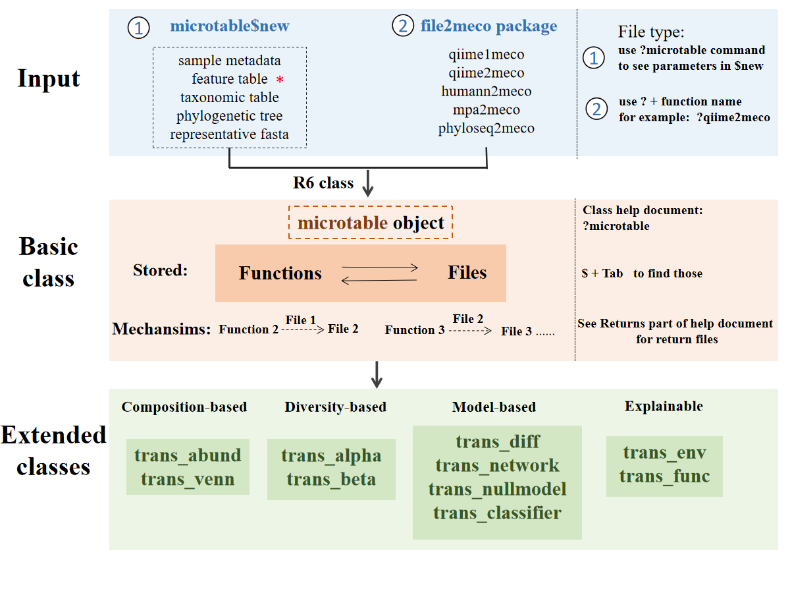
```

The stored 'Functions' and 'Files' represent that the user can access those functions or files in R6 object using $ operator 
as shown in the figure. An example is the function `dataset$cal_alphadiv()` and its return result `dataset$alpha_diversity`.
The dataset is a microtable object.
Generally, the return files of functions are named with the prefix 'res_' to make users easily find them when using Rstudio and the keyboard shortcuts (Tab).
Except for microtable class, the transformed data in created object is generally named with the prefix 'data_'.


## R6 Class

All the main classes in microeco package depend on the R6 class [@R6_Winston]. 
R6 uses the encapsulated object-oriented (OO) programming paradigm, 
which means that R6 is a profoundly different OO system from S3 and S4 because it is built on encapsulated objects, rather than generic functions. 
If the user is interested in the class features, read more from 'Advanced R' book (https://adv-r.hadley.nz/).

  + A generic is a regular function, so it lives in the global namespace. An R6 method belongs to an object so it lives in a local namespace. 
This influences how we think about naming. The methods belong to objects, not generics, and the user can call them like object$method().

  + R6’s reference semantics allow methods to simultaneously return a value and modify an object.
  
  + Every R6 object has an S3 class that reflects its hierarchy of R6 class.

## Help

The usage of help documents in the microeco package may be a little different from other packages we often used.
If the user wish to see the help document of a function, please search the name of the class it belongs to (not the name of the function) 
and click the link of the function.

```{r, echo = TRUE}
# first install microeco, see https://github.com/ChiLiubio/microeco
# load package microeco
library(microeco)
```

```{r, echo = TRUE, eval = FALSE}
# show all the classes and tutorial links
?microeco
# show the detailed description of the class microtable
# same with: help(microtable)
?microtable
```

## RTools
For Windows system, RTools (https://cran.r-project.org/bin/windows/Rtools/) is necessary to install some R packages from source, such as R packages deposited in GitHub.


## Dependence

### Description

To keep the start and use of microeco package simplified, 
the installation of microeco only depend on several packages, which are compulsory-installed from CRAN and frequently used in the data analysis.
So the question is that the user may encounter an error when using a class or function that invoke an additional package like this:

```{r, echo = TRUE, eval = FALSE}
library(microeco)
data(dataset)
test <- trans_network$new(dataset = dataset, filter_thres = 0.001)
test$cal_network(network_method = "SpiecEasi")
```

```html
Error in test$cal_network(network_method = "SpiecEasi"): SpiecEasi package is not installed!
```

<br>
The reason is that network construction with 'SpiecEasi' method requires SpiecEasi package to be installed. 
This package is deposited in GitHub and can not be installed automatically.
In addition, we donot put some packages released in CRAN and Bioconductor on the "Imports" part of microeco package.


The solutions:

1. Install the missing package when encounter such an error. Actually, it's very easy to install the packages from CRAN or Bioconductor or Github. Just have a try.

2. Install all the packages in advance. 
This is recommended if the user is interested in most of the methods and want to run a large number of examples in this tutorial.
If so, please read all of the following sections and install these packages.


### CRAN packages

Some packages released in CRAN can not be installed automatically.
These packages are necessary to reproduce some parts of the tutorial.
If you want to install all of these packages or some of them, please run this:

```{r, echo = TRUE, eval = FALSE}
# allow more waiting time to download each package
options(timeout = 1000)
# If a package is not installed, it will be installed from CRAN
# First select the packages of interest
tmp <- c("microeco", "mecoturn", "MASS", "GUniFrac", "ggpubr", "randomForest", "ggdendro", "ggrepel", "agricolae", "igraph", "picante", "pheatmap", "rgexf", 
    "ggalluvial", "ggh4x", "rcompanion", "FSA", "gridExtra", "aplot", "NST", "GGally", "ggraph", "networkD3", "poweRlaw", "ggtern", "SRS", "performance")
# Now check or install
for(x in tmp){
	if(!require(x, character.only = TRUE)) {
		install.packages(x, dependencies = TRUE)
	}
}
```


### Bioconductor packages

Some dependent packages are deposited in bioconductor (https://bioconductor.org).
Please run the following commands to install them one by one.
Several packages may be installed from source.
So, for the Windows system, please make sure RTools has been installed (https://chiliubio.github.io/microeco_tutorial/intro.html#rtools).

```{r, echo = TRUE, eval = FALSE}
install.packages("BiocManager")
install.packages("file2meco", repos = BiocManager::repositories())
install.packages("MicrobiomeStat", repos = BiocManager::repositories())
install.packages("WGCNA", repos = BiocManager::repositories())
BiocManager::install("ggtree")
BiocManager::install("metagenomeSeq")
BiocManager::install("ALDEx2")
BiocManager::install("ANCOMBC")
```


### Github packages

A part of dependent packages in some methods comes from Github (https://github.com/).
Each package from the GitHub platform is accompanied by installation instructions. 
However, due to the network instability of the platform, certain packages may fail to install online. 
As a result, in order to facilitate quick and convenient installation, 
we have collected these GitHub-dependent packages and consolidated them within a dedicated project repository (https://github.com/ChiLiubio/microeco_dependence).
Please run the following commands to install them.
For the Windows system, first make sure RTools has been installed (https://chiliubio.github.io/microeco_tutorial/intro.html#rtools).

```{r, echo = TRUE, eval = FALSE}
# download link of the compressed packages archive
# Alternative from Gitee "https://gitee.com/chiliubio/microeco_dependence/releases/download/v0.20.0/microeco_dependence.zip"
url <- "https://github.com/ChiLiubio/microeco_dependence/releases/download/v0.20.0/microeco_dependence.zip"
# allow more time to download the zip file in R
options(timeout = 2000)
# Another way is to open the upper url in browser to download the zip file and move it to the current R working directory
download.file(url = url, destfile = "microeco_dependence.zip")
# uncompress the file in R
tmp <- "microeco_dependence"
unzip(paste0(tmp, ".zip"))
# install devtools
if(!require("devtools", character.only = TRUE)){install.packages("devtools", dependencies = TRUE)}
# run these one by one
devtools::install_local(paste0(tmp, "/", "SpiecEasi-master.zip"), dependencies = TRUE)
devtools::install_local(paste0(tmp, "/", "mixedCCA-master.zip"), dependencies = TRUE)
devtools::install_local(paste0(tmp, "/", "SPRING-master.zip"), dependencies = TRUE)
devtools::install_local(paste0(tmp, "/", "NetCoMi-main.zip"), repos = BiocManager::repositories())
devtools::install_local(paste0(tmp, "/", "beem-static-master.zip"), dependencies = TRUE)
devtools::install_local(paste0(tmp, "/", "chorddiag-master.zip"), dependencies = TRUE)
devtools::install_local(paste0(tmp, "/", "ggradar-master.zip"), dependencies = TRUE)
devtools::install_local(paste0(tmp, "/", "ggnested-main.zip"), dependencies = TRUE)
devtools::install_local(paste0(tmp, "/", "ggcor-1-master.zip"), dependencies = TRUE)
```


### Gephi
Gephi is an excellent network visualization tool and used to open the saved network file, 
i.e. network.gexf in the [tutorial](https://chiliubio.github.io/microeco_tutorial/model-based-class.html#trans_network-class).
You can download Gephi and learn how to use it from https://gephi.org/users/download/


### Tax4Fun
Tax4Fun is an R package used for predicting the functional potential of prokaryotic communities.

1. install Tax4Fun package
```{r, echo = TRUE, eval = FALSE}
install.packages("RJSONIO")
install.packages(system.file("extdata", "biom_0.3.12.tar.gz", package="microeco"), repos = NULL, type = "source")
install.packages(system.file("extdata", "qiimer_0.9.4.tar.gz", package="microeco"), repos = NULL, type = "source")
install.packages(system.file("extdata", "Tax4Fun_0.3.1.tar.gz", package="microeco"), repos = NULL, type = "source")
```

2. download SILVA123 reference data from http://tax4fun.gobics.de/  
　unzip SILVA123.zip and provide this path to the folderReferenceData parameter of cal_tax4fun function in trans_func class.


### Tax4Fun2
Tax4Fun2 is another R package for the the prediction of functional profiles and functional gene redundancies of prokaryotic communities [@Wemheuer_Tax4Fun2_2020].
It has higher accuracies than PICRUSt and Tax4Fun. The Tax4Fun2 approach implemented in microeco is a little different from the original package.
Using Tax4Fun2 approach require the representative fasta file.
The user do not need to install Tax4Fun2 R package again.
The only thing need to do is to download the blast tool (**ignore this if the blast tool has been in the path**) and Ref99NR/Ref100NR database (select one).
Download blast tools from "https://ftp.ncbi.nlm.nih.gov/blast/executables/blast+" ; e.g. ncbi-blast-\*\*\*\*-x64-win64.tar.gz  for windows system.
Note that some errors can come from the latest versions because of memory issue (https://www.biostars.org/p/413294/). 
An easy solution is to use previous version (such as 2.5.0).
Download Ref99NR.zip from "https://cloudstor.aarnet.edu.au/plus/s/DkoZIyZpMNbrzSw/download"  or Ref100NR.zip from "https://cloudstor.aarnet.edu.au/plus/s/jIByczak9ZAFUB4/download".
The alternative of the download link is "https://github.com/ChiLiubio/microeco_extra_data/releases/download/v1.0.0/Tax4Fun2_ReferenceData_v2.zip" or 
"https://gitee.com/chiliubio/microeco_extra_data/releases/download/v1.0.0/Tax4Fun2_ReferenceData_v2.zip".
Uncompress all the folders. The final folders should be like these structures:

blast tools:  
　|-- ncbi-blast-2.5.0+  
　　|---- bin  
　　　|------ blastn.exe  
　　　|------ makeblastdb.exe  
　　　|------ ......  

Ref99NR:  
　|-- Tax4Fun2_ReferenceData_v2  
　　|---- Ref99NR  
　　　|------ otu000001.tbl.gz  
　　　|------ ......  
　　　|------ Ref99NR.fasta  
　　　|------ Ref99NR.tre  

The path "Tax4Fun2_ReferenceData_v2" will be required in the trans_func$cal_tax4fun2() function.
The blast tool path "ncbi-blast-2.5.0+/bin" is also required if it is not added to the system env path (environmental variable).


```{r, echo = TRUE, eval = FALSE}
# Either seqinr or Biostrings package should be installed for reading and writing fasta file
install.packages("seqinr", dependencies = TRUE)
# or install Biostrings from bioconductor https://bioconductor.org/packages/release/bioc/html/Biostrings.html
# Now we show how to read the fasta file
# see https://github.com/ChiLiubio/file2meco to install file2meco
rep_fasta_path <- system.file("extdata", "rep.fna", package="file2meco")
rep_fasta <- seqinr::read.fasta(rep_fasta_path)
# or use Biostrings package
rep_fasta <- Biostrings::readDNAStringSet(rep_fasta_path)
# try to create a microtable object with rep_fasta
data("otu_table_16S")
# In microtable class, all the taxa names should be necessarily included in rep_fasta
otu_table_16S <- otu_table_16S[rownames(otu_table_16S) %in% names(rep_fasta), ]
test <- microtable$new(otu_table = otu_table_16S, rep_fasta = rep_fasta)
test
```


## Plot
Most of the plots in the package rely on the ggplot2 package system.
We provide some parameters to optimize the corresponding plot, but it may be far from enough.
The user can also assign the output a name and use the ggplot2-style grammers to modify it.
Each data table used for visualization is stored in the object and can be saved for the customized analysis.
Of course, the user can also directly modify the class and reload them to use.
Any contribution of a modified class is appreciated via Github-Pull requests (https://github.com/ChiLiubio/microeco_tutorial/pulls) or Email (liuchi0426@126.com).


## Rstudio
The modular design of help documentation can facilitate the document viewing. 
However, in Rtudio, there may be instances where the links fail to navigate properly. 
In such cases, the issue can be resolved by reopening a document window, as illustrated in the figure below.

```{r, out.width = "800px", fig.align="center", echo = FALSE}
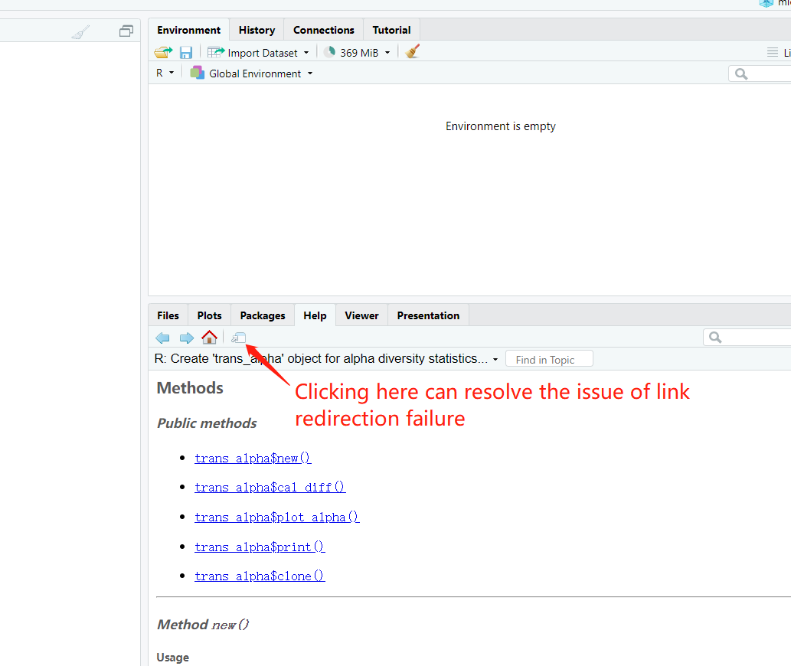
```


<!--chapter:end:01-intro.Rmd-->

# Basic class
The microtable class is the basic class.
All the other classes depend on the microtable class.

```{r, out.width = "8000px", fig.align="center", echo = FALSE}
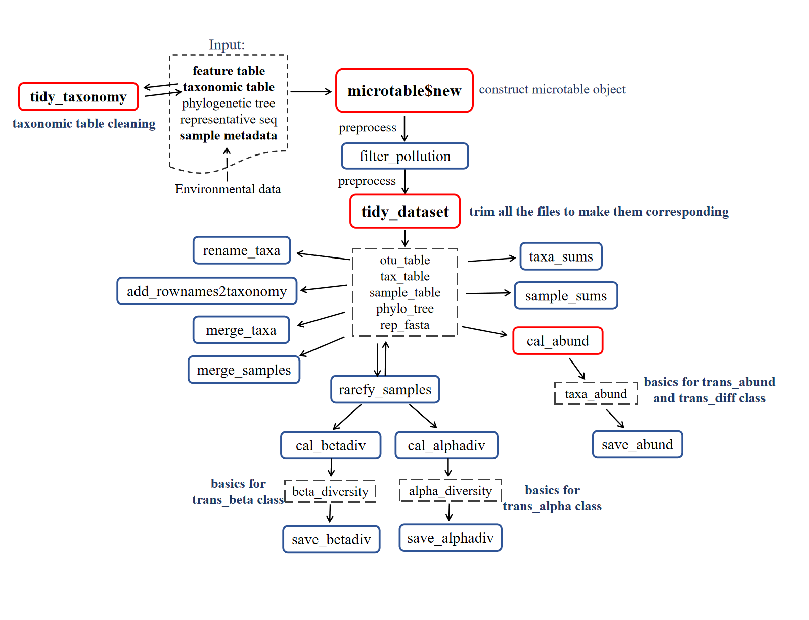
```

The objects inside the rectangle with full line represent functions.
The red rectangle means it is extremely important function.
The dashed line denotes the key objects (input or output of functions) that deserve more attention. 


## microtable class

　Many tools can be used for the bioinformatic analysis of amplicon sequencing data, such as QIIME [@Caporaso_QIIME_2010], QIIME2 [@Bolyen_Reproducible_2019], 
usearch (https://www.drive5.com/usearch/), mothur [@Schloss_Introducing_2009], 
SILVAngs (https://ngs.arb-silva.de/silvangs/), LotuS2 [@Ozkurt_LotuS2_2022],
and RDP (http://rdp.cme.msu.edu/).
Although the formats of result files may vary across tools, the main contents can be generally classified into the following parts:
(1) OTU/ASV table, i.e. the feature-sample abundance table; 
(2) taxonomic assignment table;
(3) representative sequences;
(4) phylogenetic tree;
(5) metadata. 
It is generally useful to create a detailed sample metadata table to store all the sample information (including the environmental data).

　The microtable class is the basic class and designed to store the basic data for all the downstream analysis in the microeco package.
At least, the OTU table (i.e. feature-sample abundance table) should be provided to create microtable object.
Thus, the microtable class can determine that the sample information table is missing and create a default sample table according to
sample names in otu_table.
To make the file input more convenient,
we also build another R package file2meco (https://github.com/ChiLiubio/file2meco) to read the output files of some tools into microtable object.
Currently, those tools/softwares include not only commonly-used QIIME [@Caporaso_QIIME_2010] and QIIME2[@Bolyen_Reproducible_2019], 
but also several metagenomic tools, such as HUMAnN [@Franzosa_Species_2018] and kraken2 [@Wood_Improved_2019].
In this tutorial, the data inside the package was employed to show some basic operations.


### Prepare the example data

　The example data inside the microeco package is used to show the main part of the tutorial.
This dataset arose from 16S rRNA gene Miseq sequencing results of wetland soils in China published by An et al. [@An_Soil_2019], 
who surveyed soil prokaryotic communities in Chinese inland wetlands (IW), 
coastal wetland (CW) and Tibet plateau wetlands (TW) using amplicon sequencing.
These wetlands include both saline and non-saline samples (classified for the tutorial).
The sample information table has 4 columns: "SampleID", "Group", "Type" and "Saline".
The column "SampleID" is same with the rownames.
The column "Group" represents the IW, CW and TW.
The column "Type" means the sampling region: northeastern region (NE), northwest region (NW), North China area (NC),
middle-lower reaches of the Yangtze River (YML), southern coastal area (SC), upper reaches of the Yangtze River (YU), Qinghai-Tibet Plateau (QTP). 
The column "Saline" denotes the saline soils and non-saline soils.
In this dataset, the environmental factor table is separated from the sample information table.
It is also recommended to put all the environmental data into sample information table.


```{r, echo = TRUE}
library(microeco)
# load the example data; 16S rRNA gene amplicon sequencing dataset
# metadata table; data.frame
data(sample_info_16S)
# feature table; data.frame
data(otu_table_16S)
# taxonomic assignment table; data.frame
data(taxonomy_table_16S)
# phylogenetic tree; not necessary; use for the phylogenetic analysis
# Newick format; use read.tree function of ape package to read a tree
data(phylo_tree_16S)
# load the environmental data table if it is not in sample table
data(env_data_16S)
# use pipe operator in magrittr package
library(magrittr)
# fix the random number generation to make the results repeatable
set.seed(123)
# make the plotting background same with the tutorial
library(ggplot2)
theme_set(theme_bw())
```

Make sure that the data types of sample_table, otu_table and tax_table are all `data.frame` format as the following part shows.

```{r, echo = TRUE}
class(otu_table_16S)
```

```{r, echo = TRUE, eval = FALSE}
otu_table_16S[1:5, 1:5]
```

```{r, echo = FALSE}
pander::pander(otu_table_16S[1:5, 1:5])
```

```{r, echo = TRUE}
class(taxonomy_table_16S)
```

```{r, echo = TRUE, eval = FALSE}
taxonomy_table_16S[1:5, 1:3]
```

```{r, echo = FALSE}
pander::pander(taxonomy_table_16S[1:5, 1:3])
```

Generally, users' taxonomic table has some messy information, such as NA, unidentified and unknown.
These information can potentially influence the following taxonomic abundance calculation and other taxonomy-based analysis.
So it is usually necessary to clean this data using the `tidy_taxonomy` function.
Another very important result of this operation is to **unify the taxonomic prefix** automatically,
e.g., converting D_1__ to p__ for Phylum level or adding p__ to Phylum directly if no prefix is found.


```{r, echo = TRUE, eval = FALSE}
# make the taxonomic information unified, very important
taxonomy_table_16S %<>% tidy_taxonomy
```

The rownames of sample_table in microtable object (i.e. sample names) are used for selecting samples/groups in all the related operations in the package.
Using pure number as sample names is **not recommended** in case of unknown disorder or man-made mistake.
**Before creating microtable object, make sure that the rownames of sample information table are sample names**.


```{r, echo = TRUE}
class(sample_info_16S)
```

```{r, echo = TRUE, eval = FALSE}
sample_info_16S[1:5, ]
```

```{r, echo = FALSE}
pander::pander(sample_info_16S[1:5, ])
```

In this example, the environmental data is stored in the env_data_16S alone. 
The user can also directly integrate those data into the sample information table.

```{r, echo = TRUE}
class(env_data_16S)
```

```{r, echo = FALSE}
pander::pander(env_data_16S[1:5, 1:5])
```

```{r, echo = TRUE}
class(phylo_tree_16S)
```

Then, we create an object of microtable class.
This operation is very similar with the package phyloseq[@Mcmurdie_phyloseq_2013], but in microeco it is more brief.
The otu_table in the microtable class must be the feature-sample format: rownames - OTU/ASV/pathway/other names; colnames - sample names.
**The colnames in otu_table must have overlap with rownames of sample_table**.
Otherwise, the following check can filter all the samples of otu_table because of no same sample names between otu_table and sample_table.


```{r, echo = TRUE}
# In R6 class, '$new' is the original method used to create a new object of class
# If you only provide abundance table, the class can help you create a sample info table
dataset <- microtable$new(otu_table = otu_table_16S)
class(dataset)
# generally add the metadata
dataset <- microtable$new(otu_table = otu_table_16S, sample_table = sample_info_16S)
dataset
# Let's create a microtable object with more information
dataset <- microtable$new(sample_table = sample_info_16S, otu_table = otu_table_16S, tax_table = taxonomy_table_16S, phylo_tree = phylo_tree_16S)
dataset
```

### How to read your files to microtable object?

The above-mentioned example data are directly loaded from microeco package.
So the question is __how to read your data to create a microtable object?__  
There are two ways:

▲ 1. __Use file2meco package__  
R package file2meco (https://chiliubio.github.io/microeco_tutorial/file2meco-package.html) is designed to directly read the output files of some famous tools into microtable object.
Currently, it supports QIIME [@Caporaso_QIIME_2010], QIIME2[@Bolyen_Reproducible_2019], 
HUMAnN [@Franzosa_Species_2018], MetaPhlAn [@Truong_MeTApHLaN2_2015], kraken2 [@Wood_Improved_2019], phyloseq [@Mcmurdie_phyloseq_2013], etc.
Please read the tutorial of file2meco package for more detailed information (https://chiliubio.github.io/microeco_tutorial/file2meco-package.html).

▲ 2. __Other cases__  
To transform customized files to microtable object, 
there should be two steps:  
__I) read files to R__  
The required format of microtable\$new parameters, __otu_table__, __sample_table__ and __tax_table__, are all the data.frame, which is the most frequently-used data format in R.
So no matter what the format the files are, they should be first read into R with some functions, such as `read.table` and `read.csv`.
If the user want to perform phylogenetic analysis, please also read your phylogenetic tree using `read.tree` function of ape package and 
provide the tree to the __phylo_tree__ parameter of microtable\$new function like the above example.  
__II) create the microtable object__  
Then the user can create the microtable object like the operation in the last section.
Please also see the help document of the microtable class for detailed descriptions using the following help command.

```{r, echo = TRUE, eval = FALSE}
# search the class name, not the function name
?microtable
# then see microtable$new()
```

### Functions in microtable class

Then, we remove OTUs which are not assigned in the Kingdom "k__Archaea" or "k__Bacteria". 
```{r, echo = TRUE}
# use R subset function to filter taxa in tax_table
dataset$tax_table %<>% base::subset(Kingdom == "k__Archaea" | Kingdom == "k__Bacteria")
# another way with grepl function
dataset$tax_table %<>% .[grepl("Bacteria|Archaea", .$Kingdom), ]
dataset
```

We also remove OTUs with the taxonomic assignments "mitochondria" or "chloroplast".

```{r, echo = TRUE}
# This will remove the lines containing the taxa word regardless of taxonomic ranks and ignoring word case in the tax_table.
# So if you want to filter some taxa not considerd pollutions, please use subset like the previous operation to filter tax_table.
dataset$filter_pollution(taxa = c("mitochondria", "chloroplast"))
dataset
```

To make the OTU and sample information consistent across all files in the dataset object, we use function `tidy_dataset` to trim the dataset.

```{r, echo = TRUE}
dataset$tidy_dataset()
print(dataset)
```

Then let's use sample_sums() to check the sequence numbers in each sample.

```{r, echo = TRUE}
dataset$sample_sums() %>% range
```

Sometimes, in order to reduce the effects of sequencing depth on the diversity measurements, 
it is optional to perform the resampling to make the sequence number equal for each sample.
The function `rarefy_samples` can invoke the function `tidy_dataset` automatically before and after the rarefying.
In v0.19.0, `method = 'SRS'` is available to perfom normalization by scaling with ranked subsampling [@Beule_normalization_2020].
The default method is `method = 'rarefying'`.


```{r, echo = TRUE}
# As an example, use 10000 sequences in each sample
dataset$rarefy_samples(sample.size = 10000)
dataset$sample_sums() %>% range
```

For v0.17.0, the function `save_table` can be performed to save all the basic data in microtable object to local files,
including feature abundance, metadata, taxonomic table, phylogenetic tree and representative sequences.

```{r, echo = TRUE, eval = FALSE}
dataset$save_table(dirpath = "basic_files", sep = ",")
```

Then, let's calculate the taxa abundance at each taxonomic rank using `cal_abund()`.
This function **generate a list called taxa_abund stored in the microtable object**. 
This list contain several data frame of the abundance information at each taxonomic rank.
It's worth noting that the `cal_abund()` function can be used to **solve more complicated cases with special parameters**,
such as supporting both the relative and absolute abundance calculation and selecting the partial 'taxonomic' columns.
Those have been shown in file2meco package part (https://chiliubio.github.io/microeco_tutorial/file2meco-package.html#humann-metagenomic-results) with complex metagenomic dataset.

```{r, echo = TRUE}
# use default parameters
dataset$cal_abund()
# return dataset$taxa_abund
class(dataset$taxa_abund)
```

```{r, echo = TRUE, eval = FALSE}
# show part of the relative abundance at Phylum level
dataset$taxa_abund$Phylum[1:5, 1:5]
```

```{r, echo = FALSE}
pander::pander(dataset$taxa_abund$Phylum[1:5, 1:5])
```


The function `save_abund()` can be used to save the taxa abundance file to a local place easily.

```{r, echo = TRUE, eval = FALSE}
dataset$save_abund(dirpath = "taxa_abund")
```

All the abundance tables can also be merged into one to save from v0.15.0.
This type of file format can be opened directly by other software, such as STAMP.

```{r, echo = TRUE, eval = FALSE}
# tab-delimited, i.e. mpa format
dataset$save_abund(merge_all = TRUE, sep = "\t", quote = FALSE)
# remove those unclassified
dataset$save_abund(merge_all = TRUE, sep = "\t", rm_un = TRUE, rm_pattern = "__$|Sedis$", quote = FALSE)
```

Then, let's calculate the alpha diversity.
The result is also stored in the object microtable automatically.


```{r, echo = TRUE}
# If you want to add Faith's phylogenetic diversity, use PD = TRUE, this will be a little slow
dataset$cal_alphadiv(PD = FALSE)
# return dataset$alpha_diversity
class(dataset$alpha_diversity)
```

```{r, echo = TRUE, eval = FALSE}
# save dataset$alpha_diversity to a directory
dataset$save_alphadiv(dirpath = "alpha_diversity")
```

Let's go on to beta diversity with function `cal_betadiv()`.
If method parameter is not provided, the function automatically calculates Bray-curtis, Jaccard, weighted Unifrac and unweighted unifrac matrixes [@Lozupone_UniFrac_2005].


```{r, echo = FALSE, eval = TRUE, message = FALSE}
invisible(dataset$cal_betadiv(unifrac = FALSE))
```

```{r, echo = TRUE, eval = FALSE}
# unifrac = FALSE means do not calculate unifrac metric
# require GUniFrac package installed
dataset$cal_betadiv(unifrac = TRUE)
# return dataset$beta_diversity
class(dataset$beta_diversity)
# save dataset$beta_diversity to a directory
dataset$save_betadiv(dirpath = "beta_diversity")
```

### merge taxa or samples

Merging taxa according to a specific taxonomic rank level of tax_table can generate a new microtable object.
In the new microtable object, each feature in otu_table represents one taxon at the output level.

```{r, echo = TRUE}
test <- dataset$merge_taxa(taxa = "Genus")
test
```

Similarly, merging samples according to a specific group of sample_table can also generate a new microtable object.

```{r, echo = TRUE}
test <- dataset$merge_samples(use_group = "Group")
test
```


### subset of samples

We donnot provide a special function to filter samples in microtable object, as we think it is redundant.
**We recommend manipulating the sample_table in microtable object directly.**
For example, if you want to extract samples of 'CW' group, please do like this: 

```{r, echo = TRUE, eval = TRUE}
# remember first clone the whole dataset
# see https://chiliubio.github.io/microeco_tutorial/notes.html#clone-function
group_CW <- clone(dataset)
# select 'CW'
group_CW$sample_table <- subset(group_CW$sample_table, Group == "CW")
# or: group_CW$sample_table <- subset(group_CW$sample_table, grepl("CW", Group))
# use tidy_dataset to trim all the basic files
group_CW$tidy_dataset()
group_CW
```


### subset of taxa

Similar with above operation, **subset of features can be achieved by manipulating the tax_table in microtable object directly.**

```{r, echo = TRUE, eval = TRUE}
proteo <- clone(dataset)
proteo$tax_table <- subset(proteo$tax_table, Phylum == "p__Proteobacteria")
# or: proteo$tax_table <- subset(proteo$tax_table, grepl("Proteobacteria", Phylum))
proteo$tidy_dataset()
proteo
# proteo is a new microtable object with all OTUs coming from phylum Proteobacteria
# beta diversity dissimilarity for Proteobacteria
proteo$cal_betadiv()
```


### Other examples

The function `add_rownames2taxonomy` can add the rownames of tax_table as the last column of tax_table directly.
This operation is very useful in some analysis, e.g. biomarker finding at OTU/ASV level with the relative abundance.

```{r, echo = TRUE, eval = FALSE}
test <- clone(dataset)
ncol(test$tax_table)
test$add_rownames2taxonomy(use_name = "OTU")
ncol(test$tax_table)
```

The `filter_taxa` function can be applied to filter the features with low abundance or occurrence frequency when needed.
For other operations on the features, please directly manipulate the otu_table of your microtable object.

```{r, echo = TRUE, eval = FALSE}
# It is better to have a backup before filtering features
dataset_filter <- clone(dataset)
dataset_filter
# In this example, mean relative abundance threshold 0.0001
# occurrence frequency 0.1; 10% samples have the target features
dataset_filter$filter_taxa(rel_abund = 0.0001, freq = 0.1)
dataset_filter
```

In microtable$new, if auto_tidy = TRUE, the function can automatically use `tidy_dataset` to make all files uniform.
Then, all other functions in microtable will also do this. But if the user changes the file in microtable object,
the class can not recognize this modification, the user should use `tidy_dataset` function to manually trim the microtable object.

```{r, echo = TRUE, eval = TRUE}
test <- microtable$new(sample_table = sample_info_16S[1:40, ], otu_table = otu_table_16S, auto_tidy = FALSE)
test
test1 <- microtable$new(sample_table = sample_info_16S[1:40, ], otu_table = otu_table_16S, auto_tidy = TRUE)
test1
test1$sample_table %<>% .[1:10, ]
test1
test1$tidy_dataset()
test1
```

The phylogenetic tree can be read with `read.tree` function in ape package.

```{r, echo = TRUE, eval = FALSE}
# use the example data rep_phylo.tre in file2meco package https://chiliubio.github.io/microeco_tutorial/file2meco-package.html#qiime
phylo_file_path <- system.file("extdata", "rep_phylo.tre", package="file2meco")
tree <- ape::read.tree(phylo_file_path)
```

Other functions and examples are listed here.

```{r, echo = TRUE, eval = FALSE}
# clone a complete dataset named test
test <- clone(dataset)

# rename features in all the files of microtable object
test$rename_taxa(newname_prefix = "new_name_")
rownames(test$otu_table)[1:5]
rownames(test$tax_table)[1:5]

# sum the abundance for each taxon
test$taxa_sums()

# output sample names of microtable object
test$sample_names()[1:5]

# output taxa names of microtable object
test$taxa_names()[1:5]
```


### Key points

  + sample_table: rownames of sample_table must be sample names used
  + otu_table: rownames must be feature names; colnames must be sample names
  + `microtable` class: creating microtable object requires at least one file input (otu_table)
  + `tidy_taxonomy()`: necessary to make taxonomic table have unified format
  + `tidy_dataset()`: necessary to trim files in microtable object
  + `add_rownames2taxonomy()`: add the rownames of tax_table as the last column of tax_table
  + `cal_abund()`: powerful and flexible to cope with complex cases in tax_table, see the parameters
  + taxa_abund: taxa_abund is a list stored in microtable object and have several data frame
  + beta_diversity: beta_diversity is a list stored in microtable object and have several distance matrix


<!--chapter:end:02-Basic_class.Rmd-->

# Composition-based class

The trans_abund class and trans_venn class are organised into the section 'Composition-based class', 
since they are mainly used to show the composition information of communities.


## trans_abund class
　The trans_abund class has several functions to visualize taxonomic abundance based on the ggplot2 package.


### Example

We first show the bar plot example.

```{r, echo = TRUE}
# create trans_abund object
# select top 8 abundant Phyla.
t1 <- trans_abund$new(dataset = dataset, taxrank = "Phylum", ntaxa = 8)
# t1 object now include the transformed abundance data t1$abund_data and other elements for the following plotting
```

As the sample number is large, we do not show the sample names in x axis and add the facet to show abundance according to groups.

```{r, echo = TRUE, eval = FALSE}
t1$plot_bar(others_color = "grey70", facet = "Group", xtext_keep = FALSE, legend_text_italic = FALSE)
# return a ggplot2 object
```

```{r, out.width = "750px", fig.align="center", echo = FALSE}
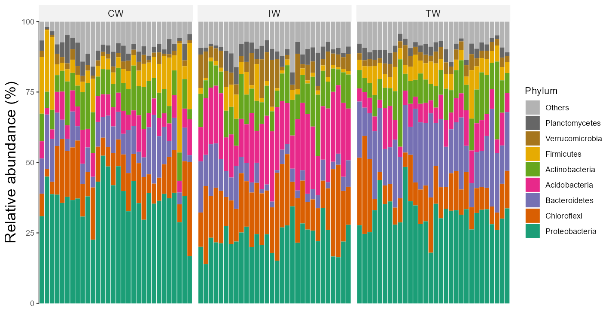
```

Two or more facets are supported with the facet parameter from v0.14.0 by providing a vector with multiple elements.

```{r, echo = TRUE, eval = FALSE}
# require package ggh4x, first run install.packages("ggh4x") if not installed
t1$plot_bar(others_color = "grey70", facet = c("Group", "Type"), xtext_keep = FALSE, legend_text_italic = FALSE, barwidth = 1)
```

```{r, out.width = "750px", fig.align="center", echo = FALSE}
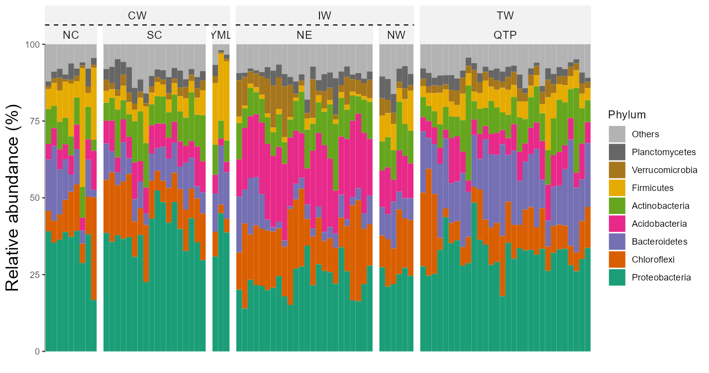
```

The default operation can filter all the unclassified taxa (i.e. p__ or g__ in tax_table that has been processed by `tidy_taxonomy` function), 
as those unknown taxa are generally meaningless.
However sometimes, these unknown taxa may be meaningful for users.
For example, if one want to isolate some unknown species, it is valuable to check the abundance of those unknown taxa.
At this time, please see this topic (https://github.com/ChiLiubio/microeco/issues/165) to resolve the issue that how to show unknown taxa with hierarchical taxonomy classification.
The alluvial plot is also implemented in the plot_bar function with use_alluvium parameter.

```{r, echo = TRUE, eval = FALSE}
t1 <- trans_abund$new(dataset = dataset, taxrank = "Genus", ntaxa = 8)
# require ggalluvial package
# use_alluvium = TRUE make the alluvial plot, clustering =TRUE can be used to reorder the samples by clustering
# bar_type = FALSE can remove 'others'
p <- t1$plot_bar(bar_full = FALSE, use_alluvium = TRUE, clustering = TRUE, xtext_angle = 30, xtext_size = 3, color_values = RColorBrewer::brewer.pal(8, "Set2"))
```

```{r, fig.align="center", echo = FALSE}
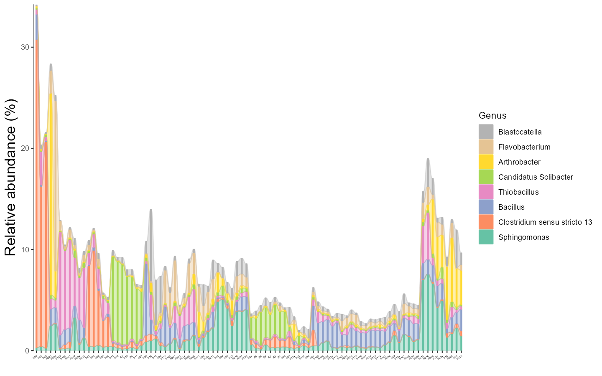
```

The bar plot can also be performed with group mean values.
Note that, from v0.16.0, the parameter `group_morestats = TRUE` can be used to add more summary statistics in the return `data_abund` when `groupmean` parameter is provided.

```{r, echo = TRUE, eval = FALSE}
# The groupmean parameter can be used to obtain the group-mean barplot.
t1 <- trans_abund$new(dataset = dataset, taxrank = "Phylum", ntaxa = 10, groupmean = "Group")
g1 <- t1$plot_bar(others_color = "grey70", legend_text_italic = FALSE)
g1 + theme_classic() + theme(axis.title.y = element_text(size = 18))
```

```{r, out.width = "400px", fig.align="center", echo = FALSE}
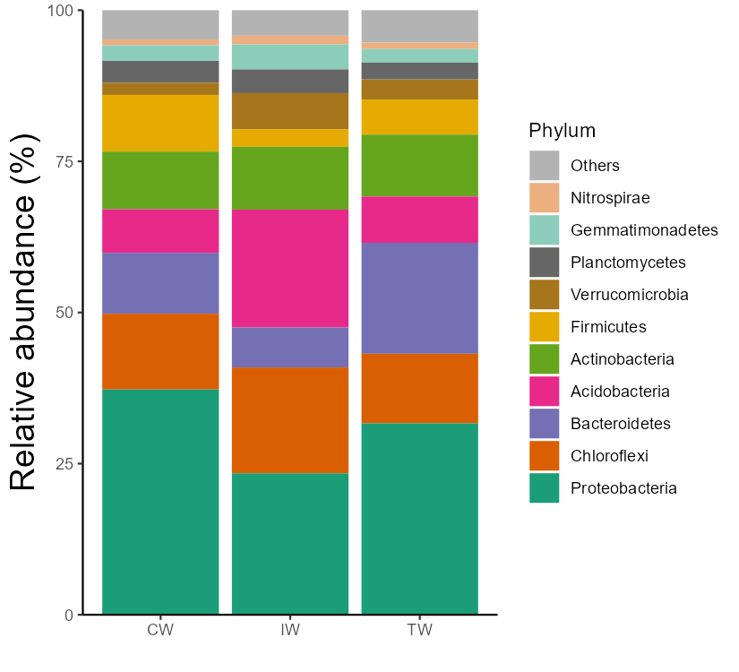
```

The box plot is an excellent way to intuitionally show abundance distribution across groups.

```{r, echo = TRUE, eval = FALSE}
# show 15 taxa at Class level
t1 <- trans_abund$new(dataset = dataset, taxrank = "Class", ntaxa = 15)
t1$plot_box(group = "Group", xtext_angle = 30)
```

```{r, out.width = "700px", fig.align="center", echo = FALSE}
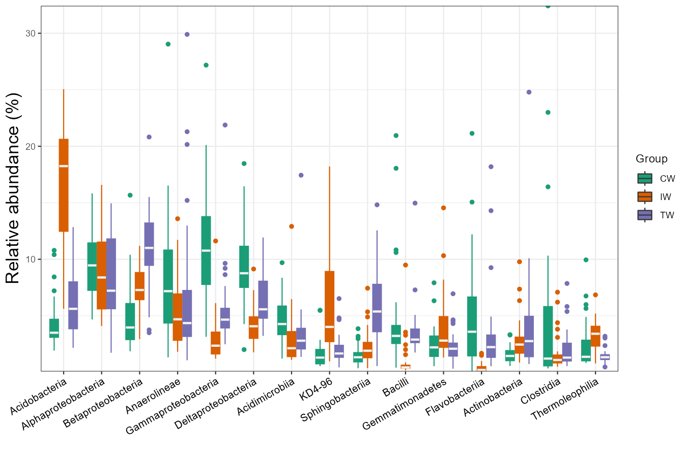
```

Then we show the heatmap with the high abundant genera.

```{r, echo = TRUE, eval = FALSE}
# show 40 taxa at Genus level
t1 <- trans_abund$new(dataset = dataset, taxrank = "Genus", ntaxa = 40)
g1 <- t1$plot_heatmap(facet = "Group", xtext_keep = FALSE, withmargin = FALSE, plot_breaks = c(0.01, 0.1, 1, 10))
g1
g1 + theme(axis.text.y = element_text(face = 'italic'))
```

```{r, out.width = "750px", fig.align="center", echo = FALSE}
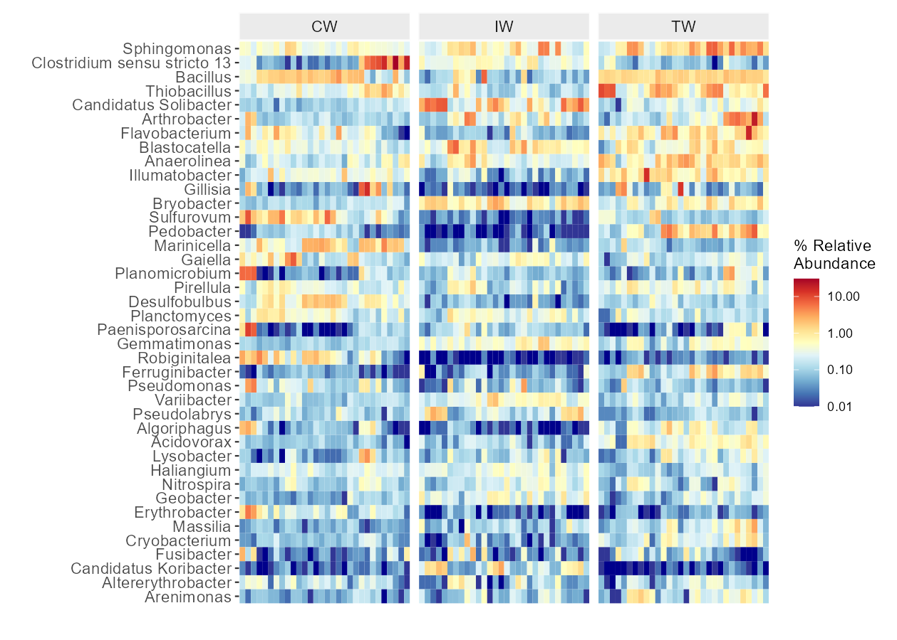
```

Line chart is very useful to show the abundance change of taxa along time, space or other gradients.

```{r, echo = TRUE, eval = FALSE}
t1 <- trans_abund$new(dataset = dataset, taxrank = "Phylum", ntaxa = 5)
t1$plot_line()
t1 <- trans_abund$new(dataset = dataset, taxrank = "Genus", ntaxa = 5, groupmean = "Type")
t1$plot_line(position = position_dodge(0.3), xtext_angle = 0)
```

```{r, out.width = "750px", fig.align="center", echo = FALSE}
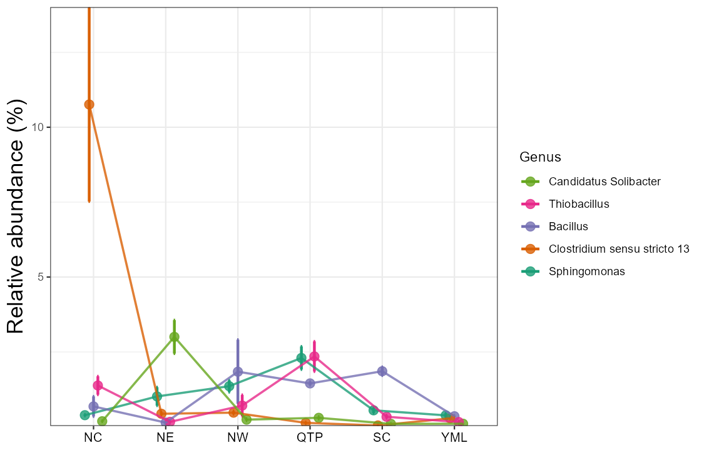
```

Then, we show the pie chart with the group mean values.

```{r, echo = TRUE, eval = FALSE}
t1 <- trans_abund$new(dataset = dataset, taxrank = "Phylum", ntaxa = 6, groupmean = "Group")
# all pie chart in one row
t1$plot_pie(facet_nrow = 1)
t1$plot_pie(facet_nrow = 1, add_label = TRUE)
```

```{r, out.width = "600px", fig.align="center", echo = FALSE}
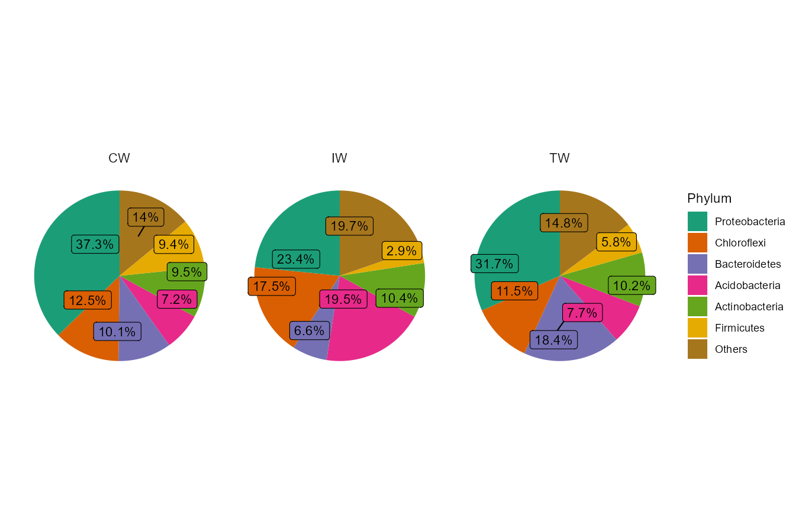
```

The donut and radar charts are implemented from v0.17.0. 
Please install the dependent packages according to the steps (https://chiliubio.github.io/microeco_tutorial/intro.html#dependence).

```{r, echo = TRUE, eval = FALSE}
t1 <- trans_abund$new(dataset = dataset, taxrank = "Phylum", ntaxa = 8, groupmean = "Group")
t1$plot_donut(label = FALSE)
t1$plot_donut(label = TRUE)
```

```{r, out.width = "650px", fig.align="center", echo = FALSE}
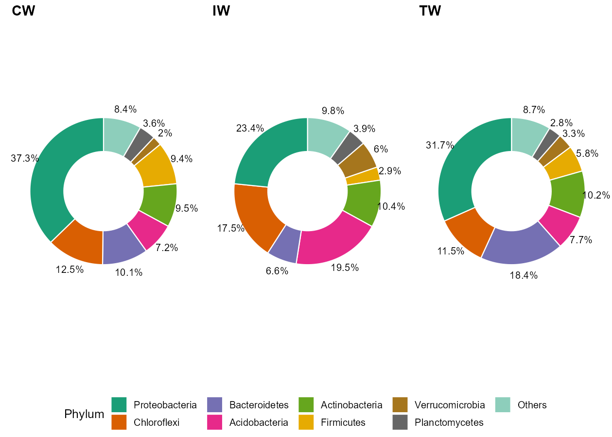
```

```{r, echo = TRUE, eval = FALSE}
t1 <- trans_abund$new(dataset = dataset, taxrank = "Phylum", ntaxa = 8, groupmean = "Group")
t1$plot_radar(values.radar = c("0%", "25%", "50%"), grid.min = 0, grid.mid = 0.25, grid.max = 0.5)
t1 <- trans_abund$new(dataset = dataset, taxrank = "Phylum", ntaxa = 8, groupmean = "Type")
t1$plot_radar(values.radar = c("0%", "25%", "50%"), grid.min = 0, grid.mid = 0.25, grid.max = 0.5)
```

```{r, out.width = "700px", fig.align="center", echo = FALSE}
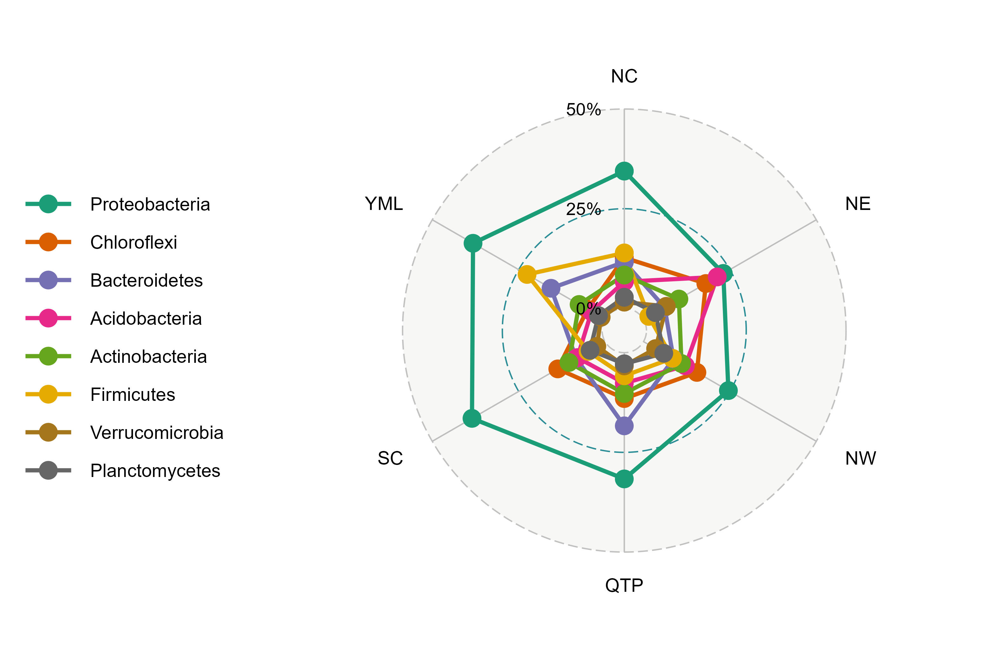
```

The ternary plot can be used for the case with three samples/groups.

```{r, echo = TRUE, eval = FALSE}
t1 <- trans_abund$new(dataset = dataset, taxrank = "Phylum", ntaxa = 8, groupmean = "Group")
t1$plot_tern()
```

```{r, out.width = "600px", fig.align="center", echo = FALSE}
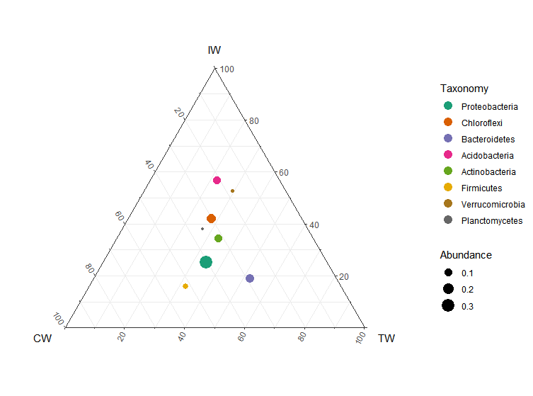
```


When the hierarchical abundance data of two levels is needed to be shown in bar plot, the nested legend can be used.

```{r, echo = TRUE, eval = FALSE}
# require ggnested package; see https://chiliubio.github.io/microeco_tutorial/intro.html#dependence
test1 <- trans_abund$new(dataset = dataset, taxrank = "Class", ntaxa = 10, high_level = "Phylum", prefix = "\\|")
test1$plot_bar(ggnested = TRUE, facet = c("Group", "Type"), xtext_angle = 30)
# fixed number in each phylum
test1 <- trans_abund$new(dataset = dataset, taxrank = "Class", ntaxa = 30, show = 0, high_level = "Phylum", high_level_fix_nsub = 4)
test1$plot_bar(ggnested = TRUE, xtext_angle = 30, facet = c("Group", "Type"))
# sum others in each phylum
test1 <- trans_abund$new(dataset = dataset, taxrank = "Class", ntaxa = 20, show = 0, high_level = "Phylum", high_level_fix_nsub = 3, prefix = "\\|")
test1$plot_bar(ggnested = TRUE, high_level_add_other = TRUE, xtext_angle = 30, facet = c("Group", "Type"))
```

```{r, out.width = "700px", fig.align="center", echo = FALSE}
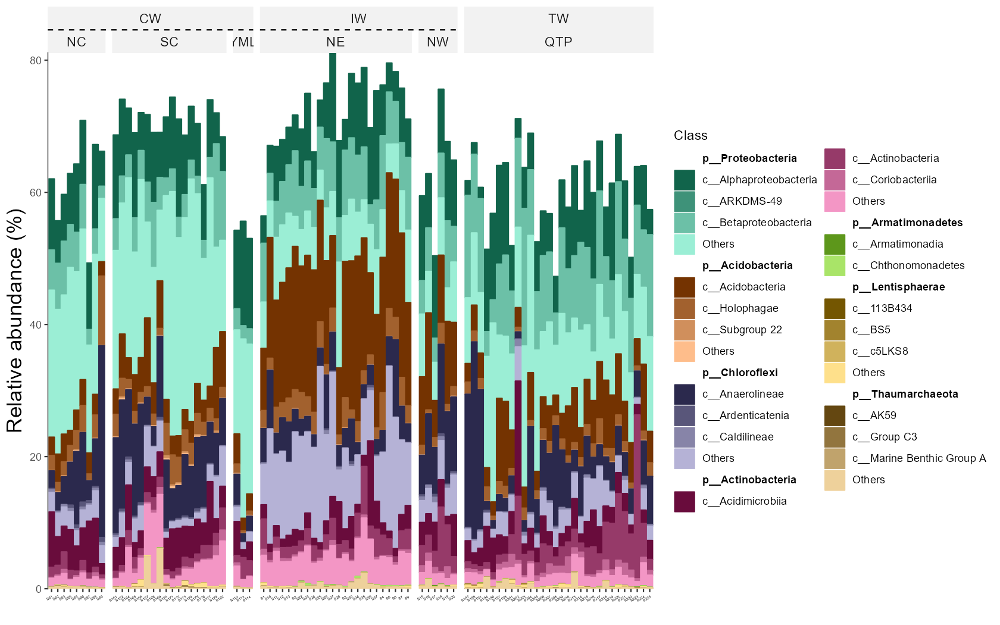
```

The `coord_flip` parameter in `plot_bar` function can be changed to make the coordinate axis flipped.
The clustering plot can also be added in the bar plot.
In this case, the coordinate axis will be flipped automatically for better visualization.

```{r, echo = TRUE, eval = FALSE}
t1 <- trans_abund$new(dataset = dataset, taxrank = "Phylum", ntaxa = 10, groupmean = "Group")
g1 <- t1$plot_bar(coord_flip = TRUE)
g1 <- g1 + theme_classic() + theme(axis.title.x = element_text(size = 16), axis.ticks.y = element_blank(), axis.line.y = element_blank())
g1
g1 <- t1$plot_bar(clustering_plot = TRUE)
# In this case, g1 (aplot object) is the combination of different ggplot objects
# to adjust the main plot, please select g1[[1]]
g1[[1]] <- g1[[1]] + theme_classic() + theme(axis.title.x = element_text(size = 16), axis.ticks.y = element_blank(), axis.line.y = element_blank())
g1
# save the figure
ggsave("test.png", g1, width = 8, height = 5)
```

```{r, out.width = "600px", fig.align="center", echo = FALSE}
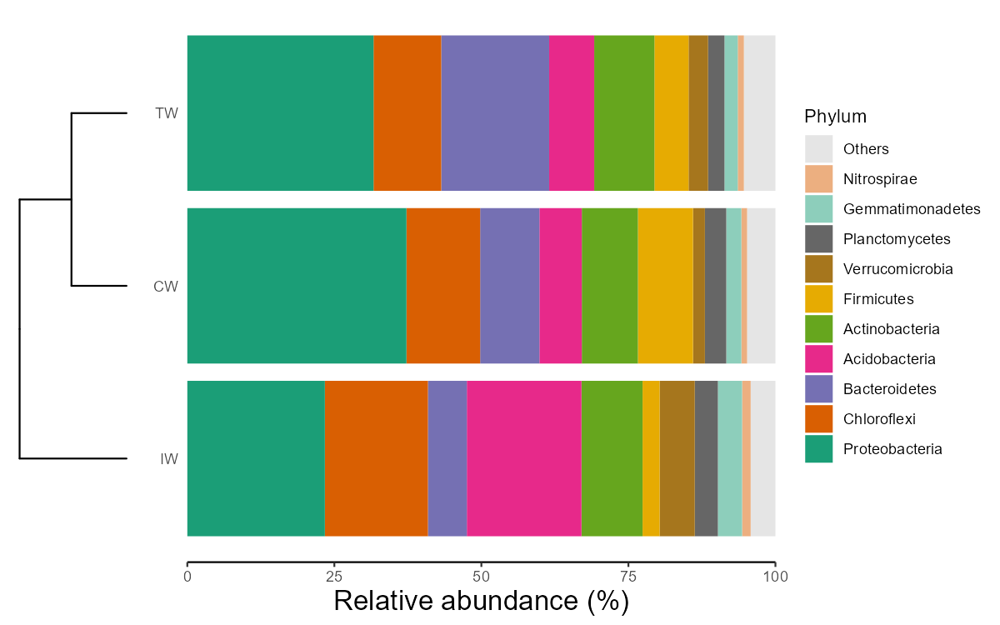
```


### Key points

  + trans_abund$new: creating trans_abund object can invoke taxa_abund in microtable for transformation
  + color_values parameter: color_values parameter in each function is used for colors selection
  + input_taxaname parameter: input_taxaname parameter in trans_abund$new can be used to select interested customized taxa instead of abundance-based selection
  + use_percentage parameter: use_percentage parameter in trans_abund$new - whether show the abundance percentage
  

## trans_venn class

The trans_venn class is developed for venn analysis, i.e. shared and unique taxa across samples/groups.

### Example

This part can be performed using samples or groups at OTU/ASV level or higher taxonomic level.
To analyze the unique and shared OTUs of groups,
we first merge samples according to the "Group" column of sample_table.

```{r, echo = TRUE, eval = FALSE}
# merge samples as one community for each group
dataset1 <- dataset$merge_samples(use_group = "Group")
# dataset1 is a new microtable object
# create trans_venn object
t1 <- trans_venn$new(dataset1, ratio = NULL)
t1$plot_venn()
```

```{r, out.width = "500px", fig.align="center", echo = FALSE}
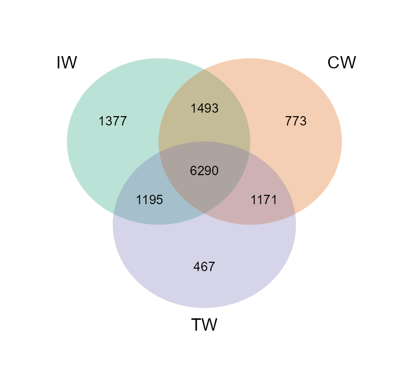
```

```{r, echo = TRUE, eval = FALSE}
# create venn plot with more information
t1 <- trans_venn$new(dataset1, ratio = "seqratio")
t1$plot_venn()
# The integer is OTU number
# The percentage data is the sequence number/total sequence number
```

```{r, out.width = "500px", fig.align="center", echo = FALSE}
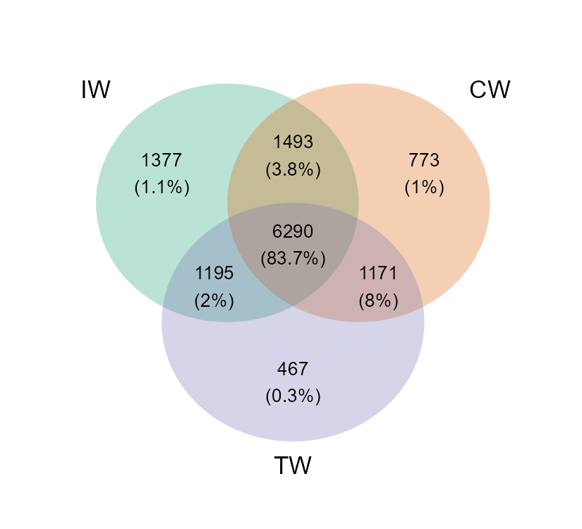
```

When the groups are too many to show with venn plot, using petal plot is better.
To assign different colors in petals, please provide multiple colors to `petal_color` parameter.

```{r, echo = TRUE, eval = FALSE}
# use "Type" column in sample_table
dataset1 <- dataset$merge_samples(use_group = "Type")
t1 <- trans_venn$new(dataset1)
t1$plot_venn(petal_plot = TRUE, petal_color = RColorBrewer::brewer.pal(8, "Dark2"))
t1$plot_venn(petal_plot = TRUE, petal_center_size = 50, petal_r = 1.5, petal_a = 3, petal_move_xy = 3.8, petal_color_center = "#BEBADA")
```

```{r, out.width = "500px", fig.align="center", echo = FALSE}
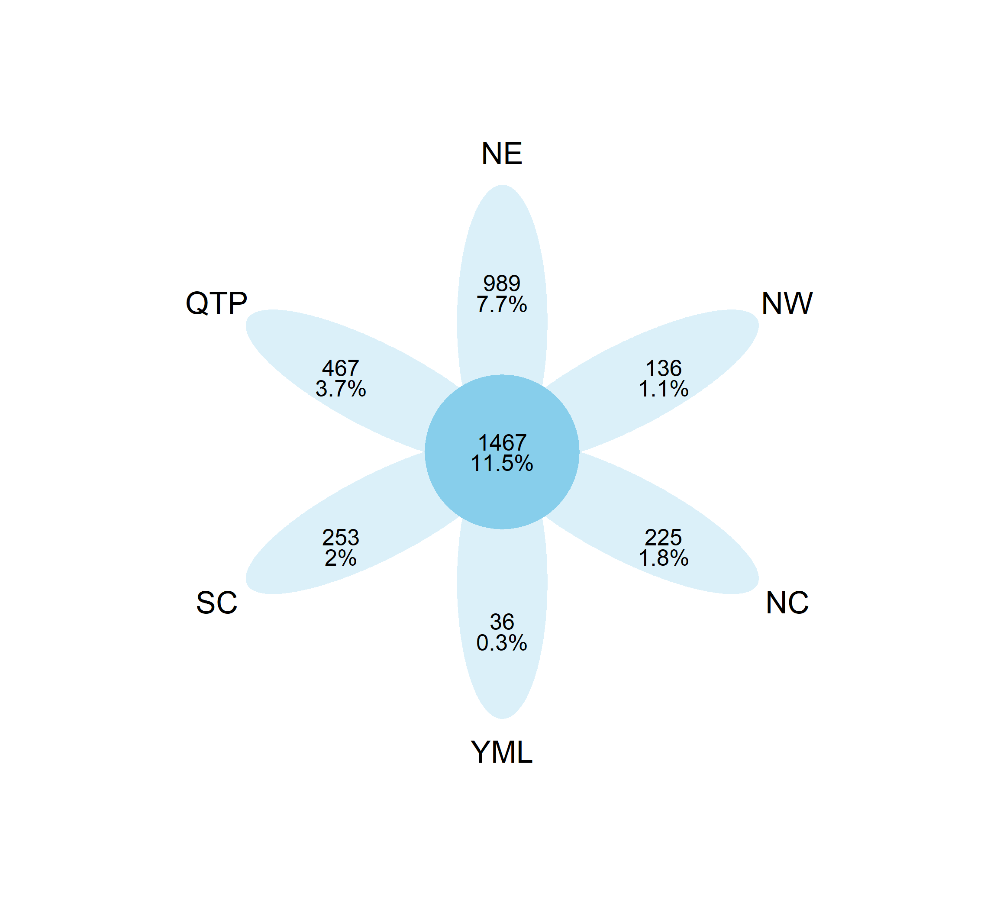
```

Another way to plot the results is to use `plot_bar` function, which is especially useful for a large number of samples/groups.
This way is generally called UpSet plot. Please see the help document for more parameters to adjust the plot.

```{r, echo = TRUE, eval = FALSE}
tmp <- dataset$merge_samples(use_group = "Type")
tmp
t1 <- trans_venn$new(dataset = tmp)
# only show some sets with large intersection numbers
t1$data_summary %<>% .[.[, 1] > 20, ]
g1 <- t1$plot_bar(left_plot = TRUE, bottom_height = 0.5, left_width = 0.15, up_bar_fill = "grey50", left_bar_fill = "grey50", bottom_point_color = "black")
g1
# g1 is aplot class and can be saved with ggplot2::ggsave, aplot::ggsave or cowplot::save_plot function
# as g1 is comprised of several sub-plots, please adjust the details for each sub-plot
g1[[1]]
g1[[2]]
```

```{r, out.width = "800px", fig.align="center", echo = FALSE}
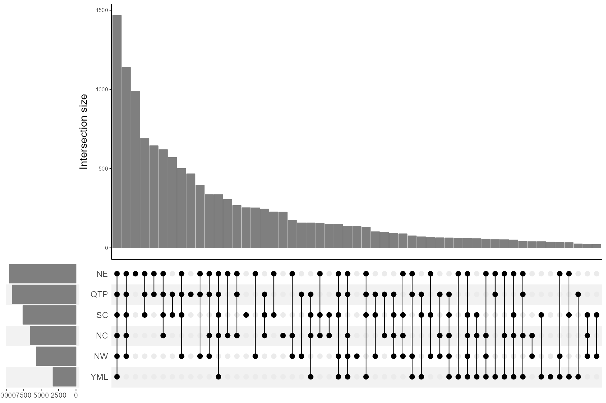
```

Generally, after getting the intersection results, we do not know who those shared or unique taxa are.
The composition of the unique or shared species may account for the different and similar parts of ecological characteristics across groups[@Mendes_Deciphering_2011].
So, it is interesting to further analyze the composition of unique and shared species. 
For this goal, we first transform the results of venn plot to the traditional feature-sample table, that is, another object of microtable class.

```{r, echo = TRUE, eval = TRUE}
dataset1 <- dataset$merge_samples(use_group = "Group")
t1 <- trans_venn$new(dataset1)
# transform venn results to the sample-species table, here do not consider abundance, only use presence/absence.
t2 <- t1$trans_comm(use_frequency = TRUE)
# t2 is a new microtable class, each part is considered a sample
class(t2)
```

We use bar plot to show the composition at the Genus level.

```{r, echo = TRUE, eval = FALSE}
# calculate taxa abundance, that is, the frequency
t2$cal_abund()
# transform and plot
t3 <- trans_abund$new(dataset = t2, taxrank = "Genus", ntaxa = 8)
t3$plot_bar(bar_full = FALSE, legend_text_italic = T, xtext_angle = 30, color_values = RColorBrewer::brewer.pal(8, "Set2"),
	order_x = c("IW", "CW", "TW", "IW&CW", "IW&TW", "CW&TW", "IW&CW&TW")) + ylab("Frequency (%)")
```


```{r, out.width = "650px", fig.align="center", echo = FALSE}
knitr::include_graphics("Images/trans_venn_bar.png")
```

We also try to use pie chart to show the compositions at the Phylum level.

```{r, echo = TRUE, eval = FALSE}
t3 <- trans_abund$new(dataset = t2, taxrank = "Phylum", ntaxa = 8)
t3$data_abund$Sample %<>% factor(., levels = unique(.))
t3$plot_pie(facet_nrow = 3, color_values = c(RColorBrewer::brewer.pal(8, "Dark2"), "grey50"))
```

```{r, out.width = "800px", fig.align="center", echo = FALSE}
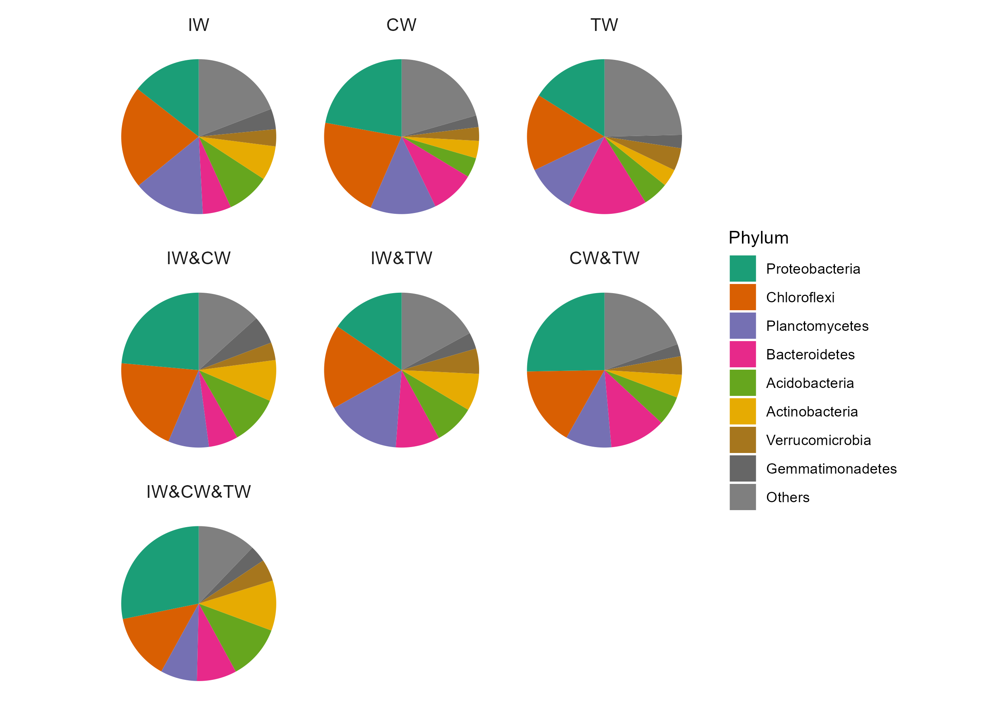
```

Other examples:

To reorder samples in the plots, please manipulate the sample_table in the object to adjust the orders.
```{r, echo = TRUE, eval = FALSE}
test <- dataset$merge_samples(use_group = "Type")
test$sample_table %<>% .[c("YML", "NE", "NW", "NC", "QTP", "SC"), , drop = FALSE]
test$tidy_dataset()
# The columns of otu_table can also be reordered according to the sample_table after running tidy_dataset function
t1 <- trans_venn$new(test)
t1$plot_bar(sort_samples = FALSE)
```

The parameter `sort_samples = TRUE` in `plot_bar` function can be applied to sort samples in the y axis according to the number of features.
The left bar plot can be removed when the parameter `left_plot = FALSE`.

```{r, echo = TRUE, eval = FALSE}
test <- dataset$merge_samples(use_group = "Type")
t1 <- trans_venn$new(test)
# remove left bar in the UpSet plot
t1$plot_bar(left_plot = FALSE)
# sort samples in the axis according to the number of features
t1$plot_bar(sort_samples = TRUE)
# original orders in test$sample_table
t1$plot_bar(sort_samples = FALSE)
```

### Key points

  + ratio parameter: ratio parameter in trans_abund$new control whether and what content appear below the taxa number in venn plot
  + return data: using trans_venn$new() return data_details and data_summary stored in trans_venn object for further ploting


<!--chapter:end:03-Composition-based_class.Rmd-->

# Diversity-based class

Diversity is one of the core topics in community ecology.
It refers to alpha diversity, beta diversity and gamma diversity.


## trans_alpha class

　Alpha diversity can be transformed and visualized using the `trans_alpha` class.
Creating an object of `trans_alpha` class can invoke the alpha_diversity data stored in the microtable object.


### Example

Creating a `trans_alpha` object can return two data.frame with the prefix 'data_': `data_alpha` and `data_stat`.
`data_alpha` is used for subsequent differential test and visualization.


```{r, echo = TRUE, eval = FALSE}
t1 <- trans_alpha$new(dataset = dataset, group = "Group")
# return t1$data_stat
head(t1$data_stat)
```

```{r, echo = FALSE}
t1 <- trans_alpha$new(dataset = dataset, group = "Group")
pander::pander(head(t1$data_stat))
```

Then, we test the differences among groups using Kruskal-Wallis Rank Sum Test (overall test when groups > 2), Wilcoxon Rank Sum Tests (for paired groups),
Dunn's Kruskal-Wallis Multiple Comparisons (for paired groups when groups > 2) and anova with multiple comparisons.

```{r, echo = TRUE, eval = FALSE}
t1$cal_diff(method = "KW")
# return t1$res_diff
head(t1$res_diff)
```

```{r, echo = FALSE}
suppressWarnings(t1$cal_diff(method = "KW"))
pander::pander(head(t1$res_diff[, -3]))
```

```{r, echo = TRUE, eval = FALSE}
t1$cal_diff(method = "KW_dunn")
# return t1$res_diff
head(t1$res_diff)
```

```{r, echo = FALSE}
t1$cal_diff(method = "KW_dunn")
pander::pander(head(t1$res_diff))
```

```{r, echo = TRUE, eval = FALSE}
# more options
t1$cal_diff(method = "KW_dunn", KW_dunn_letter = FALSE)
head(t1$res_diff)
t1$cal_diff(method = "wilcox")
head(t1$res_diff)
t1$cal_diff(method = "t.test")
```

Then, let's try to use anova. 
From v1.0.0, the `alpha` parameter can be used to adjust the significance threshold (default: 0.05) of multiple comparisons when method is 'anova' or 'KW_dunn'.


```{r, echo = TRUE, eval = FALSE}
t1$cal_diff(method = "anova")
# return t1$res_diff
head(t1$res_diff)
```

```{r, echo = FALSE}
suppressMessages(library(agricolae))
t1$cal_diff(method = "anova")
pander::pander(head(t1$res_diff))
```

The multi-factor analysis of variance is also supported with the `formula` parameter, such as two-way anova. 

```{r, echo = TRUE, eval = FALSE}
t1 <- trans_alpha$new(dataset = dataset, group = "Group")
t1$cal_diff(method = "anova", formula = "Group+Type")
head(t1$res_diff)
# see the help document for the usage of formula
```


The plot_alpha function add the significance label by searching the results in **object$res_diff** instead of recalculating the significance.
Now, let's plot the alpha diversity for each group and include the anova result.

```{r, echo = TRUE, eval = FALSE}
t1$cal_diff(method = "anova")
# y_increase can adjust the distance from the letters to the highest point
t1$plot_alpha(measure = "Chao1", y_increase = 0.3)
t1$plot_alpha(measure = "Chao1", y_increase = 0.1)
# add_sig_text_size: letter size adjustment
t1$plot_alpha(measure = "Chao1", add_sig_text_size = 6, boxplot_add = "jitter", order_x_mean = TRUE)
```

```{r, out.width = "600px", fig.align="center", echo = FALSE}
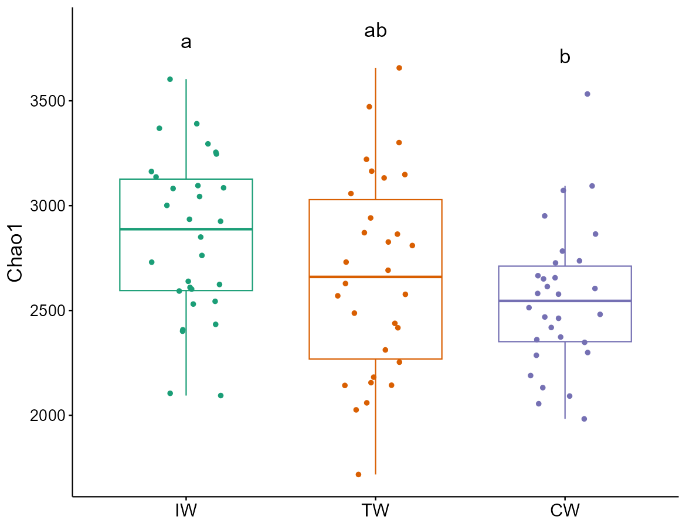
```

```{r, echo = TRUE, eval = FALSE}
t1$cal_diff(method = "wilcox")
t1$plot_alpha(measure = "Chao1", shape = "Group")
# y_start: starting height for the first label
# y_increase: increased height for each label
t1$plot_alpha(measure = "Chao1", shape = "Group", y_start = 0.1, y_increase = 0.1)
```

```{r, out.width = "600px", fig.align="center", echo = FALSE}
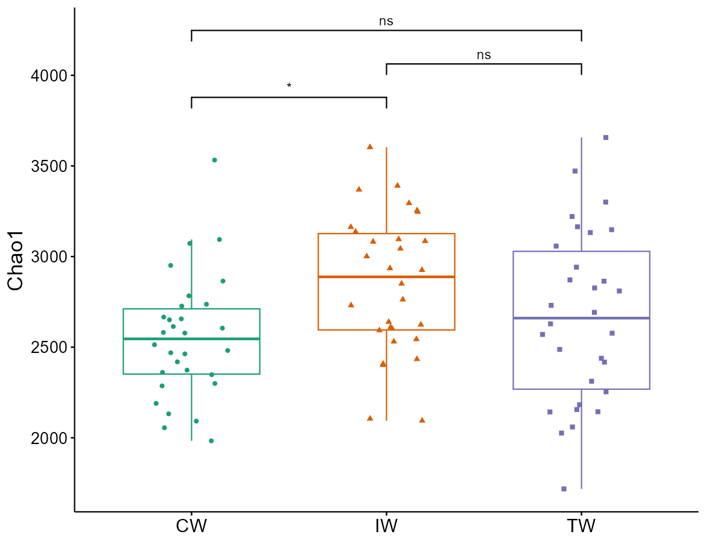
```

Let's try to remove the 'ns' in the label by manipulating the object$res_diff.

```{r, echo = TRUE, eval = FALSE}
t1$res_diff %<>% base::subset(Significance != "ns")
t1$plot_alpha(measure = "Chao1", boxplot_add = "dotplot", xtext_size = 15)
```

```{r, out.width = "600px", fig.align="center", echo = FALSE}
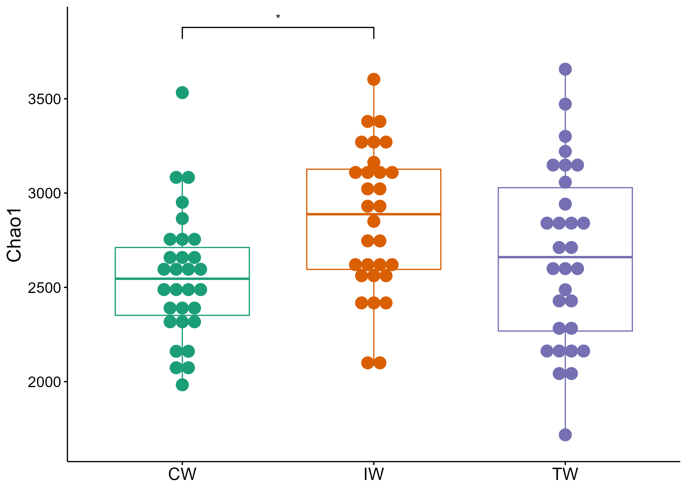
```

The trans_alpha class supports the differential test of groups within each group using the by_group parameter.

```{r, echo = TRUE, eval = FALSE}
t1 <- trans_alpha$new(dataset = dataset, group = "Type", by_group = "Group")
t1$cal_diff(method = "wilcox")
t1$plot_alpha(measure = "Shannon")
```

```{r, out.width = "600px", fig.align="center", echo = FALSE}
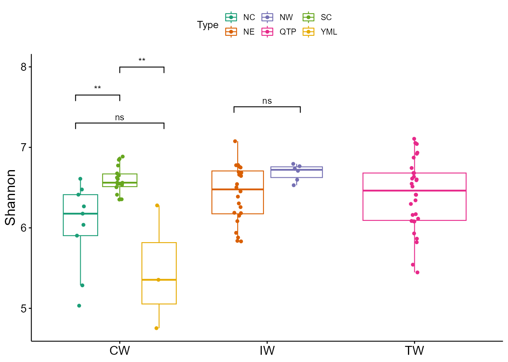
```


Scheirer Ray Hare test is a nonparametric test that is suitable for a two-way factorial experiment.

```{r, echo = TRUE, eval = FALSE}
# require rcompanion package to be installed
t1$cal_diff(method = "scheirerRayHare", formula = "Group+Type")
```


Linear mixed-effects model can be selected with the `method = "lme"`.
This model is implemented based on the `lmerTest` package.
For more parameters, please see `lmerTest::lmer` function.
Please use parameter passing when more parameters are needed.
For the formula usage, please follow this (https://mspeekenbrink.github.io/sdam-r-companion/linear-mixed-effects-models.html).
In the return table, conditional R2 is the total variance explained by fixed and random effects, 
and marginal R2 is the variance explained by fixed effects.

```{r, echo = TRUE, eval = FALSE}
if(!require("lmerTest")) install.packages("lmerTest")
t1 <- trans_alpha$new(dataset = dataset)
# just using (1|Type) as an example to show the random effect
t1$cal_diff(method = "lme", formula = "Group + (1|Type)")
View(t1$res_diff)
# return_model = TRUE can return original models, i.e. object$res_model
t1$cal_diff(method = "lme", formula = "Group + (1|Type)", return_model = TRUE)
```

Note that from v1.2.0, the parameter `use_boxplot = FALSE` in `plot_alpha` will invoke the data_stat instead of data_alpha for the Mean±SE (or SD) plot.
The line is optional to be added between points (Mean) for the case with a gradient.

```{r, echo = TRUE, eval = FALSE}
t1 <- trans_alpha$new(dataset = dataset, group = "Group")
t1$cal_diff(method = "KW_dunn", measure = "PD", KW_dunn_letter = TRUE)
t1$plot_alpha(measure = "PD")
t1$plot_alpha(use_boxplot = FALSE, measure = "PD")
t1$plot_alpha(use_boxplot = FALSE, measure = "PD", y_increase = -0.2)
t1$plot_alpha(use_boxplot = FALSE, measure = "PD", y_increase = -0.2, add_line = TRUE, line_type = 2, line_alpha = 0.5, errorbar_width = 0.1)
t1$plot_alpha(use_boxplot = FALSE, plot_SE = FALSE, measure = "PD", y_increase = 0.2, add_line = TRUE, line_type = 2, line_alpha = 0.5, errorbar_width = 0.1)
# by_group example
# use example data in mecoturn package
library(microeco)
library(mecoturn)
library(magrittr)
data(wheat_16S)
wheat_16S$sample_table$Type %<>% factor(., levels = unique(.))
t1 <- trans_alpha$new(dataset = wheat_16S, group = "Region", by_group = "Type")
t1$cal_diff(method = "KW_dunn", measure = "Shannon", KW_dunn_letter = TRUE)
View(t1$res_diff)
t1$plot_alpha(use_boxplot = FALSE, measure = "Shannon")
t1$plot_alpha(use_boxplot = FALSE, measure = "Shannon", add_line = TRUE, line_type = 2)
t1$plot_alpha(use_boxplot = FALSE, plot_SE = FALSE, measure = "Shannon", add_line = TRUE, line_type = 2)
```

From v1.4.0, the heatmap can be used to visualize the significances for the case with multiple factors in the formula.

```{r, echo = TRUE, eval = FALSE}
t1 <- trans_alpha$new(dataset = dataset, group = "Group")
t1$cal_diff(method = "anova", formula = "Group+Type+Group:Type")
t1$plot_alpha(color_palette = rev(RColorBrewer::brewer.pal(n = 11, name = "RdYlBu")), trans = "log10")
t1$plot_alpha(color_palette = c("#053061", "white", "#A50026"), trans = "log10")
t1$plot_alpha(color_values = c("#053061", "white", "#A50026"), trans = "log10")
t1$plot_alpha(color_values = c("#053061", "white", "#A50026"), trans = "log10", filter_feature = "", text_y_position = "left")
t1$plot_alpha(color_values = c("#053061", "white", "#A50026"), trans = "log10", filter_feature = "", text_y_position = "left", cluster_ggplot = "row")
```

### Key points

  + trans_alpha$new: creating `trans_alpha` object can invoke `alpha_diversity` in microtable for transformation
  + cal_diff: `formula` parameter applies to multi-factor analysis of variance.
  + cal_diff: From v1.2.0, `anova_post_test` can be used to change default post test method of anova.
  + plot_alpha: the significance label comes from the results in `object$res_diff`


## trans_beta class

　The trans_beta class is specifically designed for the beta diversity analysis, i.e. the dissimilarities among samples.
Beta diversity can be defined at different forms[@Tuomisto_diversity_2010] and can be explored with different ways[@Anderson_Navigating_2011].
We encapsulate some commonly-used approaches in microbial ecology[@Ramette_Multivariate_2007].
Note that the part of beta diversity related with environmental factors are placed into the trans_env class.
The distance matrix in beta_diversity list of microtable object will be invoked for transformation and ploting using trans_beta class when needed.
The analysis referred to the beta diversity in this class mainly include ordination, group distance, clustering and manova.


### Example

We first show the ordination using PCoA (principal coordinates analysis).

```{r, echo = TRUE, eval = TRUE}
# create an trans_beta object
# measure parameter must be one of names(dataset$beta_diversity)
t1 <- trans_beta$new(dataset = dataset, group = "Group", measure = "bray")
```

```{r, echo = TRUE, eval = FALSE}
# PCoA, PCA, DCA and NMDS are available
t1$cal_ordination(ordination = "PCoA")
# t1$res_ordination is the ordination result list
class(t1$res_ordination)
# plot the PCoA result with confidence ellipse
t1$plot_ordination(plot_color = "Group", plot_shape = "Group", plot_type = c("point", "ellipse"))
```

```{r, out.width = "650px", fig.align="center", echo = FALSE}

```

More examples on different options.

```{r, echo = TRUE, eval = FALSE}
t1$plot_ordination(plot_color = "Type", plot_type = "point")
t1$plot_ordination(plot_color = "Group", point_size = 5, point_alpha = .2, plot_type = c("point", "ellipse"), ellipse_chull_fill = FALSE)
t1$plot_ordination(plot_color = "Group", plot_shape = "Group", plot_type = c("point", "centroid"))
t1$plot_ordination(plot_color = "Group", plot_shape = "Group", plot_type = c("point", "ellipse", "centroid"))
t1$plot_ordination(plot_color = "Group", plot_shape = "Group", plot_type = c("point", "chull"))
t1$plot_ordination(plot_color = "Group", plot_shape = "Group", plot_type = c("point", "chull", "centroid"))
t1$plot_ordination(plot_color = "Group", plot_shape = "Group", plot_type = c("chull", "centroid"))
t1$plot_ordination(plot_color = "Group", plot_shape = "Group", plot_type = c("point", "chull", "centroid"), add_sample_label = "SampleID")
t1$plot_ordination(plot_color = "Group", plot_shape = "Group", plot_type = "centroid")
t1$plot_ordination(plot_color = "Group", plot_shape = "Group", plot_type = "centroid", centroid_segment_alpha = 0.9, centroid_segment_size = 1, centroid_segment_linetype = 1)
t1$plot_ordination(plot_type = c("point", "centroid"), plot_color = "Type", centroid_segment_linetype = 1)
t1$plot_ordination(plot_color = "Saline", point_size = 5, point_alpha = .2, plot_type = c("point", "chull"), ellipse_chull_fill = FALSE, ellipse_chull_alpha = 0.1)
t1$plot_ordination(plot_color = "Group") + theme(panel.grid = element_blank()) + geom_vline(xintercept = 0, linetype = 2) + geom_hline(yintercept = 0, linetype = 2)
```

One example for PCA or DCA with Genus data and loading arrow.

```{r, echo = TRUE, eval = FALSE}
d1 <- dataset$merge_taxa(taxa = "Genus")
d1$tax_table %<>% .[.$Genus != "g__", ]
d1$tidy_dataset()
rownames(d1$otu_table) <- d1$tax_table[rownames(d1$otu_table), "Genus"]
rownames(d1$tax_table) <- d1$tax_table[, "Genus"]
t1 <- trans_beta$new(dataset = d1)
t1$cal_ordination(ordination = "PCA")
t1$plot_ordination(plot_color = "Group", loading_arrow = TRUE, loading_text_italic = TRUE)
t1$cal_ordination(ordination = "DCA")
t1$plot_ordination(plot_color = "Group", loading_arrow = TRUE, loading_text_italic = TRUE)
```

Then we plot and compare the group distances.

```{r, echo = TRUE, eval = FALSE}
# calculate and plot sample distances within groups
t1$cal_group_distance(within_group = TRUE)
# return t1$res_group_distance
# perform Wilcoxon Rank Sum and Signed Rank Tests
t1$cal_group_distance_diff(method = "wilcox")
# plot_group_order parameter can be used to adjust orders in x axis
t1$plot_group_distance(boxplot_add = "mean")
```

```{r, out.width = "500px", fig.align="center", echo = FALSE}
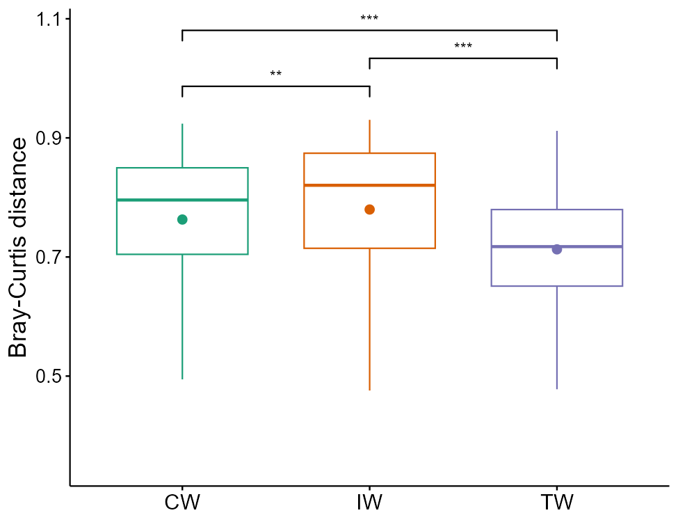
```

```{r, echo = TRUE, eval = FALSE}
# calculate and plot sample distances between groups
t1$cal_group_distance(within_group = FALSE)
t1$cal_group_distance_diff(method = "wilcox")
t1$plot_group_distance(boxplot_add = "mean")
```

```{r, out.width = "500px", fig.align="center", echo = FALSE}
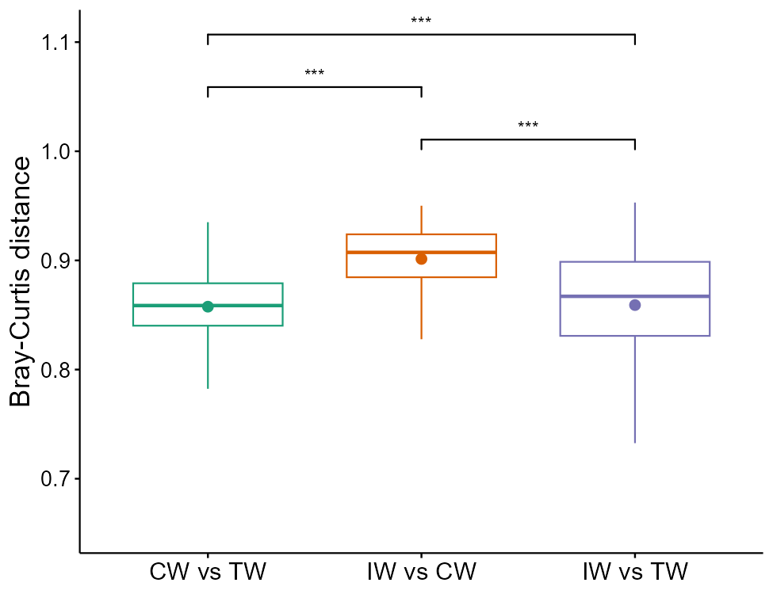
```

Clustering plot is also a frequently used method.

```{r, echo = TRUE, eval = FALSE}
# extract a part of data
d1 <- clone(dataset)
d1$sample_table %<>% subset(Group %in% c("CW", "TW"))
d1$tidy_dataset()
t1 <- trans_beta$new(dataset = d1, group = "Group")
# use replace_name to set the label name, group parameter used to set the color
t1$plot_clustering(group = "Type", replace_name = c("Type"))
```

```{r, out.width = "550px", fig.align="center", echo = FALSE}
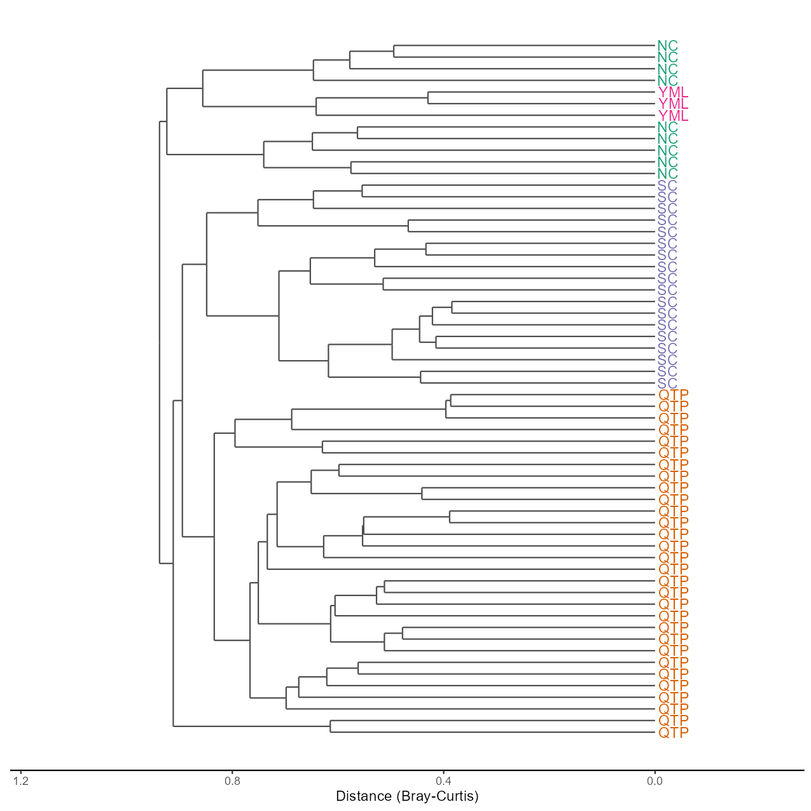
```


PerMANOVA[@Anderson_Austral_2001] can be applied to the differential test of distances among groups via the `cal_manova` function developed 
based on the `adonis2` function of vegan package.

```{r, echo = TRUE, eval = FALSE}
# manova for all groups when manova_all = TRUE
t1$cal_manova(manova_all = TRUE)
t1$res_manova
```

```{r, echo = FALSE}
t1$cal_manova(manova_all = TRUE)
pander::pander(t1$res_manova)
```

The parameter `manova_all = FALSE` can make the test switch to paired group comparison.


```{r, echo = TRUE, eval = FALSE}
# manova for each paired groups
t1$cal_manova(manova_all = FALSE)
t1$res_manova
```

```{r, echo = FALSE}
t1$cal_manova(manova_all = FALSE)
pander::pander(t1$res_manova)
```

When there are too many comparison pairs or when comparisons are valuable only within certain categories, the `by_group` parameter can be used.

```{r, echo = TRUE, eval = FALSE}
t1$cal_manova(manova_all = FALSE, group = "Type", by_group = "Group")
t1$res_manova
```

```{r, echo = FALSE}
t1$cal_manova(manova_all = FALSE, group = "Type", by_group = "Group")
pander::pander(t1$res_manova)
```


The parameter `manova_set` has higher priority than `manova_all`. If `manova_set` is provided, manova_all parameter will be disabled.

```{r, echo = TRUE, eval = FALSE}
# manova for specified group set: such as "Group + Type"
t1$cal_manova(manova_set = "Group + Type")
t1$res_manova
```

```{r, echo = FALSE}
t1$cal_manova(manova_set = "Group + Type")
pander::pander(t1$res_manova)
```

From v1.0.0, ANOSIM method is also available.

```{r, echo = TRUE, eval = FALSE}
# the group parameter is not necessary when it is provided in creating the object
t1$cal_anosim(group = "Group")
t1$res_anosim
t1$cal_anosim(group = "Group", paired = TRUE)
t1$res_anosim
```

PERMDISP[@Anderson_Navigating_2011] is implemented to test multivariate homogeneity of groups dispersions (variances) based on the `betadisper` function of vegan package.

```{r, echo = TRUE}
# for the whole comparison and for each paired groups
t1$cal_betadisper()
t1$res_betadisper
```

For the explanation of statistical methods in microbial ecology, please read the references [@Ramette_Multivariate_2007; @Buttigieg_guide_2014].


### Key points

  + trans_beta$new: creating `trans_beta` object with `measure` parameter can invoke `beta_diversity` in `microtable` object for transformation
  + cal_ordination(): PCoA, PCA and NMDS approaches are all available
  + cal_manova(): `cal_manova` function can be used for paired comparisons, overall test and multi-factors test
  + plot_group_distance(): manipulating `object$res_group_distance_diff` can control what statistical results are presented in the plot.


<!--chapter:end:04-Diversity-based_class.Rmd-->

# Model-based class

All the classes with complex models are grouped into this section.


## trans_diff class

　Differential abundance test is an important part in the microbiome profiling analysis.
It can find the significant taxa in determining community differences across groups.
Different approaches may produce inconsistent results since the underlying models/hypothesis are different [@Nearing_Microbiome_2022].
Currently, trans_diff class has multiple famous differential test approaches or wrapped methods to better capture the important biomarkers: 
Kruskal-Wallis Rank Sum Test (for groups > 2), Wilcoxon Rank Sum Tests (for each paired group),  
Dunn's Kruskal-Wallis Multiple Comparisons (for paired group in cases groups > 2),
t-test, ANOVA, Scheirer Ray Hare test, linear regression,
metastat[@White_Statistical_2009], LEfSe[@Segata_Metagenomic_2011], RF (random forest + differential test), metagenomeSeq[@Paulson_Differential_2013],
DESeq2 [@Michael_Moderated_2014], ALDEx2 [@Fernandes_Unifying_2014],
ANCOM-BC2 [@Lin_Analysis_2020], 
LinDA [@LinDA_Zhou_2022], beta regression [@Betaregression_2010],
linear mixed-effects model and generalized linear mixed model.
Given that multiple approaches are available, 
it is feasible to compare the results from different approaches and extract a part of biomarkers with high confidence for a specific dataset.


### Example

All the differential test result is stored in the `object$res_diff`.
LEfSe combines the non-parametric test and linear discriminant analysis [@Segata_Metagenomic_2011].

```{r, echo = TRUE, eval = FALSE}
t1 <- trans_diff$new(dataset = dataset, method = "lefse", group = "Group", alpha = 0.01, lefse_subgroup = NULL)
# see t1$res_diff for the result
# From v0.8.0, threshold is used for the LDA score selection.
t1$plot_diff_bar(threshold = 4)
# we show 20 taxa with the highest LDA (log10)
t1$plot_diff_bar(use_number = 1:30, width = 0.8, group_order = c("CW", "IW", "TW"))
```

```{r, out.width = "700px", fig.align="center", echo = FALSE}
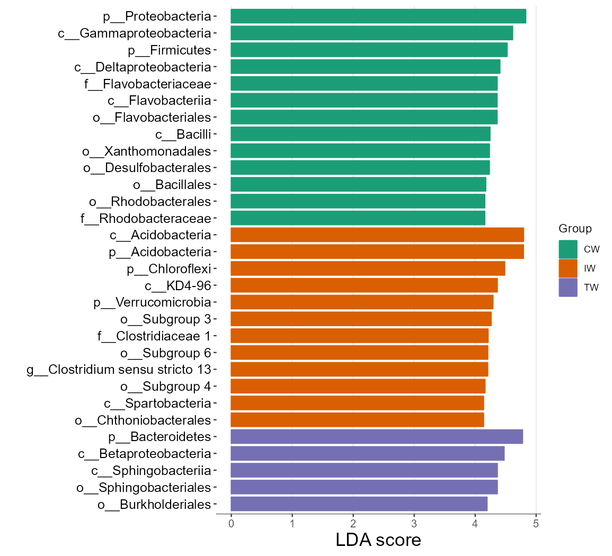
```

```{r, echo = TRUE, eval = FALSE}
# show part of the table
t1$res_diff[1:5, c(1, 3, 4, 6)]
```

```{r, echo = FALSE, eval = TRUE}
res_lefse <- read.csv("Files/res_lefse.csv")
pander::pander(res_lefse[1:5, c(1, 3, 4, 6)])
```

Then, the abundance of biomarkers detected by LEfSe can be visualized easily.

```{r, echo = TRUE, eval = FALSE}
t1$plot_diff_abund(use_number = 1:30, group_order = c("CW", "IW", "TW"))
```

```{r, out.width = "650px", fig.align="center", echo = FALSE}
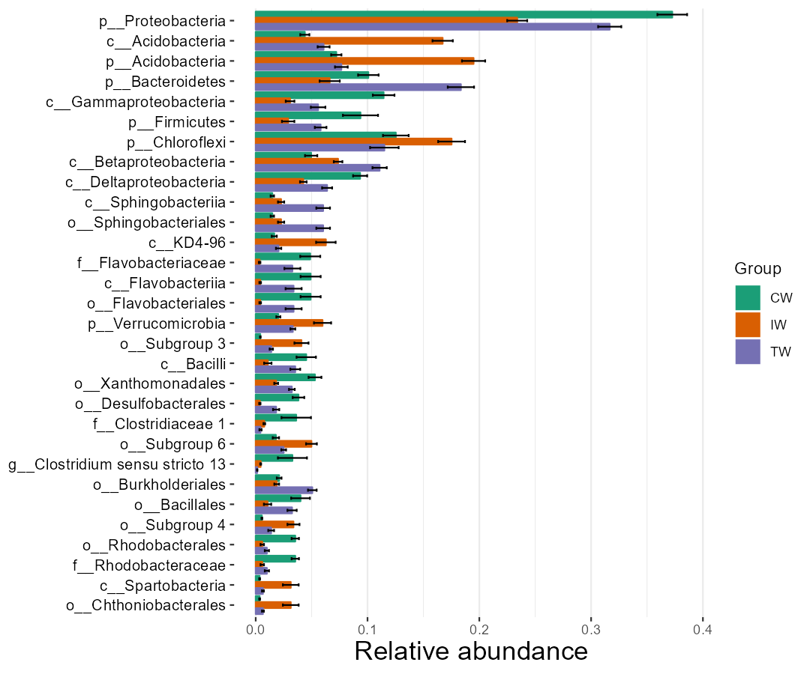
```

Then, we show the cladogram of the differential features in the taxonomic tree.
There are too many taxa in this dataset.
As an example, we only select the highest 200 abundant taxa in the tree and 50 differential features.
We only show the full taxonomic label at Phylum level and use letters at other levels to reduce the text overlap.
**Note that if an error occurs in this function, the reason with a high probability is the chaotic taxonomy in the user's data**.
**Please use the `tidy_taxonomy` function to solve this issue.**
For the tidy_taxonomy examples, please refer to another section (https://chiliubio.github.io/microeco_tutorial/other-examples-1.html#tidy_taxonomy-function).


```{r, echo = TRUE, eval = FALSE}
# clade_label_level 5 represent phylum level in this analysis
# require ggtree package
t1$plot_diff_cladogram(use_taxa_num = 200, use_feature_num = 50, clade_label_level = 5, group_order = c("CW", "IW", "TW"))
```

```{r, out.width = "1000px", fig.align="center", echo = FALSE}
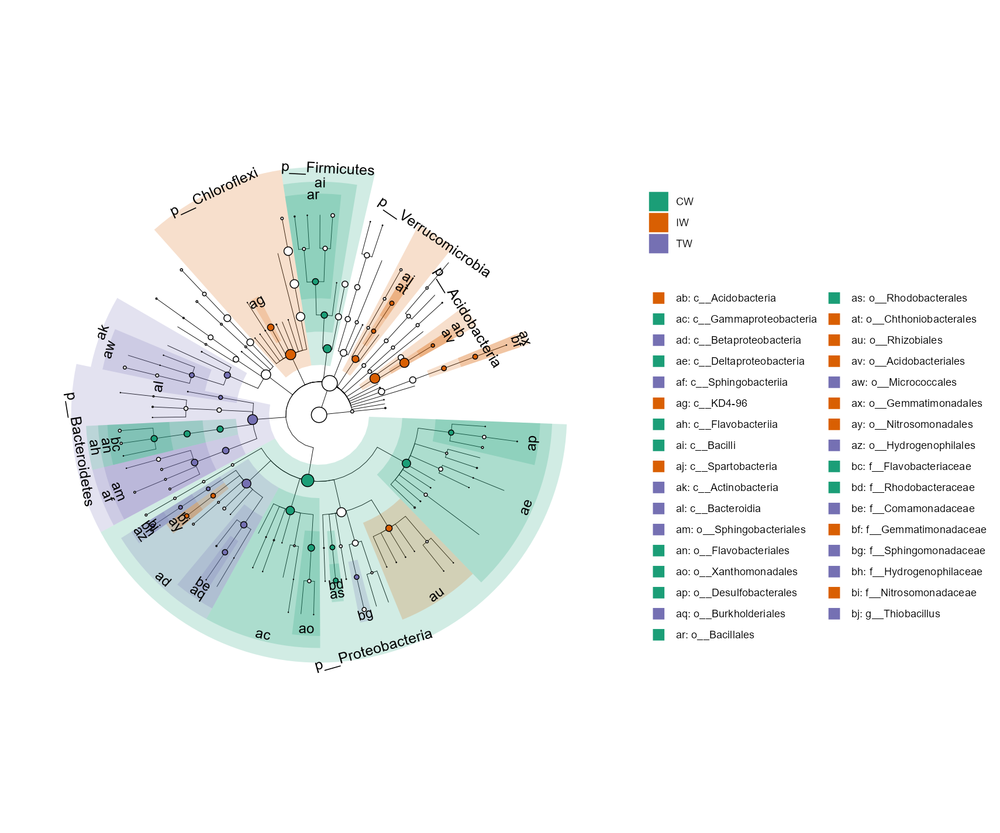
```

There may be a problem related with the taxonomic labels in the plot.
When there are too many levels shown, the taxonomic labels can have too much overlap.
However, if only Phylum labels are indicated, the taxa in the legend with marked letters are too many.
At this time, taxa can be manually choosed to show like the following operation.

```{r, echo = TRUE, eval = FALSE}
# choose some taxa according to the positions in the previous picture; those taxa labels have minimum overlap
use_labels <- c("c__Deltaproteobacteria", "c__Actinobacteria", "o__Rhizobiales", "p__Proteobacteria", "p__Bacteroidetes", 
	"o__Micrococcales", "p__Acidobacteria", "p__Verrucomicrobia", "p__Firmicutes", 
	"p__Chloroflexi", "c__Acidobacteria", "c__Gammaproteobacteria", "c__Betaproteobacteria", "c__KD4-96",
	"c__Bacilli", "o__Gemmatimonadales", "f__Gemmatimonadaceae", "o__Bacillales", "o__Rhodobacterales")
# then use parameter select_show_labels to show
t1$plot_diff_cladogram(use_taxa_num = 200, use_feature_num = 50, select_show_labels = use_labels)
# Now we can see that more taxa names appear in the tree
```

```{r, out.width = "1000px", fig.align="center", echo = FALSE}
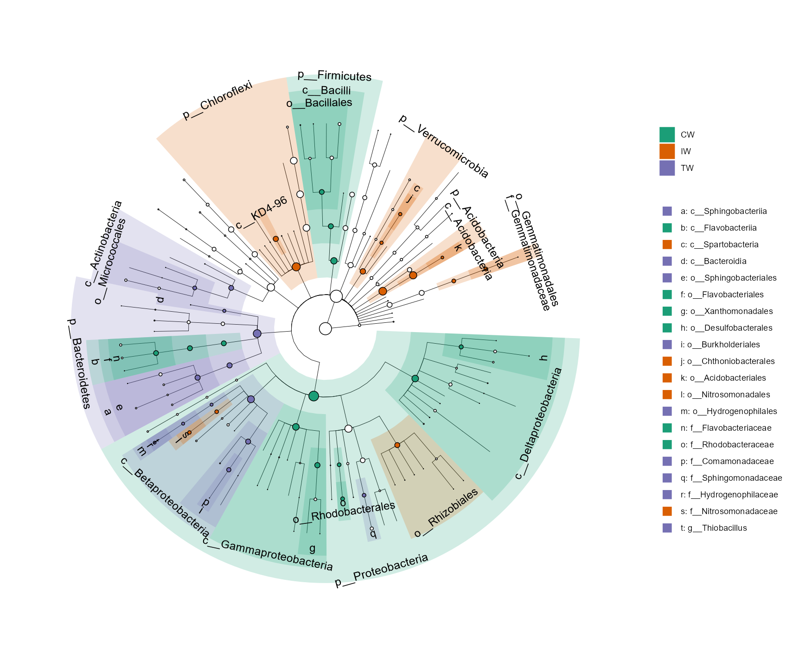
```


The 'rf' method depends on the random forest[@Beck_Machine_2014; @Yatsunenko_Human_2012] and the non-parametric test.
The current method implements random forest by bootstrapping like the operation in LEfSe and employs the significant features as input.
MeanDecreaseGini is selected as the indicator value in the analysis.

```{r, echo = TRUE, eval = FALSE}
# use Genus level for parameter taxa_level, if you want to use all taxa, change to "all"
# nresam = 1 and boots = 1 represent no bootstrapping and use all samples directly
t1 <- trans_diff$new(dataset = dataset, method = "rf", group = "Group", taxa_level = "Genus")
# plot the MeanDecreaseGini bar
# group_order is designed to sort the groups
g1 <- t1$plot_diff_bar(use_number = 1:20, group_order = c("TW", "CW", "IW"))
# plot the abundance using same taxa in g1
g2 <- t1$plot_diff_abund(group_order = c("TW", "CW", "IW"), select_taxa = t1$plot_diff_bar_taxa)
# now the y axis in g1 and g2 is same, so we can merge them
# remove g1 legend; remove g2 y axis text and ticks
g1 <- g1 + theme(legend.position = "none")
g2 <- g2 + theme(axis.text.y = element_blank(), axis.ticks.y = element_blank())
gridExtra::grid.arrange(g1, g2, ncol = 2, nrow = 1, widths = c(2, 1.7))
```

```{r, out.width = "800px", fig.align="center", echo = FALSE}
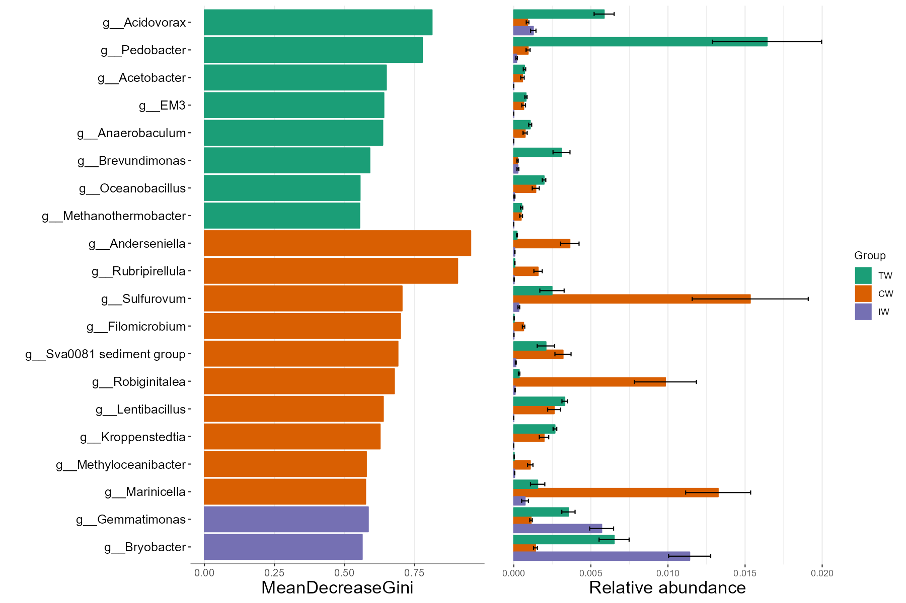
```

The significance label can also be added in the abundance plot controlled by add_sig parameter and other related parameters.
Now adding labels supports all the differential test methods.

```{r, echo = TRUE, eval = FALSE}
t1 <- trans_diff$new(dataset = dataset, method = "wilcox", group = "Group", taxa_level = "Genus", filter_thres = 0.001)
# filter something not needed to show
t1$res_diff %<>% subset(Significance %in% "***")
t1$plot_diff_abund(use_number = 1:10, add_sig = T, add_sig_label = "Significance")
```

```{r, out.width = "700px", fig.align="center", echo = FALSE}
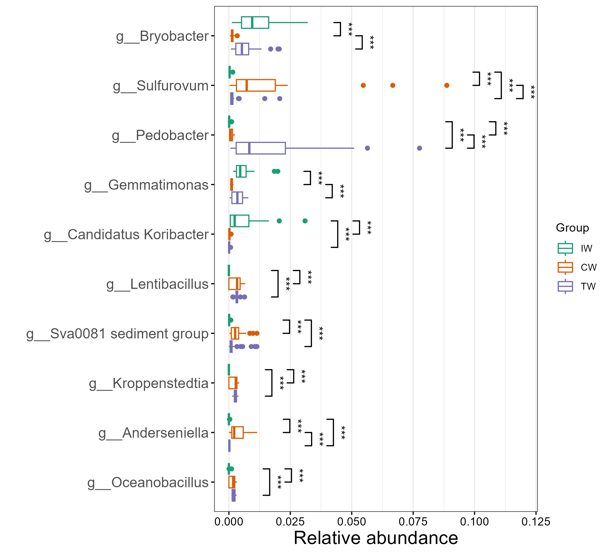
```

```{r, echo = TRUE, eval = FALSE}
t1 <- trans_diff$new(dataset = dataset, method = "anova", group = "Group", taxa_level = "Genus", filter_thres = 0.001)
t1$plot_diff_abund(use_number = 1:10, add_sig = T, coord_flip = F)
```

```{r, out.width = "700px", fig.align="center", echo = FALSE}
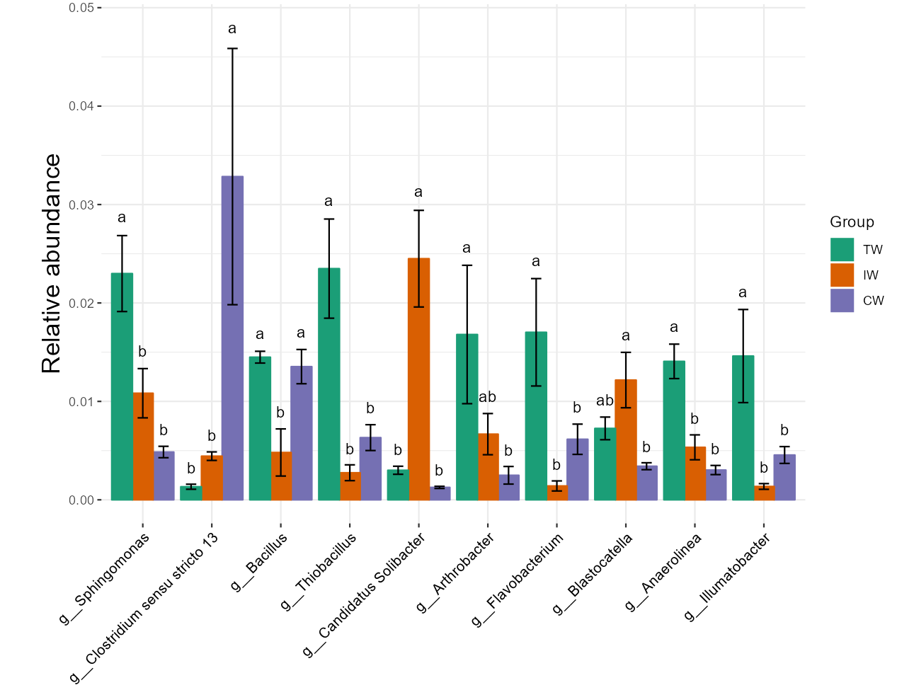
```

Metastat depends on the permutations and t-test and performs well on the sparse data for paired groups test.

```{r, echo = TRUE, eval = FALSE}
# metastat analysis at Genus level
t1 <- trans_diff$new(dataset = dataset, method = "metastat", group = "Group", taxa_level = "Genus")
# t1$res_diff is the differential test result
```

Because the example 'Group' in sample_table has three groups, 
the metastat can run the comparisons for each paired group. So there are three pairs in t1\$res_diff\$Comparison.
For the abundance plotting, the user should use select_group parameter to select the specific pair.

```{r, echo = TRUE, eval = FALSE}
# select_group should be one of groups in t1$res_diff$Comparison
t1$plot_diff_abund(use_number = 1:20, select_group = "CW - TW", coord_flip = F)
```

```{r, out.width = "650px", fig.align="center", echo = FALSE}
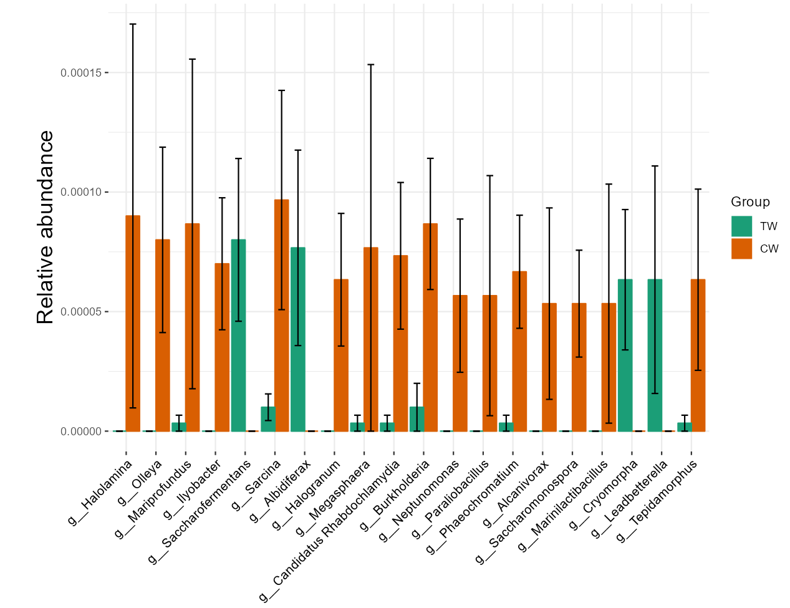
```

The following are some examples for the methods 'KW', 'KW_dunn', 'wilcox', 't.test' and 'anova'.

```{r, echo = TRUE, eval = FALSE}
# Kruskal-Wallis Rank Sum Test for all groups (>= 2)
t1 <- trans_diff$new(dataset = dataset, method = "KW", group = "Group", taxa_level = "all", filter_thres = 0.001)
t1$plot_diff_abund(use_number = 1:20)
# Dunn's Kruskal-Wallis Multiple Comparisons when group number > 2; require FSA package
t1 <- trans_diff$new(dataset = dataset, method = "KW_dunn", group = "Group", taxa_level = "Genus", filter_thres = 0.0001)
t1$plot_diff_abund(use_number = 1:10, add_sig = T, coord_flip = F)
# Wilcoxon Rank Sum and Signed Rank Tests for all paired groups
t1 <- trans_diff$new(dataset = dataset, method = "wilcox", group = "Group", taxa_level = "Genus", filter_thres = 0.001)
t1$plot_diff_bar(use_number = 1:20, select_group = "CW - TW")
t1$plot_diff_abund(use_number = 1:20, select_group = "CW - TW", group_order = c("TW", "CW"))
# t.test
t1 <- trans_diff$new(dataset = dataset, method = "t.test", group = "Group", taxa_level = "all", filter_thres = 0.001)
# anova
t1 <- trans_diff$new(dataset = dataset, method = "anova", group = "Group", taxa_level = "Phylum", filter_thres = 0.001)
head(t1$res_diff)
```

The method 'metagenomeSeq' [@Paulson_Differential_2013] and 'ancombc2' [@Lin_Analysis_2020] depend on the metagenomeSeq package and ANCOMBC package, respectively.
The method 'ALDEx2_t' and 'ALDEx2_kw' depend on the ALDEx2 package [@Fernandes_Unifying_2014].
These three packages are all deposited on the Bioconductor.

```{r, echo = TRUE, eval = FALSE}
# zero-inflated log-normal model-based differential test method from metagenomeSeq package
# If metagenomeSeq package is not installed, please first run: BiocManager::install("metagenomeSeq")
t1 <- trans_diff$new(dataset = dataset, method = "metagenomeSeq", group = "Group", taxa_level = "Genus")
t1 <- trans_diff$new(dataset = dataset, method = "metagenomeSeq", group = "Group", taxa_level = "OTU")
t1$plot_diff_abund(use_number = 1:30, group_order = c("TW", "CW", "IW"))
t1$plot_diff_bar(use_number = 1:20)
```

```{r, echo = TRUE, eval = FALSE}
# 'ALDEx2_t' and 'ALDEx2_kw' methods; use ?trans_diff to see detailed description of the methods
# If ALDEx2 package is not installed, please first run: BiocManager::install("ALDEx2")
# 'ALDEx2_t'
t1 <- trans_diff$new(dataset = dataset, method = "ALDEx2_t", group = "Group", taxa_level = "Phylum")
t1$plot_diff_abund(use_number = 1:20, group_order = c("TW", "CW", "IW"))
t1$plot_diff_abund(use_number = 1:20, select_group = "CW - TW")
t1$plot_diff_abund(use_number = 1:20, select_group = "CW - TW", add_sig = TRUE)
t1 <- trans_diff$new(dataset = dataset, method = "ALDEx2_t", group = "Group", taxa_level = "OTU", filter_thres = 0.0005)
# ALDEx2_kw
t1 <- trans_diff$new(dataset = dataset, method = "ALDEx2_kw", group = "Group", taxa_level = "OTU", filter_thres = 0.001)
t1$plot_diff_abund(use_number = 1:30, group_order = c("TW", "CW", "IW"))
t1$plot_diff_bar(use_number = 1:20)
t1$plot_diff_abund(use_number = 1:30, group_order = c("TW", "CW", "IW"), add_sig = TRUE)
```


```{r, echo = TRUE, eval = FALSE}
# ANCOMBC2 method
# when fix_formula is not provided (necessary in the ancombc2 function of ANCOMBC package), it will be assigned automatically by using group parameter
t1 <- trans_diff$new(dataset = dataset, method = "ancombc2", group = "Group", taxa_level = "Genus", filter_thres = 0.01)
t1$plot_diff_bar(keep_full_name = TRUE, heatmap_cell = "P.adj", heatmap_sig = "Significance", heatmap_x = "Factors", heatmap_y = "Taxa")
# add a continuous variable
dataset$sample_table <- data.frame(dataset$sample_table, env_data_16S[rownames(dataset$sample_table), ])
t2 <- trans_diff$new(dataset = dataset, method = "ancombc2", group = NULL, fix_formula = "pH+Group", taxa_level = "OTU", filter_thres = 0.005)
# original results t2$res_diff_raw
# converted result t2$res_diff
View(t2$res_diff)
```

The method `linda` [@LinDA_Zhou_2022] depends on the MicrobiomeStat package.

```{r, echo = TRUE, eval = FALSE}
# LinDA method. If MicrobiomeStat package is not installed, please first run: install.packages("MicrobiomeStat")
t1 <- trans_diff$new(dataset = dataset, method = "linda", group = "Group", taxa_level = "OTU")
t1$plot_diff_abund(use_number = 1:30, group_order = c("TW", "CW", "IW"), add_sig = TRUE)
t1 <- trans_diff$new(dataset = dataset, method = "linda", group = "Group+Type", taxa_level = "Genus")
View(t1$res_diff)
t1$plot_diff_bar(keep_full_name = TRUE)
# Either group or formula parameter should be provided in v1.5.0. Then are same for linda method.
dataset$sample_table <- data.frame(dataset$sample_table, env_data_16S[rownames(dataset$sample_table), ])
t1 <- trans_diff$new(dataset = dataset, method = "linda", group = "pH + Group", taxa_level = "OTU")
t2 <- trans_diff$new(dataset = dataset, method = "linda", formula = "~pH + Group", taxa_level = "OTU", filter_thres = 0.005)
t2$plot_diff_bar(keep_full_name = FALSE, color_values = c("#053061", "white", "#A50026"), trans = "log10", filter_feature = "", text_y_position = "left")
```

### More options

The dependence packages in the following examples are not mentioned in the previous package dependence part (https://chiliubio.github.io/microeco_tutorial/intro.html#dependence).
The method `DESeq2` from DESeq2 package is also supported in the trans_diff class and no longer demonstrated here.
The linear regression from lm function and linear mixed-effects models from lmerTest package can be fitted with the option `method = 'lm'` and `method = 'lme'`, respectively.
The heatmap can be used in the `plot_diff_bar` function instead of bar plot for the case with multiple factors or formula.


```{r, echo = TRUE, eval = FALSE}
# AST: arc sine square root transformation
if(!require("lmerTest")) install.packages("lmerTest")
t1 <- trans_diff$new(dataset = dataset, method = "lme", formula = "Group+(1|Type)", taxa_level = "Phylum", transformation = "AST", filter_thres = 0.001)
View(t1$res_diff)
t1$plot_diff_bar(heatmap_cell = "Estimate", heatmap_sig = "Significance", heatmap_lab_fill = "Coefficient")
```

The generalized linear mixed model (GLMM) is implemented based on the glmmTMB package.
In this example, we use beta distribution function as the family function, 
because beta distribution is especially appropriate to fit the proportional data (relative abundance here).

```{r, echo = TRUE, eval = FALSE}
if(!require("glmmTMB")) install.packages("glmmTMB")
d1 <- clone(dataset)
t1 <- trans_diff$new(dataset = d1, taxa_level = "Phylum", method = "glmm_beta", 
	formula = "Group + (1|Type)", filter_thres = 0.001)
View(t1$res_diff)
t1$plot_diff_bar(heatmap_cell = "Estimate", heatmap_sig = "Significance", heatmap_lab_fill = "Coefficient")
```

Let's run two-way anova for more usages of heatmap.

```{r, echo = TRUE, eval = FALSE}
t1 <- trans_diff$new(dataset = dataset, method = "anova", formula = "Group + Type", taxa_level = "Phylum", filter_thres = 0.001, transformation = "AST")
t1$plot_diff_bar()
t1$plot_diff_bar(color_palette = rev(RColorBrewer::brewer.pal(n = 11, name = "RdYlBu")), trans = "log10")
t1$plot_diff_bar(color_values = c("#053061", "white", "#A50026"), trans = "log10")
t1$plot_diff_bar(color_values = c("#053061", "white", "#A50026"), trans = "log10", filter_feature = "", text_y_position = "right", cluster_ggplot = "row")
```

### Key points

  + trans_diff\$new: In trans_diff\$new, p_adjust_method = "none" can close the p value adjustment. 
    This is useful in cases where very few significant taxa are found (generally no significant feature found after adjustment) and 
	where LEfSe result is needed to be compared with that from Galaxy server or other LEfSe python version.
  + trans_diff\$new: this class has a strict requirement on the taxonomic information, 
    make sure `tidy_taxonomy()` function has been performed for the `tax_table` in `microtable` object.
  + trans_diff\$new: creating this class invokes one or more tables in `taxa_abund` list, which is stored in `microtable` object.
  + trans_diff\$plot_diff_cladogram: `clade_label_size`, `clade_label_size_add` and `clade_label_size_log` can control the text size all together in the cladogram.
  + trans_diff\$new: from v0.19.0, `transformation` parameter can be employed to transform or normalize relative abundance data based on the mecodev package for
    those methods coming from trans_alpha class ("KW", "KW_dunn", "wilcox", "t.test", "anova", "scheirerRayHare", "betareg", "lme", "glmm"). 
    For example, `transformation = 'AST'` represents the arc sine square root transformation.
  + trans_diff\$plot_diff_bar: from v0.19.0, `color_group_map = TRUE` can be added in `plot_diff_bar` function to 
    fix the color in each group when part of groups are not shown in the plot, which is especially useful when multiple approaches or data are needed to run the same step.


## trans_network class

　Network analysis has been frequently used to study microbial co-occurrence patterns [@Deng_Molecular_2012; @Faust_Microbial_2012; @Coyte_Theecology_2015].
In this part, we describe part of the implemented methods in the trans_network class.


```{r, out.width = "8000px", fig.align="center", echo = FALSE}
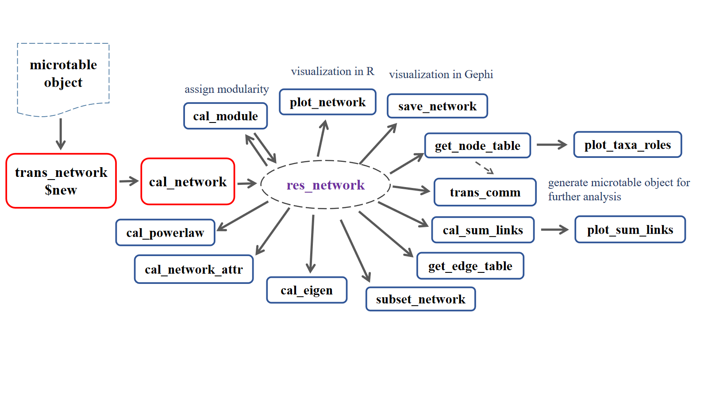
```

The objects inside the rectangle with full line represent functions.
The dashed line denotes the key objects (input or output). The `res_network` inside the ellipse with dashed line means it is a hub object for other analysis.


### Example

The correlation-based network is selected to show the main operations. 
This is only intended to show some operations conveniently. 
**Do not mean we are suggesting this approach in any case**.
Please check the final part for other network construction methods.

```{r, echo = TRUE, eval=FALSE}
# The parameter cor_method in trans_network is used to select correlation calculation method.
# default pearson or spearman correlation invoke R base cor.test, a little slow
t1 <- trans_network$new(dataset = dataset, cor_method = "spearman", filter_thres = 0.001)
# return t1$res_cor_p list, containing two tables: correlation coefficient table and p value table
```

Spearman correlation based on WGCNA package is applied to show all the following operations.

```{r, echo = TRUE, eval=FALSE}
# require WGCNA package
if(!require("WGCNA")) install.packages("WGCNA", repos = BiocManager::repositories())
t1 <- trans_network$new(dataset = dataset, cor_method = "spearman", use_WGCNA_pearson_spearman = TRUE, filter_thres = 0.0001)
```

The parameter `COR_cut` can be used to select the correlation threshold. 
Furthermore, `COR_optimization = TRUE` can be used to find the optimized coefficient threshold (potential transition point of network eigenvalues) 
instead of the `COR_cut` based on the RMT theory [@Deng_Molecular_2012].

```{r, echo = TRUE, eval=FALSE}
# construct network; require igraph package
t1$cal_network(COR_p_thres = 0.01, COR_optimization = TRUE)
# use arbitrary coefficient threshold to contruct network
t1$cal_network(COR_p_thres = 0.01, COR_cut = 0.7)
# return t1$res_network
```

Then, let's partition modules for the network.

```{r, echo = TRUE, eval=FALSE}
# invoke igraph cluster_fast_greedy function for this undirected network 
t1$cal_module(method = "cluster_fast_greedy")
```

The following operation is to save network to gexf format for the visualization with Gephi(https://gephi.org/).
The file 'network.gexf' can be directly opened by Gephi.

```{r, echo = TRUE, eval=FALSE}
# require rgexf package to be installed
t1$save_network(filepath = "network.gexf")
```

Then, we plot the network in Gephi and present the node colors according to the partitioned modules.

```{r, out.width = "550px", fig.align="center", echo = FALSE}
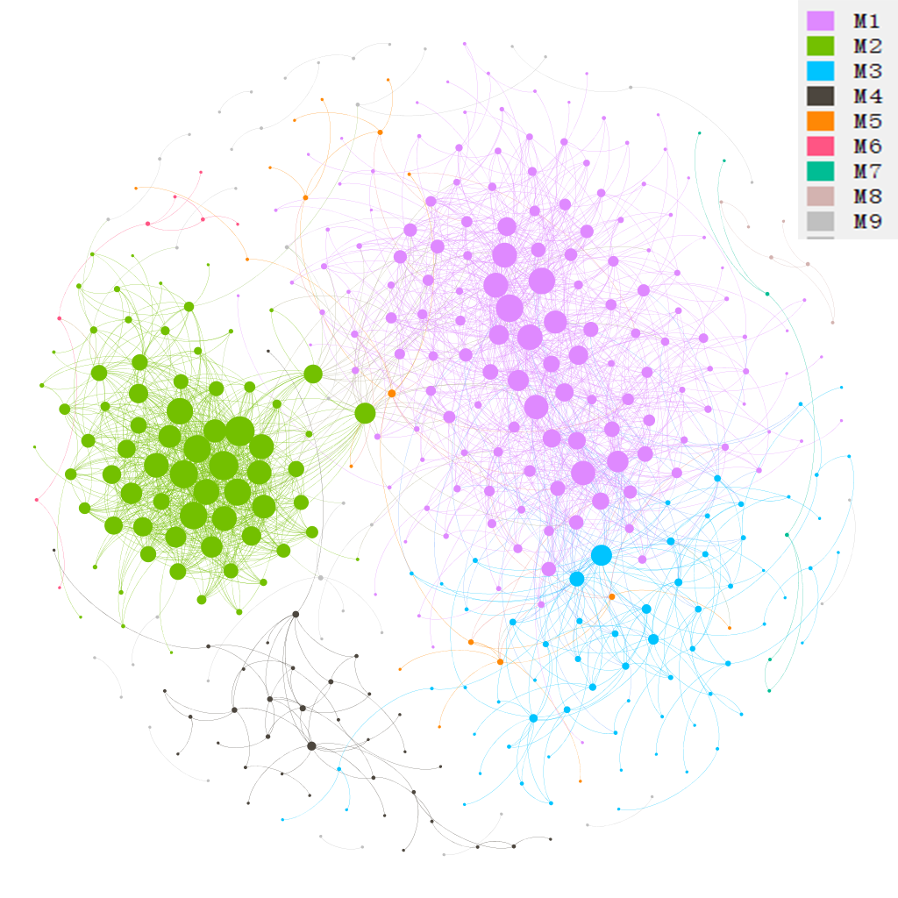
```

Now, we show the node colors with the Phylum information and the edges colors with the positive and negative correlations.
All the data used has been stored in the network.gexf file, including modules classifications, Phylum information and edge labels.

```{r, out.width = "550px", fig.align="center", echo = FALSE}
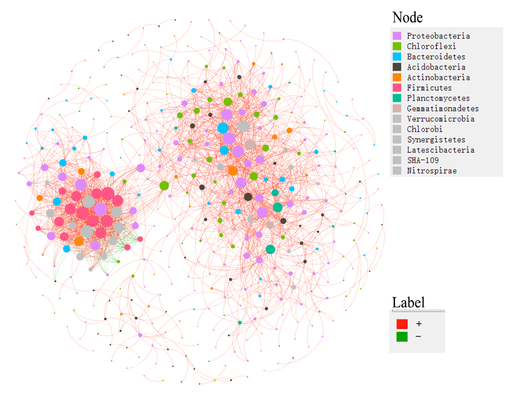
```


```{r, echo = TRUE, eval = FALSE}
# calculate network attributes
t1$cal_network_attr()
t1$res_network_attr
```

```{r, echo = FALSE}
# read
res_network_attr <- read.csv("Files/res_network_attr.csv", check.names = FALSE)
```
```{r, echo = FALSE}
pander::pander(res_network_attr)
```

The function get_node_table, get_edge_table and get_adjacency_matrix are designed to 
get node properties table, edge properties table and adjacency matrix from network, respectively.

```{r, echo = TRUE, eval = FALSE}
# get node properties
t1$get_node_table(node_roles = TRUE)
# return t1$res_node_table
```

```{r, echo = FALSE}
# read
network_node_table <- read.csv("Files/res_node_table.csv", row.names = 1, check.names = FALSE)
```

```{r, echo = FALSE}
pander::pander(network_node_table[1:5, c(1:6)])
```

```{r, echo = TRUE, eval = FALSE}
# get edge properties
t1$get_edge_table()
# return t1$res_edge_table 
t1$get_adjacency_matrix()
# return t1$res_adjacency_matrix
```

Then, let’s plot the node classification in terms of the within-module connectivity and among-module connectivity.

```{r, echo = TRUE, eval = FALSE}
# add_label = TRUE can be used to directly add text label for points
t1$plot_taxa_roles(use_type = 1)
```

```{r, out.width = "700px", fig.align="center", echo = FALSE}
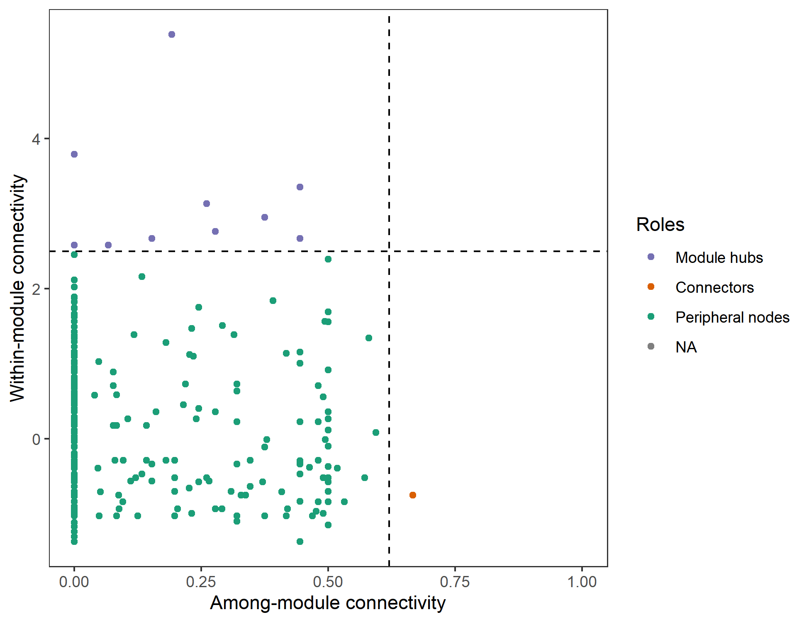
```

```{r, echo = TRUE, eval = FALSE}
# plot node roles with phylum information
t1$plot_taxa_roles(use_type = 2)
```

```{r, out.width = "800px", fig.align="center", echo = FALSE}
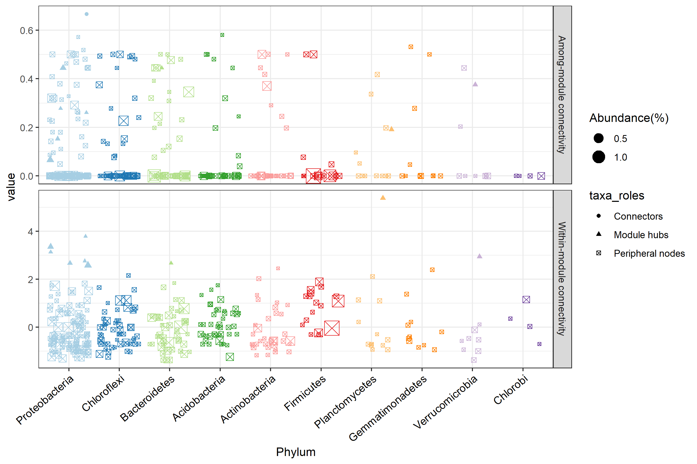
```

Now, we show the eigengene analysis of modules.
The eigengene of a module, i.e. the first principal component of PCA, represents the main variance of the abundance in the species of the module.

```{r, echo = TRUE, eval = FALSE}
t1$cal_eigen()
# return t1$res_eigen
```

Then we perform correlation heatmap to show the associations between eigengenes and environmental factors.

```{r, echo = TRUE, eval = FALSE}
# create trans_env object
t2 <- trans_env$new(dataset = dataset, add_data = env_data_16S[, 4:11])
# calculate correlations
t2$cal_cor(add_abund_table = t1$res_eigen)
# plot the correlation heatmap
t2$plot_cor()
```

```{r, out.width = "600px", fig.align="center", echo = FALSE}
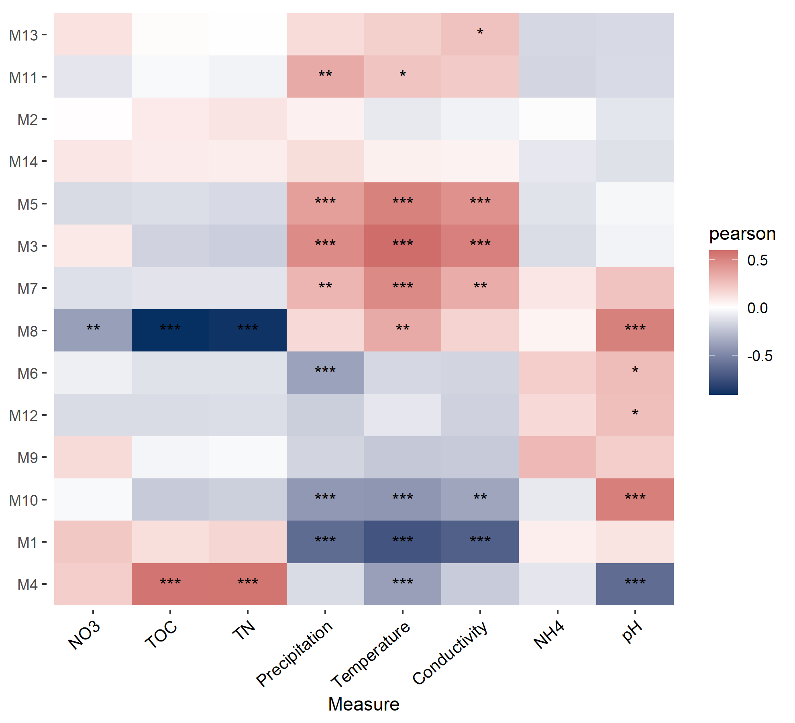
```

The `subset_network` function can be applied to extract a part of nodes and edges among these nodes from the network.
In this function, you should provide the nodes you need using the node parameter.

```{r, echo = TRUE, eval = FALSE}
# extract a sub network that contains all nodes in module M1
t1$subset_network(node = t1$res_node_table %>% base::subset(module == "M1") %>% rownames, rm_single = TRUE)
# return a new network with igraph class
# extract sub network in which all edge labels are "+", i.e. positive edges
t1$subset_network(edge = "+")
```

Then let's show how to extract sub-network for samples [@Ma_Geographic_2016].

```{r, echo = TRUE, eval = FALSE}
# extract the sub-network of sample 'S1'
sub1 <- t1$subset_network(node = dataset$otu_table %>% .[.[, "S1"] != 0, ] %>% rownames, rm_single = TRUE)
# see https://chiliubio.github.io/microeco_tutorial/notes.html#clone for the 'clone' function explanation
t2 <- clone(t1)
t2$res_network <- sub1
# then t2 have a network for 'S1' and can be used for further analysis
t2$cal_module()
t2$save_network("S1.gexf")
# please use a loop for all samples
```

We also add the function `plot_network` to directly plot the network in R, including the static network and dynamic network.
The static network is suitable for the case with relatively few nodes, while dynamic network can be better applied to a large network.
See https://yunranchen.github.io/intro-net-r/advanced-network-visualization.html and https://kateto.net/network-visualization for more
details on the network visualization in R.

```{r, echo = TRUE, eval = FALSE}
# default parameter represents using igraph plot.igraph function
t2$plot_network()
# use ggraph method; require ggraph package
# If ggraph is not installed; first install it with command: install.packages("ggraph")
t2$plot_network(method = "ggraph", node_color = "Phylum")
# use networkD3 package method for the dynamic network visualization in R
# If networkD3 is not installed; first install it with command: install.packages("networkD3")
t1$plot_network(method = "networkD3", node_color = "module")
t1$plot_network(method = "networkD3", node_color = "Phylum")
```

The `trans_comm` function can be used to convert the node classification to a new microtable object for other analysis.

```{r, echo = TRUE, eval = FALSE}
# use_col is used to select a column of t1$res_node_table
tmp <- t1$trans_comm(use_col = "module", abundance = FALSE)
tmp
tmp$otu_table[tmp$otu_table > 0] <- 1
tmp$tidy_dataset()
tmp$cal_abund()
tmp2 <- trans_abund$new(tmp, taxrank = "Phylum", ntaxa = 10)
tmp2$data_abund$Sample %<>% factor(., levels = rownames(tmp$sample_table))
tmp2$plot_line(xtext_angle = 30, color_values = RColorBrewer::brewer.pal(12, "Paired")) + ylab("OTUs ratio (%)")
```

The function `cal_sum_links` can sum the links (edge) number from one taxa to another or within the same taxa. 
The function `plot_sum_links` is used to show the result from the function `cal_sum_links`. 
This is very useful to fast see how many nodes are connected between different taxa or within one taxa. 
In terms of 'Phylum' level in the tutorial, the function cal_sum_links() sum the linkages number from one Phylum to another Phylum or the linkages in the same Phylum. 
So the numbers along the outside of the circular plot represent how many edges or linkages are related with the Phylum. 
For example, in terms of Proteobacteria, there are roughly total 900 edges associated with the OTUs in Proteobacteria, 
in which roughly 200 edges connect both OTUs in Proteobacteria and roughly 150 edges connect the OTUs from Proteobacteria with the OTUs from Chloroflexi.

```{r, echo = TRUE, eval = FALSE}
t1$cal_sum_links(taxa_level = "Phylum")
# interactive visualization; require chorddiag package; see https://github.com/mattflor/chorddiag
t1$plot_sum_links(plot_pos = TRUE, plot_num = 10, color_values = RColorBrewer::brewer.pal(10, "Paired"))
# From v1.2.0, method = "circlize" is available for conveniently saving the static plot
# If circlize package is not installed, first run: install.packages("circlize")
t1$plot_sum_links(method = "circlize", transparency = 0.2, annotationTrackHeight = circlize::mm_h(c(5, 5)))
```

```{r, out.width = "700px", fig.align="center", echo = FALSE}
knitr::include_graphics("Images/trans_network_sum_links.png")
```

For the correlation network, there are also other available correlation/association calculation options, 
such as Bray–Curtis (1-dissimilarity), SparCC [@Friedman_Inferring_2012], CCLasso [@Fang_CCLasso_2015], 
Pearson or Spearman with data normalization based on NetCoMi package [@Peschel_NetCoMi_2021].

```{r, echo = TRUE, eval=FALSE}
# use Bray–Curtis index (1-dissimilarity)
t1 <- trans_network$new(dataset = dataset, cor_method = "bray", filter_thres = 0.001)
# Pearson correlation
t1 <- trans_network$new(dataset = dataset, cor_method = "pearson", filter_thres = 0.001)
# Pearson correlation using WGCNA package
# install WGCNA package
if(!require("WGCNA")) install.packages("WGCNA", repos = BiocManager::repositories())
t1 <- trans_network$new(dataset = dataset, cor_method = "pearson", use_WGCNA_pearson_spearman = TRUE, filter_thres = 0.001)
# Pearson correlation using NetCoMi package; install it from https://github.com/stefpeschel/NetCoMi
t1 <- trans_network$new(dataset = dataset, cor_method = "pearson", use_NetCoMi_pearson_spearman = TRUE, filter_thres = 0.001)
# Spearman correlation using WGCNA package
t1 <- trans_network$new(dataset = dataset, cor_method = "spearman", use_WGCNA_pearson_spearman = TRUE, filter_thres = 0.001)
# Spearman correlation using NetCoMi package
t1 <- trans_network$new(dataset = dataset, cor_method = "spearman", use_NetCoMi_pearson_spearman = TRUE, filter_thres = 0.001)
# SparCC method, from SpiecEasi package, see https://github.com/zdk123/SpiecEasi for the installation
t1 <- trans_network$new(dataset = dataset, cor_method = "sparcc", use_sparcc_method = "SpiecEasi", filter_thres = 0.003)
# SparCC method, from NetCoMi package; https://github.com/stefpeschel/NetCoMi
t1 <- trans_network$new(dataset = dataset, cor_method = "sparcc", use_sparcc_method = "NetCoMi", filter_thres = 0.001)
# CCLasso method based on NetCoMi package
t1 <- trans_network$new(dataset = dataset, cor_method = "cclasso", filter_thres = 0.001)
# CCREPE method based on NetCoMi package
t1 <- trans_network$new(dataset = dataset, cor_method = "ccrepe", filter_thres = 0.001)
```


**Then let's show other implemented network construction approaches**:  
SPIEC-EASI (SParse InversE Covariance Estimation for Ecological Association Inference) approach of SpiecEasi R package [@Kurtz_Sparse_2015]
has two network construction approaches based on graph model, which relies on algorithms for sparse neighborhood and inverse covariance selection.
See https://github.com/zdk123/SpiecEasi for the package installation.
It is very slow for SpiecEasi_method = 'glasso' when there is a large number (such as hundreds to thousands) according to our test experience.

```{r, echo = TRUE, eval=FALSE}
t1 <- trans_network$new(dataset = dataset, cor_method = NULL, taxa_level = "OTU", filter_thres = 0.001)
# require SpiecEasi package installed https://github.com/zdk123/SpiecEasi
# also see SpiecEasi::spiec.easi for available model parameters
t1$cal_network(network_method = "SpiecEasi", SpiecEasi_method = "mb")
# see t1$res_network
```

Another network construction approach comes from julia package FlashWeave [@Tackmann_Rapid_2019].
This is a probabilistic graph-based method to obtain the conditional independence. 
It predicts direct associations among microbes from large-scale compositional abundance data through statistical co-occurrence. 
To repeat the following code, please first install julia language in your computer and the FlashWeave package, and add the julia in the computer path.

1. download and install julia from https://julialang.org/downloads/  
2. Put julia in the computer env PATH, such as  your_directory_path\Julia\bin  
3. Open terminal or cmd or Powershell, open julia, install FlashWeave following the operation in https://github.com/meringlab/FlashWeave.jl  

```{r, echo = TRUE, eval=FALSE}
t1 <- trans_network$new(dataset = dataset, cor_method = NULL, taxa_level = "OTU", filter_thres = 0)
# require Julia in the computer path, and the package FlashWeave
# different with the direct parameter passing of 'SpiecEasi' network_method, FlashWeave_other_para is used to pass parameters to Julia FlashWeave
# assign FlashWeave_tempdir parameter can change the temporary working directory
t1$cal_network(network_method = "FlashWeave", FlashWeave_other_para = "alpha=0.01,sensitive=true,heterogeneous=true")
# see t1$res_network
```

The final method we want to show comes from beemStatic package [@Li_BEEMStatic_2021].
This method can be applied to cross-sectional datasets to infer interaction network based on the generalized Lotka-Volterra model,
which is typically used in the microbial time-series data. 
So the network from this approach is a directed network.
Please see https://github.com/CSB5/BEEM-static for installing the R beemStatic package.

```{r, echo = TRUE, eval=FALSE}
t1 <- trans_network$new(dataset = dataset, cor_method = NULL, taxa_level = "OTU", filter_thres = 0.001)
# require beemStatic package installed
t1$cal_network(network_method = "beemStatic")
# use cluster_walktrap method for the directed network
t1$cal_module(method = "cluster_walktrap")
```

### Network comparison
To compare different networks from trans_network class,
please see the meconetcomp package chapter (https://chiliubio.github.io/microeco_tutorial/meconetcomp-package.html).


### Key points

  + cal_network(): get a network named `res_network` based on different methods
  + get_node_table(): get node properties table
  + subset_network(): this function can extract any sub-network according to the input nodes, e.g. sub-network for modules or samples

### Other functions

  + cal_powerlaw(): perform bootstrapping hypothesis test to determine whether degrees follow a power law distribution and fit degrees to a power law distribution.  
  + random_network(): generate random networks, compare them with the empirical network and get the p value of topological properties.


## trans_nullmodel class
  In recent decades, 
the integration of phylogenetic analysis and null model promotes the inference of niche and neutral influences on community assembly more powerfully 
by adding a phylogeny dimension [@Webb_Phylogenies_2002; @Picante_Kembel_2010; @Stegen_Quantifying_2013].
The trans_nullmodel class provides an encapsulation, including the calculation of the phylogenetic signal, 
beta mean pairwise phylogenetic distance (betaMPD), beta mean nearest taxon distance (betaMNTD), 
beta nearest taxon index (betaNTI), beta net relatedness index (betaNRI) and Bray-Curtis-based Raup-Crick (RCbray).
The approach for phylogenetic signal analysis is based on the mantel correlogram [@Liu_Long_term_2017], 
in which the change of phylogenetic signal is intuitional and clear compared to other approaches.
The combinations between RCbray and betaNTI can be used to infer the strength of each ecological process dominating the community assembly 
under the specific hypothesis [@Stegen_Quantifying_2013].

### Example

We first check the phylogenetic signal.

```{r, echo = TRUE}
# generate trans_nullmodel object
# as an example, we only use high abundance OTU with mean relative abundance > 0.0005
t1 <- trans_nullmodel$new(dataset, filter_thres = 0.0005, add_data = env_data_16S)
```

```{r, echo = TRUE, eval=FALSE}
# use pH as the test variable
t1$cal_mantel_corr(use_env = "pH")
# return t1$res_mantel_corr
# plot the mantel correlogram
t1$plot_mantel_corr()
```

```{r, out.width = "600px", fig.align="center", echo = FALSE}
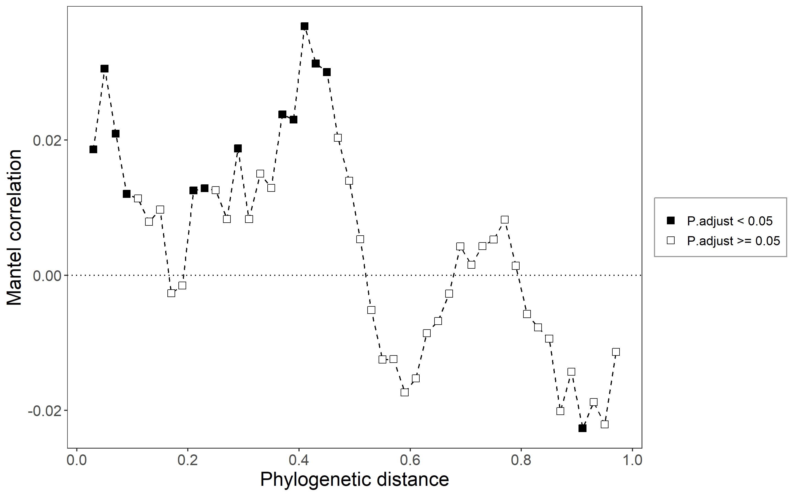
```

betaNRI(ses.betampd) is used to show the 'basal' phylogenetic turnover.
Compared to betaNTI, it can capture more turnover information associated with the deep phylogeny.
It is noted that there are many null models with the development in the several decades of community ecology.
In the trans_nullmodel class, 
the default null mode of betaNTI and betaNRI is the randomization of the phylogenetic relatedness among species.
This shuffling approach fix the observed levels of species α-diversity and β-diversity to
explore whether the observed phylogenetic turnover significantly differ from null model that phylogenetic relatedness among species are random.

```{r, echo = TRUE, eval=FALSE}
# see null.model parameter for other null models
# null model run 500 times for the example
t1$cal_ses_betampd(runs = 500, abundance.weighted = TRUE)
# return t1$res_ses_betampd
```

If we want to plot the betaNRI, we can use plot_group_distance function in trans_beta class.
For example, the results showed that the mean betaNRI of TW is extremely and significantly larger that those in CW and IW,
revealing that the basal phylogenetic turnover in TW is high.


```{r, echo = TRUE, eval=FALSE}
# add betaNRI matrix to beta_diversity list
dataset$beta_diversity[["betaNRI"]] <- t1$res_ses_betampd
# create trans_beta class, use measure "betaNRI"
t2 <- trans_beta$new(dataset = dataset, group = "Group", measure = "betaNRI")
# transform the distance for each group
t2$cal_group_distance()
# see the help document for more methods, e.g. "anova" and "KW_dunn"
t2$cal_group_distance_diff(method = "wilcox")
# plot the results
g1 <- t2$plot_group_distance(boxplot_add = "mean")
g1 + geom_hline(yintercept = -2, linetype = 2) + geom_hline(yintercept = 2, linetype = 2)
```

```{r, out.width = "550px", fig.align="center", echo = FALSE}
knitr::include_graphics("Images/trans_nullmodel_betaNRI_one_dataset.png")
```


BetaNTI(ses.betamntd) can be used to indicate the phylogenetic terminal turnover [@Stegen_Quantifying_2013].

```{r, echo = TRUE, eval=FALSE}
# null model run 500 times
t1$cal_ses_betamntd(runs = 500, abundance.weighted = TRUE, null.model = "taxa.labels")
# return t1$res_ses_betamntd
```

```{r, echo = FALSE}
# read
t1$res_ses_betamntd <- as.matrix(read.csv("Files/cal_ses_betamntd.csv", row.names = 1, check.names = FALSE))
```

```{r, echo = FALSE}
# show t1$res_ses_betamntd
pander::pander(t1$res_ses_betamntd[1:5, 1:5])
```

If the dataset is large, it is faster with use_iCAMP = TRUE for betaNTI.

```{r, echo = TRUE, eval=FALSE}
tmp <- "./test1"; dir.create(tmp)
t1$cal_ses_betamntd(runs = 1000, abundance.weighted = TRUE, use_iCAMP = TRUE, iCAMP_tempdir = tmp)
```


RCbray (Bray-Curtis-based Raup-Crick) can be calculated using function cal_rcbray()
to assess whether the compositional turnover was governed primarily by drift [@Chase_null_2011].
We applied null model to simulate species distribution by randomly sampling individuals from each 
species pool with preserving species occurrence frequency and sample species richness [@Liu_Long_term_2017].

```{r, echo = TRUE, eval=FALSE}
# result stored in t1$res_rcbray
t1$cal_rcbray(runs = 1000)
# return t1$res_rcbray
```

```{r, echo = FALSE}
# read
t1$res_rcbray <- as.matrix(read.csv("Files/cal_rcbray.csv", row.names = 1, check.names = FALSE))
```

As an example, we also calculate the proportion of the inferred processes on the community assembly as shown in the references [@Stegen_Quantifying_2013; @Liu_Long_term_2017].
In the example, the fraction of pairwise comparisons with significant betaNTI values (|βNTI| > 2) is the estimated influence of Selection;
βNTI > 2 represents the heterogeneous selection; βNTI < -2 represents the homogeneous selection.
The value of RCbray characterizes the magnitude of deviation between observed Bray–Curtis and Bray–Curtis expected under the randomization;
a value of |RCbray| > 0.95 was considered significant.
The fraction of all pairwise comparisons with |βNTI| < 2 and RCbray > +0.95 was taken as the influence of Dispersal Limitation combined with Drift.
The fraction of all pairwise comparisons with |βNTI| < 2 and RCbray < -0.95 was taken as an estimate for the influence of Homogenizing Dispersal.
The fraction of all pairwise comparisons with |βNTI| < 2 and |RCbray| < 0.95 estimates the influence of Drift acting alone.

```{r, echo = TRUE}
# use betaNTI and rcbray to evaluate processes
t1$cal_process(use_betamntd = TRUE, group = "Group")
t1$cal_process(use_betamntd = TRUE)
# return t1$res_process
```

```{r, echo = TRUE, eval = FALSE}
t1$res_process
```

```{r, echo = FALSE}
pander::pander(t1$res_process)
```

The `cal_NST` function can be used to calculate normalized stochasticity ratio based on the NST package [@Ning_general_2019],
including 'tNST' and 'pNST' methods.

```{r, echo = TRUE, eval = FALSE}
# require NST package to be installed
t1$cal_NST(method = "tNST", group = "Group", dist.method = "bray", abundance.weighted = TRUE, output.rand = TRUE, SES = TRUE)
t1$res_NST$index.grp
```

```{r, echo = FALSE}
t1$cal_NST(group = "Group", dist.method = "bray", abundance.weighted = TRUE, output.rand = TRUE, SES = TRUE)
pander::pander(t1$res_NST$index.grp)
```

```{r, echo = TRUE, eval = FALSE}
# test the NST difference between each pair of groups
t1$cal_NST_test(method = "nst.boot")
```

```{r, echo = TRUE, eval = FALSE}
# convert long format table to square matrix
# the 10th column: MST.ij.bray in t1$res_NST$index.pair
test <- t1$cal_NST_convert(10)
```

```{r, echo = TRUE, eval = FALSE}
# for pNST method, phylogenetic tree is needed
t1$cal_NST(method = "pNST", group = "Group", output.rand = TRUE, SES = TRUE)
t1$cal_NST_test(method = "nst.boot")
```

For nearest Taxon Index (NTI) and nearest Relative Index (NRI), please use cal_NTI and cal_NRI, respectively.

```{r, echo = TRUE, eval = FALSE}
t1$cal_NRI(null.model = "taxa.labels", abundance.weighted = FALSE, runs = 999)
t1$cal_NTI(null.model = "taxa.labels", abundance.weighted = TRUE, runs = 999)
```


### Key points

  + trans_nullmodel$new: filter_thres parameter for the filtering of taxa with relative low abundance
  + cal_rcbray(): if only need rcbray, ignore other phylogenetic operations
 
### Other function

  + cal_Cscore(): calculates the (normalised) mean number of checkerboard combinations (C-score) using C.score


## trans_classifier class

The trans_classifier class is a wrapper for methods of machine-learning-based classification models.
Microbiome-based supervised machine-learning has been successful in predicting human health status [@Poore_Microbiome_2020]
and soil categories [@Wilhelm_Predicting_2021]. 


### Dependencies

Before starting the examples, make sure those packages have been installed.

```{r, echo = TRUE, eval = FALSE}
packages <- c("Boruta", "parallel", "rsample", "randomForest", "caret", "gridExtra", "multiROC")
# Now check or install
for(x in packages){
	if(!require(x, character.only = TRUE)) {
		install.packages(x, dependencies = TRUE)
	}
}
```

### Examples
In this section, we use the example data in file2meco package (https://chiliubio.github.io/microeco_tutorial/file2meco-package.html) to demonstrate the feature selection, 
data training and prediction with random forest algorithm.

```{r, echo = TRUE, eval=FALSE}
library(file2meco)
abund_file_path <- system.file("extdata", "dada2_table.qza", package="file2meco")
sample_file_path <- system.file("extdata", "sample-metadata.tsv", package="file2meco")
taxonomy_file_path <- system.file("extdata", "taxonomy.qza", package="file2meco")
# construct microtable object
d1 <- qiime2meco(feature_table = abund_file_path, sample_table = sample_file_path, taxonomy_table = taxonomy_file_path)
d1$cal_abund()

# initialize: use "genotype" as response variable
# x.predictors parameter is used to select the taxa; here we use all the taxa data in d1$taxa_abund
t1 <- trans_classifier$new(dataset = d1, y.response = "genotype", x.predictors = "All")
```

We silit the data into training and testing set.

```{r, echo = TRUE, eval=FALSE}
# generate train and test set
t1$cal_split(prop.train = 3/4)
```

Before training the model, we run the set_trainControl to invoke the trainControl function of caret package to generate the parameters used for training.
Here we use the default parameters in trainControl function.

```{r, echo = TRUE, eval=FALSE}
# require caret package
t1$set_trainControl()
```

Now let's start model training with rf method.

```{r, echo = TRUE, eval=FALSE}
# use default parameter method = "rf"
t1$cal_train(max.ntree = 500)
```

We can use cal_predict function to predict the testing data set.

```{r, echo = TRUE, eval=FALSE}
t1$cal_predict()
# plot the confusionMatrix to check out the performance
t1$plot_confusionMatrix()
```

```{r, out.width = "600px", fig.align="center", echo = FALSE}
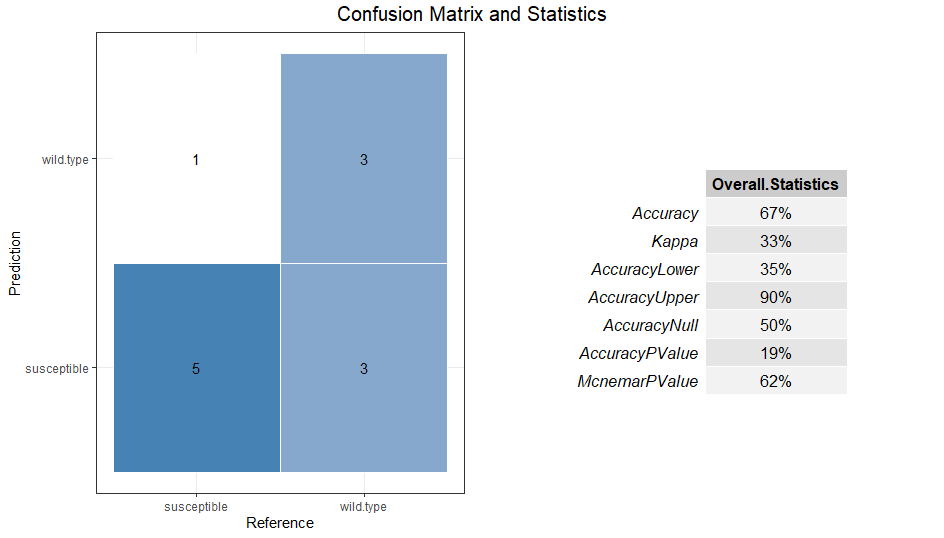
```

Using cal_ROC and plot_ROC can get the ROC (Receiver Operator Characteristic) curve.

```{r, echo = TRUE, eval=FALSE}
t1$cal_ROC()
t1$plot_ROC(size = 0.5, alpha = 0.7)
```

```{r, out.width = "500px", fig.align="center", echo = FALSE}
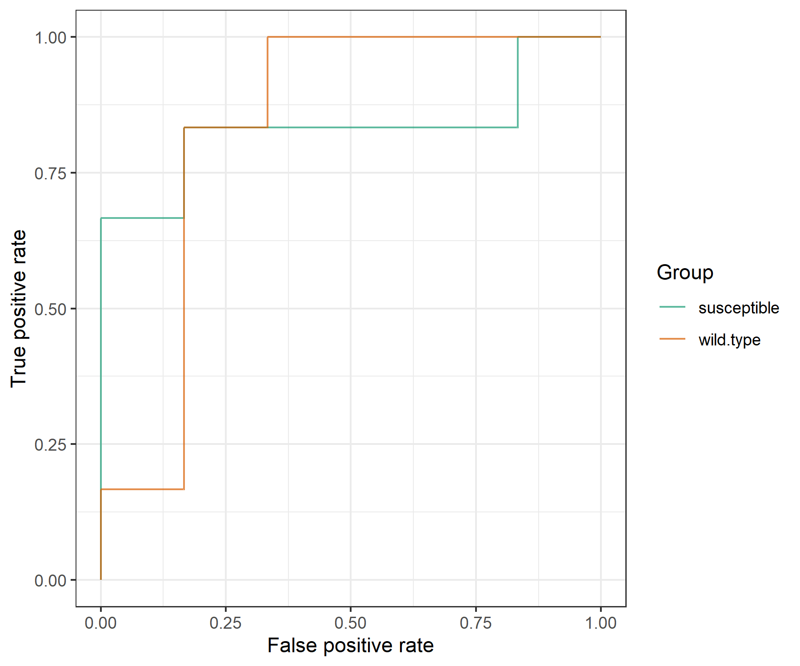
```

While building a machine learning model for microbiome data,
the huge diversity of microbial community and/or associated relationships among taxa accross phylogeny can lead to a large number of unnecessary features,
which can reduce the overall accuracy, increase the complexity and overfit of the model and decrease the generalization capability of the model.
So, feature selection is one important step in building machine-learning model.
Then, we attempt to use Boruta package [@Kursa_Feature_2010] to do feature selection.

```{r, echo = TRUE, eval=FALSE}
# require Boruta package
t1$cal_feature_sel(boruta.maxRuns = 300, boruta.pValue = 0.01)
```

To compare the results between the procedure with feature selection and that without feature selection,
we also perfom all the analysis with feature selection to show the whole results.

```{r, echo = TRUE, eval=FALSE}
t2 <- trans_classifier$new(dataset = d1, y.response = "genotype", x.predictors = "All")
t2$cal_feature_sel(boruta.maxRuns = 300, boruta.pValue = 0.01)
t2$cal_split(prop.train = 3/4)
t2$set_trainControl()
t2$cal_train(max.ntree = 500)
t2$cal_predict()
t2$plot_confusionMatrix()
t2$cal_ROC()
t2$plot_ROC(size = 0.5, alpha = 0.7)
```

```{r, out.width = "600px", fig.align="center", echo = FALSE}
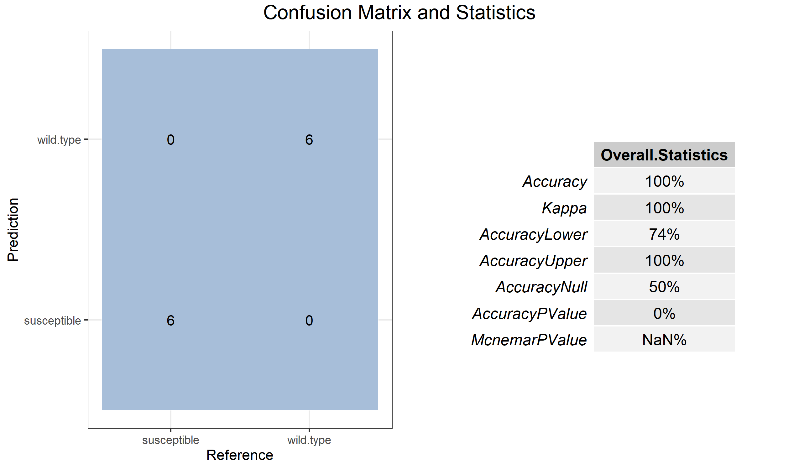
```
```{r, out.width = "500px", fig.align="center", echo = FALSE}
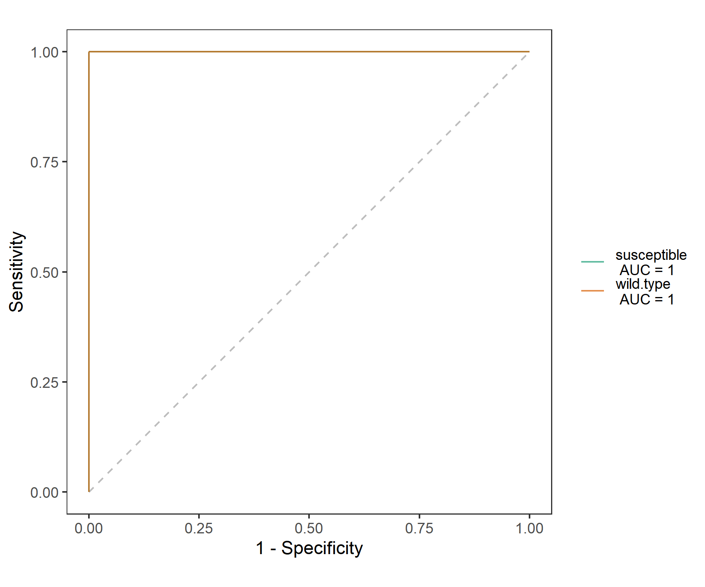
```

To plot the Precision-Recall curve (PR curve), please make plot_type = "PR" in plot_ROC function.

```{r, echo = TRUE, eval=FALSE}
t2$plot_ROC(plot_type = "PR", size = 0.5, alpha = 0.7)
```
```{r, out.width = "500px", fig.align="center", echo = FALSE}
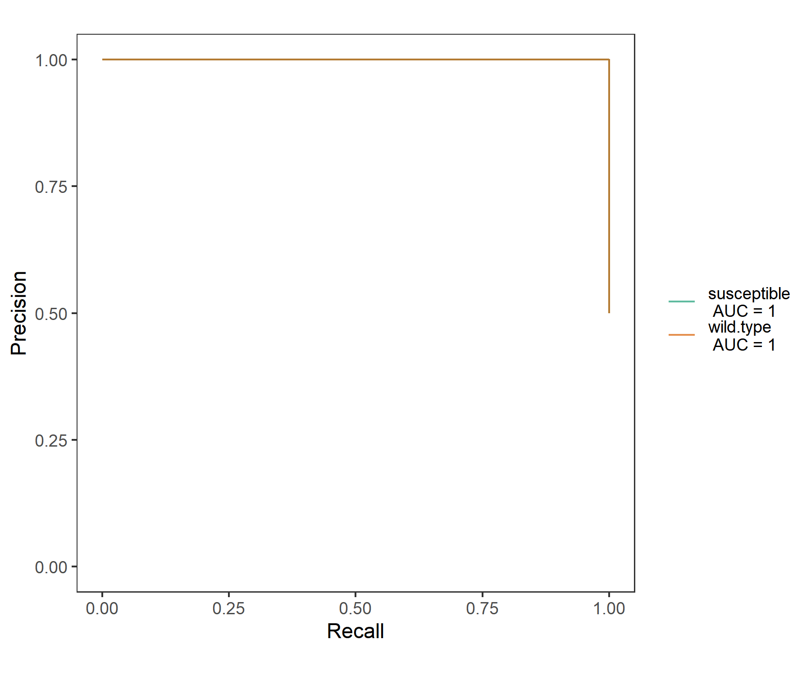
```

To show the ROC curve or PR curve of the training result, please make input = "train" in plot_ROC function.

```{r, echo = TRUE, eval=FALSE}
t2$cal_ROC(input = "train")
t2$plot_ROC(plot_type = "ROC", size = 0.5, alpha = 0.7)
```
```{r, out.width = "500px", fig.align="center", echo = FALSE}
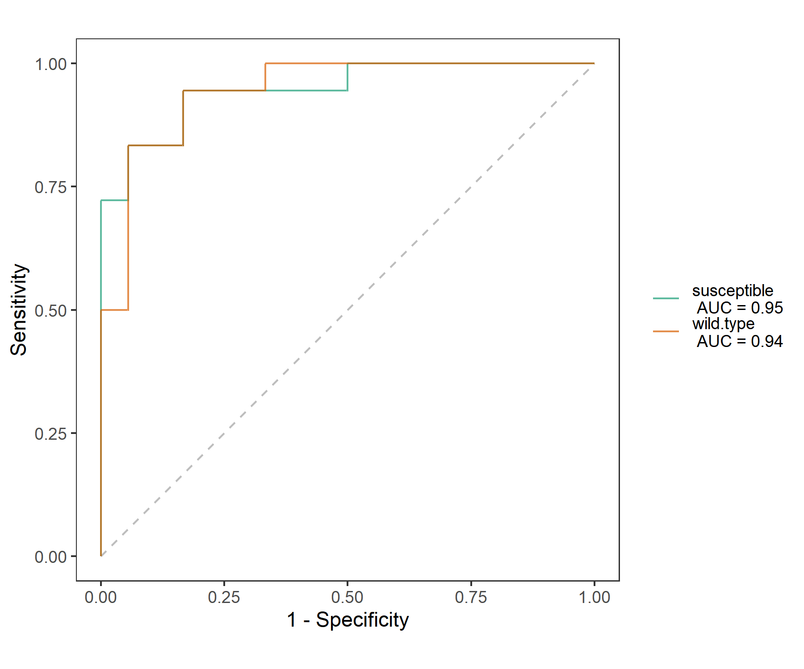
```

For other machine-learning models, please use method parameter in cal_train function.
```{r, echo = TRUE, eval=FALSE}
# use SVM method
t2$al_train(method = "svmRadial", tuneLength = 15)
```

The regression is supported from v0.15.0.

```{r, echo = TRUE, eval=FALSE}
# prepare data
data(env_data_16S)
new_test <- clone(dataset)
new_test$sample_table <- data.frame(new_test$sample_table, env_data_16S[rownames(new_test$sample_table), ])
# pH response variable
t1 <- trans_classifier$new(dataset = new_test, y.response = "pH", x.predictors = "Genus")
t1$cal_split(prop.train = 3/4)
t1$set_trainControl()
t1$cal_train()
t1$res_train
t1$cal_predict()
t1$res_predict
# feature importance
t1$cal_feature_imp()
head(t1$res_feature_imp)
t1$plot_feature_imp(use_number = 1:20) + ylab("IncNodePurity")
```


### Key points

  + cal_feature_sel(): perform feature selection
  
### Other function

  + cal_feature_imp(): get feature importance from the training model when method is "rf"
  + cal_preProcess(): Pre-process (centering, scaling etc.) of the feature data based on the caret::preProcess function.


 

<!--chapter:end:05-Model-based_class.Rmd-->

# Explainable class

The trans_env and trans_func classes are placed into the section 'Explainable class', 
as environmental factors and microbial functions can be generally applied to explain microbial community structure and assembly.


## trans_env class
There may be some NA (missing value) in the user's env data.
If so, please add `complete_na = TRUE` for the interpolation when creating a trans_env object.

### Example

Creating trans_env object has at least two ways.
The following is using additional environmental data which is not in the microtable object.

```{r, echo = TRUE}
# add_data is used to add the environmental data
t1 <- trans_env$new(dataset = dataset, add_data = env_data_16S[, 4:11])
```

Maybe a more general way is to directly use the data from sample_table of your microtable object.
To show this operation, we first merge additional table into sample_table to generate a new microtable object.

```{r, echo = TRUE}
new_test <- clone(dataset)
new_test$sample_table <- data.frame(new_test$sample_table, env_data_16S[rownames(new_test$sample_table), ])
# now new_test$sample_table has the whole data
new_test
```

Now let's use env_cols to select the required columns from sample_table in the microtable object.
From v1.0.0, the parameter `standardize = TRUE` is available to standardize each variable.

```{r, echo = TRUE}
t1 <- trans_env$new(dataset = new_test, env_cols = 8:15)
```

Generally, it is beneficial to analyze environmental variables in order to better use more methods.
The `cal_diff` function is used to test the significance of variables across groups like we have shown in trans_alpha and trans_diff class parts.


```{r, echo = TRUE, eval = FALSE}
# use Wilcoxon Rank Sum Test as an example
t1$cal_diff(group = "Group", method = "wilcox")
head(t1$res_diff)
```
```{r, echo = FALSE}
t1$cal_diff(group = "Group", method = "wilcox")
pander::pander(t1$res_diff[1:7, c(1, 2, 4, 6, 7)])
```

Let’s perform the ANOVA and show the letters in the box plot. We use list to store all the plots for each factor and plot them together.

```{r, echo = TRUE, eval = FALSE}
t1$cal_diff(method = "anova", group = "Group")
# place all the plots into a list
tmp <- list()
for(i in colnames(t1$data_env)){
    tmp[[i]] <- t1$plot_diff(measure = i, add_sig_text_size = 5, xtext_size = 12) + theme(plot.margin = unit(c(0.1, 0, 0, 1), "cm"))
}
plot(gridExtra::arrangeGrob(grobs = tmp, ncol = 3))
```
```{r, out.width = "750px", fig.align="center", echo = FALSE}
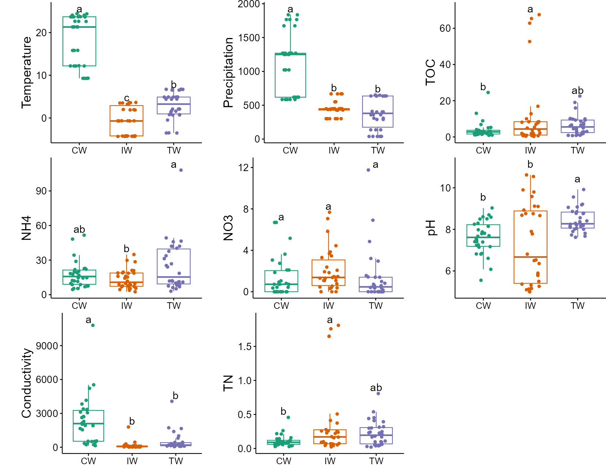
```

From v0.12.0, trans_env class supports the differential test of groups within each group by using the by_group parameter in cal_diff function.

```{r, echo = TRUE, eval = FALSE}
t1$cal_diff(group = "Type", by_group = "Group", method = "anova")
t1$plot_diff(measure = "pH", add_sig_text_size = 5)
```

```{r, out.width = "600px", fig.align="center", echo = FALSE}
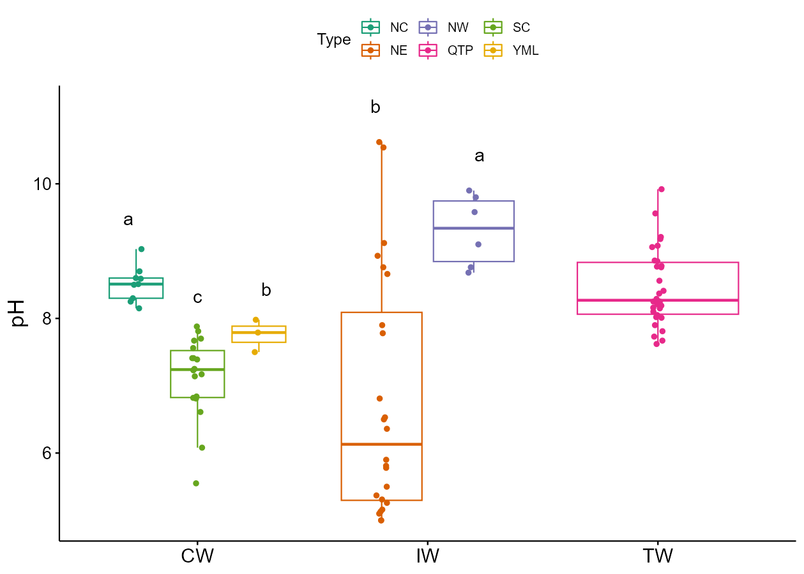
```

Then we show the autocorrelations among variables.

```{r, echo = TRUE, eval = FALSE}
# require GGally package to be installed
t1$cal_autocor()
```
```{r, out.width = "800px", fig.align="center", echo = FALSE}
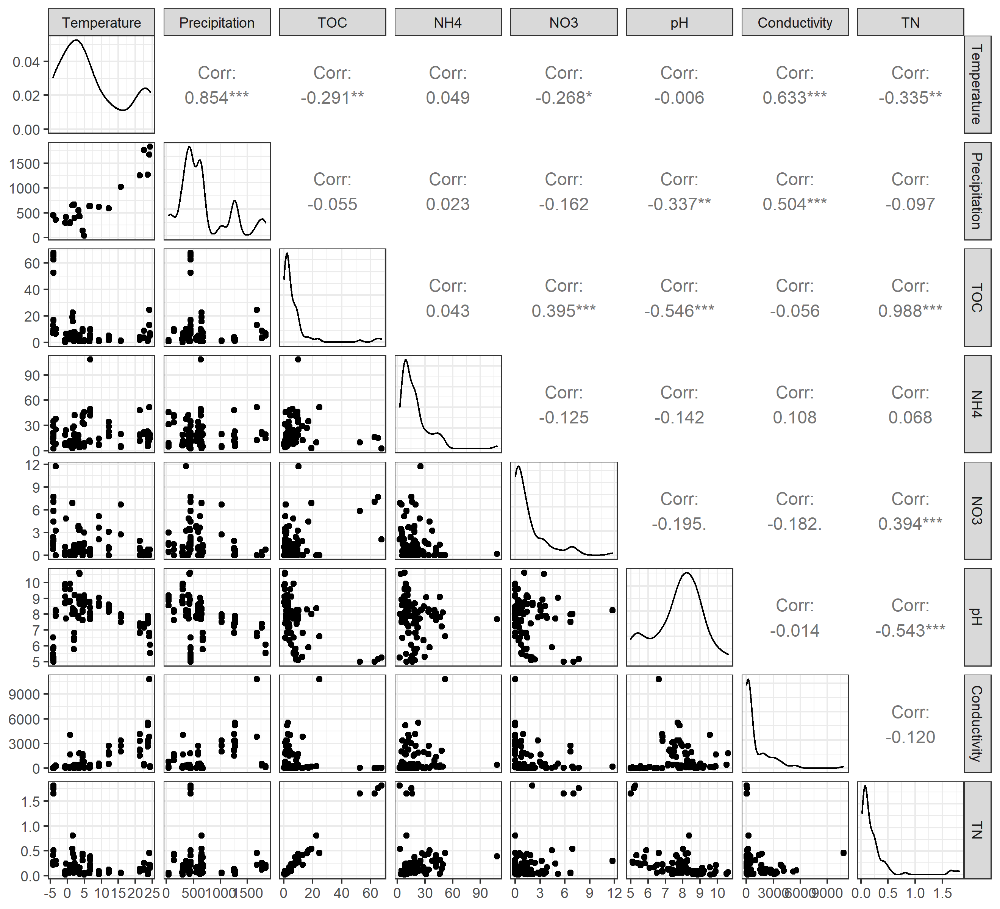
```

For different groups, please use group parameter to show the distributions of variables and the autocorrelations across groups.

```{r, echo = TRUE, eval = FALSE}
t1$cal_autocor(group = "Group")
```
```{r, out.width = "800px", fig.align="center", echo = FALSE}
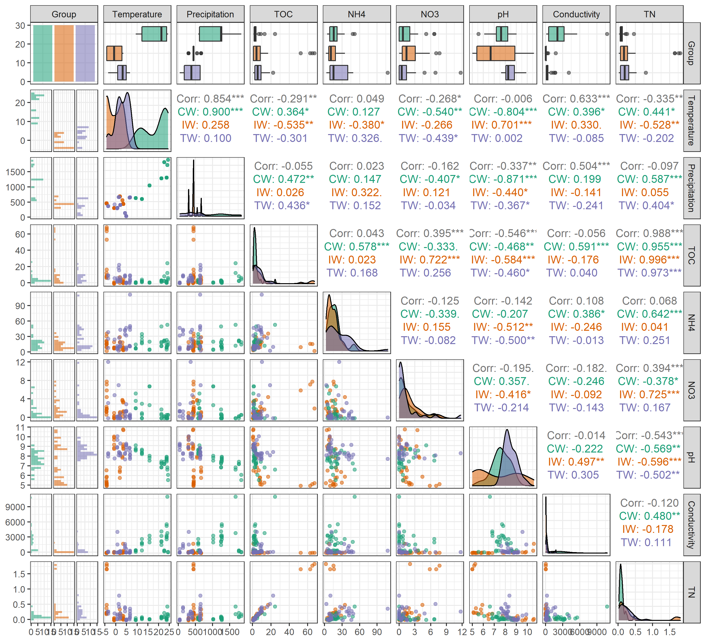
```

Then let's show the RDA analysis (db-RDA and RDA).

```{r, echo = TRUE, eval = FALSE}
# use bray-curtis distance for dbRDA
t1$cal_ordination(method = "dbRDA", use_measure = "bray")
# show the orginal results
t1$trans_ordination()
t1$plot_ordination(plot_color = "Group")
# the main results of RDA are related with the projection and angles between arrows
# adjust the length of the arrows to show them better
t1$trans_ordination(adjust_arrow_length = TRUE, max_perc_env = 1.5)
# t1$res_rda_trans is the transformed result for plotting
t1$plot_ordination(plot_color = "Group")
```

```{r, out.width = "650px", fig.align="center", echo = FALSE}
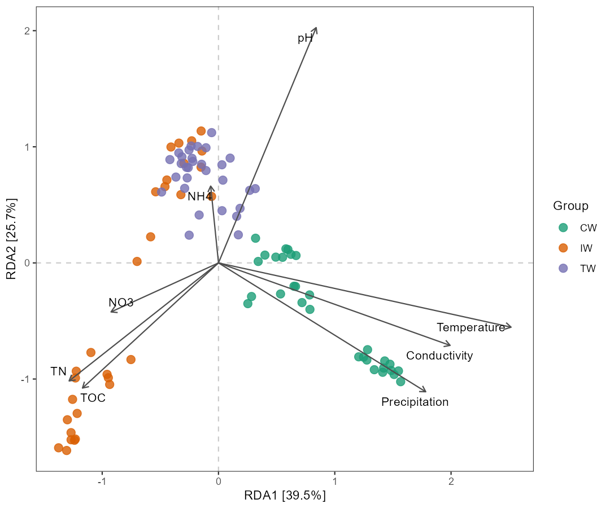
```

From v0.14.0, the function `cal_ordination_anova` is implemented to check the significance of the ordination model instead of the encapsulation in `cal_ordination`.
Furthermore, the function `cal_ordination_envfit` can be used to get the contribution of each variables to the model.

```{r, echo = TRUE, eval = FALSE}
t1$cal_ordination_anova()
t1$cal_ordination_envfit()
```

Then, let's try to do RDA at the Genus level.

```{r, echo = TRUE, eval = FALSE}
# use Genus
t1$cal_ordination(method = "RDA", taxa_level = "Genus")
# select 10 features and adjust the arrow length
t1$trans_ordination(show_taxa = 10, adjust_arrow_length = TRUE, max_perc_env = 1.5, max_perc_tax = 1.5, min_perc_env = 0.2, min_perc_tax = 0.2)
# t1$res_rda_trans is the transformed result for plot
t1$plot_ordination(plot_color = "Group")
```

```{r, out.width = "650px", fig.align="center", echo = FALSE}
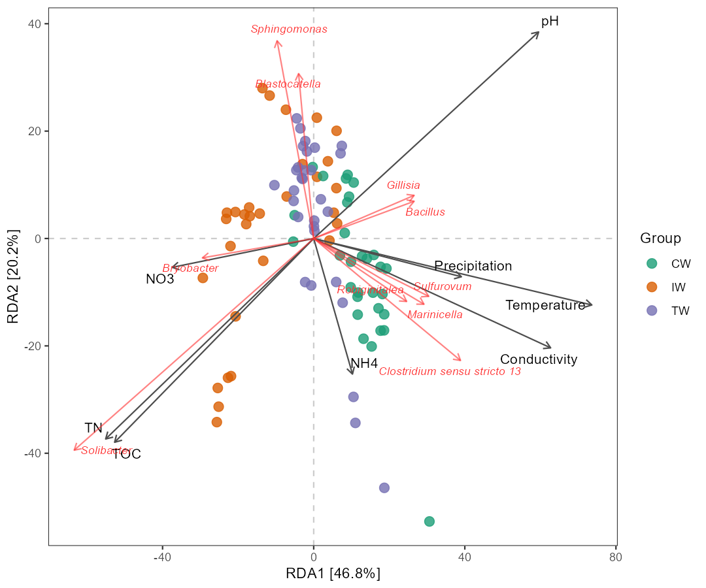
```

For more visualization styles, run the following examples.

```{r, echo = TRUE, eval = FALSE}
t1$plot_ordination(plot_color = "Group", plot_shape = "Group")
t1$plot_ordination(plot_color = "Group", plot_shape = "Group", plot_type = c("point", "ellipse"))
t1$plot_ordination(plot_color = "Group", plot_shape = "Group", plot_type = c("point", "centroid"))
t1$plot_ordination(plot_color = "Group", plot_shape = "Group", plot_type = c("point", "chull"))
t1$plot_ordination(plot_color = "Group", plot_shape = "Group", plot_type = c("point", "ellipse", "centroid"))
t1$plot_ordination(plot_color = "Group", plot_shape = "Group", plot_type = c("point", "chull", "centroid"), add_sample_label = "SampleID")
t1$plot_ordination(plot_color = "Group", plot_shape = "Group", plot_type = "centroid", centroid_segment_alpha = 0.9, centroid_segment_size = 1, centroid_segment_linetype = 1)
t1$plot_ordination(plot_color = "Type", plot_type = c("point", "centroid"), centroid_segment_linetype = 1)
```


Mantel test can be used to check whether there is significant correlations between environmental variables and distance matrix.

```{r, echo = TRUE, eval = FALSE}
t1$cal_mantel(use_measure = "bray")
# return t1$res_mantel
head(t1$res_mantel)
```

```{r, echo = FALSE}
t1$cal_mantel(use_measure = "bray")
pander::pander(t1$res_mantel[, -c(1, 3:4)])
```

```{r, echo = TRUE, eval = FALSE}
# mantel test for different groups
t1$cal_mantel(by_group = "Group", use_measure = "bray")
# partial mantel test
t1$cal_mantel(partial_mantel = TRUE)
```

For the combination of mantel test and correlation heatmap, 
please see another example (https://chiliubio.github.io/microeco_tutorial/other-examples-1.html#mantel-test-correlation-heatmap).  


The correlations between environmental variables and taxa are important in analyzing and inferring the factors affecting community structure.
Let's first perform a correlation heatmap using relative abundance data at Genus level with the `cal_cor` function.
The parameter `p_adjust_type` can control the p value adjustment type. 

```{r, echo = TRUE}
t1 <- trans_env$new(dataset = dataset, add_data = env_data_16S[, 4:11])
# 'p_adjust_type = "Env"' means p adjustment is performed for each environmental variable separately.
t1$cal_cor(use_data = "Genus", p_adjust_method = "fdr", p_adjust_type = "Env")
# return t1$res_cor
```

Then, we can plot the correlation results using plot_cor function.

```{r, echo = TRUE, eval = FALSE}
# default ggplot2 method with clustering
t1$plot_cor()
```

There are too many genera.
We can use the filter_feature parameter in plot_cor to filter some taxa that do not have any significance < 0.001.

```{r, echo = TRUE, eval = FALSE}
# filter genera that donot have at least one ***
t1$plot_cor(filter_feature = c("", "*", "**"))
```

Sometimes, if the user wants to do the correlation analysis between the environmental factors and some important taxa detected in the biomarker analysis,
please use **other_taxa** parameter in cal_cor function.


```{r, echo = TRUE, eval = FALSE}
# first create trans_diff object as a demonstration
t2 <- trans_diff$new(dataset = dataset, method = "rf", group = "Group", taxa_level = "Genus")
# then create trans_env object
t1 <- trans_env$new(dataset = dataset, add_data = env_data_16S[, 4:11])
# use other_taxa to select taxa you need
t1$cal_cor(use_data = "other", p_adjust_method = "fdr", other_taxa = t2$res_diff$Taxa[1:40])
t1$plot_cor()
```

```{r, out.width = "700px", fig.align="center", echo = FALSE}
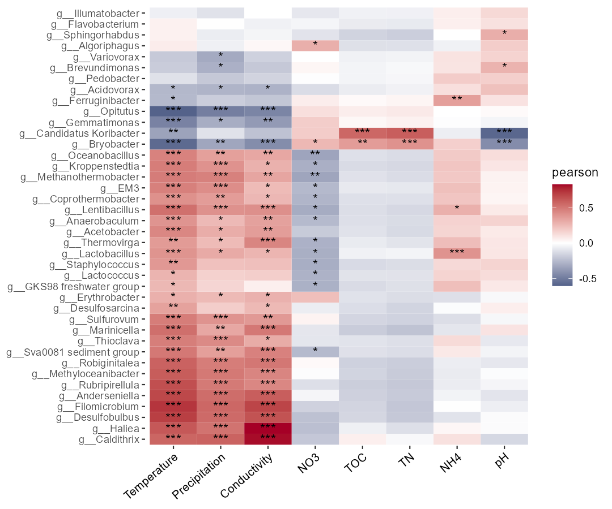
```

The pheatmap method is also available.
Note that, besides the **color_vector** parameter, 
**color_palette** can also be used to control color palette with customized colors.

```{r, echo = TRUE, eval = FALSE}
# clustering heatmap; require pheatmap package
# Let's take another color pallete
t1$plot_cor(pheatmap = TRUE, color_palette = rev(RColorBrewer::brewer.pal(n = 9, name = "RdYlBu")))
```

```{r, out.width = "700px", fig.align="center", echo = FALSE}
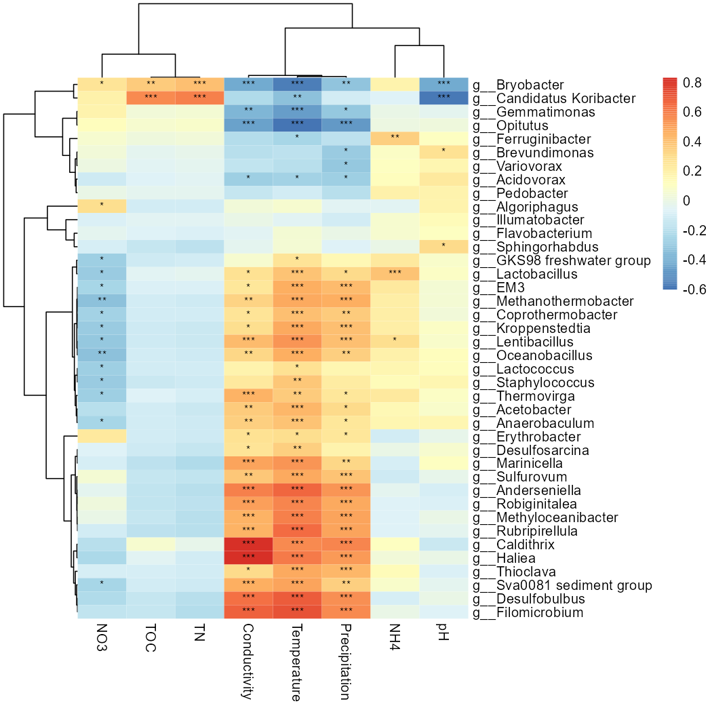
```

Sometimes, if it is needed to study the correlations between environmental variables and taxa for different groups,
**by_group parameter** can be used for this goal.

```{r, echo = TRUE, eval = FALSE}
# calculate correlations for different groups using parameter by_group
t1$cal_cor(by_group = "Group", use_data = "other", p_adjust_method = "fdr", other_taxa = t2$res_diff$Taxa[1:40])
# return t1$res_cor
t1$plot_cor()
```

```{r, out.width = "700px", fig.align="center", echo = FALSE}
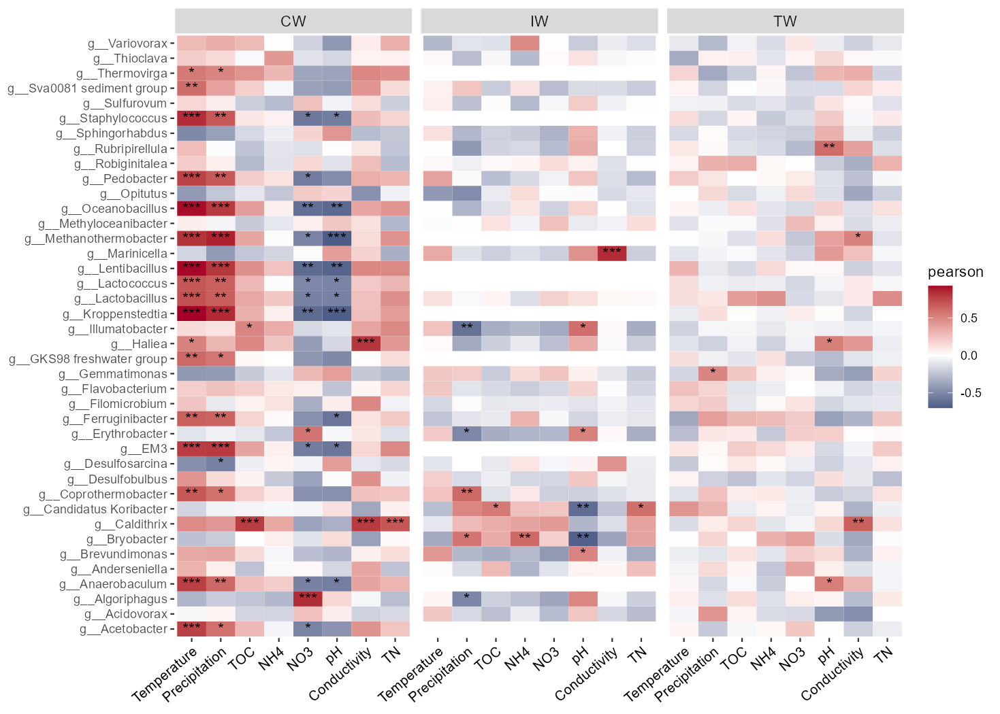
```


If the user is concerned with the relationship between environmental factors and alpha diversity, 
please use **add_abund_table** parameter in the cal_cor function.

```{r, echo = TRUE, eval = FALSE}
t1 <- trans_env$new(dataset = dataset, add_data = env_data_16S[, 4:11])
# use add_abund_table parameter to add the extra data table
t1$cal_cor(add_abund_table = dataset$alpha_diversity)
# try to use ggplot2 with clustering plot
# require ggtree and aplot packages to be installed (https://chiliubio.github.io/microeco_tutorial/intro.html#dependence)
t1$plot_cor(cluster_ggplot = "both")
```

```{r, out.width = "600px", fig.align="center", echo = FALSE}
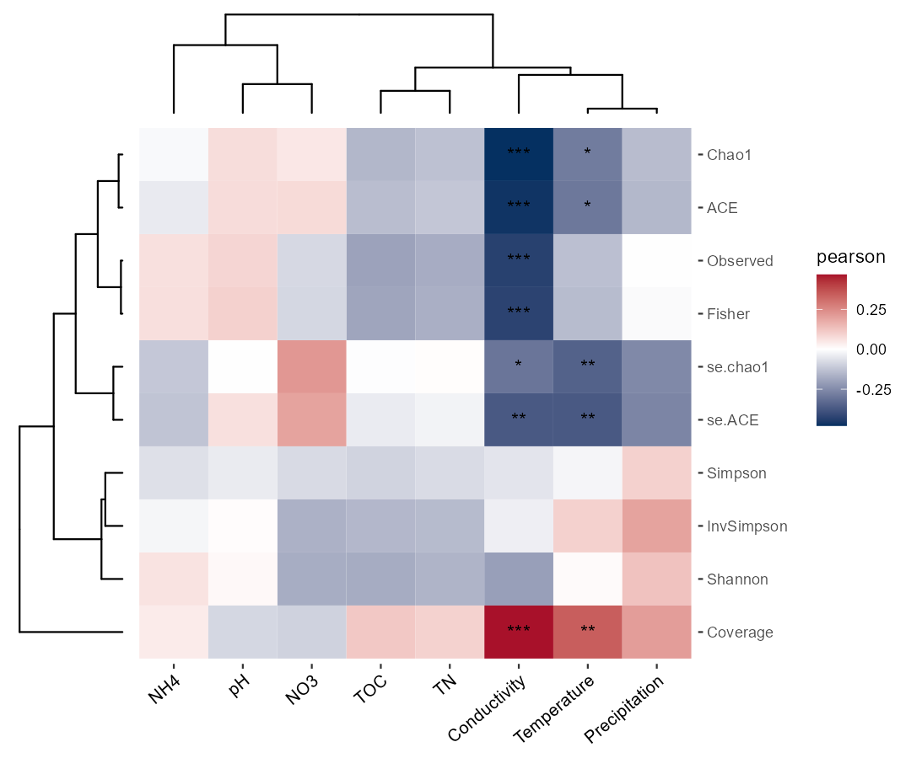
```

The function `plot_scatterfit` in trans_env class is designed for the scatter plot, adding the fitted line and statistics of correlation or regression.


```{r, echo = TRUE, eval = FALSE}
# use pH and bray-curtis distance
# add correlation statistics
t1$plot_scatterfit(
	x = "pH", 
	y = dataset$beta_diversity$bray[rownames(t1$data_env), rownames(t1$data_env)], 
	type = "cor",
	point_size = 3, point_alpha = 0.1, 
	label.x.npc = "center", label.y.npc = "bottom", 
	x_axis_title = "Euclidean distance of pH", 
	y_axis_title = "Bray-Curtis distance"
	)
```

```{r, out.width = "550px", fig.align="center", echo = FALSE}
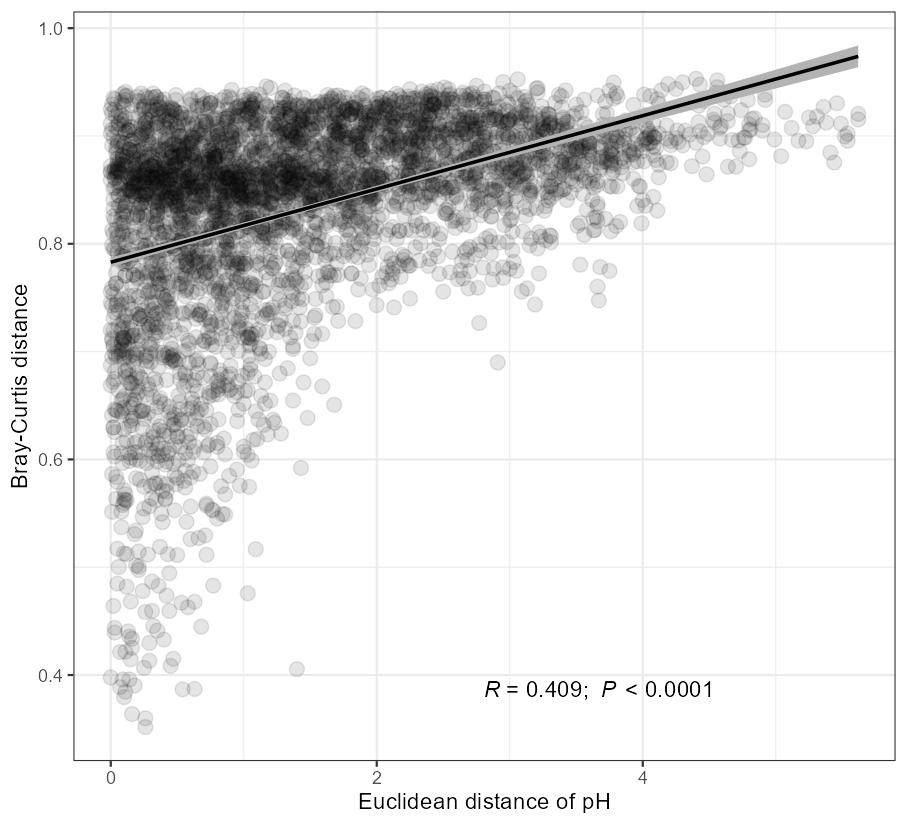
```

```{r, echo = TRUE, eval = FALSE}
# regression with type = "lm", use group parameter for different groups
t1$plot_scatterfit(
    x = dataset$beta_diversity$bray[rownames(t1$data_env), rownames(t1$data_env)],
	y = "pH",
	type = "lm", 
	group = "Group", 
	group_order = c("CW", "TW", "IW"),
	point_size = 3, point_alpha = 0.3, line_se = FALSE, line_size = 1.5, shape_values = c(16, 17, 7),
    y_axis_title = "Euclidean distance of pH", x_axis_title = "Bray-Curtis distance"
	) + theme(axis.title = element_text(size = 17))
```

```{r, out.width = "550px", fig.align="center", echo = FALSE}
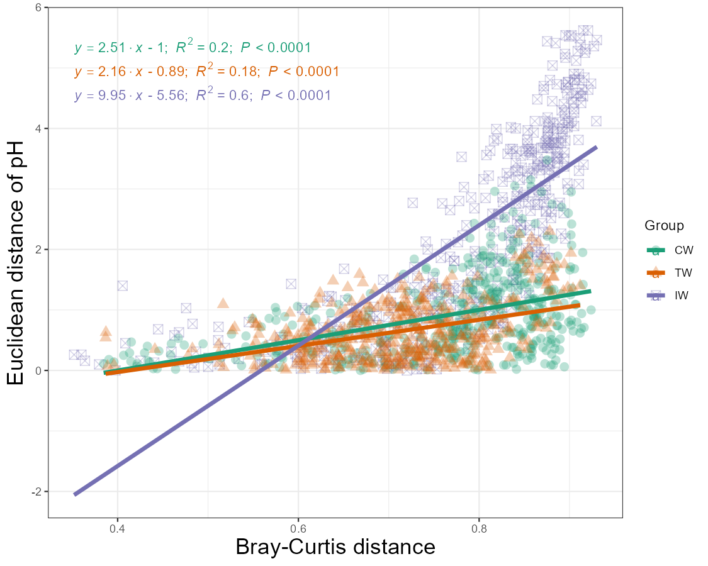
```

Other examples.

```{r, echo = TRUE, eval = FALSE}
t1 <- trans_env$new(dataset = new_test, env_cols = 8:15)
# with forward selection in RDA
t1$cal_ordination(method = "dbRDA", feature_sel = TRUE)
# CCA, canonical correspondence analysis
t1$cal_ordination(method = "CCA", taxa_level = "Genus")
t1$trans_ordination(adjust_arrow_length = TRUE)
t1$plot_ordination(plot_color = "Group", plot_shape = "Group", plot_type = c("point", "ellipse"))
# correlation analysis without p adjustment
t1$cal_cor(use_data = "Genus", p_adjust_method = "none", use_taxa_num = 30)
# correlation heatmap with clustering based on the ggplot2 and aplot packages
g1 <- t1$plot_cor(cluster_ggplot = "both")
g1
# clustering heatmap with ggplot2 depends on aplot package
# to change the detail in the plot, please manipulate each element of g1
g1[[1]]
# standardize x axis text format
g1[[1]] <- g1[[1]] + scale_x_discrete(labels = c(NH4 = expression(NH[4]^'+'-N), NO3 = expression(NO[3]^'-'-N)))
g1[[1]]
g1
ggplot2::ggsave("test.pdf", g1, width = 8, height = 6)
# For regression, lm_equation = FALSE can be applied to not display the equation.
t1$plot_scatterfit(x = 1, y = 2, type = "lm", lm_equation = TRUE)
# use line_alpha to adjust the transparency of the confidence interval
t1$plot_scatterfit(x = 1, y = 2, type = "lm", lm_equation = FALSE, line_alpha = 0.3)
t1$plot_scatterfit(x = 1, y = 2, type = "lm", point_alpha = .3, line_se = FALSE)
t1$plot_scatterfit(x = 1, y = 2, type = "lm", line_se_color = "grey90", label_sep = ",", label.x.npc = "center", label.y.npc = "bottom")
t1$plot_scatterfit(x = 1, y = 2, line_se = FALSE, pvalue_trim = 3, cor_coef_trim = 3)
t1$plot_scatterfit(x = "pH", y = "TOC", type = "lm", group = "Group", line_se = FALSE, label.x.npc = "center",
	shape_values = 1:3, x_axis_title = "pH", y_axis_title = "TOC")
# correlation between relative abundance of Genus-Arthrobacter and pH
tmp <- unlist(dataset$taxa_abund$Genus["k__Bacteria|p__Actinobacteria|c__Actinobacteria|o__Micrococcales|f__Micrococcaceae|g__Arthrobacter", ])
t1$plot_scatterfit(x = "pH", y = tmp, point_size = 3, point_alpha = 0.3, 
	y_axis_title = "Arthrobacter", x_axis_title = "pH")
```


### Key points

  + complete_na parameter in trans_env$new: used to fill the NA (missing value) of the environmental data based on the mice package.
  + env_cols parameter in trans_env$new: select the variables from sample_table of your microtable object.
  + add_abund_table parameter in cal_cor: other customized data can be also provided for the correlation analysis.
  + use_cor parameter in plot_scatterfit: both the correlation and regression are available in this function.
  + cal_mantel(): partial_mantel = TRUE can be used for partial mantel test.
  + plot_ordination(): use plot_type parameter to select point types and env_nudge_x and taxa_nudge_x (also _y) to adjust the text positions.


## trans_func class

　Ecological researchers are usually interested in the the funtional profiles of microbial communities,
because functional or metabolic data is powerful to explain the structure and dynamics of microbial communities.
As metagenomic sequencing is complicated and expensive, using amplicon sequencing data to predict functional profiles is an alternative choice. 
Several software are often used for this goal, such as PICRUSt [@Langille_Predictive_2013], Tax4Fun [@Aßhauer_Tax4Fun_2015] and FAPROTAX [@Louca_High_2016; @Louca_Decoupling_2016].
These tools are great to be used for the prediction of functional profiles based on the prokaryotic communities from sequencing results.
In addition, it is also important to obtain the traits or functions for each taxa, not just the whole profile of communities.
FAPROTAX database is a collection of the traits and functions of prokaryotes based on the known research results published in books and literatures.
We match the taxonomic information of prokaryotes against this database to predict the traits of prokaryotes on biogeochemical roles.
The NJC19 database [@Lim_Large_2020] is also available for animal-associated prokaryotic data, such as human gut microbiota.
We also implement the FUNGuild [@Nguyen_FUNGuild_2016] and FungalTraits [@Polme_FungalTraits_2020] databases to predict the fungal traits.
The idea identifying prokaryotic traits and functional redundancy was initially inspired by our another study [@Liu_Microbial_2022].


### Example

We first identify/predict traits of taxa with the prokaryotic example data.

```{r, echo = TRUE}
# create object of trans_func
t2 <- trans_func$new(dataset)
# mapping the taxonomy to the database
# this can recognize prokaryotes or fungi automatically if the names of taxonomic levels are standard.
# for fungi example, see https://chiliubio.github.io/microeco_tutorial/other-dataset.html#fungi-data
# default database for prokaryotes is FAPROTAX database
t2$cal_spe_func(prok_database = "FAPROTAX")
# return t2$res_spe_func, 1 represent trait exists, 0 represent no or cannot confirmed.
```

```{r, echo = TRUE, eval = FALSE}
t2$res_spe_func[1:5, 1:2]
```

```{r, echo = FALSE}
pander::pander(t2$res_spe_func[1:5, 1:2])
```

The percentages of the OTUs having the same trait can reflect the functional redundancy of this function in the community.

```{r, echo = TRUE}
# calculate the percentages for communities
# here do not consider the abundance
t2$cal_spe_func_perc(abundance_weighted = FALSE)
# t2$res_spe_func_perc[1:5, 1:2]
```

```{r, echo = FALSE}
pander::pander(t2$res_spe_func_perc[1:5, 1:2])
```

From v1.3.0, the `trans_spe_func_perc` function is implemented to get the long-format table for more flexible manipulation, e.g., filtering and grouping. 
The return `res_spe_func_perc_trans` in the object is the table for the following visualization.
Note that this step is not necessary as `plot_spe_func_perc` function can automatically invoke this function if `res_spe_func_perc_trans` is not found.

```{r, echo = TRUE, eval = FALSE}
t2$trans_spe_func_perc()
t2$plot_spe_func_perc()
```

For the differential test of the abundance percentages across groups, 
please move to another part (https://chiliubio.github.io/microeco_tutorial/other-examples-1.html#faprotax-differential-test).
Then we take another example to show the percentages of the OTUs for each trait in network modules.

```{r, echo = TRUE, eval = FALSE}
# construct a network for the example
network <- trans_network$new(dataset = dataset, cal_cor = "base", taxa_level = "OTU", filter_thres = 0.0001, cor_method = "spearman")
network$cal_network(p_thres = 0.01, COR_cut = 0.7)
network$cal_module()
# convert module info to microtable object
meco_module <- network$trans_comm(use_col = "module")
meco_module_func <- trans_func$new(meco_module)
meco_module_func$cal_spe_func(prok_database = "FAPROTAX")
meco_module_func$cal_spe_func_perc(abundance_weighted = FALSE)
meco_module_func$plot_spe_func_perc(order_x = paste0("M", 1:10))
```
```{r, out.width = "700px", fig.align="center", echo = FALSE}
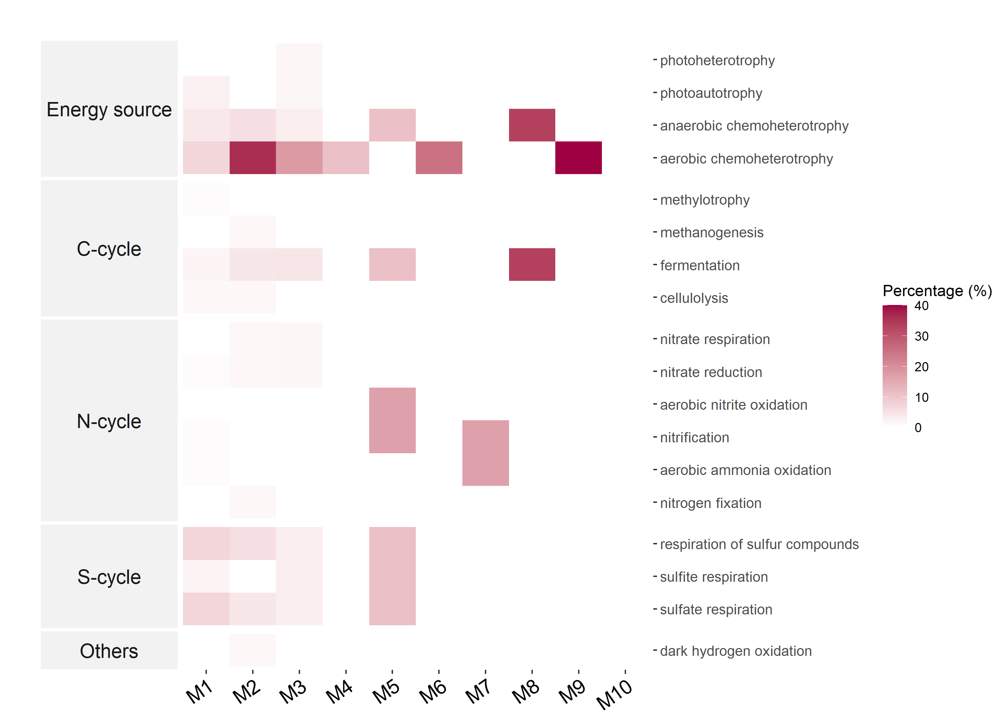
```

```{r, echo = TRUE, eval = FALSE}
# If you want to change the group list, reset the list t2$func_group_list
t2$func_group_list
# use show_prok_func to see the detailed information of prokaryotic traits
t2$show_prok_func("methanotrophy")
```

Then we try to correlate the percentage data in `res_spe_func_perc` to environmental variables.

```{r, echo = TRUE, eval = FALSE}
t3 <- trans_env$new(dataset = dataset, add_data = env_data_16S[, 4:11])
t3$cal_cor(add_abund_table = t2$res_spe_func_perc, cor_method = "spearman")
t3$plot_cor(pheatmap = TRUE)
```

```{r, out.width = "800px", fig.align="center", echo = FALSE}
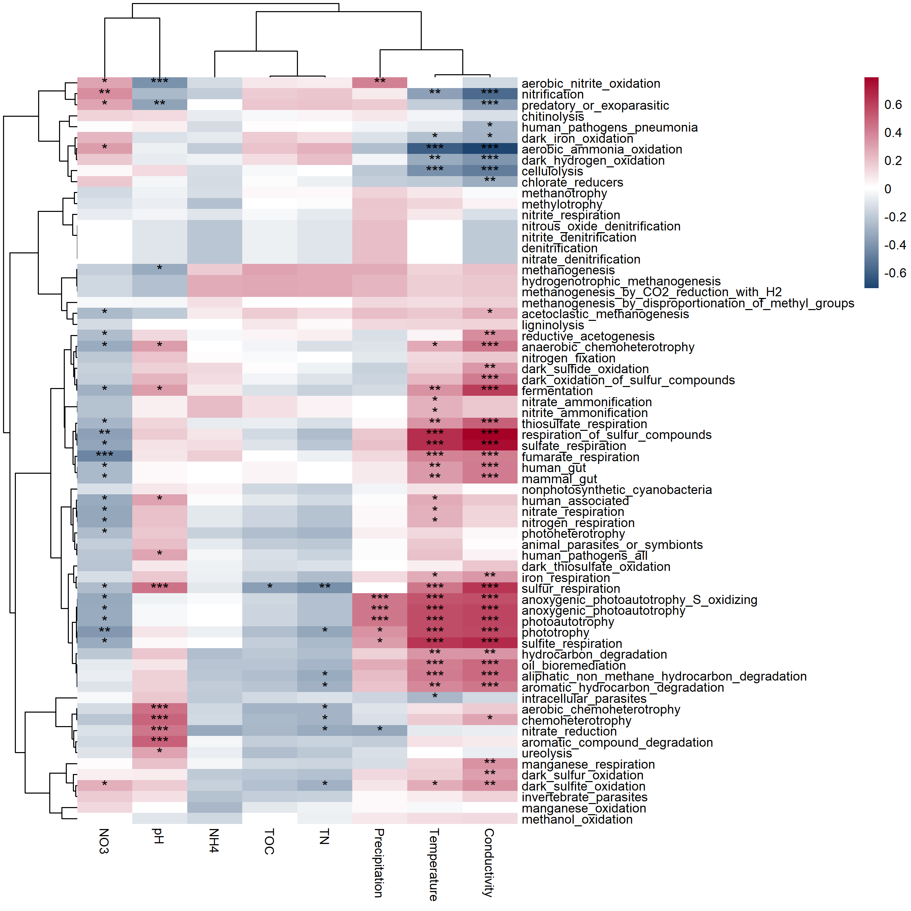
```


Tax4Fun [@Aßhauer_Tax4Fun_2015] requires a strict input file format associated with the taxonomic information.
To analyze the trimmed or changed OTU data in R with Tax4Fun, we provide a link to the Tax4Fun functional prediction.
Please check out the dependence part https://chiliubio.github.io/microeco_tutorial/intro.html#tax4fun for installing Tax4Fun package and download SILVA123 ref data.

```{r, echo = TRUE, eval = TRUE, message=FALSE}
t1 <- trans_func$new(dataset)
# https://chiliubio.github.io/microeco_tutorial/intro.html#tax4fun for the installation description
# and provide the file path of SILVA123
t1$cal_tax4fun(folderReferenceData = "./SILVA123")
# return two files: t1$tax4fun_KO: KO file; t1$tax4fun_path: pathway file.
# t1$tax4fun_KO$Tax4FunProfile[1:5, 1:2]
```


```{r, echo = FALSE}
pander::pander(t1$tax4fun_KO$Tax4FunProfile[1:5, 1:2])
```


We further analyze the abundance of predicted metabolic pathways.

```{r, echo = TRUE, eval = TRUE}
# must transpose to taxa row, sample column
pathway_file <- t1$tax4fun_path$Tax4FunProfile %>% t %>% as.data.frame
# filter rownames, only keep ko+number
rownames(pathway_file) %<>% gsub("(^.*);\\s.*", "\\1", .)
# load the pathway hierarchical metadata
data(Tax4Fun2_KEGG)
# further create a microtable object, familiar?
func1 <- microtable$new(otu_table = pathway_file, tax_table = Tax4Fun2_KEGG$ptw_desc, sample_table = t1$sample_table)
print(func1)
```

Now, we need to trim data and calculate abundance.
```{r, echo = TRUE, eval = TRUE}
func1$tidy_dataset()
# calculate abundance automatically at three levels: Level.1, Level.2, Level.3
func1$cal_abund()
print(func1)
```

Then, we can plot the abundance.
```{r, echo = TRUE, eval = FALSE}
# bar plot at Level.1
func2 <- trans_abund$new(func1, taxrank = "Level.1", groupmean = "Group")
func2$plot_bar(legend_text_italic = FALSE)
```

```{r, out.width = "600px", fig.align="center", echo = FALSE}
knitr::include_graphics("Images/plot_bar_tax4fun1.png")
```

We can also do something else. For example, we can use lefse to test the differences of the abundances and find the important enriched pathways across groups.

```{r, echo = TRUE, eval = FALSE}
func2 <- trans_diff$new(dataset = func1, method = "lefse", group = "Group", alpha = 0.05, lefse_subgroup = NULL)
func2$plot_diff_bar(threshold = 3, width = 0.8)
```

```{r, out.width = "600px", fig.align="center", echo = FALSE}
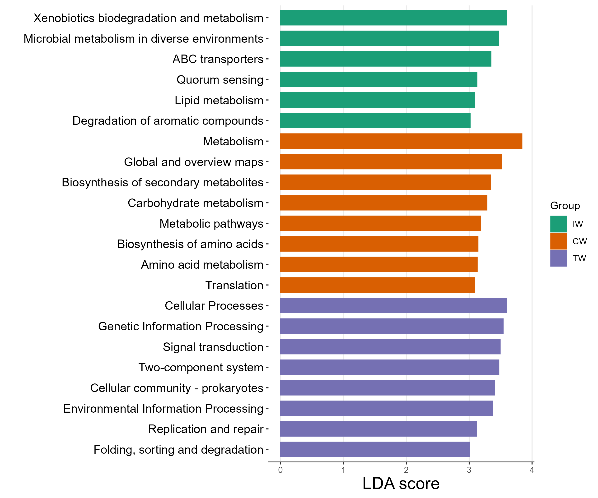
```

Tax4Fun2 [@Wemheuer_Tax4Fun2_2020] is another R package for the prediction of functional profiles of prokaryotic communities from 16S rRNA gene sequences.
It also provides two indexes for the evaluation of functional gene redundancies.
If the user want to use Tax4Fun2 method, the representative fasta file is necessary to be added in the microtable object.
Please check out https://chiliubio.github.io/microeco_tutorial/intro.html#tax4fun2 to see
how to read fasta file with `read.fasta` of seqinr package or `readDNAStringSet` of Biostrings package.
Please also see https://chiliubio.github.io/microeco_tutorial/intro.html#tax4fun2 for downloading ncbi-blast and Ref99NR/Ref100NR.
For windows system, ncbi-blast-2.5.0+ is recommended since other versions can not operate well.


```{r, echo = TRUE, eval = FALSE}
# first delete the dataset created before
rm(dataset)
# load the example dataset from microeco package as there is the rep_fasta object in it
data(dataset)
dataset

t1 <- trans_func$new(dataset)
# create a directory for result and log files
dir.create("test_prediction")
# https://chiliubio.github.io/microeco_tutorial/intro.html#tax4fun2 for installation
# ignore blast_tool_path parameter if blast tools have been in path
# the function can search whether blast tool directory is in the path, if not, automatically use provided blast_tool_path parameter
t1$cal_tax4fun2(blast_tool_path = "ncbi-blast-2.5.0+/bin", path_to_reference_data = "Tax4Fun2_ReferenceData_v2",
  database_mode = "Ref99NR", path_to_temp_folder = "test_prediction")

# prepare feature table and metadata
data(Tax4Fun2_KEGG)
# create a microtable object for pathways
func2 <- microtable$new(otu_table = t1$res_tax4fun2_pathway, tax_table = Tax4Fun2_KEGG$ptw_desc, sample_table = dataset$sample_table)
func2$tidy_dataset()
func2$cal_abund()

# calculate functional redundancies
t1$cal_tax4fun2_FRI()
```

### Key points

  + blast_tool_path parameter in cal_tax4fun2: if the blast tool has been in 'environment variable' of computer, it is ok to use blast_tool_path = NULL 
  + blast version: tax4fun2 require NCBI blast tool. However, some errors often come from the latest versions (https://www.biostars.org/p/413294/). An easy solution is to use previous version (such as v2.5.0).


<!--chapter:end:06-Explainable_class.Rmd-->

# file2meco package

In the microtable class part, we showed the basic way about how to create microtable object with the example data.
Actually, constructing the microtable object from other tools/platforms (e.g., QIIME, QIIME2, HUMAnN, Kraken2 and phyloseq) 
can be easily achieved with the package file2meco (https://github.com/ChiLiubio/file2meco).
The idea of creating file2meco package comes from a study involved in complex metagenomic analysis [@Liu_Microbial_2022].
Note that the `sample_table` parameter in each function of file2meco package supports various metadata input format, including  
1) comma seperated file with the suffix .csv or tab seperated file with the suffix .tsv or .txt;  
2) Excel file with the suffix .xlsx or .xls;  
3) data.frame object in R session.


```{r, echo = TRUE, eval = FALSE}
# install file2meco package (>= 0.7.1)
if(!require("BiocManager", quietly = TRUE)) install.packages("BiocManager")
if(!require("file2meco")) install.packages("file2meco", repos = BiocManager::repositories())
```
▲ Trouble shooting:  
• The files in the following examples all come from the package file2meco and are found by the function `system.file` automatically irrespective of Operating System.
When the user imports a file, please donot use this function.
The first thing should be to make sure that R can find your input file.
The user should either provide a full path to the import function or only the file name after putting the file into the R working directory.
For the latter one, if the user does not know where the working directory is,
please use the function `getwd` to find the working directory or directly create a new project in the target directory with RStudio [File --> New Project].


## QIIME

The qiime1meco() function can be used to construct the microtable object using the raw OTU file from QIIME 1 [@Caporaso_QIIME_2010].

```{r, echo = TRUE, eval = FALSE}
library(file2meco)
# see the help document
?qiime1meco
# Let's run the examples
# use the raw data files stored inside the package
otu_file_path <- system.file("extdata", "otu_table_raw.txt", package="file2meco")
# csv file of metadata
sample_file_path <- system.file("extdata", "sample_info.csv", package="file2meco")
phylo_file_path <- system.file("extdata", "rep_phylo.tre", package="file2meco")
# if you want to use Tax4Fun2 approach, you need read the representative sequences and add it to the microtable object.
rep_fasta_path <- system.file("extdata", "rep.fna", package="file2meco")
# contruct microtable object
qiime1meco(otu_file_path)
qiime1meco(otu_file_path, sample_table = sample_file_path)
qiime1meco(otu_file_path, sample_table = sample_file_path, phylo_tree = phylo_file_path)
qiime1meco(otu_file_path, sample_table = sample_file_path, phylo_tree = phylo_file_path, rep_fasta = rep_fasta_path)
```


## QIIME2

The qiime2meco() function is designed to create the microtable object using files from QIIME2 [@Bolyen_Reproducible_2019].
The example data is the ASV (amplicon sequence variant) abundance table based on DADA2 [@Callahan_DADA2_2016].


```{r, echo = TRUE, eval = FALSE}
library(file2meco)
?qiime2meco
# use data files inside the package which were downloaded from (https://docs.qiime2.org/2022.2/tutorials/pd-mice/).
abund_file_path <- system.file("extdata", "dada2_table.qza", package="file2meco")
# tsv file of metadata
sample_file_path <- system.file("extdata", "sample-metadata.tsv", package="file2meco")
taxonomy_file_path <- system.file("extdata", "taxonomy.qza", package="file2meco")
# construct microtable object
qiime2meco(abund_file_path)
qiime2meco(abund_file_path, sample_table = sample_file_path, taxonomy_table = taxonomy_file_path)
# add phylogenetic tree and fasta for more demonstrations
# please download tree from https://docs.qiime2.org/2022.2/data/tutorials/pd-mice/tree.qza
# the file name is 'tree.qza'; put it into the R working directory
tree_data <- "tree.qza"
# please download fasta from https://docs.qiime2.org/2022.2/data/tutorials/pd-mice/dada2_rep_set.qza
# the file name is 'dada2_rep_set.qza'; put it into the R working directory
rep_data <- "dada2_rep_set.qza"
test1 <- qiime2meco(abund_file_path, sample_table = sample_file_path, taxonomy_table = taxonomy_file_path, phylo_tree = tree_data, rep_fasta = rep_data, auto_tidy = TRUE)
test1
```


## HUMAnN

Many methods in microeco package can be used not only for the traditional species abundance data, i.e. species-sample table,
but also for other data, such as metagenomic data.
HUMAnN [@Franzosa_Species_2018] is an excellent tool for functional profiling analysis of metagenomes and metatranscriptomes at species-level.
The humann2meco() function can be used to create the microtable object using metagenomic analysis files from HUMAnN3 (https://huttenhower.sph.harvard.edu/humann).
Certainly, it can also be used for the whole community profile of metabolic pathways when needed.
Currently, it supports both the MetaCyc (https://metacyc.org/) and KEGG pathway abundance file input directly.


```{r, echo = TRUE, eval = FALSE}
library(file2meco)
library(microeco)
library(magrittr)
?humann2meco
sample_file_path <- system.file("extdata", "example_metagenome_sample_info.tsv", package="file2meco")
match_file_path <- system.file("extdata", "example_metagenome_match_table.tsv", package="file2meco")

# MetaCyc pathway database based analysis
# use the raw data files stored inside the package for MetaCyc pathway database based analysis
abund_file_path <- system.file("extdata", "example_HUMAnN_MetaCyc_abund.tsv", package="file2meco")
# the default db is "MetaCyc"
humann2meco(abund_file_path, db = "MetaCyc")
humann2meco(abund_file_path, db = "MetaCyc", sample_table = sample_file_path, match_table = match_file_path)
# Let's try more interesting usages with microeco
test <- humann2meco(abund_file_path, db = "MetaCyc", sample_table = sample_file_path, match_table = match_file_path)
test$tidy_dataset()
# rel = FALSE sum original abundance instead of relative abundance
test$cal_abund(select_cols = 1:3, rel = FALSE)
test$taxa_abund$Superclass1 %<>% .[!grepl("unclass", rownames(.)), ]
# use_percentage = FALSE disable percentage for relative abundance
test1 <- trans_abund$new(test, taxrank = "Superclass1", ntaxa = 10, use_percentage = FALSE)
# reassign ylab title instead of default 'Relative Abundance'
test1$ylabname <- "Abundance (RPK)"
# bar_type = "notfull" show original abundance instead of normalized 0-1
test1$plot_bar(facet = "Group", bar_type = "notfull")
# select both function and taxa
test$cal_abund(select_cols = c("Superclass1", "Phylum", "Genus"), rel = TRUE)
test1 <- trans_abund$new(test, taxrank = "Phylum", ntaxa = 10, delete_taxonomy_lineage = T)
test1$plot_bar(facet = "Group")
# functional biomarker
test$cal_abund(select_cols = 1:3, rel = TRUE)
test$taxa_abund$Superclass1 %<>% .[!grepl("unclass", rownames(.)), ]
test1 <- trans_diff$new(test, method = "lefse", group = "Group")
test1$plot_diff_bar(use_number = 1:20)
# taxa biomarker
test$cal_abund(select_cols = 4:9, rel = TRUE)
test$taxa_abund$Phylum %<>% .[!grepl("unclass", rownames(.)), ]
# p_adjust_method = "none" shut down the p value adjustment
test1 <- trans_diff$new(test, method = "lefse", group = "Group", p_adjust_method = "none")
test1$plot_diff_bar(threshold = 2)
```


```{r, echo = TRUE, eval = FALSE}
# use KEGG pathway based HUMAnN result
abund_file_path <- system.file("extdata", "example_HUMAnN_KEGG_abund.tsv", package="file2meco")
test <- humann2meco(abund_file_path, db = "KEGG", sample_table = sample_file_path, match_table = match_file_path)
test$tax_table %<>% subset(Level.1 != "unclassified")
test$tidy_dataset()
```


## MetaPhlAn
MetaPhlAn is an software used for metagenomic taxonomic profiling [@Truong_MeTApHLaN2_2015].
The format of MetaPhlAn classification results is usually called 'mpa' format.
The mpa2meco function is developed for this format conversion to microtable object.
See the following example of Kraken2 part.


## Kraken2/Braken

Kraken is a taxonomic sequence classifier that assigns taxonomic labels to DNA sequences.
Kraken examines the k-mers within a query sequence and uses the information within those k-mers to query a database. 
That database maps k-mers to the lowest common ancestor (LCA) of all genomes known to contain a given k-mer.
Kraken2 [@Wood_Improved_2019] is the newest version.
Braken [@Lu_Bracken_2017] can be applied to estimate species abundance following the Kraken analysis.
The merged Kraken2/Braken results can be obtained by merge_metaphlan_tables.py from MetaPhlAn or combine_mpa.py from KrakenTools (https://ccb.jhu.edu/software/krakentools/).

```{r, echo = TRUE, eval = FALSE}
# use the raw data files inside the package
abund_file_path <- system.file("extdata", "example_kraken2_merge.txt", package="file2meco")
sample_file_path <- system.file("extdata", "example_metagenome_sample_info.tsv", package="file2meco")
match_file_path <- system.file("extdata", "example_metagenome_match_table.tsv", package="file2meco")
mpa2meco(abund_file_path)
# 'rel = FALSE' means raw abundance in taxa_abund
test1 <- mpa2meco(abund_file_path, sample_table = sample_file_path, match_table = match_file_path, rel = FALSE, use_level = "s__")
test1$taxa_abund$Kingdom[, 1:3]
# 'rel = TRUE' means relative abundance in taxa_abund
test2 <- mpa2meco(abund_file_path, sample_table = sample_file_path, match_table = match_file_path, rel = TRUE)
test2$taxa_abund$Kingdom[, 1:3]
# The relative abundance in test2 is different with that in test3
# The taxonomic abundances in taxa_abund of test3 is calculated based on the otu_table (species abundance) and tax_table
# So when the user need to use raw or relative taxonomic abundance coming from original file, please donot run cal_abund function.
library(microeco)
test3 <- clone(test2)
test3$cal_abund()
test3$taxa_abund$Kingdom[, 1:3]
```


## NCycDB/PCycDB

NCycDB database [@Tu_NCycDB_2018] is a curated integrative database for fast and accurate metagenomic profiling of nitrogen cycling genes.
The `ncyc2meco` function is designed for construct the microtable object using gene abundance files from NCycDB.
This function can also be used to parse the output of PCycDB [@Zeng_PCycDB_2022] database benefiting from implemented mapping database from v0.7.0.
The `ncyc2meco` function can identify the database and invoke the internal mapping data automatically according to the gene names of input features.

```{r, echo = TRUE, eval = FALSE}
library(file2meco)
library(microeco)
library(magrittr)
?ncyc2meco
# use the raw data files stored inside the package
abund_file_path <- system.file("extdata", "example_Ncyc_table.tsv", package="file2meco")
sample_file_path <- system.file("extdata", "example_metagenome_sample_info.tsv", package="file2meco")
match_file_path <- system.file("extdata", "example_metagenome_match_table.tsv", package="file2meco")
ncyc2meco(abund_file_path)
ncyc2meco(abund_file_path, sample_table = sample_file_path, match_table = match_file_path)
```

```{r, echo = TRUE, eval = FALSE}
# Let's try more interesting usages with microeco
test <- ncyc2meco(abund_file_path, sample_table = sample_file_path, match_table = match_file_path)
test$tidy_dataset()
# use split_group = TRUE to calculate the pathway abundance with multipe map correspondance
test$cal_abund(select_cols = 1:2, rel = TRUE, split_group = TRUE, split_column = "Pathway")
test$taxa_abund$Pathway %<>% .[!grepl("unclass", rownames(.)), ]
test1 <- trans_abund$new(test, taxrank = "Pathway")
test1$plot_bar(bar_type = "notfull")
# for gene abundance, no splitting on the pathways
test$cal_abund(select_cols = 1:2, rel = TRUE, split_group = FALSE)
test$taxa_abund$Gene %<>% .[!grepl("unclass", rownames(.)), ]
test1 <- trans_abund$new(test, taxrank = "Gene")
test1$plot_bar(bar_type = "notfull")
```


## phyloseq
Two functions meco2phyloseq() and phyloseq2meco() were provided for the conversion between microtable object and phyloseq object of phyloseq package [@Mcmurdie_phyloseq_2013].

```{r, echo = TRUE, eval = FALSE}
# Please first install phyloseq
if (!requireNamespace("BiocManager", quietly = TRUE)) install.packages("BiocManager")
BiocManager::install("phyloseq")
library(phyloseq)
```

```{r, echo = TRUE, eval = FALSE}
# from microtable to phyloseq object
data("dataset")
physeq <- meco2phyloseq(dataset)
physeq
```

```{r, echo = TRUE, eval = FALSE}
# from phyloseq to microtable object
data("GlobalPatterns")
meco_dataset <- phyloseq2meco(GlobalPatterns)
meco_dataset
```

## PICRUSt2

PICRUSt2 [@Douglas_PICRUSt2_2020] contains an updated and larger database of gene families and reference genomes compared to the original version of PICRUSt. 
We do not create a special file conversion function for PICRUSt2 
as it is very easy to convert the output pathway files of PICRUSt2 to microtable object. 
Two example files of PICRUSt2 output in file2meco package were used to show the operation.

```{r, echo = TRUE, eval = FALSE}
# MetaCyc pathway output
tmp_file_path <- system.file("extdata", "example_PICRUSt2_MetaCyc_path_abun_unstrat.tsv", package="file2meco")
pathway_table <- read.delim(tmp_file_path, row.names = 1)
data("MetaCyc_pathway_map")
tmp <- microtable$new(otu_table = pathway_table, tax_table = MetaCyc_pathway_map)
tmp$tidy_dataset()
tmp
```

```{r, echo = TRUE, eval = FALSE}
# KEGG pathway output
tmp_file_path <- system.file("extdata", "example_PICRUSt2_KEGG_path_abun_unstrat.tsv", package="file2meco")
pathway_table <- read.delim(tmp_file_path, row.names = 1)
data("Tax4Fun2_KEGG")
tmp <- microtable$new(otu_table = pathway_table, tax_table = Tax4Fun2_KEGG$ptw_desc)
tmp$tidy_dataset()
tmp
```

## ViromeScan

ViromeScan [@Rampelli_ViromeScan_2016] is a tool for metagenomic viral community profiling.
The input of `vs2meco` function must be a folder containing all the directories named by sample names.
Each sample directory should have the original output files generated by ViromeScan software.


```{r, echo = TRUE, eval = FALSE}
library(microeco)
library(file2meco)
# use viromescan directory inside the package
dir_path <- system.file("extdata", "viromescan", package="file2meco")
d1 <- vs2meco(dir_path)
d1$cal_abund(rel = TRUE)
# d1$taxa_abund$Family is same with the percentage output of viromescan at 
# Family level, i.e. Family_level_results-%.txt file
d1$cal_abund(rel = FALSE)
# d1$taxa_abund$Family is same with the count output of viromescan at 
# Family level, i.e. Family_level_results-Counts.txt file
```


<!--chapter:end:07-file2meco.Rmd-->

# Other dataset

## Fungi data

Another ITS sequencing dataset [@Gao_Strong_2019] is also stored in the example data of the package.
Here, we use it as an example to show the use of FUNGuild database[@Nguyen_FUNGuild_2016].
FungalTraits [@Polme_FungalTraits_2020] database is also available for identifying fungal traits.


```{r, echo = TRUE, eval = FALSE}
library(microeco)
library(magrittr)
# load ITS data
data(sample_info_ITS)
data(otu_table_ITS)
data(taxonomy_table_ITS)
# create microtable object
meco_fungi <- microtable$new(sample_table = sample_info_ITS, otu_table = otu_table_ITS, tax_table = taxonomy_table_ITS)
# remove the taxa not assigned in the Kingdom "k__Fungi"
meco_fungi$tax_table %<>% base::subset(Kingdom == "k__Fungi")
# use tidy_dataset() to make OTUs and samples information consistent across files
meco_fungi$tidy_dataset()
# create trans_network object
t1 <- trans_network$new(dataset = meco_fungi, cal_cor = "WGCNA", taxa_level = "OTU", filter_thres = 0.000001, cor_method = "spearman")
# create correlation network 
t1$cal_network(COR_p_thres = 0.05, COR_cut = 0.6)
# add modules
t1$cal_module()
# convert module info to microtable object
meco_module <- t1$trans_comm(use_col = "module")
# create trans_func object
t2 <- trans_func$new(meco_module)
# identify species traits, automatically select database for prokaryotes or fungi
# fungi_database = "FungalTraits" for the FungalTraits database
t2$cal_spe_func(fungi_database = "FUNGuild")
# calculate abundance-unweighted functional redundancy of each trait for each network module
t2$cal_spe_func_perc(abundance_weighted = FALSE)
# plot the functional redundancy of network modules
t2$plot_spe_func_perc(order_x = paste0("M", 1:10))
```

```{r, out.width = "700px", fig.align="center", echo = FALSE}
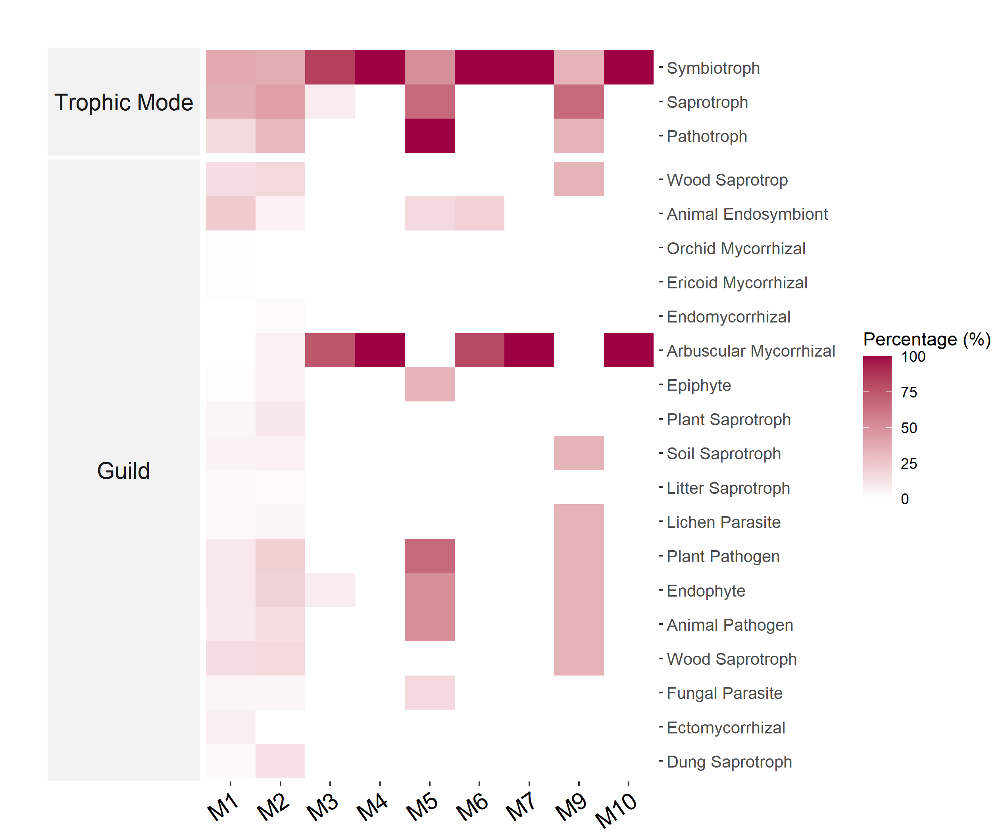
```

## Metagenomic data

In the file2meco package part,
we provide several examples to transform the output files of some famous metagenomic tools (e.g. HUMAnN and kraken2) to 
the microtable object directly.
Here, we show some detailed examples using KEGG pathway results.

```{r, echo = TRUE, eval = FALSE}
library(microeco)
library(file2meco)
library(magrittr)
?humann2meco
sample_file_path <- system.file("extdata", "example_metagenome_sample_info.tsv", package="file2meco")
match_file_path <- system.file("extdata", "example_metagenome_match_table.tsv", package="file2meco")
# use KEGG pathway based HUMAnN result
abund_file_path <- system.file("extdata", "example_HUMAnN_KEGG_abund.tsv", package="file2meco")
# match_table parameter can be used to replace sample names
test <- humann2meco(abund_file_path, db = "KEGG", sample_table = sample_file_path, match_table = match_file_path)
# remove the unclassified pathway in Level.1
test$tax_table %<>% subset(Level.1 != "unclassified")
test$tidy_dataset()
# rel = FALSE donot use relative abundance, use the raw RPK
test$cal_abund(select_cols = 1:3, rel = FALSE)
# use_percentage = FALSE disable percentage for relative abundance
test1 <- trans_abund$new(test, taxrank = "Level.2", ntaxa = 10, use_percentage = FALSE)
test1$plot_bar(facet = "Group", bar_full = FALSE, xtext_angle = 30) + ggplot2::ylab("Abundance (RPK)")
```

```{r, out.width = "800px", fig.align="center", echo = FALSE}
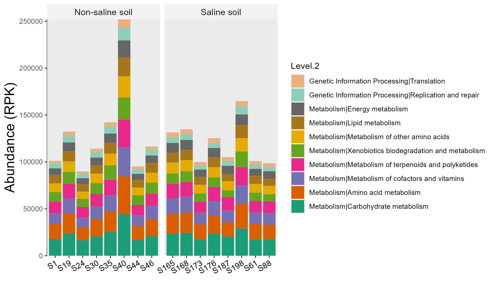
```

Then, we select both function and taxa to see which taxa those high abundant pathways come from.

```{r, echo = TRUE, eval = FALSE}
# This operation is more flexible
test$cal_abund(select_cols = c("Level.1", "Phylum", "Genus"), rel = FALSE)
test$taxa_abund$Level.1 %<>% .[!grepl("unclass", rownames(.)), ]
test$taxa_abund$Phylum %<>% .[!grepl("unclass", rownames(.)), ]
test1 <- trans_abund$new(test, taxrank = "Phylum", ntaxa = 10, use_percentage = FALSE)
test1$plot_bar(facet = "Group", bar_full = FALSE, xtext_angle = 30) + ggplot2::ylab("Abundance (RPK)")
```

```{r, out.width = "800px", fig.align="center", echo = FALSE}
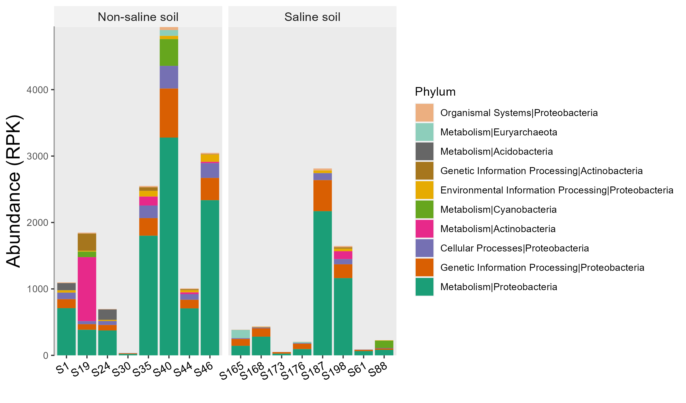
```

Let's run LEfSe to find some functional biomarkers to differentiate two groups.

```{r, echo = TRUE, eval = FALSE}
# functional biomarker
test$cal_abund(select_cols = 1:3, rel = TRUE)
test1 <- trans_diff$new(test, method = "lefse", group = "Group")
test1$plot_diff_bar(threshold = 3)
```

```{r, out.width = "700px", fig.align="center", echo = FALSE}
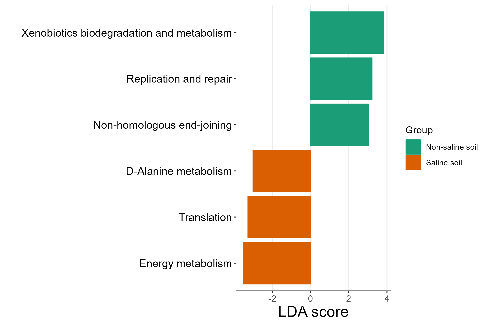
```


## Gut microbiome

We use mouse gut data stored in file2meco package to show the input of QIIME2 file and the use of metabolic trait database NJC19 database[@Lim_Large_2020].

```{r, echo = TRUE, eval = FALSE}
library(microeco)
library(file2meco)
library(ggplot2)

# use data files inside the file2meco package.
abund_file_path <- system.file("extdata", "dada2_table.qza", package="file2meco")
sample_file_path <- system.file("extdata", "sample-metadata.tsv", package="file2meco")
taxonomy_file_path <- system.file("extdata", "taxonomy.qza", package="file2meco")
# construct microtable object
data1 <- qiime2meco(abund_file_path, sample_table = sample_file_path, taxonomy_table = taxonomy_file_path)
data1$tidy_dataset()
# revise the species names in tax_table as the information in the example file is not standard
select_rows <- data1$tax_table$Species != "s__"
data1$tax_table$Species[select_rows] <- paste0("s__", gsub("g__", "", data1$tax_table$Genus[select_rows]), " ", gsub("s__", "", data1$tax_table$Species[select_rows]))
# taxonomic abundance
data1$cal_abund()

# create object of trans_func
data2 <- trans_func$new(data1)
# Select NJC19 database
data2$cal_spe_func(prok_database = "NJC19")
# get the trait percentage data
data2$cal_spe_func_perc(abundance_weighted = FALSE)
# inset the trait percentage result into taxa_abund of microtable object
data1$taxa_abund$Trait <- as.data.frame(t(data2$res_spe_func_perc))
# use trans_abund to plot
t1 <- trans_abund$new(dataset = data1, taxrank = "Trait", ntaxa = 10, use_percentage = FALSE)
t1$plot_box(group = "donor_status", xtext_angle = 30) + ylab("Relative population abundance (%)") + theme(axis.text.x = element_text(size = 13))
```

```{r, out.width = "800px", fig.align="center", echo = FALSE}
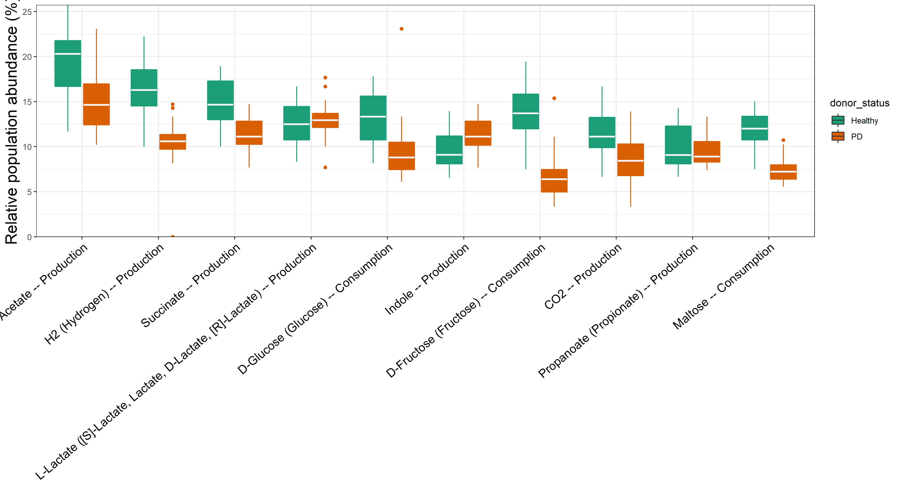
```


```{r, echo = TRUE, eval = FALSE}
# differential abundance test of the traits percentage and use random forest to find biomarkers
t1 <- trans_diff$new(dataset = data1, method = "rf", group = "donor_status", taxa_level = "Trait")
t1$plot_diff_bar(use_number = 1:30)
```

```{r, out.width = "800px", fig.align="center", echo = FALSE}
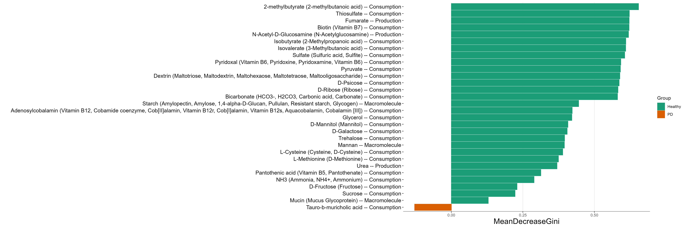
```


<!--chapter:end:08-Otherdata.Rmd-->

# Notes
We show some other important points here.

## `clone` function
R6 class has a special copy mechanism which is different from S3 and S4.
**If you want to copy an object completely, you should use the function `clone` instead of direct assignment.**

```{r, echo = TRUE}
# use clone to copy completely
t1 <- clone(dataset)
t2 <- clone(t1)
t2$sample_table <- NULL
identical(t2, t1)
```

```{r, echo = TRUE}
# this operation is usually unuseful, because changing t2 will also affect t1
t2 <- t1
t2$sample_table <- NULL
identical(t2, t1)
```


## `save` function

As an R6 object is an encapsulated environment, there is also another useful advantage, i.e. the data repeatability.
By applying R6 classes, the analyzed data in 'R Environment' can have fewest intermediate files.
It is also very convenient to save the analyzed data (i.e. object) to local computer with `save` function for back-up and communication with others.
This is the recommended way to send data for the test in 'Github Issues'.

```{r, echo = TRUE, eval = FALSE}
# save 'dataset' to local computer
save(dataset, file = "dataset.RData")
# load the data by others in their R project
load("dataset.RData")
```

The `dataset.RData` can be compressed into zip format for the upload in 'Github Issues' (https://github.com/ChiLiubio/microeco/issues).
If you want to use R to compress it, please run the following command.

```{r, echo = TRUE, eval = FALSE}
zip("test_data.zip", "dataset.RData")
```

The 'test_data.zip' is the final compressed file for the upload.
This saved object is only related with the package version when you save it and has no matter with the updated package when one load it again.
So it is repeatable.


## Github Issues

Please write the question/bug/suggestion in 'Github Issues' (https://github.com/ChiLiubio/microeco/issues).
Several points are recommended.

  + Before creating a 'New issue', please first skim through the 'Issues' including 'Open' and 'Closed'.
Then go ahead if no similar issue is found or the similar issue has not been addressed.

  + Please remember to provide your package version when writing a 'New issue'.

  + For the specific issue related with data, please provide the data and scripts for the reproduction.
If the data has not been published, please provide a toy example or a subset data as far as possible.

  + To provide the data, please use save function as previous part shows (https://chiliubio.github.io/microeco_tutorial/notes.html#save-function), 
and paste the compressed zip format data.

  + When pasting the script directly, please use \`\`\` at the beginning and end of scripts to mark the code block for the readability 
as \# can cause format chaos without code tag.


## group order
If the user want to reorder the groups, **assigning factors may be the simplest way.**

```{r, echo = TRUE, eval = FALSE}
data(dataset)
t1 <- trans_beta$new(dataset = dataset, measure = "bray")
t1$cal_ordination(ordination = "PCoA")
t1$plot_ordination(plot_color = "Group")
```

```{r, out.width = "500px", fig.align="center", echo = FALSE}
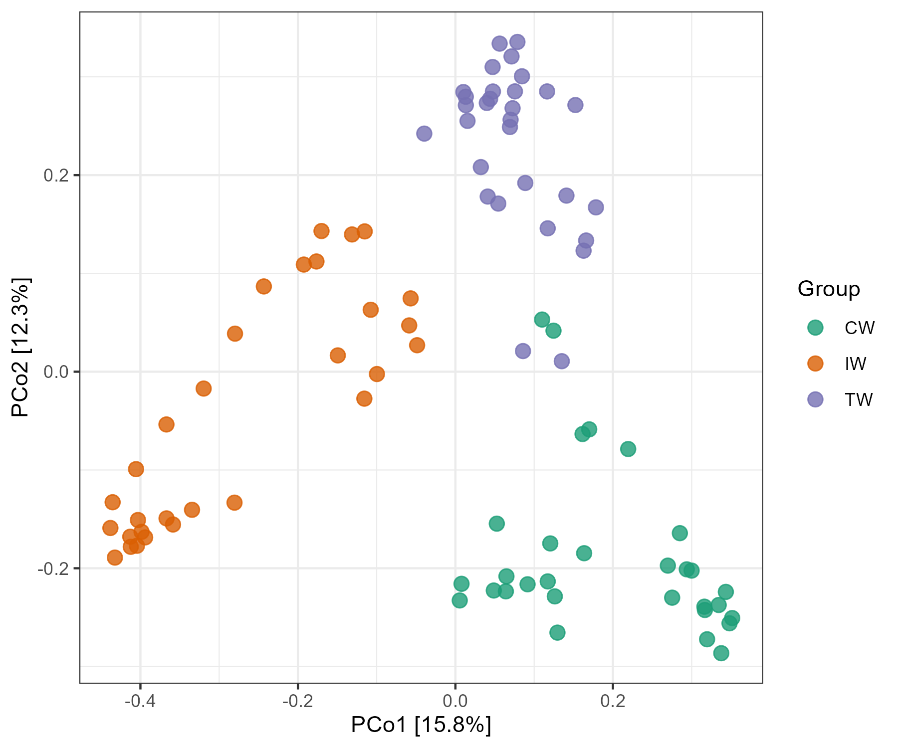
```

Then we assign factors to the 'Group' in sample_table of dataset.
We can find the changed group order in the legend and colors in the plot.

```{r, echo = TRUE, eval = FALSE}
dataset$sample_table$Group %<>% factor(., levels = c("IW", "TW", "CW"))
str(dataset$sample_table)
t1 <- trans_beta$new(dataset = dataset, measure = "bray")
t1$cal_ordination(ordination = "PCoA")
t1$plot_ordination(plot_color = "Group")
```

```{r, out.width = "500px", fig.align="center", echo = FALSE}
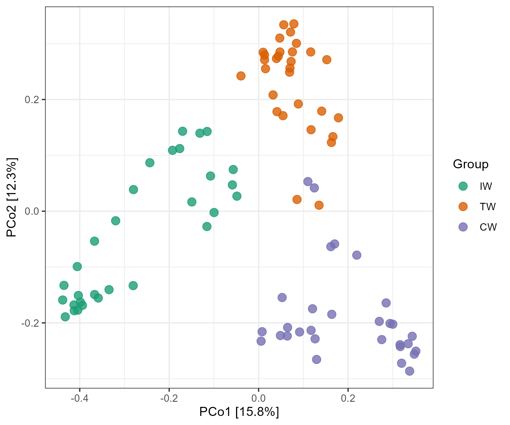
```


## add layers to plot
Most of the plots are generated by applying the ggplot2 package.
The important parameters in the plotting functions are configured according to our experience.
If the inner parameters can not enough, the user can add the layers to the plot like the following operation or
make the plot using the data (generally data.frame class) stored in the object.


```{r, echo = TRUE, eval = FALSE}
t1 <- trans_abund$new(dataset = dataset, taxrank = "Phylum", ntaxa = 10, groupmean = "Group")
g1 <- t1$plot_bar(others_color = "grey70", legend_text_italic = FALSE)
g1 + theme_classic() + theme(axis.title.y = element_text(size = 18))
```

```{r, out.width = "400px", fig.align="center", echo = FALSE}
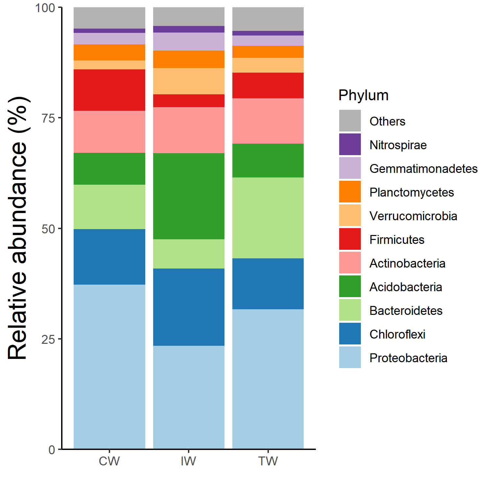
```

## colors for more groups

Within the R microeco package, for the visualization of discrete data, 
`RColorBrewer::brewer.pal(8, "Dark2")` is employed as the default color generation option. 
As this palette encompasses merely eight unique colors, 
users who require additional variations or seek to switch to a different color palette are advised to utilize the `paletteer` package (https://r-charts.com/color-palettes/).

```{r, echo = TRUE, eval = FALSE}
install.packages("paletteer")
library("paletteer")
# examples
paletteer_d("RColorBrewer::Spectral")
paletteer_d("RColorBrewer::Set3")
paletteer_d("RColorBrewer::Paired")
paletteer_d("ggsci::nrc_npg")
paletteer_d("ggsci::default_aaas")
paletteer_d("ggsci::lanonc_lancet")
paletteer_d("ggsci::default_nejm")
paletteer_d("ggsci::category10_d3")
paletteer_d("ggthemes::Classic_10_Light")
paletteer_d("ggthemes::Classic_10_Medium")
paletteer_d("ggthemes::Classic_Cyclic")
# 20 color values
paletteer_d("ggsci::category20c_d3")
paletteer_d("ggsci::category20_d3")
paletteer_d("ggthemes::Classic_20")
```

```{r, echo = TRUE, eval = FALSE}
t1 <- trans_abund$new(dataset = dataset, taxrank = "Phylum", ntaxa = 10, groupmean = "Group")
t1$plot_bar(color_values = paletteer_d("ggthemes::Classic_10_Medium"))
t1 <- trans_abund$new(dataset = dataset, taxrank = "Phylum", ntaxa = 20, groupmean = "Group")
t1$plot_bar(color_values = paletteer_d("ggthemes::Classic_20"))
```


## change object

All the classes are set public, meaning that you can **change, add or remove the objects stored in them as you want**.

```{r, echo = TRUE}
# add a matrix you think useful
dataset$my_matrix <- matrix(1, nrow = 4, ncol = 4)
# change the information
dataset$sample_table %<>% .[, -2]
```


## customized data input

From v0.7.0, trans_alpha, trans_env and trans_venn classes can accept NULL dataset input for some customized usage of some functions in those classes.

```{r, echo = TRUE, eval = FALSE}
t1 <- trans_env$new()
t1 <- trans_alpha$new(dataset = NULL, group = NULL)
```


<!--chapter:end:09-Notes.Rmd-->

# meconetcomp package

To facilitate microbial co-occurrence network comparison, 
R package meconetcomp (https://github.com/ChiLiubio/meconetcomp) was developed.
The basic strategy is to use R list to put into all the trans_network objects and perform the following analysis.
The flow chart and following contents are adapted from the published article [@Liu_meconetcomp_2023].
For more details, please see the online paper (https://doi.org/10.1002/imt2.71).


```{r, out.width = "650px", fig.align="center", echo = FALSE}
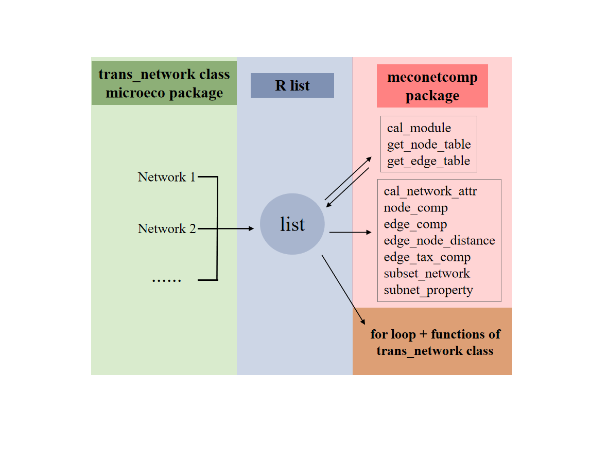
```

```{r, echo = TRUE, eval = FALSE}
# install the required packages
# aplot: one dependency of the trans_venn class of microeco package
# agricolae: for Duncan's new multiple range test
packages <- c("meconetcomp", "rgexf", "pheatmap", "aplot", "agricolae")
# Now check or install
for(x in packages){
	if(!require(x, character.only = TRUE)) {
		install.packages(x, dependencies = TRUE)
	}
}
```

```{r, echo = TRUE, eval = FALSE}
library(microeco)
library(meconetcomp)
# use pipe operator in magrittr package
library(magrittr)
library(igraph)
library(ggplot2)
# load soil amplicon sequencing dataset
data(soil_amp)
```

First reconstruct three correlation networks for the three groups 'IW', 'TW' and 'CW' as the example.

```{r, echo = TRUE, eval = FALSE}
# first create a list
soil_amp_network <- list()
# select samples of "IW" group
# use clone to get a deep copy of soil_amp (R6 object)
tmp <- clone(soil_amp)
# change sample_table directly
tmp$sample_table %<>% subset(Group == "IW")
# trim all files in the object
tmp$tidy_dataset()
# use filter_thres parameter to filter the feature with low relative abundance
tmp <- trans_network$new(dataset = tmp, cor_method = "spearman", filter_thres = 0.0005)
# COR_p_thres represents the p value threshold
# COR_cut denotes the correlation coefficient threshold
tmp$cal_network(COR_p_thres = 0.01, COR_cut = 0.6)
# put the network into the list
soil_amp_network$IW <- tmp
# select samples of "TW" group
tmp <- clone(soil_amp)
tmp$sample_table %<>% subset(Group == "TW")
tmp$tidy_dataset()
tmp <- trans_network$new(dataset = tmp, cor_method = "spearman", filter_thres = 0.0005)
tmp$cal_network(COR_p_thres = 0.01, COR_cut = 0.6)
soil_amp_network$TW <- tmp
# select samples of "CW" group
tmp <- clone(soil_amp)
tmp$sample_table %<>% subset(Group == "CW")
tmp$tidy_dataset()
tmp <- trans_network$new(dataset = tmp, cor_method = "spearman", filter_thres = 0.0005)
tmp$cal_network(COR_p_thres = 0.01, COR_cut = 0.6)
soil_amp_network$CW <- tmp
# Now we have the list soil_amp_network
```


## Network modularity for all networks

The function cal_module in meconetcomp package is designed to partition modules for all the networks in the list.

```{r, echo = TRUE, eval = FALSE}
soil_amp_network %<>% cal_module(undirected_method = "cluster_fast_greedy")
```

## Network topological attributes for all networks

we extracted all the res_network_attr tables in the networks and merged them into one final table by using cal_network_attr function in meconetcomp package.

```{r, echo = TRUE, eval = FALSE}
tmp <- cal_network_attr(soil_amp_network)
# tmp is a data.frame object
```

## Node and edge properties extraction for all networks

The get_node_table and get_edge_table functions of meconetcomp package can be used to directly extract node and edge properties for all the networks.
The return table is stored in each network object.

```{r, echo = TRUE, eval = FALSE}
soil_amp_network %<>% get_node_table(node_roles = TRUE) %>% get_edge_table
```

## Compare nodes across networks

The nodes in all the networks can be converted to a new microtable object by using the node_comp function of meconetcomp package.
Then, it is easy to analyse the nodes overlap with trans_venn class.

```{r, echo = TRUE, eval = FALSE}
# obtain the node distributions by searching the res_node_table in the object
tmp <- node_comp(soil_amp_network, property = "name")
# obtain nodes intersection
tmp1 <- trans_venn$new(tmp, ratio = "numratio")
g1 <- tmp1$plot_venn(fill_color = FALSE)
ggsave("soil_amp_node_overlap.pdf", g1, width = 7, height = 6)
# calculate jaccard distance to reflect the overall differences of networks
tmp$cal_betadiv(method = "jaccard")
tmp$beta_diversity$jaccard
```

## Compare edges across networks

The pipeline of studying edges overlap is similar with the above operations of nodes comparison.
The edge_comp function of meconetcomp package is used to convert edges distribution to a new microtable object.

```{r, echo = TRUE, eval = FALSE}
# get the edge distributions across networks
tmp <- edge_comp(soil_amp_network)
# obtain edges intersection
tmp1 <- trans_venn$new(tmp, ratio = "numratio")
g1 <- tmp1$plot_venn(fill_color = FALSE)
ggsave("soil_amp_edge_overlap.pdf", g1, width = 7, height = 6)
# calculate jaccard distance
tmp$cal_betadiv(method = "jaccard")
tmp$beta_diversity$jaccard
```

## Extract overlapped edges of networks to a new network

Then we extracted the subset of edges according to the intersections of edges across networks,
which can be accomplished with the subset_network function in meconetcomp package.


```{r, echo = TRUE, eval = FALSE}
# first obtain edges distribution and intersection
tmp <- edge_comp(soil_amp_network)
tmp1 <- trans_venn$new(tmp)
# convert intersection result to a microtable object
tmp2 <- tmp1$trans_comm()
# extract the intersection of all the three networks ("IW", "TW" and "CW")
# please use colnames(tmp2$otu_table) to find the required name
Intersec_all <- subset_network(soil_amp_network, venn = tmp2, name = "IW&TW&CW")
# Intersec_all is a trans_network object
# for example, save Intersec_all as gexf format
Intersec_all$save_network("Intersec_all.gexf")
```

## Compare phylogenetic distances of paired nodes in edges

The edge_node_distance class (R6 class) in meconetcomp package is designed to compare the distribution of distance values of paired nodes in all the edges across networks.
Here, we indicated the phylogenetic distance distributions and performed the differential test among networks.
The input parameter dis_matrix can be any symmetric matrix with both the column names and row names (i.e. feature names).
So it is also feasible to compare other properties of features, such as Levin's niche overlap.


```{r, echo = TRUE, eval = FALSE}
# filter useless features to speed up the calculation
node_names <- unique(unlist(lapply(soil_amp_network, function(x){colnames(x$data_abund)})))
filter_soil_amp <- microeco::clone(soil_amp)
filter_soil_amp$otu_table <- filter_soil_amp$otu_table[node_names, ]
filter_soil_amp$tidy_dataset()
# obtain phylogenetic distance matrix
phylogenetic_distance_soil <- as.matrix(cophenetic(filter_soil_amp$phylo_tree))
# use both the positive and negative labels
tmp <- edge_node_distance$new(network_list = soil_amp_network, dis_matrix = phylogenetic_distance_soil, label = c("+", "-"))
tmp$cal_diff(method = "anova")
# visualization
g1 <- tmp$plot(boxplot_add = "none", add_sig = TRUE, add_sig_text_size = 5) + ylab("Phylogenetic distance")
ggsave("soil_amp_phylo_distance.pdf", g1, width = 7, height = 6)

# show different modules with at least 10 nodes and positive edges
tmp <- edge_node_distance$new(network_list = soil_amp_network, dis_matrix = phylogenetic_distance_soil, 
	label = "+", with_module = TRUE, module_thres = 10)
tmp$cal_diff(method = "anova")
g1 <- tmp$plot(boxplot_add = "none", add_sig = TRUE, add_sig_text_size = 5) + ylab("Phylogenetic distance")
ggsave("soil_amp_phylo_distance_modules.pdf", g1, width = 8, height = 6)
```


## Compare node sources of edges across networks

To know which taxa constitute the nodes in edges is important in understanding species co-occurrence patterns and answering ecological questions.
In this part, as an instance, we used edge_tax_comp function of meconetcomp package to get the sums of node sources (at Phylum level) in the positive edges.
In other words, how many linked nodes of positive edges come from different phyla or the same phyla.
Then, to make the results comparable, the ratio was calculated with the positive edge number as denominator.

```{r, echo = TRUE, eval = FALSE}
soil_amp_network_edgetax <- edge_tax_comp(soil_amp_network, taxrank = "Phylum", label = "+", rel = TRUE)
# filter the features with small number
soil_amp_network_edgetax <- soil_amp_network_edgetax[apply(soil_amp_network_edgetax, 1, mean) > 0.01, ]
# visualization
g1 <- pheatmap::pheatmap(soil_amp_network_edgetax, display_numbers = TRUE)
ggsave("soil_amp_edge_tax_comp.pdf", g1, width = 7, height = 7)
```

## Compare topological properties of sub-networks

In this part, we extracted the sub-networks according to the OTU existed in each sample of soil_amp dataset for each network in soil_amp_network.
Then, the global topological properties of sub-networks were calculated.
All the operations were encapsulated into the subnet_property function of meconetcomp package.

```{r, echo = TRUE, eval = FALSE}
# calculate global properties of all sub-networks
tmp <- subnet_property(soil_amp_network)
# then prepare the data for the correlation analysis
# use sample names (second column) as rownames
rownames(tmp) <- tmp[, 2]
# delete first two columns (network name and sample name)
tmp <- tmp[, -c(1:2)]
# load ready-made abiotic factor and diversity table
data(soil_measure_diversity)
tmp1 <- trans_env$new(dataset = soil_amp, add_data = soil_measure_diversity)
tmp1$cal_cor(use_data = "other", by_group = "Group", add_abund_table = tmp, cor_method = "spearman")
# generate correlation heatmap
g1 <- tmp1$plot_cor()
ggsave("soil_amp_subnet_property.pdf", g1, width = 11, height = 5)
```

## Robustness of network

The robustness analysis is implemented in the robustness class based on 
several edge and node removal strategies and robustness measures [@Bellingeri_comprem_2020; @LiuJing_comprobust_2017].
For the details of each method, please refer to the help document with the command `?robustness`.
Available options of `remove_strategy` parameter include "edge_rand" (edges are randomly removed),
"edge_strong" (edges are removed in decreasing order of weight), "node_rand" (nodes are removed randomly),
"node_hub" (node hubs are randomly removed, including network hubs and module hubs),
"node_degree_high" (nodes are removed in decreasing order of degree), etc.
Available options of `measure` include "Eff", "Eigen" and "Pcr".
"Eff" denotes the network efficiency [@LiuJing_comprobust_2017]. 
The average efficiency of the network is defined:
$$ Eff = \frac{1}{N(N - 1)} \sum_{i \neq j \in G}\frac{1}{d(i, j)} $$
where N is the total number of nodes and $d(i,j)$ is the shortest path between node $i$ and node $j$. 
When the weight is found in the edge attributes, $d(i,j)$ denotes the weighted shortest path between node $i$ and node $j$.
"Eigen" represents the natural connectivity.
The natural connectivity can be regarded as an average eigenvalue that changes strictly monotonically with the addition or deletion of edges. 
It is defined:
$$ \bar{\lambda} = \ln(\frac{1}{N} \sum_{i=1}^{N} e^{\lambda~i~}) $$
where $\lambda~i~$ is the $i$th eigenvalue of the graph adjacency matrix. The larger the value of $\bar{\lambda}$ is, the more robust the network is.
"Pcr" means the critical removal fraction of vertices (edges) for the disintegration of networks.
This is a robustness measure based on random graph theory.
The critical fraction against random attacks is labeled as $P_{c}^r$. It is defined:
$$ P_{c}^r = 1 - \frac{1}{\frac{\langle k^2 \rangle}{\langle k \rangle} - 1} $$
where $\langle k \rangle$ is the average nodal degree of the original network, and $\langle k^2 \rangle$ is the average of square of nodal degree. 


```{r, echo = TRUE, eval = FALSE}
tmp <- robustness$new(soil_amp_network, remove_strategy = c("edge_rand", "edge_strong", "node_degree_high"), 
	remove_ratio = seq(0, 0.99, 0.1), measure = c("Eff", "Eigen", "Pcr"), run = 10)
View(tmp$res_table)
tmp$plot(linewidth = 1)
```

```{r, out.width = "700px", fig.align="center", echo = FALSE}
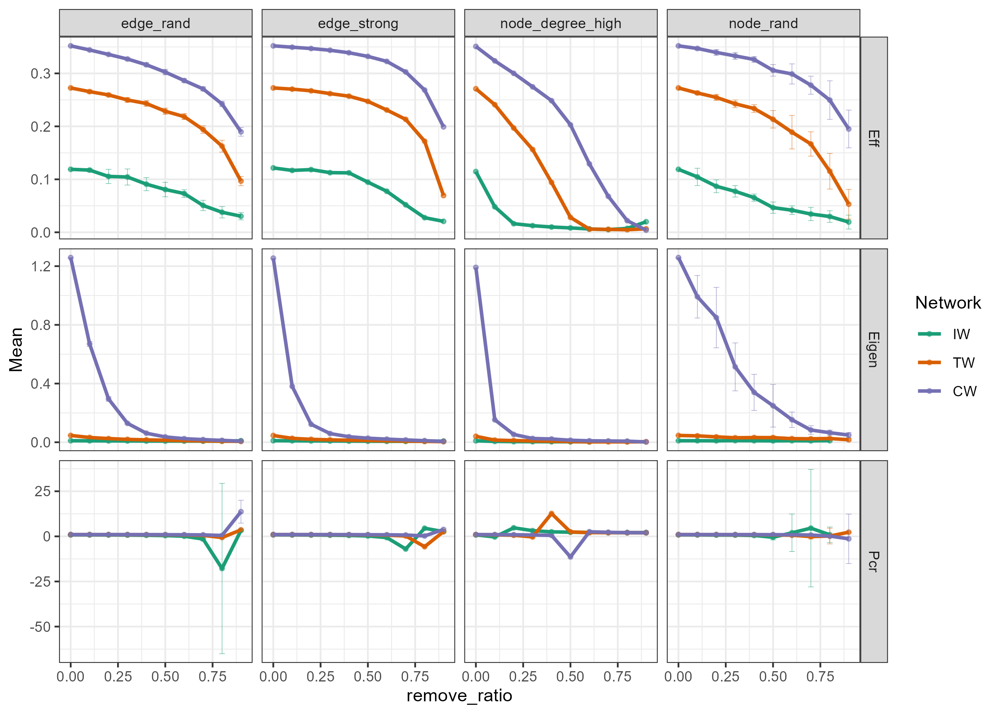
```


## Vulnerability of nodes

From v0.4.0, the vulnerability of nodes can be calculated with the `vulnerability` function.
The vulnerability of one node is defined as the efficiency of network after removing this targeted node [@Yuan_Climatewarm_2021].
For the details, please swith to the help document.


```{r, echo = TRUE, eval = FALSE}
vul_table <- vulnerability(soil_amp_network)
View(vul_table)
```


## Cohesion

The cohesion is a method for quantifying the connectivity of microbial communities [@Herren_Cohesion_2017].
From v0.5.0, the cohesion is implemented in cohesionclass.
It is defined:
$$   C_{j}^{pos} = \sum_{i=1}^{n} a_{i} \cdot \bar{r_{i}}_{|r>0}   $$
$$   C_{j}^{neg} = \sum_{i=1}^{n} a_{i} \cdot \bar{r_{i}}_{|r<0}   $$
where $C_{j}^{pos}$ is the positive cohesion, and $C_{j}^{neg}$ is the negative cohesion.
$a_{i}$ is the relative abundance of species $i$ in sample $j$.
$\bar{r_{i}}_{|r>0}$ denotes the mean weight (correlation coefficient, interaction strength) of all the edges (related with species $i$) with positive association.


```{r, echo = TRUE, eval = FALSE}
t1 <- cohesionclass$new(soil_amp_network)
View(t1$res_list$sample)
View(t1$res_list$feature)
t1$cal_diff(method = "anova")
t1$plot(measure = "r_pos")
t1$plot(measure = "r_pos", boxplot_add = "none")
```


<!--chapter:end:10-meconetcomp.Rmd-->

# mecodev package
The mecodev package (https://github.com/ChiLiubio/mecodev/) is designed for more extended analysis approaches based on the microeco package.

## trans_rarefy
The class trans_rarefy in mecodev package can be used for the rarefaction and the following plotting to see whether 
the sequencing depth is enough to cover all the so-called species in the microbial community.

```{r, echo = TRUE, eval = FALSE}
library(microeco)
library(mecodev)
data(sample_info_16S)
data(otu_table_16S)
# set.seed is used to fix the random number generation to make the results repeatable
set.seed(123)
dataset <- microtable$new(sample_table = sample_info_16S, otu_table = otu_table_16S)
dataset$tidy_dataset()
# trans_rarefy class
t1 <- trans_rarefy$new(dataset, alphadiv = "Observed", depth = c(0, 10, 50, 500, 2000, 4000, 6000, 8000))
t1$plot_rarefy(color = "Group", show_point = FALSE, add_fitting = FALSE)
t1$plot_rarefy(color = "Group", show_point = FALSE, add_fitting = TRUE)
```

```{r, out.width = "550px", fig.align="center", echo = FALSE}
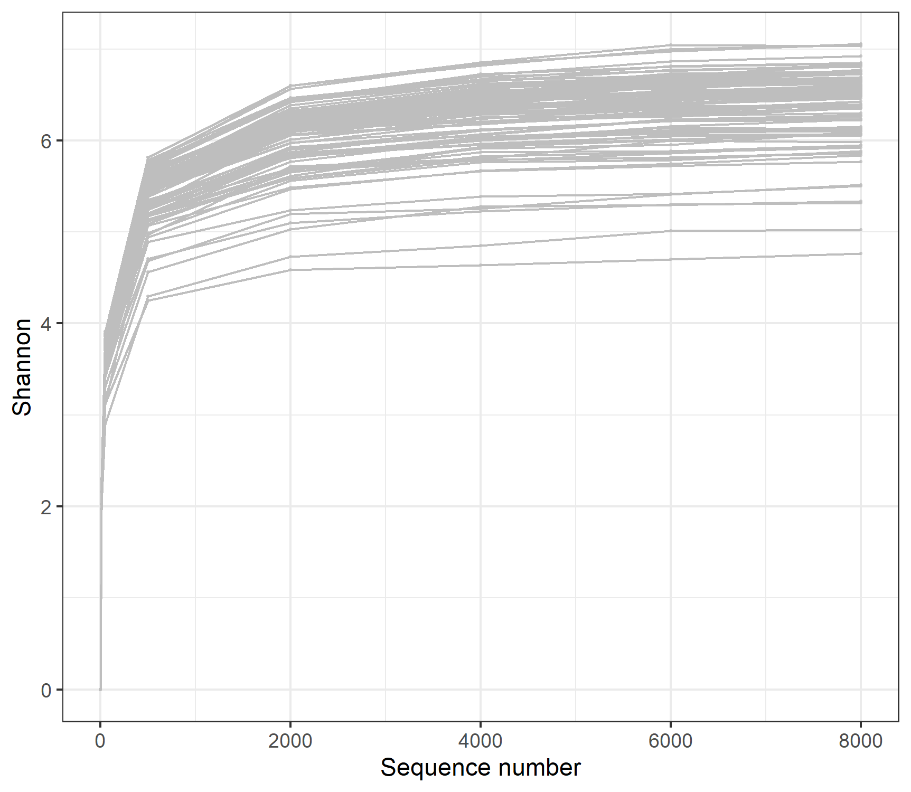
```


## trans_ts

The class trans_ts is designed for the time series data analysis.
A commonly used approach for modeling microbial ecology for time series data is the generalized Lotka-Volterra (gLV) model, the classical predator-prey systems.
gLV models are based on ordinary differential equations that model the logistic growth of species; 
naturally capture predator-prey, amensalistic, and competitive interactions; and have been applied to study dynamics of microbial ecosystems.
More importantly, from a practical perspective, gLV models have been used for a range of applications including identifying potential probiotics
against pathogens, forecasting changes in microbial density, characterizing important community members (e.g., keystone species), 
and analyzing community stability (see [@Li_expectation_2019] and the references therein).
Currently, the biomass estimation and biological interaction prediction approaches are implemented based on the beem package [@Li_expectation_2019].
The example data 'gut_microb_ts' comes from the article [@Gibbons_twodynamic_2017].

```{r, echo = TRUE, eval = FALSE}
# install the necessary packages
# For windows system:
install.packages("doMC", repos = "http://R-Forge.R-project.org")
# For linux or mac
install.packages("doMC")
# Then install the following packages
install.packages("lokern")
install.packages("monomvn")
install.packages("pspline")
devtools::install_github('csb5/beem')
```

```{r, echo = TRUE, eval = FALSE}
library(mecodev)
# load the example data in mecodev package; the input must be a microtable object
# There are several strict requirements on the sample_table; see the document of the class.
data("gut_microb_ts")
# generally, using filter_thres to filter the taxa with low abundance is crutial
# there are only 22 taxa in the example data, we use 0
t1 <- trans_ts$new(dataset = gut_microb_ts, filter_thres = 0.005)
# use minimal 30 times for iteration
t1$cal_biomass(min_iter = 30)
# return t1$res_biomass and t1$res_param
# t2 is a trans_network object
t2 <- t1$cal_network()
# use cluster_optimal; as the default cluster_fast_greedy can not be used for the directed network
t2$cal_module(method = "cluster_optimal")
```


## trans_gamma

The class trans_gamma is developed to explore the relationship between gamma diversity and beta diversity 
based on the methods from biogeographic studies[@Zhang_Local_2020].
Currently, the contents include the observed beta-gamma diversity relationship, simulated beta-gamma diversity relationship and the following plotting.
If the observed gamma diversity and beta diversity are significantly correlated,
species pool at regional scale (or maybe your defined scale, e.g., different treatments in the lab) can have large effect on the beta diversity.
Thus, species pool should be first considered to explain beta diversity patterns.
This class also provide simulation function to explore the relation between gamma diversity and beta diversity in the absence of any process
other than random sampling based on the species log-normal distribution.
We use the wetland data to show the observed beta-gamma diversity relationship.


```{r, echo = TRUE, eval = FALSE}
library(microeco)
library(mecodev)
# load the example data
data(sample_info_16S)
data(otu_table_16S)
test <- microtable$new(sample_table = sample_info_16S, otu_table = otu_table_16S)
test$tidy_dataset()
test$rarefy_samples(sample.size = 10000)
# then create trans_gamma object
test1 <- trans_gamma$new(dataset = test, group = "Type", method = "bray")
test1$cal_observed(sample_size = NULL)
test1$res_observed
# use Spearman correlation
test1$plot_observed(cor_method = "spearman")
```

```{r, out.width = "550px", fig.align="center", echo = FALSE}
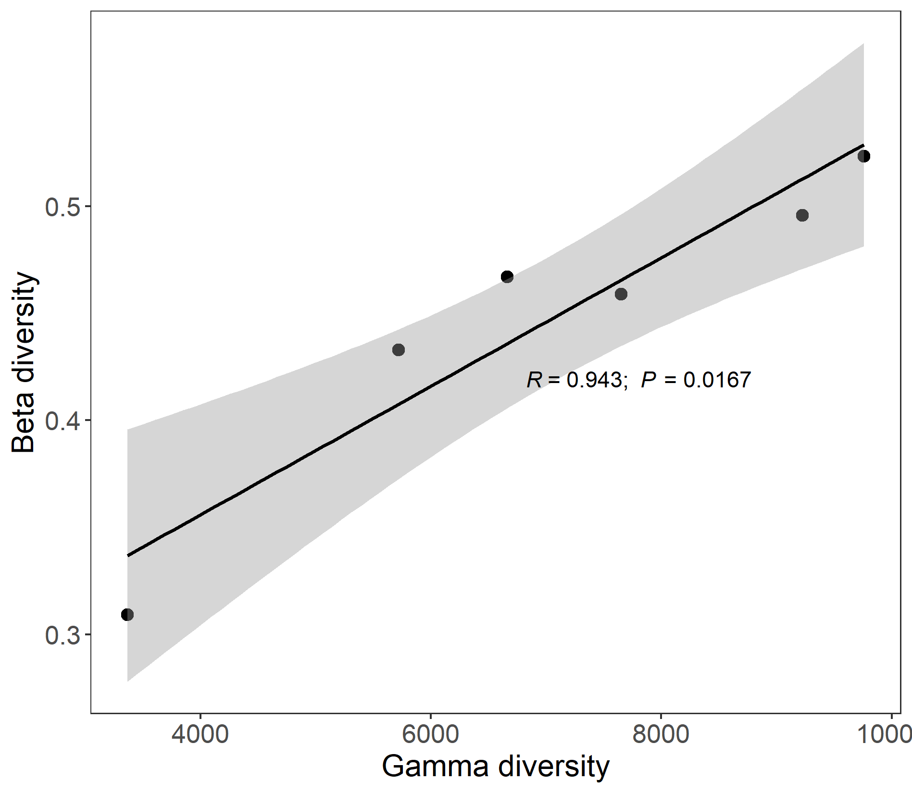
```

Let's simulate the relation between gamma diversity and beta diversity in the absence of any process
other than random sampling based on the species log-normal distribution.

```{r, echo = TRUE, eval = FALSE}
# if you only run the simulation, dataset parameter is not necessary
test1 <- trans_gamma$new(method = "bray")
# use individul numbers at 200, 1000 and 2000, and hypothesize each species pool have 20 samples.
test1$cal_simulation(ncom = 20, ind_vect = c(200, 1000, 2000))
test1$plot_simulation(add_fitting = FALSE)
```

```{r, out.width = "600px", fig.align="center", echo = FALSE}
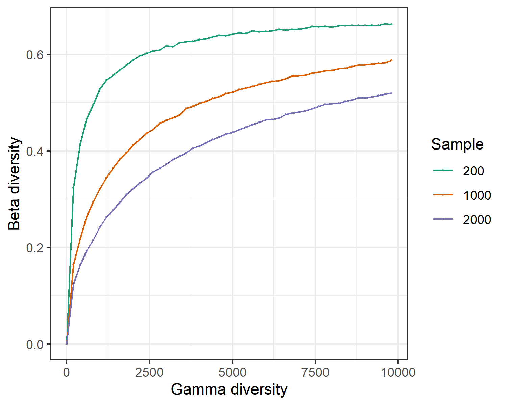
```


<!--chapter:end:11-mecodev.Rmd-->

# mecoturn package

The mecoturn package is designed to study microbial turnover along plant compartments originally (https://github.com/ChiLiubio/mecoturn).
Generally speaking, it can be used in any case associated with a gradient. 


```{r, echo = TRUE, eval = FALSE}
# mecoturn v0.3.0
install.packages("mecoturn")
# check and install dependent packages
packages <- c("agricolae")
for(x in packages){
	if(!require(x, character.only = TRUE)){
		install.packages(x)
	}
}
```

## betaturn class

The betaturn class is used to study the turnover of communities, i.e. beta diversity along a gradient [@Anderson_Navigating_2011].
The pipeline consists of the steps of dissimilarity matrix generation, matrix conversion, differential test and visualization.
Creating betaturn object can generate the dissimilarity matrix stored in the object.
The example data `wheat_16S` is the amplicon sequencing data of 16S rDNA of wheat samples from different regions.
In `wheat_16S$sample_table`, the `Type` column represents the niches, i.e. plant compartments, including S (bulk soil), RS (rhizosphere soil) and R (root endophyte).
The `Plant_ID` column denotes each unique plant individual that the samples belong to.
The `Region` column means the sampling region of those plants. 
Each region has five plant individuals.

```{r, out.width = "1000px", fig.align="center", echo = FALSE}
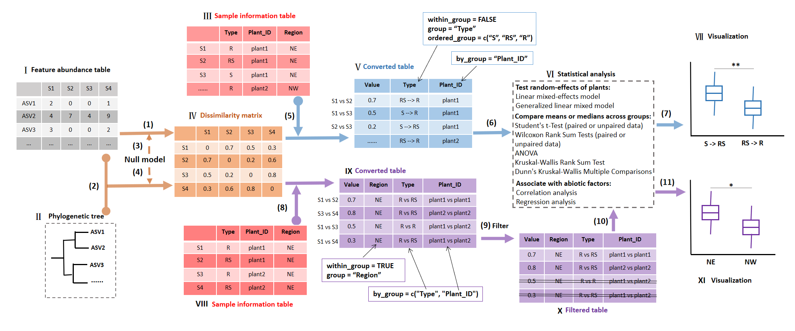
```

Schematic diagrams of the framework in betaturn class.
In the flow chart,
Roman numeral represents the data for the input or output of associated step.
Arabic numeral within brackets denotes the step for the corresponding operation.
The workflow of betaturn class consists of the dissimilarity matrix generation, matrix conversion, differential test and visualization.
The core of the workflow is the matrix conversion, which can be classified into two cases (step 5 and 8) in the Figure.  
Ⅰ: Feature abundance table: microtable\$otu_table object.
The microtable object can be created by the microtable class (R6 class) in microeco package.
The feature abundance table denotes the amplicon sequence variants (ASV) table or operational taxonomic units (OTU) abundance table in a study and should be data.frame format.  
Ⅱ: Phylogenetic tree: microtable\$phylo_tree object.
It represents reconstructed phylogenetic tree based on the representative sequences and should be "phylo" format coming from read.tree function in ape package.
It is designed for calculating phylogenetic distance matrix of beta diversity,
such as mean nearest taxon distance (betaMNTD) and UniFrac metrics.  
Ⅲ: Sample information table: microtable\$sample_table object. It is the sample metadata and must be data.frame format. 
The 'Type' column represents plant compartments (including bulk soil) or other ordered groups used for the following comparison.
S: bulk soil; RS: rhizosphere soil; R: root endophyte.
The 'Plant_ID' column denotes each plant, by which the ordered distance transformation can be accomplished.   
Ⅳ: Dissimilarity matrix: symmetric distance matrix in betaturn\$dataset\$beta_diversity list.
The names of both the rows and columns of this symmetrical matrix are the sample names and they are correspondingly aligned as well.  
Ⅴ: Converted table: betaturn\$res_group_distance object.
It is the output of function cal_group_distance of betaturn class with the parameter "within_group = FALSE".
The table conversion is performed between any two samples of 'Type' column in Ⅲ,
but the combination of any two samples is constrained by the by_group parameter, 
i.e. the conversion is only completed within the same plant according to 'Plant_ID' column of Ⅲ in the example,
which is one of the key features of the mecoturn package.
The converted distance table has a new 'Type' column as the combination of the elements in 'Type' column of original sample information table.
The ordered_group is designed optionally to sort the group order in the result.  
Ⅵ: Statistical analysis: betaturn\$res_group_distance_diff object. 
The approaches that used to compare means or medians across groups (i.e. groups in 'Type' column of Ⅲ) 
are adapted from the cal_diff function of trans_alpha class in microeco package.
By accessing the data in betaturn\$res_group_distance object,
correlation and regression analysis can be easily conducted with the trans_env class of microeco package.  
Ⅶ: Visualization: the ggplot2 object for the mode-"within_group = FALSE".  
Ⅷ: Sample information table similar with Ⅲ.
In this example, "Region" column represents that the plants are collected from different regions.
It is used to show the mode-"within_group = TRUE".  
Ⅸ: Converted table: similar with Ⅴ, but it is generated with the parameter "within_group = TRUE" in cal_group_distance function of betaturn class.
The table conversion is accomplished within each element of the "Region" column in Ⅷ for this study.
It can also be other column, such as "Plant_ID".
Any two samples within an element of "Region" column will be combined.
Under such a circumstance, 
by_group parameter is designed to generate the additional combinations related to the 'Type' and 'Plant_ID' columns in this study used for the following filtering.
So, in the mode-"within_group = TRUE", the aim of by_group parameter is to create the combinations of groups as the table shows, 
not to play a role of restriction of the by_group in the mode-"within_group = FALSE".  
Ⅹ: Filtered table: similar with Ⅸ.
Here, the filtered table is an example to show the flexible manipulation on the converted table.
In this example, needless rows (combined by different plants) are deleted by customized operation in order to generate a final table for the following statistics and visualization.  
Ⅺ: Visualization: ggplot2 object for the mode-"within_group = TRUE".  
(1): betaturn\$new function with the parameter measure = "bray" (Bray-Curtis dissimilarity) or measure = "jaccard" (Jaccard dissimilarity). 
Several beta diversity metrics are provided to obtain the distance matrix by creating betaturn object.  
(2): betaturn\$new function with the parameter measure = "wei_unifrac", "unwei_unifrac", "betaMPD" or "betaMNTD".
Several distance metrics of phylogenetic beta diversity require both the file Ⅰ and Ⅱ.  
(3): betaturn\$new function with the parameter measure = "RCbray". RCbray: Raup–Crick based Bray-Curtis dissimilarity.  
(4): betaturn\$new function with the parameter measure = "betaNRI", "betaNTI" or "ses_UniFrac".  
Phylogenetic beta diversity, plus null model, can be used to obtain the standardized effect size of observed phylogenetic beta diversity.
betaNTI: beta nearest taxon index; betaNRI: beta net relatedness index; ses_UniFrac: standardized effect size of UniFrac distance.  
(5): betaturn\$cal_group_distance(within_group = FALSE, ...).
The distance matrix can be converted to a long format table according to the group classifications in Ⅲ.
The 'Plant_ID' (or other name) is used for guiding the file conversion in the mode-"within_group = FALSE" of Ⅴ. 
The new 'Type' in Ⅴ is generated by combining paired plant compartments.  
(6): betaturn\$cal_group_distance_diff function.
The differential test can be performed with several available approaches shown in the Ⅵ.  
(7): betaturn\$plot_group_distance function.
The visualization is implemented based on R ggplo2 and ggpubr packages. 
The differential test results in step (6) can be mapped to the plot automatically.  
(8): betaturn\$cal_group_distance(within_group = TRUE, ...).
This step is similar with step (5), but it is performed by the function cal_group_distance with the parameter "within_group = TRUE".  
(9): customized manipulation on betaturn\$res_group_distance file. 
This step is to manipulate the file res_group_distance in the betaturn object and delete useless rows in the file according to the customized requirement.  
(10): Similar with step (6).  
(11): Similar with step (7).  


```{r, echo = TRUE, eval = FALSE}
library(mecoturn)
library(magrittr)
data(wheat_16S)
# see the help document of betaturn
?betaturn
# use 'bray', i.e. Bray-Curtis dissimilarity, as the example
b1 <- betaturn$new(wheat_16S, measure = "bray")
```

```{r, echo = FALSE, eval = TRUE}
suppressMessages(library(mecoturn))
library(magrittr)
data(wheat_16S)
b1 <- betaturn$new(wheat_16S, measure = "bray")
```

The matrix conversion is the core step in the betaturn class.
It has two cases: `within_group = TRUE` and `within_group = FALSE`.
The case `within_group = FALSE` means the distance conversion is carried out between any two elements of `Type` column (`group` parameter).
The parameter `by_group` is used to constrain the conversion, i.e. the conversion is performed for each plant.

```{r, echo = TRUE, eval = TRUE}
b1$cal_group_distance(group = "Type", within_group = FALSE, by_group = "Plant_ID")
head(b1$res_group_distance)
```

The combinations of `Type` may be not well-organized. We use `ordered_group` parameter to sort them and `sep` parameter to assign the direction.

```{r, echo = TRUE, eval = TRUE}
b1$cal_group_distance(group = "Type", ordered_group = c("S", "RS", "R"), within_group = FALSE, by_group = "Plant_ID", sep = " -> ")
head(b1$res_group_distance)
```

The `cal_group_distance_diff` function can be used to perform the statistical analysis.

```{r, echo = TRUE, eval = FALSE}
# Wilcoxon rank sum test
b1$cal_group_distance_diff(method = "wilcox")
# paired Wilcoxon test by adding by_ID
b1$cal_group_distance_diff(method = "wilcox", by_ID = "Plant_ID")
# box plot
b1$plot_group_distance()
```

The parameter `add_cols` can be used to add other columns in `sample_table` to the final table when `within_group = FALSE`.
This is especially useful when the statistical analysis will be performed for different groups.

```{r, echo = TRUE, eval = FALSE}
b1$cal_group_distance(group = "Type", ordered_group = c("S", "RS", "R"), within_group = FALSE, by_group = "Plant_ID", sep = " -> ", add_cols = "Region")
head(b1$res_group_distance)
# Wilcoxon test for each region
b1$cal_group_distance_diff(method = "wilcox", by_group = "Region")
b1$plot_group_distance()
```

Then let's use linear mixed-effects model to check the random effects of plants.
For the usages of the `formula` in linear mixed-effects model (lme4 package), see https://mspeekenbrink.github.io/sdam-r-companion/linear-mixed-effects-models.html

```{r, echo = TRUE, eval = FALSE}
b1$cal_group_distance(group = "Type", ordered_group = c("S", "RS", "R"), within_group = FALSE, by_group = "Plant_ID", sep = " -> ", add_cols = "Region")
# random intercept and slope of Region
b1$cal_group_distance_diff(method = "lme", formula = "Type + (1 + Type| Region)")
# random intercept of Plant_ID
b1$cal_group_distance_diff(method = "lme", formula = "Type + (1 | Plant_ID)")
# random intercept of Plant_ID nested in Region
b1$cal_group_distance_diff(method = "lme", formula = "Type + (1 | Region/Plant_ID)")
b1$res_group_distance_diff
```

Another case `within_group = TURE` means the distance conversion is performed according to each element of the group.
For example, when `group = "Region"`, any two samples within an element of `"Region"` column will be combined.
In this scenario, by_group parameter is designed to generate the additional combinations related to other columns.

```{r, echo = TRUE, eval = FALSE}
b1$cal_group_distance(within_group = TRUE, group = "Region", by_group = c("Type", "Plant_ID"))
head(b1$res_group_distance)
# filter the combinations not coming from the same plant
all_plants <- unique(wheat_16S$sample_table$Plant_ID)
b1$res_group_distance %<>% .[.$Plant_ID %in% paste0(all_plants, " vs ", all_plants), ]
# compare values across regions
b1$cal_group_distance_diff(method = "anova")
b1$plot_group_distance(add_sig_text_size = 5.6, xtext_angle = 30)
```

## taxaturn class

The taxaturn class refers to microbial abundance change along a gradient.
Its workflow includes the taxonomic abundance calculation, abundance transformation, abundance change summary, statistical analysis and visualization.

```{r, out.width = "1000px", fig.align="center", echo = FALSE}
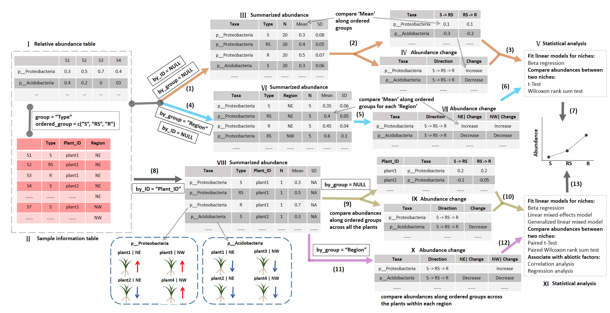
```

The core of this workflow is the abundance change summary and statistical analysis, 
which can be classified into two cases: by_ID = NULL and by_ID = "Plant_ID" in the example (step 1 or 4, and step 8 in the Figure).  
Ⅰ: Taxonomic abundance table: the table (data.frame format) in microtable\$taxa_abund list. 
It denotes taxonomic abundance table with the data.frame format at a specific taxonomic level.  
Ⅱ: Sample information table: the sample metadata, i.e. sample_table in microtable object. 
The 'Type' column represents the plant compartments or other ordered groups used for the following comparisons.
The 'Plant_ID' column denotes each plant, which can guide the comparison of abundances for each plant when by_ID = "Plant_ID".
"Region" column is used for the cases with by_group = "Region".  
Ⅲ: Summarized abundance: taxaturn\$res_abund object.
This summarized abundance table is converted under the condition of by_ID = NULL and by_group = NULL.
Under this condition, the abundance is summarized by the groups of "Type" column of Ⅱ in order to generate 'Mean' and 'SD' in the result (mean and standard deviation of each group).
'N' is the sample number in each group.  
Ⅳ: Abundance change table: res_change_pair (the upper one) and res_change (the table below) in the taxaturn object.
The change pattern along the ordered groups is generated according to the mean abundance in Ⅲ for each taxon.
The res_change_pair table has all paired abundance difference values between two neighboring niches for each taxon (the abundance of the latter minus that of the former).
The res_change is the following summary information of difference values along ordered paired groups in res_change_pair table.
In res_change table, there are three types of changes: 'Increase', 'Decrease' and others (fluctuation with the combination of '+', '-' or '0', 
or nothing when no consistent result is obtained across plants).  
Ⅴ: Statistical analysis. 
The approaches include beta regression model and differential abundance test between two groups.
The differential abundance test is designed for the comparison of two groups, 
such as differential test between S and RS or between RS and R.
There are two implemented approaches: t-Test and Wilcoxon Rank Sum Test.  
Ⅵ: Summarized abundance. Similar with Ⅲ, but the Mean and SD are performed by both the group ('Type') and by_group ('Region'). So N is less than that in Ⅲ.  
Ⅶ: Abundance change table. Similar with Ⅳ, but the 'change' trend is summarized for different regions, respectively.  
Ⅷ: Summarized abundance. As by_ID is provided ("Plant_ID"), the N is 1. The Mean is the abundance of each sample of each plant. SD is not available (NA).  
Ⅸ: Abundance change table: res_change_pair (the upper one) and res_change (the table below) in the taxaturn object.
The res_change_pair is a little different from that in Ⅳ, because it is calculated for each individual plant.
So the table has a column named by_ID ("Plant_ID").
This table is particularly useful for the association between abundance difference values and environmental factors.
The res_change table is the summary result of res_change_pair table.
For the case 'by_group = NULL', the data in res_change is the consistent abundance comparison along ordered groups and across all the plants.  
Ⅹ: Abundance change table. 
Different from the res_change table of Ⅸ, the res_change table in Ⅹ is generated according to the by_group ('Region'). 
So the result is the consistent abundance comparisons along ordered groups within each region.
Note that the res_change_pair table is not shown here as it is same with res_change_pair in Ⅸ, 
because the parameter by_group = "Region" only affects the change summary result.  
Ⅺ: Statistical analysis. Different from Ⅴ, some approaches for this case (by_ID is provided) necessitates consideration of the paired data,
such as paired t-Test and paired Wilcoxon Rank Sum Test. The input data will be first sorted by the elements in "Plant_ID" column of Ⅱ.
The linear mixed-effects model can be used to test the random effects of plant individuals similar with the Ⅵ.
To better fit the relative abundance (bounded by 0 and 1), 
the family function of generalized linear mixed model (GLMM) in taxaturn class is fixed with the beta distribution function, and the link function is "logit" function.
The correlation and regression analysis can be performed by means of the trans_env class of microeco package.  
(1) and (2): taxaturn\$new function. The parameter by_ID = NULL and by_group = NULL is applied in this example.
Creating taxaturn object can generate Ⅲ (i.e. res_abund) in the object.
If the taxonomic abundance (i.e. taxa_abund list) in the input microtable object is NULL, 
the function can automatically invoke the cal_abund function in microtable object to calculate it.  
Creating taxaturn object can also create Ⅳ (i.e. res_change_pair and res_change) in the object.  
(3): taxaturn\$cal_diff function. The cal_diff function in taxaturn class is designed to perform the differential test.  
(4) and (5): taxaturn\$new function. Similar with step (1). The parameter by_ID = NULL and by_group = "Region" is used in this example.   
(6): Similar with step (3).  
(7): taxaturn\$plot function. The plot function in taxaturn class is used to plot the abundance along ordered groups and generate a ggplot2 object.  
(8) and (9): taxaturn\$new function with the parameter by_ID = "Plant_ID" and by_group = NULL.  
(10): taxaturn\$cal_diff function. For the case that by_ID parameter is provided,
the differential abundance test between two groups are designed for the paired data.  
(8) and (11): taxaturn\$new function with the parameter by_ID = "Plant_ID" and by_group = "Region".  
(12): Similar with step (10).  
(13): Similar with step (7). For the case that by_ID parameter is provided, abundance visualization is performed for each element of by_ID parameter, 
i.e. each plant individual in this example.  


```{r, echo = TRUE, eval = TRUE}
# study the abundance change of phyla by comparing the mean abundances without the consideration of plants
t1 <- taxaturn$new(wheat_16S, taxa_level = "Phylum", group = "Type", ordered_group = c("S", "RS", "R"), by_ID = NULL, by_group = NULL, filter_thres = 0.001)
head(t1$res_change)
t1$cal_diff(method = "wilcox", p_adjust_method = NULL)
head(t1$res_change)
# compare the abundance change by summarizing the results for each plant individual
t1 <- taxaturn$new(wheat_16S, taxa_level = "Phylum", group = "Type", ordered_group = c("S", "RS", "R"), by_ID = "Plant_ID", by_group = NULL, filter_thres = 0.001)
head(t1$res_change)
# paired Wilcoxon test
t1$cal_diff(method = "wilcox", p_adjust_method = NULL)
head(t1$res_change)
```

The upper operations can also be applied to different groups.

```{r, echo = TRUE, eval = FALSE}
# for each region without the consideration of plants
t1 <- taxaturn$new(wheat_16S, taxa_level = "Phylum", group = "Type", ordered_group = c("S", "RS", "R"), by_ID = NULL, by_group = "Region", filter_thres = 0.001)
head(t1$res_change)
t1$cal_diff(method = "wilcox", p_adjust_method = NULL)
head(t1$res_change)
# for each region with the consideration of plants
t1 <- taxaturn$new(wheat_16S, taxa_level = "Phylum", group = "Type", ordered_group = c("S", "RS", "R"), by_ID = "Plant_ID", by_group = "Region", filter_thres = 0.001)
head(t1$res_change)
# paired Wilcoxon test
t1$cal_diff(method = "wilcox", p_adjust_method = NULL)
head(t1$res_change)
t1$plot(point_size = 2)
```

Then let's show the linear mixed-effects model to analyze both the fixed and random effects.

```{r, echo = TRUE, eval = FALSE}
t1 <- taxaturn$new(wheat_16S, taxa_level = "Phylum", group = "Type", ordered_group = c("S", "RS", "R"), by_ID = "Plant_ID", by_group = "Region")
t1$cal_diff(method = "lme", formula = "Type + (1 + Type | Region)", measure = "p__Proteobacteria")
t1$res_diff
```

For the relative abundance fitting, common parametric tests like anova is not a good way since the dependent variable is proportion data, 
which is not normally distributed or homoscedastic generally.
Beta regression is suitable for the proportion data (bound at 0 and 1) [@Douma_Analysing_2019].
This method is implemented based on the betareg package [@Betaregression_2010].

```{r, echo = TRUE, eval = FALSE}
# for all samples
t1 <- taxaturn$new(wheat_16S, taxa_level = "Phylum", group = "Type", ordered_group = c("S", "RS", "R"), by_ID = "Plant_ID", by_group = NULL, filter_thres = 0.001)
t1$cal_diff(method = "betareg", formula = "Type")
t1$res_diff
```

```{r, echo = TRUE, eval = FALSE}
# for different regions
t1 <- taxaturn$new(wheat_16S, taxa_level = "Phylum", group = "Type", ordered_group = c("S", "RS", "R"), by_ID = "Plant_ID", by_group = "Region", filter_thres = 0.001)
# measure can be assigned with a taxon
t1$cal_diff(method = "betareg", formula = "Type", measure = "p__Proteobacteria")
t1$res_diff
t1$plot(point_size = 2, select_taxon = "p__Proteobacteria", plot_type = c("point", "smooth"), rect_fill = FALSE)
```

When both the random effects and beta distribution fitting are considered in the model, 
generalized linear mixed model can be employed with the family function beta distribution function.

```{r, echo = TRUE, eval = FALSE}
t1 <- taxaturn$new(wheat_16S, taxa_level = "Phylum", group = "Type", ordered_group = c("S", "RS", "R"), filter_thres = 0.001)
t1$cal_diff(method = "glmm", formula = "Type + (1|Region)", return_model = TRUE, group2num = TRUE)
View(t1$res_diff)
# extract the original models
m1 <- t1$res_model
# without the random effect term
t1$cal_diff(method = "glmm", formula = "Type", return_model = TRUE, group2num = TRUE)
m2 <- t1$res_model
# use anova to compare models
# names(m1)[1]: p__Proteobacteria
anova(m1[[1]], m2[[1]])
```


<!--chapter:end:12-mecoturn.Rmd-->

# Other examples

We've gathered a few tricks to make several issues easier to solve.
We encourage users to contribute some unique, special or helpful examples inspired by the packages.


## Custom taxa order in bar plot

The flexibility of the package design can be reflected on many aspects.
In some cases, it is possible to tactfully handle some particular challenges.
For example, Dr.Jarrod contribute a cool answer to the question that how to use custom taxa and the order in bar plot by modifying the data inside the object.
This is a discussion topic in microeco Discussions (https://github.com/ChiLiubio/microeco/discussions/45).


## tidy_taxonomy function

The taxonomic classification with standard prefix is very important for some analyses,
e.g. taxonomic abundance plotting and biomarker finding.
The `tidy_taxonomy` function in microeco package is designed to make the taxa having standard prefix.
See those Issues with the detailed examples: (https://github.com/ChiLiubio/microeco/issues/32), (https://github.com/ChiLiubio/microeco/issues/22),
(https://github.com/ChiLiubio/microeco/issues/231), (https://github.com/ChiLiubio/microeco/issues/254) and (https://github.com/ChiLiubio/microeco/issues/338).


## Show the abundance of unknown taxa

In the `trans_abund` class, the default operation can filter the unclassified taxa, such as those with 'g__'.
Sometimes, these unknown taxa may be useful to represent uncultured species.
Under the circumstance, the abundance of unknown taxa can be used to show the ratio of unknown taxa in the system.
Please see the solution in this topic (https://github.com/ChiLiubio/microeco/issues/165).


## Question of prefix in the taxa

The prefix of taxa in taxonomic table may affect the following performance of plotting, e.g. text in legend.
Please see those Issues (https://github.com/ChiLiubio/microeco/issues/32), (https://github.com/ChiLiubio/microeco/issues/7) 
and (https://github.com/ChiLiubio/microeco/issues/15).


## The use of phylogenetic tree

One of Issues referred to the basic use of phylogenetic tree in the microeco package (https://github.com/ChiLiubio/microeco/issues/33).


## trans_norm

The class trans_norm in microeco package (>= 1.6.0) provides several data normalization or transformation approaches for the microtable object or data.frame object.
The format of output is same with the input.
For the details and references of the approaches, please refer to the help document of the class with the command `?trans_norm`.


```{r, echo = TRUE, eval = FALSE}
library(microeco)
data(dataset)
t1 <- trans_norm$new(dataset = dataset)
# Geometric mean of pairwise ratios
d1 <- t1$norm(method = "GMPR")
# Centered log-ratio normalization
d2 <- t1$norm(method = "clr")
# Robust centered log-ratio normalization
d2 <- t1$norm(method = "rclr")
# d2 is another microtable object
# Cumulative sum scaling normalization
d2 <- t1$norm(method = "CCS")
# Total sum scaling, dividing counts by the sequencing depth
d2 <- t1$norm(method = "TSS")

# log transformation
d3 <- t1$norm(method = "log")
```


## Mantel test + Correlation heatmap

Sometimes, mantel test results and correlations of environmental factors are visualized together to deliver more information.
In this example, we show how to extend the mantel test results from `trans_env` class with the package ggcor.
Please install `ggcor` package according to the document (https://chiliubio.github.io/microeco_tutorial/intro.html#github-packages).

```{r, echo = TRUE, eval = FALSE}
# prepare data
library(microeco)
library(magrittr)
data(dataset)
data(env_data_16S)
dataset$sample_table <- data.frame(dataset$sample_table, env_data_16S[rownames(dataset$sample_table), ])
# extract two phyla to show the steps
d1 <- clone(dataset)
d1$tax_table <- d1$tax_table[d1$tax_table$Phylum == "p__Proteobacteria", ]
d1$tidy_dataset()
d1$cal_betadiv()
d2 <- clone(dataset)
d2$tax_table <- d2$tax_table[d2$tax_table$Phylum == "p__Bacteroidetes", ]
d2$tidy_dataset()
d2$cal_betadiv()
# first perform mantel test
t1 <- trans_env$new(dataset = d1, env_cols = 8:15)
t1$cal_mantel(use_measure = "bray", partial_mantel = TRUE)
t2 <- trans_env$new(dataset = d2, env_cols = 8:15)
t2$cal_mantel(use_measure = "bray", partial_mantel = TRUE)
# extract a part of the results 
x1 <- data.frame(spec = "Proteobacteria", t1$res_mantel) %>% .[, c(1, 3, 6, 8)]
x2 <- data.frame(spec = "Bacteroidetes", t2$res_mantel) %>% .[, c(1, 3, 6, 8)]
# rename columns
colnames(x1) <- colnames(x2) <- c("spec", "env", "r", "p.value")
# generate interval data
x1 %<>% dplyr::mutate(rd = cut(r, breaks = c(-Inf, 0.3, 0.6, Inf), labels = c("< 0.3", "0.3 - 0.6", ">= 0.6")),
	pd = cut(p.value, breaks = c(-Inf, 0.01, 0.05, Inf), labels = c("< 0.01", "0.01 - 0.05", ">= 0.05")))
x2 %<>% dplyr::mutate(rd = cut(r, breaks = c(-Inf, 0.3, 0.6, Inf), labels = c("< 0.3", "0.3 - 0.6", ">= 0.6")),
	pd = cut(p.value, breaks = c(-Inf, 0.01, 0.05, Inf), labels = c("< 0.01", "0.01 - 0.05", ">= 0.05")))

# cobine two tables
plot_table <- rbind(x1, x2)
# install ggcor following the steps (https://chiliubio.github.io/microeco_tutorial/intro.html#github-packages)
library(ggplot2)
library(ggcor)
set_scale()

g1 <- quickcor(t1$data_env, type = "upper", cor.test = TRUE, show.diag = FALSE) +
    geom_square() +
	geom_mark(sig.thres = 0.05, markonly = TRUE, color = "black", size = 6) +
    anno_link(aes(colour = pd, size = rd), data = plot_table) +
    scale_size_manual(values = c(0.5, 1.5, 3)) +
    scale_colour_manual(values = c("#D95F02", "#1B9E77", "#A2A2A288")) +
    guides(size = guide_legend(title = "Mantel's r", override.aes = list(colour = "grey35"), order = 2),
           colour = guide_legend(title = "Mantel's p", override.aes = list(size = 3), order = 1),
           fill = guide_colorbar(title = "Pearson's r", order = 3))

g1
```

```{r, out.width = "650px", fig.align="center", echo = FALSE}
knitr::include_graphics("Images/plot_env_mantel_ggcor.png")
```


## PCoA + boxplot

In the sections involving trans_venn and trans_env classes, 
we mentioned some combination graphs generated based on the `aplot` package. 
Here, we continue to use the `aplot` and `microeco` packages to demonstrate how to add boxplots of coordinate scores to PCoA graphs. 
Similar combination graphs can be easily manipulated, so we no longer include this type of visualization in the plotting functions of ordination methods. 
Firstly, we use `trans_beta` class to compute PCoA, then perform differential test based on the `cal_diff` function in `trans_env` class.

```{r, echo = TRUE, eval = FALSE}
library(microeco)
library(magrittr)
library(ggplot2)
library(aplot)
theme_set(theme_bw())
data(dataset)
# PCoA
t1 <- trans_beta$new(dataset = dataset, group = "Group", measure = "bray")
t1$cal_ordination(ordination = "PCoA")
# extract the axis scores
tmp <- t1$res_ordination$scores
# differential test with trans_env class
t2 <- trans_env$new(dataset = dataset, add_data = tmp[, 1:2])
# 'KW_dunn' for non-parametric test
t2$cal_diff(group = "Group", method = "anova")
```

Then, employ the plotting functions in `t1` and `t2` objects for visualization.

```{r, echo = TRUE, eval = FALSE}
p1 <- t1$plot_ordination(plot_color = "Group", plot_shape = "Group", plot_type = c("point", "ellipse"))
# groups order in p2 is same with p1; use legend.position = "none" to remove redundant legend
p2 <- t2$plot_diff(measure = "PCo1", add_sig = T) + theme_bw() + coord_flip() + 
	theme(legend.position = "none", axis.title.x = element_blank(), axis.text.y = element_blank(), axis.ticks.y = element_blank())
p3 <- t2$plot_diff(measure = "PCo2", add_sig = T) + theme_bw() + 
	theme(legend.position = "none", axis.title.y = element_blank(), axis.text.x = element_blank(), axis.ticks.x = element_blank())
# height of the upper figure and width of the right-hand figure are both 0.2-fold of the main figure
g <- p1 %>% insert_top(p2, height = 0.2) %>% insert_right(p3, width = 0.2)
g
```

```{r, out.width = "650px", fig.align="center", echo = FALSE}
knitr::include_graphics("Images/Other_PCoA_boxplot1.png")
```


At this point, 
we notice that the horizontal axis of the upper figure and the vertical axis of the right-hand figure do not correspond precisely with those of the main figure. 
Therefore, if we proceed with these graphs, 
the axis ticks of the upper and right-hand figures should be kept. 
If the user requires complete correspondence of the ticks, 
further control over the coordinate axes should be implemented. 
Here, we manually control the coordinate range.

```{r, echo = TRUE, eval = FALSE}
# use 1.4-fold of the scores as axis ranges
x_lim <- range(tmp[, 1]) * 1.4
y_lim <- range(tmp[, 2]) * 1.4
# limit x and y axis without any extension
p1 <- p1 + scale_y_continuous(limits = y_lim, expand = c(0, 0)) + 
	scale_x_continuous(limits = x_lim, expand = c(0, 0))
# limit x axis of upper figure (it's y axis when flipped)
p2 <- p2 + scale_y_continuous(limits = x_lim, expand = c(0, 0))
# limit y axis of right-hand figure
p3 <- p3 + scale_y_continuous(limits = y_lim, expand = c(0, 0))
g <- p1 %>% insert_top(p2, height = 0.2) %>% insert_right(p3, width = 0.2)
g
```

Now, the ticks of the coordinate axes fully correspond, and we may selectively remove the ticks on the upper and right-hand figures.

```{r, echo = TRUE, eval = FALSE}
p2 <- p2 + theme(axis.text.x = element_blank(), axis.ticks.x = element_blank())
p3 <- p3 + theme(axis.text.y = element_blank(), axis.ticks.y = element_blank())
g <- p1 %>% insert_top(p2, height = 0.2) %>% insert_right(p3, width = 0.2)
g
# save g to computer
ggsave("test1.pdf", g, width = 7, height= 6)
```

```{r, out.width = "650px", fig.align="center", echo = FALSE}
knitr::include_graphics("Images/Other_PCoA_boxplot2.png")
```


## FAPROTAX + differential test

In the `trans_func` section, we showed an example of correlations between the abundances of OTUs with the traits from FAPROTAX database and environmental factors.
Now, we go ahead and use `trans_diff` class to demonstrate the differential test of the abundances of OTUs with the traits across groups.

```{r, echo = TRUE, eval = FALSE}
library(microeco)
data(dataset)
t1 <- trans_func$new(dataset)
t1$cal_spe_func(prok_database = "FAPROTAX")
t1$cal_spe_func_perc(abundance_weighted = TRUE)
# use list to prepare data
tmp <- list()
# transpose res_spe_func_perc to be a data.frame like taxonomic abundance
tmp$func <- as.data.frame(t(t1$res_spe_func_perc), check.names = FALSE)
# assign the list as taxa_abund in your microtable object
dataset$taxa_abund <- tmp
# use trans_diff class to perform differential test
t2 <- trans_diff$new(dataset = dataset, method = "anova", group = "Group", taxa_level = "all")
t2$plot_diff_abund(add_sig = T) + ggplot2::ylab("Relative abundance (%)")
```

## RDA results output

In some analyses, it is often necessary to preserve intermediate files of various analysis results, 
and not all files are in the data.frame format. 
For example, in RDA analysis, the `res_ordination_R2` generated by `cal_ordination` function is a numeric vector, 
and the `res_ordination_envfit` generated by the `cal_ordination_envfit` function is of envfit class. 
For those outputs, we can utilize the `capture.output` function to redirect the contents displayed in the dialogue box into a file.

```{r, echo = TRUE, eval = FALSE}
library(microeco)
data(dataset)
data(env_data_16S)
t1 <- trans_env$new(dataset = dataset, add_data = env_data_16S[, 4:11])
t1$cal_ordination(method = "RDA", taxa_level = "Genus")
# get the significance of the terms
t1$cal_ordination_anova()
# fit factors onto the ordination to get R2 for each factor
t1$cal_ordination_envfit()
t1$trans_ordination(adjust_arrow_length = TRUE)
g1 <- t1$plot_ordination(plot_color = "Group", plot_shape = "Group")
ggplot2::ggsave("RDA.pdf", g1, width = 8, height = 6.5)
# use capture.output to save output
capture.output(t1$res_ordination_R2, file = "RDA_R2.txt")
capture.output(t1$res_ordination_envfit, file = "RDA_envfit.txt")
# save data.frame objects
write.table(t1$res_ordination_terms, "RDA_anova_termsig.txt", sep = "\t")
write.table(t1$res_ordination_axis, "RDA_anova_axissig.txt", sep = "\t")
write.table(t1$res_ordination_trans$df_sites, "RDA_axis_sample.txt", sep = "\t")
write.table(t1$res_ordination_trans$df_arrows, "RDA_axis_term.txt", sep = "\t")
write.table(t1$res_ordination_trans$df_arrows_spe, "RDA_axis_taxa.txt", sep = "\t")
```


## betaNRI/betaNTI for each group

Sometimes, if you want to perform betaNRI/betaNTI for each group individually (one group is considered one species pool),
you should calculate the index for each group, respectively.

```{r, echo = TRUE, eval=FALSE}
library(ggplot2)
library(microeco)
# we create a list to store the trans_nullmodel results.
sesbeta_each <- list()
group_col <- "Group"
all_groups <- unique(dataset$sample_table[, group_col])
# calculate for each group, respectively
for(i in all_groups){
	# like the above operation, but need provide 'group' and 'select_group'
	test <- trans_nullmodel$new(dataset, group = group_col, select_group = i, filter_thres = 0.0005)
	test$cal_ses_betampd(runs = 500, abundance.weighted = TRUE)
	sesbeta_each[[i]] <- test$res_ses_betampd
}
# merge and reshape to generate one symmetrical matrix
test <- lapply(sesbeta_each, reshape2::melt) %>% 
	do.call(rbind, .) %>%
	reshape2::dcast(., Var1~Var2, value.var = "value")
rownames(test) <- test[, 1]
test <- test[, -1, drop = FALSE]
# like the above operation
dataset$beta_diversity[["betaNRI"]] <- test
t2 <- trans_beta$new(dataset = dataset, group = "Group", measure = "betaNRI")
t2$cal_group_distance()
# statistical analysis
t2$cal_group_distance_diff(method = "wilcox")
g1 <- t2$plot_group_distance(boxplot_add = "mean")
g1 + geom_hline(yintercept = -2, linetype = 2) + geom_hline(yintercept = 2, linetype = 2)
```

```{r, out.width = "550px", fig.align="center", echo = FALSE}
knitr::include_graphics("Images/trans_nullmodel_betaNRI_each_dataset.png")
```


<!--chapter:end:13-Other_examples.Rmd-->

`r if (knitr:::is_html_output()) '
# References {-}
'`

<!--chapter:end:14-references.Rmd-->

